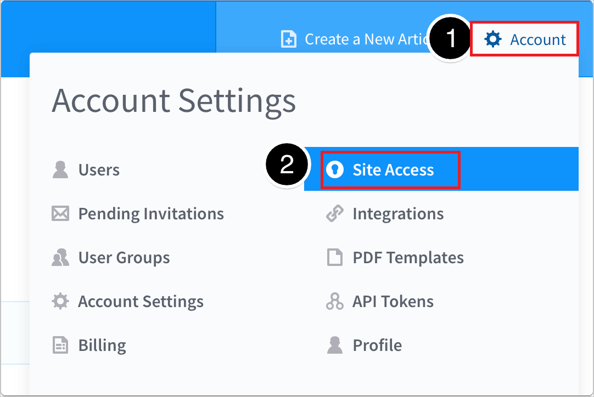
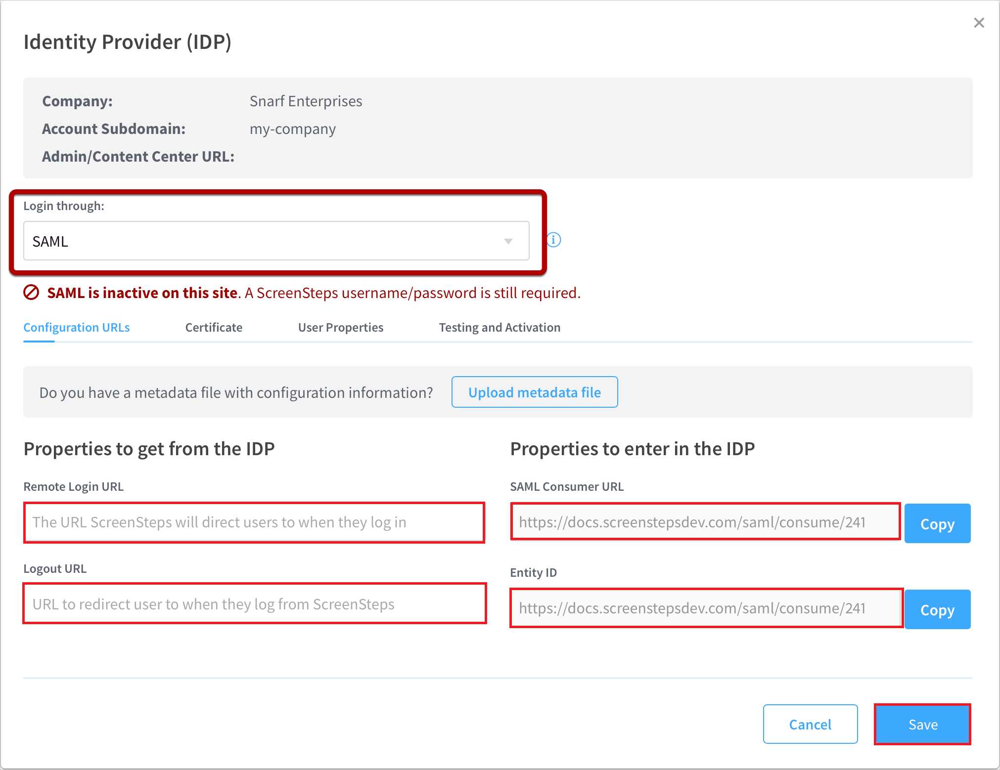

# Configure ScreenSteps for Single sign-on with Microsoft Entra ID

In this article,  you learn how to integrate ScreenSteps with Microsoft Entra ID. When you integrate ScreenSteps with Microsoft Entra ID, you can:

* Control in Microsoft Entra ID who has access to ScreenSteps.
* Enable your users to be automatically signed-in to ScreenSteps with their Microsoft Entra accounts.
* Manage your accounts in one central location.

## Prerequisites
The scenario outlined in this article assumes that you already have the following prerequisites:

[!INCLUDE [common-prerequisites.md](~/identity/saas-apps/includes/common-prerequisites.md)]
* ScreenSteps single sign-on (SSO) enabled subscription.

## Scenario description

In this article,  you configure and test Microsoft Entra single sign-on in a test environment.

* ScreenSteps supports **SP** initiated SSO.
* ScreenSteps supports [Automated user provisioning](screensteps-provisioning-tutorial.md).

## Add ScreenSteps from the gallery

To configure the integration of ScreenSteps into Microsoft Entra ID, you need to add ScreenSteps from the gallery to your list of managed SaaS apps.

1. Sign in to the [Microsoft Entra admin center](https://entra.microsoft.com) as at least a [Cloud Application Administrator](~/identity/role-based-access-control/permissions-reference.md#cloud-application-administrator).
1. Browse to **Entra ID** > **Enterprise apps** > **New application**.
1. In the **Add from the gallery** section, type **ScreenSteps** in the search box.
1. Select **ScreenSteps** from results panel and then add the app. Wait a few seconds while the app is added to your tenant.

Alternatively, you can also use the [Enterprise App Configuration Wizard](https://portal.office.com/AdminPortal/home?Q=Docs#/azureadappintegration). In this wizard, you can add an application to your tenant, add users/groups to the app, assign roles, and walk through the SSO configuration as well. [Learn more about Microsoft 365 wizards.](/microsoft-365/admin/misc/azure-ad-setup-guides)

## Configure and test Microsoft Entra SSO for ScreenSteps

Configure and test Microsoft Entra SSO with ScreenSteps using a test user called **B.Simon**. For SSO to work, you need to establish a link relationship between a Microsoft Entra user and the related user in ScreenSteps.

To configure and test Microsoft Entra SSO with ScreenSteps, perform the following steps:

1. **[Configure Microsoft Entra SSO](#configure-azure-ad-sso)** - to enable your users to use this feature.
    1. **Create a Microsoft Entra test user** - to test Microsoft Entra single sign-on with B.Simon.
    1. **Assign the Microsoft Entra test user** - to enable B.Simon to use Microsoft Entra single sign-on.
1. **[Configure ScreenSteps SSO](#configure-screensteps-sso)** - to configure the single sign-on settings on application side.
    1. **[Create ScreenSteps test user](#create-screensteps-test-user)** - to have a counterpart of B.Simon in ScreenSteps that's linked to the Microsoft Entra representation of user.
1. **[Test SSO](#test-sso)** - to verify whether the configuration works.

## Configure Microsoft Entra SSO

Follow these steps to enable Microsoft Entra SSO.

1. Sign in to the [Microsoft Entra admin center](https://entra.microsoft.com) as at least a [Cloud Application Administrator](~/identity/role-based-access-control/permissions-reference.md#cloud-application-administrator).
1. Browse to **Entra ID** > **Enterprise apps** > **ScreenSteps** > **Single sign-on**.
1. On the **Select a single sign-on method** page, select **SAML**.
1. On the **Set up single sign-on with SAML** page, select the pencil icon for **Basic SAML Configuration** to edit the settings.

   

1. On the **Basic SAML Configuration** section, perform the following steps:

    In the **Sign-on URL** text box, type a URL using the following pattern:
    `https://<tenantname>.ScreenSteps.com`

    > [!NOTE]
	> This value isn't real. Update this value with the actual Sign-On URL, which is explained later in this article.

1. On the **Set up Single Sign-On with SAML** page, in the **SAML Signing Certificate** section, select **Download** to download the **Certificate (Base64)** from the given options as per your requirement and save it on your computer.

	

1. On the **Set up ScreenSteps** section, copy one or more appropriate URLs as per your requirement.

	

[!INCLUDE [create-assign-users-sso.md](~/identity/saas-apps/includes/create-assign-users-sso.md)]

## Configure ScreenSteps SSO

1. Sign in to ScreenSteps company site as an administrator.

1. Go to **Account Settings** > **Site Access**.

    

1. Select the pencil icon in the **Content Management and Admin Centers** and select **SAML** as identity provider from the drop-down.

    

    a. In the **Remote Login URL** field, paste the **Login URL** which you copied from the Microsoft Entra admin center.

    b. Leave the **Logout URL** field blank

    c. Copy **SAML Consumer URL** value, paste this value into the **Sign-on URL** text box in the **Basic SAML Configuration** section in Microsoft Entra admin center.

    d. Copy **Entity ID** value, paste this value into the **Identifier (Entity ID)** text box in the **Basic SAML Configuration** section in Microsoft Entra admin center.

    e. Select **Save**.

> [!NOTE]
> To configure Single Sign-on in Screen steps, Please refer [How to Set up Single Sign-on](https://help.screensteps.com/a/1097728-how-to-set-up-single-sign-on). This article guides you through the steps of setting up ScreenSteps to work with Microsoft Entra ID.
> After answering a few questions in the help article, you be asked to "Select how you set up SSO". Select Microsoft Entra ID and continue on with [Configure Microsoft Entra SSO](#configure-azure-ad-sso).

### Create ScreenSteps test user

In this section, you create a user called Britta Simon in ScreenSteps. Work with [ScreenSteps Client support team](https://www.screensteps.com/contact) to add the users in the ScreenSteps platform. Users must be created and activated before you use single sign-on.

## Test SSO

In this section, you test your Microsoft Entra single sign-on configuration with following options. 

* Switch to the **Testing and Activation** tab in ScreenSteps.

* Select the **Save & Copy** button to copy the **SAML Test URL** to the clipboard.

* Open an Incognito browser window and paste the URL in.

* Sign in with the `B.Simon@contoso.com` test user you created in the previous step. You should be granted access to ScreenSteps and `B.Simon@contoso.com` should appear in the list of Users in ScreenSteps.

* You can use Microsoft My Apps. When you select the ScreenSteps tile in the My Apps, this option redirects to ScreenSteps Sign-on URL. For more information, see [Microsoft Entra My Apps](/azure/active-directory/manage-apps/end-user-experiences#azure-ad-my-apps).

## Related content

Once you configure ScreenSteps you can enforce session control, which protects exfiltration and infiltration of your organization’s sensitive data in real time. Session control extends from Conditional Access. [Learn how to enforce session control with Microsoft Cloud App Security](/cloud-app-security/proxy-deployment-aad).