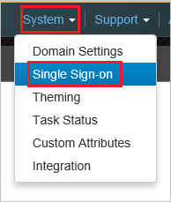
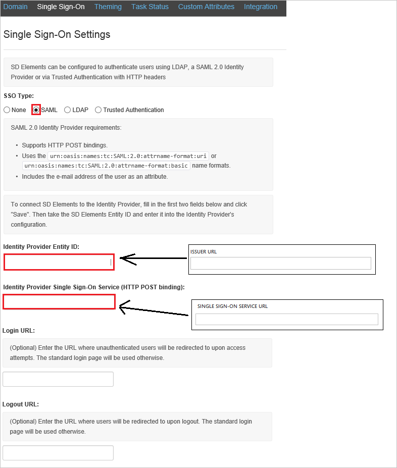
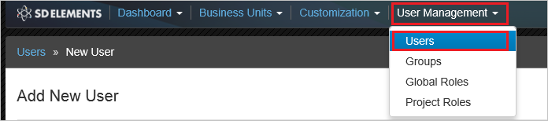
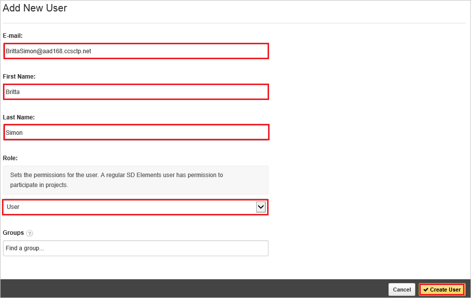

# Configure SD Elements for Single sign-on with Microsoft Entra ID

In this article,  you learn how to integrate SD Elements with Microsoft Entra ID. When you integrate SD Elements with Microsoft Entra ID, you can:

* Control in Microsoft Entra ID who has access to SD Elements.
* Enable your users to be automatically signed-in to SD Elements with their Microsoft Entra accounts.
* Manage your accounts in one central location.

## Prerequisites
The scenario outlined in this article assumes that you already have the following prerequisites:

[!INCLUDE [common-prerequisites.md](~/identity/saas-apps/includes/common-prerequisites.md)]
* SD Elements single sign-on (SSO) enabled subscription.

## Scenario description

In this article,  you configure and test Microsoft Entra SSO in a test environment.

* SD Elements supports **IDP** initiated SSO.

## Add SD Elements from the gallery

To configure the integration of SD Elements into Microsoft Entra ID, you need to add SD Elements from the gallery to your list of managed SaaS apps.

1. Sign in to the [Microsoft Entra admin center](https://entra.microsoft.com) as at least a [Cloud Application Administrator](~/identity/role-based-access-control/permissions-reference.md#cloud-application-administrator).
1. Browse to **Entra ID** > **Enterprise apps** > **New application**.
1. In the **Add from the gallery** section, type **SD Elements** in the search box.
1. Select **SD Elements** from results panel and then add the app. Wait a few seconds while the app is added to your tenant.

 Alternatively, you can also use the [Enterprise App Configuration Wizard](https://portal.office.com/AdminPortal/home?Q=Docs#/azureadappintegration). In this wizard, you can add an application to your tenant, add users/groups to the app, assign roles, and walk through the SSO configuration as well. [Learn more about Microsoft 365 wizards.](/microsoft-365/admin/misc/azure-ad-setup-guides)

## Configure and test Microsoft Entra SSO for SD Elements

Configure and test Microsoft Entra SSO with SD Elements using a test user called **B.Simon**. For SSO to work, you need to establish a link relationship between a Microsoft Entra user and the related user in SD Elements.

To configure and test Microsoft Entra SSO with SD Elements, perform the following steps:

1. **[Configure Microsoft Entra SSO](#configure-azure-ad-sso)** - to enable your users to use this feature.
    1. **Create a Microsoft Entra test user** - to test Microsoft Entra single sign-on with B.Simon.
    1. **Assign the Microsoft Entra test user** - to enable B.Simon to use Microsoft Entra single sign-on.
1. **[Configure SD Elements SSO](#configure-sd-elements-sso)** - to configure the single sign-on settings on application side.
    1. **[Create SD Elements test user](#create-sd-elements-test-user)** - to have a counterpart of B.Simon in SD Elements that's linked to the Microsoft Entra representation of user.
1. **[Test SSO](#test-sso)** - to verify whether the configuration works.

## Configure Microsoft Entra SSO

Follow these steps to enable Microsoft Entra SSO.

1. Sign in to the [Microsoft Entra admin center](https://entra.microsoft.com) as at least a [Cloud Application Administrator](~/identity/role-based-access-control/permissions-reference.md#cloud-application-administrator).
1. Browse to **Entra ID** > **Enterprise apps** > **SD Elements** > **Single sign-on**.
1. On the **Select a single sign-on method** page, select **SAML**.
1. On the **Set up single sign-on with SAML** page, select the pencil icon for **Basic SAML Configuration** to edit the settings.

   

1. On the **Set up single sign-on with SAML** page, perform the following steps:

    a. In the **Identifier** text box, type a URL using the following pattern:
    `https://<TENANT_NAME>.sdelements.com/sso/saml2/metadata`

    b. In the **Reply URL** text box, type a URL using the following pattern:
    `https://<TENANT_NAME>.sdelements.com/sso/saml2/acs/`

	> [!NOTE]
	> These values aren't real. Update these values with the actual Identifier and Reply URL. Contact [SD Elements Client support team](mailto:support@sdelements.com) to get these values. You can also refer to the patterns shown in the **Basic SAML Configuration** section.

1. SD Elements application expects the SAML assertions in a specific format, which requires you to add custom attribute mappings to your SAML token attributes configuration. The following screenshot shows the list of default attributes.

	

1. In addition to above, SD Elements application expects few more attributes to be passed back in SAML response which are shown below. These attributes are also pre populated but you can review them as per your requirements.

	| Name |  Source Attribute|
    | --- | --- |
	| email |user.mail |
	| firstname |user.givenname |
	| lastname |user.surname |

1. On the **Set up single sign-on with SAML** page, in the **SAML Signing Certificate** section,  find **Certificate (Base64)** and select **Download** to download the certificate and save it on your computer.

	

1. On the **Set up SD Elements** section, copy the appropriate URL(s) based on your requirement.

	

[!INCLUDE [create-assign-users-sso.md](~/identity/saas-apps/includes/create-assign-users-sso.md)]

## Configure SD Elements SSO

1. To get single sign-on enabled, contact your [SD Elements support team](mailto:support@sdelements.com) and provide them with the downloaded certificate file.

1. In a different browser window, sign-on to your SD Elements tenant as an administrator.

1. In the menu on the top, select **System**, and then **Single Sign-on**.

    

1. On the **Single Sign-On Settings** dialog, perform the following steps:

    

    a. As **SSO Type**, select **SAML**.

    b. In the **Identity Provider Entity ID** textbox, paste the value of **Microsoft Entra Identifier**.

    c. In the **Identity Provider Single Sign-On Service** textbox, paste the value of **Login URL**.

    d. Select **Save**.

### Create SD Elements test user

The objective of this section is to create a user called B.Simon in SD Elements. In the case of SD Elements, creating SD Elements users is a manual task.

**To create B.Simon in SD Elements, perform the following steps:**

1. In a web browser window, sign-on to your SD Elements company site as an administrator.

1. In the menu on the top, select **User Management**, and then **Users**.

     

1. Select **Add New User**.

    

1. On the **Add New User** dialog, perform the following steps:

     

    a. In the **E-mail** textbox, enter the email of user like **b.simon@contoso.com**.

    b. In the **First Name** textbox, enter the first name of user like **B.**.

    c. In the **Last Name** textbox, enter the last name of user like **Simon**.

    d. As **Role**, select **User**.

    e. Select **Create User**.

## Test SSO 

In this section, you test your Microsoft Entra single sign-on configuration with following options.

* Select **Test this application**, and you should be automatically signed in to the SD Elements for which you set up the SSO.

* You can use Microsoft My Apps. When you select the SD Elements tile in the My Apps, you should be automatically signed in to the SD Elements for which you set up the SSO. For more information about the My Apps, see [Introduction to the My Apps](https://support.microsoft.com/account-billing/sign-in-and-start-apps-from-the-my-apps-portal-2f3b1bae-0e5a-4a86-a33e-876fbd2a4510).

## Related content

Once you configure SD Elements you can enforce session control, which protects exfiltration and infiltration of your organization’s sensitive data in real time. Session control extends from Conditional Access. [Learn how to enforce session control with Microsoft Defender for Cloud Apps](/cloud-app-security/proxy-deployment-aad).
