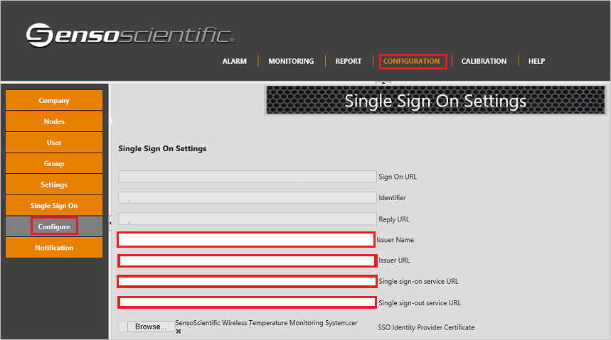

# Configure SensoScientific Wireless Temperature Monitoring System for Single sign-on with Microsoft Entra ID

In this article,  you learn how to integrate SensoScientific Wireless Temperature Monitoring System with Microsoft Entra ID. When you integrate SensoScientific Wireless Temperature Monitoring System with Microsoft Entra ID, you can:

* Control in Microsoft Entra ID who has access to SensoScientific Wireless Temperature Monitoring System.
* Enable your users to be automatically signed-in to SensoScientific Wireless Temperature Monitoring System with their Microsoft Entra accounts.
* Manage your accounts in one central location.

## Prerequisites

To configure Microsoft Entra integration with SensoScientific Wireless Temperature Monitoring System, you need the following items:

* A Microsoft Entra subscription. If you don't have a Microsoft Entra environment, you can get a [free account](https://azure.microsoft.com/free/).
* SensoScientific Wireless Temperature Monitoring System single sign-on enabled subscription.
* Along with Cloud Application Administrator, Application Administrator can also add or manage applications in Microsoft Entra ID.
For more information, see [Azure built-in roles](~/identity/role-based-access-control/permissions-reference.md).

## Scenario description

In this article,  you configure and test Microsoft Entra single sign-on in a test environment.

* SensoScientific Wireless Temperature Monitoring System supports **IDP** initiated SSO.

## Add SensoScientific Wireless Temperature Monitoring System from the gallery

To configure the integration of SensoScientific Wireless Temperature Monitoring System into Microsoft Entra ID, you need to add SensoScientific Wireless Temperature Monitoring System from the gallery to your list of managed SaaS apps.

1. Sign in to the [Microsoft Entra admin center](https://entra.microsoft.com) as at least a [Cloud Application Administrator](~/identity/role-based-access-control/permissions-reference.md#cloud-application-administrator).
1. Browse to **Entra ID** > **Enterprise apps** > **New application**.
1. In the **Add from the gallery** section, type **SensoScientific Wireless Temperature Monitoring System** in the search box.
1. Select **SensoScientific Wireless Temperature Monitoring System** from results panel and then add the app. Wait a few seconds while the app is added to your tenant.

 Alternatively, you can also use the [Enterprise App Configuration Wizard](https://portal.office.com/AdminPortal/home?Q=Docs#/azureadappintegration). In this wizard, you can add an application to your tenant, add users/groups to the app, assign roles, and walk through the SSO configuration as well. [Learn more about Microsoft 365 wizards.](/microsoft-365/admin/misc/azure-ad-setup-guides)

## Configure and test Microsoft Entra SSO for SensoScientific Wireless Temperature Monitoring System

Configure and test Microsoft Entra SSO with SensoScientific Wireless Temperature Monitoring System using a test user called **B.Simon**. For SSO to work, you need to establish a link relationship between a Microsoft Entra user and the related user in SensoScientific Wireless Temperature Monitoring System.

To configure and test Microsoft Entra SSO with SensoScientific Wireless Temperature Monitoring System, perform the following steps:

1. **[Configure Microsoft Entra SSO](#configure-azure-ad-sso)** - to enable your users to use this feature.
    1. **Create a Microsoft Entra test user** - to test Microsoft Entra single sign-on with B.Simon.
    1. **Assign the Microsoft Entra test user** - to enable B.Simon to use Microsoft Entra single sign-on.
1. **[Configure SensoScientific Wireless Temperature Monitoring System SSO](#configure-sensoscientific-wireless-temperature-monitoring-system-sso)** - to configure the single sign-on settings on application side.
    1. **[Create SensoScientific Wireless Temperature Monitoring System test user](#create-sensoscientific-wireless-temperature-monitoring-system-test-user)** - to have a counterpart of B.Simon in SensoScientific Wireless Temperature Monitoring System that's linked to the Microsoft Entra representation of user.
1. **[Test SSO](#test-sso)** - to verify whether the configuration works.

## Configure Microsoft Entra SSO

Follow these steps to enable Microsoft Entra SSO.

1. Sign in to the [Microsoft Entra admin center](https://entra.microsoft.com) as at least a [Cloud Application Administrator](~/identity/role-based-access-control/permissions-reference.md#cloud-application-administrator).
1. Browse to **Entra ID** > **Enterprise apps** > **SensoScientific Wireless Temperature Monitoring System** > **Single sign-on**.
1. On the **Select a single sign-on method** page, select **SAML**.
1. On the **Set up single sign-on with SAML** page, select the pencil icon for **Basic SAML Configuration** to edit the settings.

   

1. On the **Basic SAML Configuration** section, the user doesn't have to perform any step as the app is already pre-integrated with Azure.

1. On the **Set up Single Sign-On with SAML** page, in the **SAML Signing Certificate** section, select **Download** to download the **Certificate (Base64)** from the given options as per your requirement and save it on your computer.

	

1. On the **Set up SensoScientific Wireless Temperature Monitoring System** section, copy the appropriate URL(s) as per your requirement.

	

[!INCLUDE [create-assign-users-sso.md](~/identity/saas-apps/includes/create-assign-users-sso.md)]

## Configure SensoScientific Wireless Temperature Monitoring System SSO

1. Sign on to your SensoScientific Wireless Temperature Monitoring System application as an administrator.

1. In the navigation menu on the top, select **Configuration** and goto **Configure** under **Single Sign On** to open the Single Sign On Settings and perform the following steps:

	

    a. Select **Issuer Name** as Microsoft Entra ID.

	b. In the **Issuer URL** textbox, paste the **Microsoft Entra Identifier**..

	c. In the **Single Sign-On Service URL** textbox, paste the **Login URL**..

	d. In the **Single Sign-Out Service URL** textbox, paste the **Logout URL**..

	e. Browse the certificate which you have downloaded from Azure portal and upload here.

	f. Select **Save**.

### Create SensoScientific Wireless Temperature Monitoring System test user

To enable Microsoft Entra users to sign in to SensoScientific Wireless Temperature Monitoring System, they must be provisioned into SensoScientific Wireless Temperature Monitoring System. Work with [SensoScientific Wireless Temperature Monitoring System support team](https://www.sensoscientific.com/contact-us/) to add the users in the SensoScientific Wireless Temperature Monitoring System platform. Users must be created and activated before you use single sign-on.

## Test SSO

In this section, you test your Microsoft Entra single sign-on configuration with following options.

* Select **Test this application**, and you should be automatically signed in to the SensoScientific Wireless Temperature Monitoring System for which you set up the SSO.

* You can use Microsoft My Apps. When you select the SensoScientific Wireless Temperature Monitoring System tile in the My Apps, you should be automatically signed in to the SensoScientific Wireless Temperature Monitoring System for which you set up the SSO. For more information, see [Microsoft Entra My Apps](/azure/active-directory/manage-apps/end-user-experiences#azure-ad-my-apps).

## Related content

Once you configure SensoScientific Wireless Temperature Monitoring System you can enforce session control, which protects exfiltration and infiltration of your organization’s sensitive data in real time. Session control extends from Conditional Access. [Learn how to enforce session control with Microsoft Cloud App Security](/cloud-app-security/proxy-deployment-aad).
