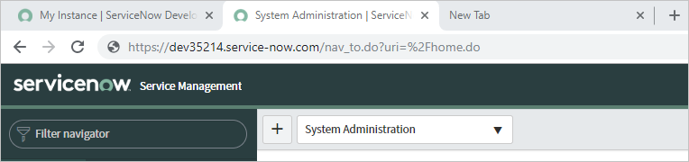
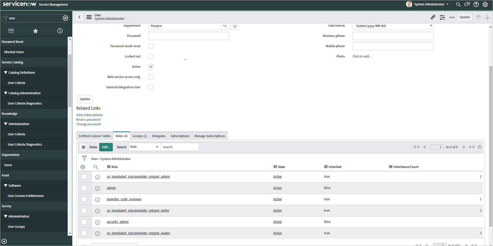
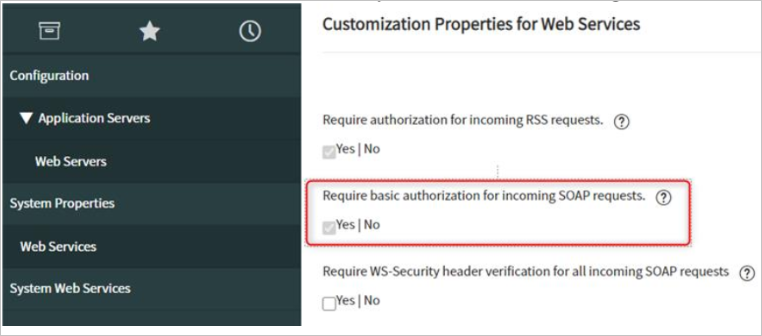

# Configure ServiceNow for automatic user provisioning with Microsoft Entra ID

This article describes the steps that you take in both ServiceNow and Microsoft Entra ID to configure automatic user provisioning. When Microsoft Entra ID is configured, it automatically provisions and deprovisions users and groups to [ServiceNow](https://www.servicenow.com) by using the Microsoft Entra provisioning service. 

For more information on the Microsoft Entra automatic user provisioning service, see [Automate user provisioning and deprovisioning to SaaS applications with Microsoft Entra ID](~/identity/app-provisioning/user-provisioning.md). 

## Capabilities supported

> [!div class="checklist"]
> - Create users in ServiceNow.
> - Remove users in ServiceNow when they don't need access anymore.
> - Keep user attributes synchronized between Microsoft Entra ID and ServiceNow.
> - Provision groups and group memberships in ServiceNow.
> - Allow [single sign-on](servicenow-tutorial.md) to ServiceNow (recommended).

## Prerequisites

- A Microsoft Entra user account with an active subscription. If you don't already have one, you can [Create an account for free](https://azure.microsoft.com/free/?WT.mc_id=A261C142F).
- One of the following roles: [Application Administrator](/entra/identity/role-based-access-control/permissions-reference#application-administrator), [Cloud Application Administrator](/entra/identity/role-based-access-control/permissions-reference#cloud-application-administrator), or [Application Owner](/entra/fundamentals/users-default-permissions#owned-enterprise-applications).
- A [ServiceNow instance](https://www.servicenow.com) of Calgary or higher.
- A [ServiceNow Express instance](https://www.servicenow.com) of Helsinki or higher.
- A user account in ServiceNow with the admin role.

> [!NOTE]
> This integration is also available to use from Microsoft Entra US Government Cloud environment. You can find this application in the Microsoft Entra US Government Cloud Application Gallery and configure it in the same way as you do from public cloud.

## Step 1: Plan your provisioning deployment

- Learn about [how the provisioning service works](~/identity/app-provisioning/user-provisioning.md).
- Determine who's in [scope for provisioning](~/identity/app-provisioning/define-conditional-rules-for-provisioning-user-accounts.md).
- Determine what data to [map between Microsoft Entra ID and ServiceNow](~/identity/app-provisioning/customize-application-attributes.md). 

## Step 2: Configure ServiceNow to support provisioning with Microsoft Entra ID

1. Identify your ServiceNow instance name. You can find the instance name in the URL that you use to access ServiceNow. In the following example, the instance name is **dev35214**.

   

1. Obtain credentials for an admin in ServiceNow. Go to the user profile in ServiceNow and verify that the user has the admin role. 

   

## Step 3: Add ServiceNow from the Microsoft Entra application gallery

Add ServiceNow from the Microsoft Entra application gallery to start managing provisioning to ServiceNow. If you previously set up ServiceNow for single sign-on (SSO), you can use the same application. However, we recommend that you create a separate app when you're testing the integration. [Learn more about adding an application from the gallery](~/identity/enterprise-apps/add-application-portal.md). 

## Step 4: Define who is in scope for provisioning 

[!INCLUDE [create-assign-users-provisioning.md](~/identity/saas-apps/includes/create-assign-users-provisioning.md)]

## Step 5: Configure automatic user provisioning to ServiceNow 

This section guides you through the steps to configure the Microsoft Entra provisioning service to create, update, and disable users and groups in TestApp. You can base the configuration on user and group assignments in Microsoft Entra ID.

To configure automatic user provisioning for ServiceNow in Microsoft Entra ID:

1. Sign in to the [Microsoft Entra admin center](https://entra.microsoft.com) as at least a [Cloud Application Administrator](~/identity/role-based-access-control/permissions-reference.md#cloud-application-administrator).
1. Browse to **Entra ID** > **Enterprise apps**.

   

1. In the list of applications, select **ServiceNow**.

1. Select the **Provisioning** tab.

1. Set **Provisioning Mode** to **Automatic**.

1. In the **Admin Credentials** section, enter your ServiceNow admin credentials and username. Select **Test Connection** to ensure that Microsoft Entra ID can connect to ServiceNow. If the connection fails, ensure that your ServiceNow account has admin permissions and try again.
   
1. In the **Notification Email** box, enter the email address of a person or group that should receive the provisioning error notifications. Then select the **Send an email notification when a failure occurs** check box.

1. Select **Save**.

1. In the **Mappings** section, select **Synchronize Microsoft Entra users to ServiceNow**.

1. Review the user attributes that are synchronized from Microsoft Entra ID to ServiceNow in the **Attribute-Mapping** section. The attributes selected as **Matching** properties are used to match the user accounts in ServiceNow for update operations. 

   If you choose to change the [matching target attribute](~/identity/app-provisioning/customize-application-attributes.md), you need to ensure that the ServiceNow API supports filtering users based on that attribute. 
   
   Select the **Save** button to commit any changes.

1. In the **Mappings** section, select **Synchronize Microsoft Entra groups to ServiceNow**.

1. Review the group attributes that are synchronized from Microsoft Entra ID to ServiceNow in the **Attribute-Mapping** section. The attributes selected as **Matching** properties are used to match the groups in ServiceNow for update operations. Select the **Save** button to commit any changes.

1. To configure scoping filters, see the instructions in the [Scoping filter  article](~/identity/app-provisioning/define-conditional-rules-for-provisioning-user-accounts.md).

1. To enable the Microsoft Entra provisioning service for ServiceNow, change **Provisioning Status** to **On** in the **Settings** section.

1. Define the users and groups that you want to provision to ServiceNow by choosing the desired values in **Scope** in the **Settings** section.

	

1. When you're ready to provision, select **Save**.

This operation starts the initial synchronization cycle of all users and groups defined in **Scope** in the **Settings** section. The initial cycle takes longer to perform than subsequent cycles. Subsequent cycles occur about every 40 minutes, as long as the Microsoft Entra provisioning service is running. 

## Step 6: Monitor your deployment

[!INCLUDE [monitor-deployment.md](~/identity/saas-apps/includes/monitor-deployment.md)]

## Troubleshooting tips

- When you're provisioning certain attributes (such as **Department** and **Location**) in ServiceNow, the values must already exist in a reference table in ServiceNow. If they don't, you get an **InvalidLookupReference** error. 

   For example, you might have two locations (Seattle, Los Angeles) and three departments (Sales, Finance, Marketing) in a certain table in ServiceNow. If you try to provision a user whose department is "Sales" and whose location is "Seattle," that user is provisioned successfully. If you try to provision a user whose department is "Sales" and whose location is "LA," the user won't be provisioned. The location "LA" must be added to the reference table in ServiceNow, or the user attribute in Microsoft Entra ID must be updated to match the format in ServiceNow. 
- If you get an **EntryJoiningPropertyValueIsMissing** error, review your [attribute mappings](~/identity/app-provisioning/customize-application-attributes.md) to identify the matching attribute. This value must be present on the user or group you're trying to provision. 
- To understand any requirements or limitations (for example, the format to specify a country code for a user), review the [ServiceNow SOAP API](https://docs.servicenow.com/bundle/rome-application-development/page/integrate/web-services-apis/reference/r_DirectWebServiceAPIFunctions.html).
- Provisioning requests are sent by default to https://{your-instance-name}.service-now.com/{table-name}. If you need a custom tenant URL, you can provide the entire URL as the instance name.
- The **ServiceNowInstanceInvalid** error indicates a problem communicating with the ServiceNow instance. Here's the text of the error:
  
  `Details: Your ServiceNow instance name appears to be invalid.  Please provide a current ServiceNow administrative user name and          password along with the name of a valid ServiceNow instance.`                                                              

  If you're having test connection problems, try selecting **No** for the following settings in ServiceNow:
   
  - **System Security** > **High security settings** > **Require basic authentication for incoming SCHEMA requests**
  - **System Properties** > **Web Services** > **Require basic authorization for incoming SOAP requests**

     

  If you still can't resolve your problem, contact ServiceNow support, and ask them to turn on SOAP debugging to help troubleshoot. 

- The Microsoft Entra provisioning service currently operates under particular [IP ranges](~/identity/app-provisioning/use-scim-to-provision-users-and-groups.md#ip-ranges). If necessary, you can restrict other IP ranges and add these particular IP ranges to the allowlist of your application. That technique will allow traffic flow from the Microsoft Entra provisioning service to your application.

- Self-hosted ServiceNow instances aren't supported. 

- When an update to the *active* attribute in ServiceNow is provisioned, the attribute *locked_out* is also updated accordingly, even if *locked_out* isn't mapped in the Azure provisioning service.  

## Additional resources

- [Managing user account provisioning for enterprise apps](~/identity/app-provisioning/configure-automatic-user-provisioning-portal.md)
- [What is single sign-on with Microsoft Entra ID?](~/identity/enterprise-apps/what-is-single-sign-on.md)

## Related content

- [Learn how to review logs and get reports on provisioning activity](~/identity/app-provisioning/check-status-user-account-provisioning.md)
