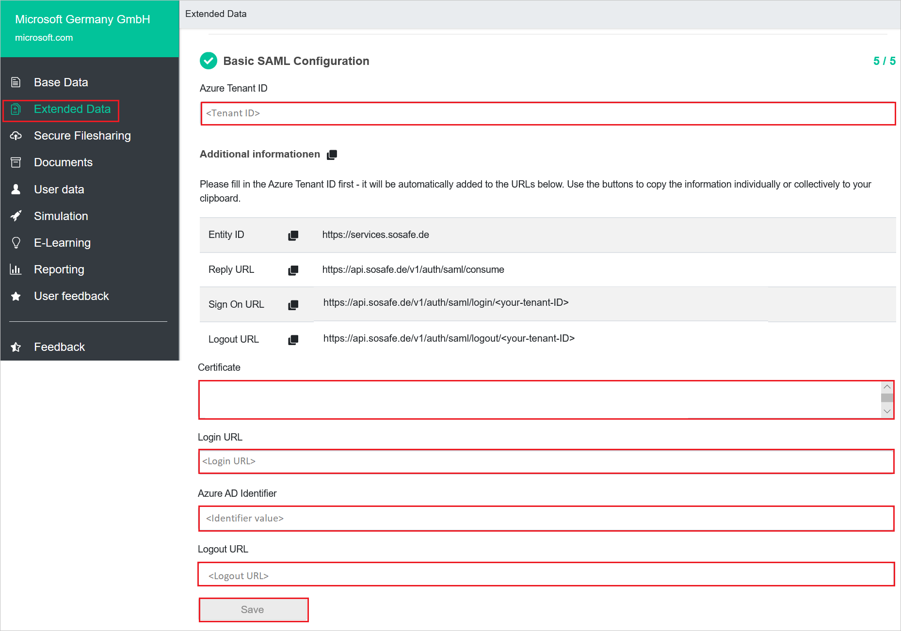

# Configure SoSafe for Single sign-on with Microsoft Entra ID

In this article,  you learn how to integrate SoSafe with Microsoft Entra ID. When you integrate SoSafe with Microsoft Entra ID, you can:

* Control in Microsoft Entra ID who has access to SoSafe.
* Enable your users to be automatically signed-in to SoSafe with their Microsoft Entra accounts.
* Manage your accounts in one central location.

## Prerequisites
The scenario outlined in this article assumes that you already have the following prerequisites:

[!INCLUDE [common-prerequisites.md](~/identity/saas-apps/includes/common-prerequisites.md)]
* SoSafe single sign-on (SSO) enabled subscription.

## Scenario description

In this article,  you configure and test Microsoft Entra SSO in a test environment.

* SoSafe supports **SP and IDP** initiated SSO.
* SoSafe supports **Just In Time** user provisioning.
* SoSafe supports [Automated user provisioning](sosafe-provisioning-tutorial.md).

> [!NOTE]
> Identifier of this application is a fixed string value so only one instance can be configured in one tenant.

## Adding SoSafe from the gallery

To configure the integration of SoSafe into Microsoft Entra ID, you need to add SoSafe from the gallery to your list of managed SaaS apps.

1. Sign in to the [Microsoft Entra admin center](https://entra.microsoft.com) as at least a [Cloud Application Administrator](~/identity/role-based-access-control/permissions-reference.md#cloud-application-administrator).
1. Browse to **Entra ID** > **Enterprise apps** > **New application**.
1. In the **Add from the gallery** section, type SoSafe in the search box.
1. Select SoSafe from results panel and then add the app. Wait a few seconds while the app is added to your tenant.

 Alternatively, you can also use the [Enterprise App Configuration Wizard](https://portal.office.com/AdminPortal/home?Q=Docs#/azureadappintegration). In this wizard, you can add an application to your tenant, add users/groups to the app, assign roles, and walk through the SSO configuration as well. [Learn more about Microsoft 365 wizards.](/microsoft-365/admin/misc/azure-ad-setup-guides)

## Configure and test Microsoft Entra SSO for SoSafe

Configure and test Microsoft Entra SSO with SoSafe using a test user called **B.Simon**. For SSO to work, you need to establish a link relationship between a Microsoft Entra user and the related user in SoSafe.

To configure and test Microsoft Entra SSO with SoSafe, perform the following steps:

1. **[Configure Microsoft Entra SSO](#configure-azure-ad-sso)** - to enable your users to use this feature.
    1. **Create a Microsoft Entra test user** - to test Microsoft Entra single sign-on with B.Simon.
    1. **Assign the Microsoft Entra test user** - to enable B.Simon to use Microsoft Entra single sign-on.
1. **[Configure SoSafe SSO](#configure-sosafe-sso)** - to configure the single sign-on settings on application side.
    1. **[Create SoSafe test user](#create-sosafe-test-user)** - to have a counterpart of B.Simon in SoSafe that's linked to the Microsoft Entra representation of user.
1. **[Test SSO](#test-sso)** - to verify whether the configuration works.

## Configure Microsoft Entra SSO

Follow these steps to enable Microsoft Entra SSO.

1. Sign in to the [Microsoft Entra admin center](https://entra.microsoft.com) as at least a [Cloud Application Administrator](~/identity/role-based-access-control/permissions-reference.md#cloud-application-administrator).
1. Browse to **Entra ID** > **Enterprise apps** > SoSafe application integration 
1. Select **Single sign-on**.
1. On the **Select a single sign-on method** page, select **SAML**.
1. On the **Set up single sign-on with SAML** page, select the pencil icon for **Basic SAML Configuration** to edit the settings.

   

1. On the **Basic SAML Configuration** section, the user doesn't have to perform any step as the app is already pre-integrated with Azure.

1. Select **Set additional URLs** and perform the following step if you wish to configure the application in **SP** initiated mode:

    In the **Sign-on URL** text box, type a URL using the following pattern:
    `https://api.sosafe.de/v1/auth/saml/login/<TENANT_ID>`

	> [!NOTE]
	> The Sign-on URL value isn't real. Update the value with actual Sign-on URL. Contact [SoSafe Client support team](mailto:support@sosafe.de) to get these values. You can also refer to the patterns shown in the **Basic SAML Configuration** section.

1. On the **Set up single sign-on with SAML** page, in the **SAML Signing Certificate** section,  find **Certificate (Base64)** and select **Download** to download the certificate and save it on your computer.

	

1. On the Set up SoSafe section, copy the appropriate URL(s) based on your requirement.

	

[!INCLUDE [create-assign-users-sso.md](~/identity/saas-apps/includes/create-assign-users-sso.md)]

## Configure SoSafe SSO

1. In a different web browser window, sign into SoSafe website as an administrator.

1. Select **Extended Data** and perform the following steps in the following page.

    

    a. Paste the value of Tenant ID value in **Azure Tenant ID** textbox from Azure portal.

    b. Open the downloaded **Certificate(Base64)** into Notepad and paste the content into the **Certificate** textbox.

    c. In the **Login URL** box, paste the **Login URL** value that you copied.

    d. In the **Microsoft Entra Identifier** box, paste the **Entity ID** value that you copied.

    e. In the **Logout URL** box, paste the **Logout URL** value that you copied.

    f. Select **SAVE**

### Create SoSafe test user

In this section, a user called Britta Simon is created in SoSafe. SoSafe supports just-in-time user provisioning, which is enabled by default. There's no action item for you in this section. If a user doesn't already exist in SoSafe, a new one is created after authentication.

SoSafe also supports automatic user provisioning, you can find more details [here](./sosafe-provisioning-tutorial.md) on how to configure automatic user provisioning.

## Test SSO 

In this section, you test your Microsoft Entra single sign-on configuration with following options. 

#### SP initiated:

* Select **Test this application**, this option redirects to SoSafe Sign on URL where you can initiate the login flow.  

* Go to SoSafe Sign-on URL directly and initiate the login flow from there.

#### IDP initiated:

* Select **Test this application**, and you should be automatically signed in to the SoSafe for which you set up the SSO. 

You can also use Microsoft My Apps to test the application in any mode. When you select the SoSafe tile in the My Apps, if configured in SP mode you would be redirected to the application sign on page for initiating the login flow and if configured in IDP mode, you should be automatically signed in to the SoSafe for which you set up the SSO. For more information, see [Microsoft Entra My Apps](/azure/active-directory/manage-apps/end-user-experiences#azure-ad-my-apps).

## Related content

Once you configure SoSafe you can enforce session control, which protects exfiltration and infiltration of your organization’s sensitive data in real time. Session control extends from Conditional Access. [Learn how to enforce session control with Microsoft Defender for Cloud Apps](/cloud-app-security/proxy-deployment-any-app).
