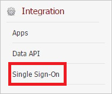

# Configure Humanity for Single sign-on with Microsoft Entra ID

In this article,  you learn how to integrate Humanity with Microsoft Entra ID. When you integrate Humanity with Microsoft Entra ID, you can:

* Control in Microsoft Entra ID who has access to Humanity.
* Enable your users to be automatically signed-in to Humanity with their Microsoft Entra accounts.
* Manage your accounts in one central location.

## Prerequisites
The scenario outlined in this article assumes that you already have the following prerequisites:

[!INCLUDE [common-prerequisites.md](~/identity/saas-apps/includes/common-prerequisites.md)]
* Humanity single sign-on (SSO) enabled subscription.

## Scenario description

In this article,  you configure and test Microsoft Entra single sign-on in a test environment.

* Humanity supports **SP** initiated SSO.

> [!NOTE]
> Identifier of this application is a fixed string value so only one instance can be configured in one tenant.

## Add Humanity from the gallery

To configure the integration of Humanity into Microsoft Entra ID, you need to add Humanity from the gallery to your list of managed SaaS apps.

1. Sign in to the [Microsoft Entra admin center](https://entra.microsoft.com) as at least a [Cloud Application Administrator](~/identity/role-based-access-control/permissions-reference.md#cloud-application-administrator).
1. Browse to **Entra ID** > **Enterprise apps** > **New application**.
1. In the **Add from the gallery** section, type **Humanity** in the search box.
1. Select **Humanity** from results panel and then add the app. Wait a few seconds while the app is added to your tenant.

 Alternatively, you can also use the [Enterprise App Configuration Wizard](https://portal.office.com/AdminPortal/home?Q=Docs#/azureadappintegration). In this wizard, you can add an application to your tenant, add users/groups to the app, assign roles, and walk through the SSO configuration as well. [Learn more about Microsoft 365 wizards.](/microsoft-365/admin/misc/azure-ad-setup-guides)

## Configure and test Microsoft Entra SSO for Humanity

Configure and test Microsoft Entra SSO with Humanity using a test user called **B.Simon**. For SSO to work, you need to establish a link relationship between a Microsoft Entra user and the related user in Humanity.

To configure and test Microsoft Entra SSO with Humanity, perform the following steps:

1. **[Configure Microsoft Entra SSO](#configure-azure-ad-sso)** - to enable your users to use this feature.
    1. **Create a Microsoft Entra test user** - to test Microsoft Entra single sign-on with B.Simon.
    1. **Assign the Microsoft Entra test user** - to enable B.Simon to use Microsoft Entra single sign-on.
1. **[Configure Humanity SSO](#configure-humanity-sso)** - to configure the single sign-on settings on application side.
    1. **[Create Humanity test user](#create-humanity-test-user)** - to have a counterpart of B.Simon in Humanity that's linked to the Microsoft Entra representation of user.
1. **[Test SSO](#test-sso)** - to verify whether the configuration works.

## Configure Microsoft Entra SSO

Follow these steps to enable Microsoft Entra SSO.

1. Sign in to the [Microsoft Entra admin center](https://entra.microsoft.com) as at least a [Cloud Application Administrator](~/identity/role-based-access-control/permissions-reference.md#cloud-application-administrator).
1. Browse to **Entra ID** > **Enterprise apps** > **Humanity** > **Single sign-on**.
1. On the **Select a single sign-on method** page, select **SAML**.
1. On the **Set up single sign-on with SAML** page, select the pencil icon for **Basic SAML Configuration** to edit the settings.

   

1. On the **Basic SAML Configuration** section, perform the following steps:

    a. In the **Identifier (Entity ID)** text box, type the URL: 
    `https://company.humanity.com/app/`

	b. In the **Sign on URL** text box, type the URL:
    `https://company.humanity.com/includes/saml/`

	> [!NOTE]
	> These values aren't real. Update these values with the actual Identifier and Sign on URL. Contact the Humanity client support team to get these values. You can also refer to the patterns shown in the **Basic SAML Configuration** section.

4. On the **Set up Single Sign-On with SAML** page, in the **SAML Signing Certificate** section, select **Download** to download the **Certificate (Base64)** from the given options as per your requirement and save it on your computer.

	

1. On the **Set up Humanity** section, copy the appropriate URL(s) as per your requirement.

	

[!INCLUDE [create-assign-users-sso.md](~/identity/saas-apps/includes/create-assign-users-sso.md)]

## Configure Humanity SSO

1. In a different web browser window, log in to your **Humanity** company site as an administrator.

2. In the menu on the top, select **Admin**.

    

3. Under **Integration**, select **Single Sign-On**.

    

4. In the **Single Sign-On** section, perform the following steps:

    

    a. Select **SAML Enabled**.

    b. Select **Allow Password Login**.

    c. In the **SAML Issuer URL** textbox, paste the **Login URL** value.

    d. In the **Remote Logout URL** textbox, paste the **Logout URL** value.

    e. Open your base-64 encoded certificate in notepad, copy the content of it into your clipboard, and then paste it to the **X.509 Certificate** textbox.

    f. Select **Save Settings**.

### Create Humanity test user

In order to enable Microsoft Entra users to log in to Humanity, they must be provisioned into Humanity. In the case of Humanity, provisioning is a manual task.

**To provision a user account, perform the following steps:**

1. Log in to your **Humanity** company site as an administrator.

2. Select **Admin**.

    

3. Select **Staff**.

    

4. Under **Actions**, select **Add Employees**.

    

5. In the **Add Employees** section, perform the following steps:

    

    a. Type the **First Name**, **Last Name**, and **Email** of a valid Microsoft Entra account you want to provision into the related textboxes.

    b. Select **Save Employees**.

> [!NOTE]
> You can use any other Humanity user account creation tools or APIs provided by Humanity to provision Microsoft Entra user accounts.

## Test SSO

In this section, you test your Microsoft Entra single sign-on configuration with following options. 

* Select **Test this application**, this option redirects to Humanity Sign-on URL where you can initiate the login flow. 

* Go to Humanity Sign-on URL directly and initiate the login flow from there.

* You can use Microsoft My Apps. When you select the Humanity tile in the My Apps, this option redirects to Humanity Sign-on URL. For more information, see [Microsoft Entra My Apps](/azure/active-directory/manage-apps/end-user-experiences#azure-ad-my-apps).

## Related content

Once you configure Humanity you can enforce session control, which protects exfiltration and infiltration of your organization’s sensitive data in real time. Session control extends from Conditional Access. [Learn how to enforce session control with Microsoft Defender for Cloud Apps](/cloud-app-security/proxy-deployment-aad).
