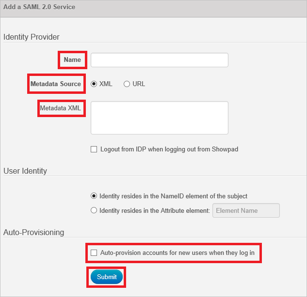

# Configure Showpad for Single sign-on with Microsoft Entra ID

In this article,  you learn how to integrate Showpad with Microsoft Entra ID. When you integrate Showpad with Microsoft Entra ID, you can:

* Control in Microsoft Entra ID who has access to Showpad.
* Enable your users to be automatically signed-in to Showpad with their Microsoft Entra accounts.
* Manage your accounts in one central location.

## Prerequisites
The scenario outlined in this article assumes that you already have the following prerequisites:

[!INCLUDE [common-prerequisites.md](~/identity/saas-apps/includes/common-prerequisites.md)]
* Showpad single sign-on enabled subscription.

## Scenario description

In this article,  you configure and test Microsoft Entra single sign-on in a test environment.

* Showpad supports **SP** initiated SSO.
* Showpad supports **Just In Time** user provisioning.

## Add Showpad from the gallery

To configure the integration of Showpad into Microsoft Entra ID, you need to add Showpad from the gallery to your list of managed SaaS apps.

1. Sign in to the [Microsoft Entra admin center](https://entra.microsoft.com) as at least a [Cloud Application Administrator](~/identity/role-based-access-control/permissions-reference.md#cloud-application-administrator).
1. Browse to **Entra ID** > **Enterprise apps** > **New application**.
1. In the **Add from the gallery** section, type **Showpad** in the search box.
1. Select **Showpad** from results panel and then add the app. Wait a few seconds while the app is added to your tenant.

 Alternatively, you can also use the [Enterprise App Configuration Wizard](https://portal.office.com/AdminPortal/home?Q=Docs#/azureadappintegration). In this wizard, you can add an application to your tenant, add users/groups to the app, assign roles, and walk through the SSO configuration as well. [Learn more about Microsoft 365 wizards.](/microsoft-365/admin/misc/azure-ad-setup-guides)

## Configure and test Microsoft Entra SSO for Showpad

Configure and test Microsoft Entra SSO with Showpad using a test user called **B.Simon**. For SSO to work, you need to establish a link relationship between a Microsoft Entra user and the related user in Showpad.

To configure and test Microsoft Entra SSO with Showpad, perform the following steps:

1. **[Configure Microsoft Entra SSO](#configure-azure-ad-sso)** - to enable your users to use this feature.
    1. **Create a Microsoft Entra test user** - to test Microsoft Entra single sign-on with B.Simon.
    1. **Assign the Microsoft Entra test user** - to enable B.Simon to use Microsoft Entra single sign-on.
1. **[Configure Showpad SSO](#configure-showpad-sso)** - to configure the single sign-on settings on application side.
    1. **[Create Showpad test user](#create-showpad-test-user)** - to have a counterpart of B.Simon in Showpad that's linked to the Microsoft Entra representation of user.
1. **[Test SSO](#test-sso)** - to verify whether the configuration works.

## Configure Microsoft Entra SSO

Follow these steps to enable Microsoft Entra SSO.

1. Sign in to the [Microsoft Entra admin center](https://entra.microsoft.com) as at least a [Cloud Application Administrator](~/identity/role-based-access-control/permissions-reference.md#cloud-application-administrator).
1. Browse to **Entra ID** > **Enterprise apps** > **Showpad** > **Single sign-on**.
1. On the **Select a single sign-on method** page, select **SAML**.
1. On the **Set up single sign-on with SAML** page, select the pencil icon for **Basic SAML Configuration** to edit the settings.

   

1. On the **Basic SAML Configuration** section, perform the following steps:

    a. In the **Identifier (Entity ID)** text box, type a URL using the following pattern:
    `https://<company-name>.showpad.biz`
    
	b. In the **Sign on URL** text box, type a URL using the following pattern:
    `https://<company-name>.showpad.biz/login`

	> [!NOTE]
	> These values aren't real. Update these values with the actual Identifier and Sign on URL. Contact [Showpad Client support team](https://help.showpad.com/) to get these values. You can also refer to the patterns shown in the **Basic SAML Configuration** section.

1. On the **Set up Single Sign-On with SAML** page, in the **SAML Signing Certificate** section, select **Download** to download the **Federation Metadata XML** from the given options as per your requirement and save it on your computer.

	

6. On the **Set up Showpad** section, copy the appropriate URL(s) as per your requirement.

	

[!INCLUDE [create-assign-users-sso.md](~/identity/saas-apps/includes/create-assign-users-sso.md)]

## Configure Showpad SSO

1. Sign in to your Showpad tenant as an administrator.

1. In the menu on the top, select the **Settings**.

    

1. Navigate to **Single Sign-On** and select **Enable**.

    

1. On the **Add a SAML 2.0 Service** dialog, perform the following steps:

     

    a. In the **Name** textbox, type the name of Identifier Provider (for example: your company name).

    b. As **Metadata Source**, select **XML**.

    c. Copy the content of metadata XML file, which you have downloaded, and then paste it into the **Metadata XML** textbox.

    d. Select **Auto-provision accounts for new users when they log in**.

    e. Select **Submit**.

### Create Showpad test user

In this section, a user called Britta Simon is created in Showpad. Showpad supports just-in-time user provisioning, which is enabled by default. There's no action item for you in this section. If a user doesn't already exist in Showpad, a new one is created after authentication.

## Test SSO 

In this section, you test your Microsoft Entra single sign-on configuration with following options. 

* Select **Test this application**, this option redirects to Showpad Sign-on URL where you can initiate the login flow. 

* Go to Showpad Sign-on URL directly and initiate the login flow from there.

* You can use Microsoft My Apps. When you select the Showpad tile in the My Apps, this option redirects to Showpad Sign-on URL. For more information, see [Microsoft Entra My Apps](/azure/active-directory/manage-apps/end-user-experiences#azure-ad-my-apps).

## Related content

Once you configure Showpad you can enforce session control, which protects exfiltration and infiltration of your organization’s sensitive data in real time. Session control extends from Conditional Access. [Learn how to enforce session control with Microsoft Cloud App Security](/cloud-app-security/proxy-deployment-aad).
