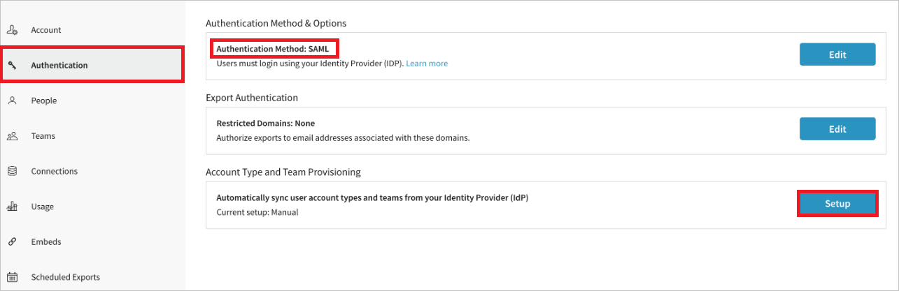
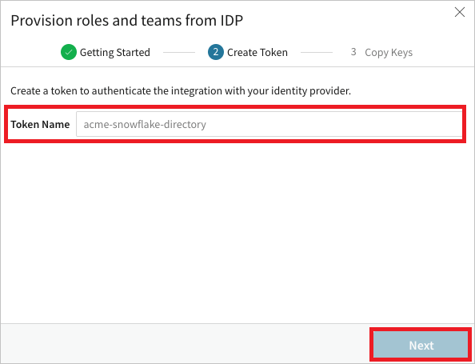
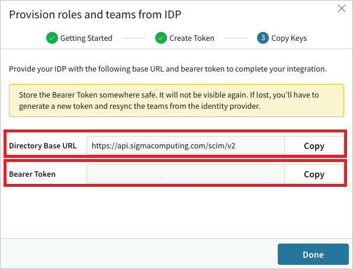

# Configure Sigma Computing for automatic user provisioning with Microsoft Entra ID

This article describes the steps you need to perform in both Sigma Computing and Microsoft Entra ID to configure automatic user provisioning. When configured, Microsoft Entra ID automatically provisions and de-provisions users and groups to [Sigma Computing](https://www.sigmacomputing.com/) using the Microsoft Entra provisioning service. For important details on what this service does, how it works, and frequently asked questions, see [Automate user provisioning and deprovisioning to SaaS applications with Microsoft Entra ID](~/identity/app-provisioning/user-provisioning.md). 

## Capabilities Supported
> [!div class="checklist"]
> * Create users in Sigma Computing
> * Remove users in Sigma Computing when they don't require access anymore
> * Keep user attributes synchronized between Microsoft Entra ID and Sigma Computing
> * Provision groups and group memberships in Sigma Computing
> * [Single sign-on](./sigma-computing-tutorial.md) to Sigma Computing (recommended)

## Prerequisites

The scenario outlined in this article assumes that you already have the following prerequisites:

* [!INCLUDE [common-prerequisites.md](~/identity/saas-apps/includes/common-prerequisites.md)]
* An admin account in your Sigma organization.
* An existing [SSO](./sigma-computing-tutorial.md) integration with Sigma Computing.

## Step 1: Plan your provisioning deployment
1. Learn about [how the provisioning service works](~/identity/app-provisioning/user-provisioning.md).
2. Determine who's in [scope for provisioning](~/identity/app-provisioning/define-conditional-rules-for-provisioning-user-accounts.md).
3. Determine what data to [map between Microsoft Entra ID and Sigma Computing](~/identity/app-provisioning/customize-application-attributes.md). 

## Step 2: Configure Sigma Computing to support provisioning with Microsoft Entra ID

1. Log in to your Sigma account.

1. Navigate to the **Admin Portal** by selecting **Administration** from the user menu.

1. In the left panel, select **Authentication** to open your organization’s Authentication page.

1. Ensure the **Authentication Method** is **SAML** only.

1. Select the **Setup** button under **Account Type and Team Provisioning** to open the Provisioning modal.

   

1. Read through the notes provided on the getting started section of the Provisioning modal. Check the confirmation box, and select **Next** to continue.

1. Enter a Token name and select **Next**.

   

1. Sigma will provide you with a **Bearer Token** and **Directory Base URL**. Copy and save these values in a secure location. These values are entered in the **Tenant URL** and **Secret Token** field in the Provisioning tab of your Sigma Computing application. Select **Done**.

   
   

## Step 3: Add Sigma Computing from the Microsoft Entra application gallery

Add Sigma Computing from the Microsoft Entra application gallery to start managing provisioning to Sigma Computing. If you have previously setup Sigma Computing for SSO, you can use the same application. However, we recommend that you create a separate app when testing out the integration initially. Learn more about adding an application from the gallery [here](~/identity/enterprise-apps/add-application-portal.md). 

## Step 4: Define who is in scope for provisioning 

[!INCLUDE [create-assign-users-provisioning.md](~/identity/saas-apps/includes/create-assign-users-provisioning.md)]

## Step 5: Configure automatic user provisioning to Sigma Computing 

This section guides you through the steps to configure the Microsoft Entra provisioning service to create, update, and disable users and/or groups in TestApp based on user and/or group assignments in Microsoft Entra ID.

### Configure automatic user provisioning for Sigma Computing in Microsoft Entra ID

1. Sign in to the [Microsoft Entra admin center](https://entra.microsoft.com) as at least a [Cloud Application Administrator](~/identity/role-based-access-control/permissions-reference.md#cloud-application-administrator).
1. Browse to **Entra ID** > **Enterprise apps**

   

1. In the applications list, select **Sigma Computing**.

   

1. Select the **Provisioning** tab.

	

1. Select **+ New configuration**.

	

1. In the **Tenant URL** field, enter your Sigma Computing Tenant URL and Secret Token. Select **Test Connection** to ensure Microsoft Entra ID can connect to Sigma Computing. If the connection fails, ensure your Sigma Computing account has the required admin permissions and try again.

   

1. Select **Create** to create your configuration.

1. Select **Properties** on the **Overview** page.

1. Select the **Edit** icon to edit the properties. Enable notification emails and provide an email to receive quarantine notifications. Enable **Accidental deletions prevention**. Select **Apply** to save the changes.

   

1. Select **Attribute Mapping** in the left panel and select **users**.

1. Review the user attributes that are synchronized from Microsoft Entra ID to Sigma Computing in the **Attribute-Mapping** section. The attributes selected as **Matching** properties are used to match the user accounts in Sigma Computing for update operations. If you choose to change the [matching target attribute](~/identity/app-provisioning/customize-application-attributes.md), you need to ensure that the Sigma Computing API supports filtering users based on that attribute. Select the **Save** button to commit any changes.

   |Attribute|Type|Supported For Filtering|
   |---|---|---|
   |userName|String|&check;|
   |userType|String|
   |active|Boolean|
   |emails[type eq "work"].value|String|
   |name.givenName|String|
   |name.familyName|String|

1. Select **Groups**.

1. Review the group attributes that are synchronized from Microsoft Entra ID to Sigma Computing in the **Attribute-Mapping** section. The attributes selected as **Matching** properties are used to match the groups in Sigma Computing for update operations. Select the **Save** button to commit any changes.

      |Attribute|Type|Supported For Filtering|
      |---|---|---|
      |displayName|String|&check;|
      |members|Reference|

1. To configure scoping filters, refer to the instructions provided in the [Scoping filter article](~/identity/app-provisioning/define-conditional-rules-for-provisioning-user-accounts.md).

1. Use [on-demand provisioning](~/identity/app-provisioning/provision-on-demand.md) to validate sync with a small number of users before deploying more broadly in your organization.

1. When you're ready to provision, select **Start Provisioning** from the **Overview** page.

## Step 6: Monitor your deployment

[!INCLUDE [monitor-deployment.md](~/identity/saas-apps/includes/monitor-deployment.md)]

## Additional resources

* [Managing user account provisioning for Enterprise Apps](~/identity/app-provisioning/configure-automatic-user-provisioning-portal.md)
* [What is application access and single sign-on with Microsoft Entra ID?](~/identity/enterprise-apps/what-is-single-sign-on.md)

## Related content

* [Learn how to review logs and get reports on provisioning activity](~/identity/app-provisioning/check-status-user-account-provisioning.md)
