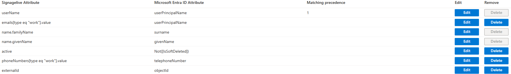
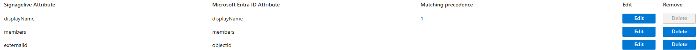

# Configure Signagelive for automatic user provisioning with Microsoft Entra ID

The objective of this article is to demonstrate the steps to be performed in Signagelive  and Microsoft Entra ID to configure Microsoft Entra ID to automatically provision and de-provision users and/or groups to Signagelive.

> [!NOTE]
> This article describes a connector built on top of the Microsoft Entra user provisioning service. For important details on what this service does, how it works, and frequently asked questions, see [Automate user provisioning and deprovisioning to SaaS applications with Microsoft Entra ID](~/identity/app-provisioning/user-provisioning.md).
>

## Prerequisites

The scenario outlined in this article assumes that you already have the following prerequisites:

[!INCLUDE [common-prerequisites.md](~/identity/saas-apps/includes/common-prerequisites.md)].
* [A Signagelive tenant](https://signagelive.com/pricing/)
* A user account in Signagelive with Admin permissions.

## Assigning users to Signagelive   

Microsoft Entra ID uses a concept called *assignments* to determine which users should receive access to selected apps. In the context of automatic user provisioning, only the users and/or groups that have been assigned to an application in Microsoft Entra ID are synchronized.

Before configuring and enabling automatic user provisioning, you should decide which users and/or groups in Microsoft Entra ID need access to Signagelive. Once decided, you can assign these users and/or groups to Signagelive    by following the instructions here:
* [Assign a user or group to an enterprise app](~/identity/enterprise-apps/assign-user-or-group-access-portal.md)

## Important tips for assigning users to Signagelive   

* It+'s recommended that a single Microsoft Entra user is assigned to Signagelive    to test the automatic user provisioning configuration. More users and/or groups may be assigned later.

* When assigning a user to Signagelive, you must select any valid application-specific role (if available) in the assignment dialog. Users with the **Default Access** role are excluded from provisioning.

## Set up Signagelive  for provisioning

Before configuring Signagelive for automatic user provisioning with Microsoft Entra ID, you need to enable SCIM provisioning on Signagelive.

  Reach out to  [Signagelive](mailto:development@signagelive.com) to obtain the secret token needed to configure SCIM provisioning.

## Add Signagelive from the gallery

To configure Signagelive    for automatic user provisioning with Microsoft Entra ID, you need to add Signagelive from the Microsoft Entra application gallery to your list of managed SaaS applications.

**To add Signagelive from the Microsoft Entra application gallery, perform the following steps:**

1. Sign in to the [Microsoft Entra admin center](https://entra.microsoft.com) as at least a [Cloud Application Administrator](~/identity/role-based-access-control/permissions-reference.md#cloud-application-administrator).
1. Browse to **Entra ID** > **Enterprise apps** > **New application**.
1. In the **Add from the gallery** section, type **Signagelive**, select **Signagelive** in the search box.
1. Select **Signagelive** from results panel and then add the app. Wait a few seconds while the app is added to your tenant.
	

## Configuring automatic user provisioning to Signagelive    

This section guides you through the steps to configure the Microsoft Entra provisioning service to create, update, and disable users and/or groups in Signagelive based on user and/or group assignments in Microsoft Entra ID.

> [!TIP]
>  You may also choose to enable SAML-based single sign-on for Signagelive, following the instructions provided in the [Signagelive Single sign-on  article](Signagelive-tutorial.md). Single sign-on can be configured independently of automatic user provisioning, though these two features complement each other.

### To configure automatic user provisioning for Signagelive  in Microsoft Entra ID:

1. Sign in to the [Microsoft Entra admin center](https://entra.microsoft.com) as at least a [Cloud Application Administrator](~/identity/role-based-access-control/permissions-reference.md#cloud-application-administrator).
1. Browse to **Entra ID** > **Enterprise apps**

	

1. In the applications list, select **Signagelive**.

	

3. Select the **Provisioning** tab.

	

4. Set the **Provisioning Mode** to **Automatic**.

	

5. Under the Admin Credentials section, input ` https://samlapi.signagelive.com/scim/v2` in **Tenant URL**. In **Secret Token** field, enter the **bearer Token** value provided by the engineering development team. Select **Test Connection** to ensure Microsoft Entra ID can connect to Signagelive. If the connection fails, ensure your Signagelive account has Admin permissions and try again.
	

6. In the **Notification Email** field, enter the email address of a person or group who should receive the provisioning error notifications and check the checkbox - **Send an email notification when a failure occurs**.

	

7. Select **Save**.

8. Under the **Mappings** section, select **Synchronize Microsoft Entra users to Signagelive**.

9. Review the user attributes that are synchronized from Microsoft Entra ID to Signagelive in the **Attribute Mapping** section. The attributes selected as **Matching** properties are used to match the user accounts in Signagelive for update operations. Select the **Save** button to commit any changes.

	

10. Under the **Mappings** section, select **Synchronize Microsoft Entra group to Signagelive**.

11. Review the group attributes that are synchronized from Microsoft Entra ID to Signagelive in the **Attribute Mapping** section. The attributes selected as **Matching** properties are used to match the group accounts in Signagelive for update operations. Select the **Save** button to commit any changes.

	

12. To configure scoping filters, refer to the following instructions provided in the [Scoping filter  article](~/identity/app-provisioning/define-conditional-rules-for-provisioning-user-accounts.md).

13. To enable the Microsoft Entra provisioning service for Signagelive, change the **Provisioning Status** to **On** in the **Settings** section.

	

14. Define the users and/or groups that you would like to provision to Signagelive by choosing the desired values in **Scope** in the **Settings** section.

	

15. When you're ready to provision, select **Save**.

	

This operation starts the initial synchronization of all users and/or groups defined in **Scope** in the **Settings** section. The initial sync takes longer to perform than subsequent syncs. For more information on how long it takes for users and/or groups to provision, see [How long will it take to provision users](~/identity/app-provisioning/application-provisioning-when-will-provisioning-finish-specific-user.md#how-long-will-it-take-to-provision-users). 

You can use the **Current Status** section to monitor progress and follow links to your provisioning activity report, which describes all actions performed by the Microsoft Entra provisioning service on Signagelive. For more information, see [Check the status of user provisioning](~/identity/app-provisioning/application-provisioning-when-will-provisioning-finish-specific-user.md). To read the Microsoft Entra provisioning logs, see [Reporting on automatic user account provisioning](~/identity/app-provisioning/check-status-user-account-provisioning.md).

## More resources

* [Managing user account provisioning for Enterprise Apps](~/identity/app-provisioning/configure-automatic-user-provisioning-portal.md)
* [What is application access and single sign-on with Microsoft Entra ID?](~/identity/enterprise-apps/what-is-single-sign-on.md)

## Related content

* [Learn how to review logs and get reports on provisioning activity](~/identity/app-provisioning/check-status-user-account-provisioning.md)
