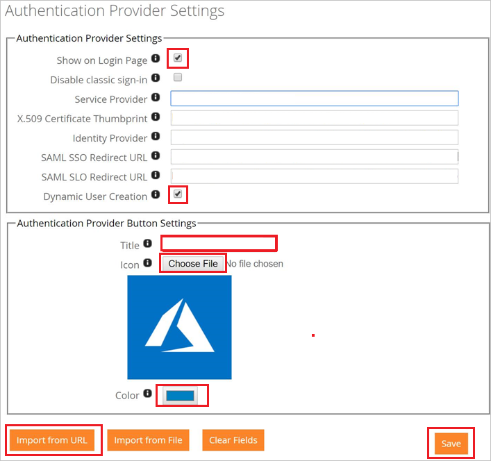
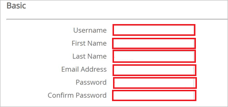

# Configure Silverback for Single sign-on with Microsoft Entra ID

In this article,  you learn how to integrate Silverback with Microsoft Entra ID. When you integrate Silverback with Microsoft Entra ID, you can:

* Control in Microsoft Entra ID who has access to Silverback.
* Enable your users to be automatically signed-in to Silverback with their Microsoft Entra accounts.
* Manage your accounts in one central location.

## Prerequisites

To get started, you need the following items:

* A Microsoft Entra subscription. If you don't have a subscription, you can get a [free account](https://azure.microsoft.com/free/).
* Silverback single sign-on (SSO) enabled subscription.
* Along with Cloud Application Administrator, Application Administrator can also add or manage applications in Microsoft Entra ID.
For more information, see [Azure built-in roles](~/identity/role-based-access-control/permissions-reference.md).

## Scenario description

In this article,  you configure and test Microsoft Entra single sign-on in a test environment.

* Silverback supports **SP** initiated SSO.

## Add Silverback from the gallery

To configure the integration of Silverback into Microsoft Entra ID, you need to add Silverback from the gallery to your list of managed SaaS apps.

1. Sign in to the [Microsoft Entra admin center](https://entra.microsoft.com) as at least a [Cloud Application Administrator](~/identity/role-based-access-control/permissions-reference.md#cloud-application-administrator).
1. Browse to **Entra ID** > **Enterprise apps** > **New application**.
1. In the **Add from the gallery** section, type **Silverback** in the search box.
1. Select **Silverback** from results panel and then add the app. Wait a few seconds while the app is added to your tenant.

 Alternatively, you can also use the [Enterprise App Configuration Wizard](https://portal.office.com/AdminPortal/home?Q=Docs#/azureadappintegration). In this wizard, you can add an application to your tenant, add users/groups to the app, assign roles, and walk through the SSO configuration as well. [Learn more about Microsoft 365 wizards.](/microsoft-365/admin/misc/azure-ad-setup-guides)

## Configure and test Microsoft Entra SSO for Silverback

Configure and test Microsoft Entra SSO with Silverback using a test user called **B.Simon**. For SSO to work, you need to establish a link relationship between a Microsoft Entra user and the related user in Silverback.

To configure and test Microsoft Entra SSO with Silverback, perform the following steps:

1. **[Configure Microsoft Entra SSO](#configure-azure-ad-sso)** - to enable your users to use this feature.
    1. **Create a Microsoft Entra test user** - to test Microsoft Entra single sign-on with B.Simon.
    1. **Assign the Microsoft Entra test user** - to enable B.Simon to use Microsoft Entra single sign-on.
1. **[Configure Silverback SSO](#configure-silverback-sso)** - to configure the single sign-on settings on application side.
    1. **[Create Silverback test user](#create-silverback-test-user)** - to have a counterpart of B.Simon in Silverback that's linked to the Microsoft Entra representation of user.
1. **[Test SSO](#test-sso)** - to verify whether the configuration works.

## Configure Microsoft Entra SSO

Follow these steps to enable Microsoft Entra SSO.

1. Sign in to the [Microsoft Entra admin center](https://entra.microsoft.com) as at least a [Cloud Application Administrator](~/identity/role-based-access-control/permissions-reference.md#cloud-application-administrator).
1. Browse to **Entra ID** > **Enterprise apps** > **Silverback** > **Single sign-on**.
1. On the **Select a single sign-on method** page, select **SAML**.
1. On the **Set up single sign-on with SAML** page, select the pencil icon for **Basic SAML Configuration** to edit the settings.

    

1. On the **Basic SAML Configuration** section, perform the following steps:

    a. In the **Identifier** box, type a URL using the following pattern:
    `<YOURSILVERBACKURL>.com`

    b. In the **Reply URL** text box, type a URL using the following pattern:
    `https://<YOURSILVERBACKURL>.com/sts/authorize/login`

    c. In the **Sign-on URL** text box, type a URL using the following pattern:
    `https://<YOURSILVERBACKURL>.com/ssp`

	> [!NOTE]
	> These values aren't real. Update these values with the actual Identifier, Reply URL and Sign on URL. Contact [Silverback Client support team](mailto:helpdesk@matrix42.com) to get these values. You can also refer to the patterns shown in the **Basic SAML Configuration** section.

1. On the **Set up Single Sign-On with SAML** page, In the **SAML Signing Certificate** section, select copy button to copy **App Federation Metadata Url** and save it on your computer.

	

[!INCLUDE [create-assign-users-sso.md](~/identity/saas-apps/includes/create-assign-users-sso.md)]

## Configure Silverback SSO

1. In a different web browser, log in to your Silverback Server as an Administrator.

2. Navigate to **Admin** > **Authentication Provider**.

3. On the **Authentication Provider Settings** page, perform the following steps:

	

	a. 	Select **Import from URL**.

	b.	Paste the copied Metadata URL and select **OK**.

	c.	Confirm with **OK** then the values are populated automatically.

	d.	Enable **Show on Login Page**.

	e.	Enable **Dynamic User Creation** if you want to add by Microsoft Entra authorized users automatically (optional).

	f.	Create a **Title** for the button on the Self Service Portal.

	g.	Upload an **Icon** by selecting **Choose File**.

	h.	Select the background **color** for the button.

	i.	Select **Save**.

### Create Silverback test user

To enable Microsoft Entra users to log in to Silverback, they must be provisioned into Silverback. In Silverback, provisioning is a manual task.

**To provision a user account, perform the following steps:**

1. Log in to your Silverback Server as an Administrator.

2. Navigate to **Users** and **add a new device user**.

3. On the **Basic** page, perform the following steps:

	

	a. In **Username** text box, enter the name of user like **Britta**.

	b. In **First Name** text box, enter the first name of user like **Britta**.

	c. In **Last Name** text box, enter the last name of user like **Simon**.

	d. In **E-mail Address** text box, enter the email of user like **Brittasimon\@contoso.com**.

	e. In the **Password** text box, enter your password.

	f. In the **Confirm Password** text box, Reenter your password and confirm.

	g. Select **Save**.

> [!NOTE]
> If you don’t want to create each user manually Enable the **Dynamic User Creation** Checkbox under **Admin** > **Authentication Provider**.

## Test SSO

In this section, you test your Microsoft Entra single sign-on configuration with following options. 

* Select **Test this application**, this option redirects to Silverback Sign on URL where you can initiate the login flow. 

* Go to Silverback Sign on URL directly and initiate the login flow from there.

* You can use Microsoft My Apps. When you select the Silverback tile in the My Apps, this option redirects to Silverback Sign on URL. For more information, see [Microsoft Entra My Apps](/azure/active-directory/manage-apps/end-user-experiences#azure-ad-my-apps).

## Related content

Once you configure Silverback you can enforce session control, which protects exfiltration and infiltration of your organization’s sensitive data in real time. Session control extends from Conditional Access. [Learn how to enforce session control with Microsoft Cloud App Security](/cloud-app-security/proxy-deployment-aad).
