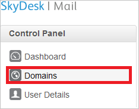
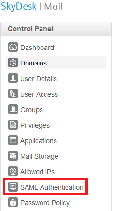

# Configure SkyDesk Email for Single sign-on with Microsoft Entra ID

In this article,  you learn how to integrate SkyDesk Email with Microsoft Entra ID. When you integrate SkyDesk Email with Microsoft Entra ID, you can:

* Control in Microsoft Entra ID who has access to SkyDesk Email.
* Enable your users to be automatically signed-in to SkyDesk Email with their Microsoft Entra accounts.
* Manage your accounts in one central location.

## Prerequisites
The scenario outlined in this article assumes that you already have the following prerequisites:

[!INCLUDE [common-prerequisites.md](~/identity/saas-apps/includes/common-prerequisites.md)]
* SkyDesk Email single sign-on (SSO) enabled subscription.

## Scenario description

In this article,  you configure and test Microsoft Entra single sign-on in a test environment.

* SkyDesk Email supports **SP** initiated SSO.

> [!NOTE]
> Identifier of this application is a fixed string value so only one instance can be configured in one tenant.

## Add SkyDesk Email from the gallery

To configure the integration of SkyDesk Email into Microsoft Entra ID, you need to add SkyDesk Email from the gallery to your list of managed SaaS apps.

1. Sign in to the [Microsoft Entra admin center](https://entra.microsoft.com) as at least a [Cloud Application Administrator](~/identity/role-based-access-control/permissions-reference.md#cloud-application-administrator).
1. Browse to **Entra ID** > **Enterprise apps** > **New application**.
1. In the **Add from the gallery** section, type **SkyDesk Email** in the search box.
1. Select **SkyDesk Email** from results panel and then add the app. Wait a few seconds while the app is added to your tenant.

 Alternatively, you can also use the [Enterprise App Configuration Wizard](https://portal.office.com/AdminPortal/home?Q=Docs#/azureadappintegration). In this wizard, you can add an application to your tenant, add users/groups to the app, assign roles, and walk through the SSO configuration as well. [Learn more about Microsoft 365 wizards.](/microsoft-365/admin/misc/azure-ad-setup-guides)

## Configure and test Microsoft Entra SSO for SkyDesk Email

Configure and test Microsoft Entra SSO with SkyDesk Email using a test user called **B.Simon**. For SSO to work, you need to establish a link relationship between a Microsoft Entra user and the related user in SkyDesk Email.

To configure and test Microsoft Entra SSO with SkyDesk Email, perform the following steps:

1. **[Configure Microsoft Entra SSO](#configure-azure-ad-sso)** - to enable your users to use this feature.
    1. **Create a Microsoft Entra test user** - to test Microsoft Entra single sign-on with B.Simon.
    1. **Assign the Microsoft Entra test user** - to enable B.Simon to use Microsoft Entra single sign-on.
1. **[Configure SkyDesk Email SSO](#configure-skydesk-email-sso)** - to configure the single sign-on settings on application side.
    1. **[Create SkyDesk Email test user](#create-skydesk-email-test-user)** - to have a counterpart of B.Simon in SkyDesk Email that's linked to the Microsoft Entra representation of user.
1. **[Test SSO](#test-sso)** - to verify whether the configuration works.

## Configure Microsoft Entra SSO

Follow these steps to enable Microsoft Entra SSO.

1. Sign in to the [Microsoft Entra admin center](https://entra.microsoft.com) as at least a [Cloud Application Administrator](~/identity/role-based-access-control/permissions-reference.md#cloud-application-administrator).
1. Browse to **Entra ID** > **Enterprise apps** > **SkyDesk Email** > **Single sign-on**.
1. On the **Select a single sign-on method** page, select **SAML**.
1. On the **Set up single sign-on with SAML** page, select the pencil icon for **Basic SAML Configuration** to edit the settings.

   

1. On the **Basic SAML Configuration** section, perform the following step:

    In the **Sign-on URL** text box, type a URL using the following pattern:
    `https://mail.skydesk.jp/portal/<companyname>`

1. On the **Set up Single Sign-On with SAML** page, in the **SAML Signing Certificate** section, select **Download** to download the **Certificate (Base64)** from the given options as per your requirement and save it on your computer.

	

1. On the **Set up SkyDesk Email** section, copy the appropriate URL(s) as per your requirement.

	

[!INCLUDE [create-assign-users-sso.md](~/identity/saas-apps/includes/create-assign-users-sso.md)]

## Configure SkyDesk Email SSO

1. In a different web browser, sign-on to your SkyDesk Email account as administrator.

1. In the menu on the top, select **Setup**, and select **Org**.

    
  
1. Select **Domains** from the left panel.

    

1. Select **Add Domain**.

    

1. Enter your Domain name, and then verify the Domain.

    

1. Select **SAML Authentication** from the left panel.

    

1. On the **SAML Authentication** dialog page, perform the following steps:

    

    > [!NOTE]
    > To use SAML based authentication, you should either have **verified domain** or **portal URL** setup. You can set the portal URL with the unique name.

    

    a. In the **Login URL** textbox, paste the value of **Login URL**.

    b. In the **Logout** URL textbox, paste the value of **Logout URL**.

    c. **Change Password URL** is optional so leave it blank.

    d. Select **Get Key From File** to select your downloaded certificate from Azure portal, and then select **Open** to upload the certificate.

    e. As **Algorithm**, select **RSA**.

    f. Select **Ok** to save the changes.

### Create SkyDesk Email test user

In this section, you create a user called Britta Simon in SkyDesk Email.

Select **User Access** from the left panel in SkyDesk Email and then enter your username.

## Test SSO

In this section, you test your Microsoft Entra single sign-on configuration with following options. 

* Select **Test this application**, this option redirects to SkyDesk Email Sign-on URL where you can initiate the login flow. 

* Go to SkyDesk Email Sign-on URL directly and initiate the login flow from there.

* You can use Microsoft My Apps. When you select the SkyDesk Email tile in the My Apps, this option redirects to SkyDesk Email Sign-on URL. For more information, see [Microsoft Entra My Apps](/azure/active-directory/manage-apps/end-user-experiences#azure-ad-my-apps).

## Related content

Once you configure SkyDesk Email you can enforce session control, which protects exfiltration and infiltration of your organization’s sensitive data in real time. Session control extends from Conditional Access. [Learn how to enforce session control with Microsoft Defender for Cloud Apps](/cloud-app-security/proxy-deployment-aad).
