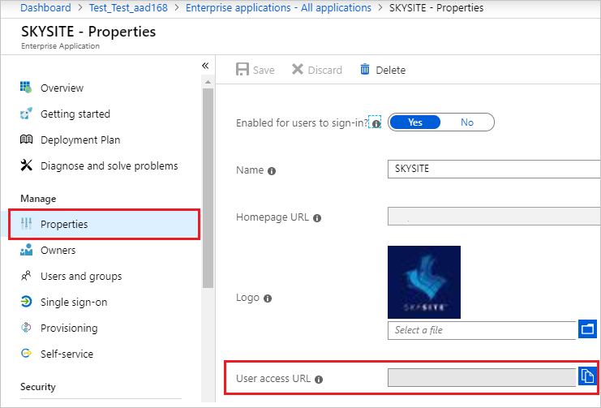
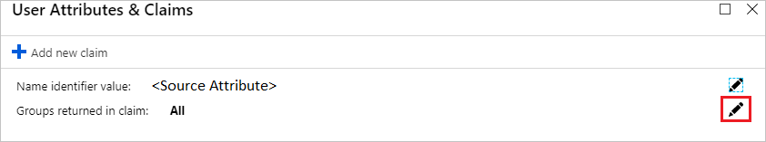
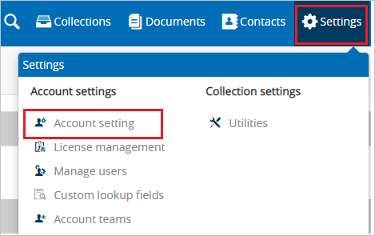
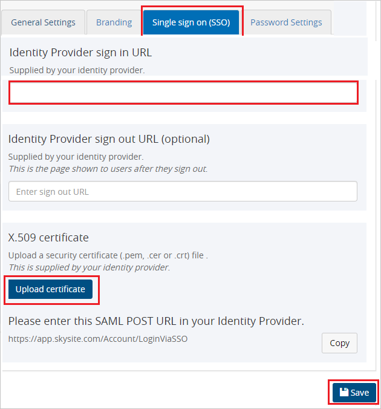

# Configure SKYSITE for Single sign-on with Microsoft Entra ID

In this article,  you learn how to integrate SKYSITE with Microsoft Entra ID. When you integrate SKYSITE with Microsoft Entra ID, you can:

* Control in Microsoft Entra ID who has access to SKYSITE.
* Enable your users to be automatically signed-in to SKYSITE with their Microsoft Entra accounts.
* Manage your accounts in one central location.

## Prerequisites
The scenario outlined in this article assumes that you already have the following prerequisites:

[!INCLUDE [common-prerequisites.md](~/identity/saas-apps/includes/common-prerequisites.md)]
* SKYSITE single sign-on (SSO) enabled subscription.

## Scenario description

In this article,  you configure and test Microsoft Entra SSO in a test environment.

* SKYSITE supports **IDP** initiated SSO.

* SKYSITE supports **Just In Time** user provisioning.

## Add SKYSITE from the gallery

To configure the integration of SKYSITE into Microsoft Entra ID, you need to add SKYSITE from the gallery to your list of managed SaaS apps.

1. Sign in to the [Microsoft Entra admin center](https://entra.microsoft.com) as at least a [Cloud Application Administrator](~/identity/role-based-access-control/permissions-reference.md#cloud-application-administrator).
1. Browse to **Entra ID** > **Enterprise apps** > **New application**.
1. In the **Add from the gallery** section, type **SKYSITE** in the search box.
1. Select **SKYSITE** from results panel and then add the app. Wait a few seconds while the app is added to your tenant.

 Alternatively, you can also use the [Enterprise App Configuration Wizard](https://portal.office.com/AdminPortal/home?Q=Docs#/azureadappintegration). In this wizard, you can add an application to your tenant, add users/groups to the app, assign roles, and walk through the SSO configuration as well. [Learn more about Microsoft 365 wizards.](/microsoft-365/admin/misc/azure-ad-setup-guides)

## Configure and test Microsoft Entra SSO for SKYSITE

Configure and test Microsoft Entra SSO with SKYSITE using a test user called **B.Simon**. For SSO to work, you need to establish a link relationship between a Microsoft Entra user and the related user in SKYSITE.

To configure and test Microsoft Entra SSO with SKYSITE, perform the following steps:

1. **[Configure Microsoft Entra SSO](#configure-azure-ad-sso)** - to enable your users to use this feature.
    1. **Create a Microsoft Entra test user** - to test Microsoft Entra single sign-on with B.Simon.
    1. **Assign the Microsoft Entra test user** - to enable B.Simon to use Microsoft Entra single sign-on.
1. **[Configure SKYSITE SSO](#configure-skysite-sso)** - to configure the single sign-on settings on application side.
    1. **[Create SKYSITE test user](#create-skysite-test-user)** - to have a counterpart of B.Simon in SKYSITE that's linked to the Microsoft Entra representation of user.
1. **[Test SSO](#test-sso)** - to verify whether the configuration works.

## Configure Microsoft Entra SSO

Follow these steps to enable Microsoft Entra SSO.

1. Sign in to the [Microsoft Entra admin center](https://entra.microsoft.com) as at least a [Cloud Application Administrator](~/identity/role-based-access-control/permissions-reference.md#cloud-application-administrator).
1. Browse to **Entra ID** > **Enterprise apps** > **SKYSITE** application integration page, select **Properties tab** and perform the following step: 

	

	* Copy the **User access URL** and you have to paste it in **Configure SKYSITE SSO section**, which is explained later in the article.

1. On the **SKYSITE** application integration page, navigate to **single sign-on**.
1. On the **Select a single sign-on method** page, select **SAML**.
1. On the **Set up single sign-on with SAML** page, select the pencil icon for **Basic SAML Configuration** to edit the settings.

   

1. On the **Basic SAML Configuration** section the application is pre-configured in **IDP** initiated mode and the necessary URLs are already pre-populated with Azure. The user needs to save the configuration by selecting the **Save** button.

1. SKYSITE application expects the SAML assertions in a specific format, which requires you to add custom attribute mappings to your SAML token attributes configuration. The following screenshot shows the list of default attributes. Select **Edit** icon to open User Attributes dialog.

	

1. In addition to above, SKYSITE application expects few more attributes to be passed back in SAML response. In the **User Attributes & Claims** section on the **Group Claims (Preview)** dialog, perform the following steps:

	a. Select the **pen** next to **Groups returned in claim**.

	

	b. Select **All groups** from the radio list.

	c. Select **Source attribute** of **Group ID**.

	d. Select **Save**.

1. On the **Set up single sign-on with SAML** page, in the **SAML Signing Certificate** section,  find **Certificate (Base64)** and select **Download** to download the certificate and save it on your computer.

	

1. On the **Set up SKYSITE** section, copy the appropriate URL(s) based on your requirement.

	

[!INCLUDE [create-assign-users-sso.md](~/identity/saas-apps/includes/create-assign-users-sso.md)]

## Configure SKYSITE SSO

1. Open a new web browser window and sign into your SKYSITE company site as an administrator and perform the following steps:

1. Select **Settings** on the top right side of page and then navigate to **Account setting**.

	

1. Switch to **Single sign on (SSO)** tab, perform the following steps:

	

	a. In the **Identity Provider sign in URL** text box, paste the value of **User access URL**, which you have copied from the **properties** tab in Azure portal.

	b. Select **Upload certificate**, to upload the Base64 encoded certificate which you have downloaded.

	c. Select **Save**.

### Create SKYSITE test user

In this section, a user called Britta Simon is created in SKYSITE. SKYSITE supports just-in-time user provisioning, which is enabled by default. There's no action item for you in this section. If a user doesn't already exist in SKYSITE, a new one is created after authentication.

## Test SSO 

In this section, you test your Microsoft Entra single sign-on configuration with following options.

* Select **Test this application**, and you should be automatically signed in to the SKYSITE for which you set up the SSO.

* You can use Microsoft My Apps. When you select the SKYSITE tile in the My Apps, you should be automatically signed in to the SKYSITE for which you set up the SSO. For more information, see [Microsoft Entra My Apps](/azure/active-directory/manage-apps/end-user-experiences#azure-ad-my-apps).

## Related content

Once you configure SKYSITE you can enforce session control, which protects exfiltration and infiltration of your organization’s sensitive data in real time. Session control extends from Conditional Access. [Learn how to enforce session control with Microsoft Cloud App Security](/cloud-app-security/proxy-deployment-aad).
