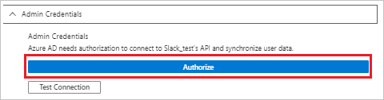
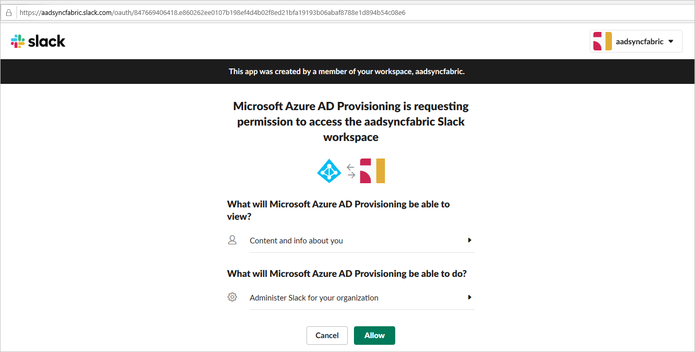

# Automate User provisioning into Slack with Microsoft Entra ID

> [!NOTE]
> Integrating with Slack with a custom / BYOA application isn't supported. Using the gallery application as described in this article is supported. The gallery application has been customized to work with Slack's SCIM v1 server. 

The objective of this article is to show you the steps you need to perform in Slack and Microsoft Entra ID to automatically provision and deprovision user accounts from Microsoft Entra ID to Slack. For important details on what this service does, how it works, and frequently asked questions, see [Automate user provisioning and deprovisioning to SaaS applications with Microsoft Entra ID](~/identity/app-provisioning/user-provisioning.md). 

## Capabilities supported
> [!div class="checklist"]
> * Create users in Slack
> * Remove users in Slack when they don't require access anymore
> * Keep user attributes synchronized between Microsoft Entra ID and Slack
> * Provision groups and group memberships in Slack
> * [Single sign-on](./slack-tutorial.md) to Slack (recommended)

## Prerequisites

The scenario outlined in this article assumes that you already have the following items:

* [A Microsoft Entra tenant](~/identity-platform/quickstart-create-new-tenant.md).
* One of the following roles: [Application Administrator](/entra/identity/role-based-access-control/permissions-reference#application-administrator), [Cloud Application Administrator](/entra/identity/role-based-access-control/permissions-reference#cloud-application-administrator), or [Application Owner](/entra/fundamentals/users-default-permissions#owned-enterprise-applications).
* A Slack tenant with the [Plus plan](https://slack.com/pricing) or better enabled.
* A user account in Slack with Team Admin permissions.

> [!NOTE]
> This integration is also available to use from Microsoft Entra US Government Cloud environment. You can find this application in the Microsoft Entra US Government Cloud Application Gallery and configure it in the same way as you do from public cloud.

## Step 1: Plan your provisioning deployment
1. Learn about [how the provisioning service works](~/identity/app-provisioning/user-provisioning.md).
2. Determine who's in [scope for provisioning](~/identity/app-provisioning/define-conditional-rules-for-provisioning-user-accounts.md).
3. Determine what data to [map between Microsoft Entra ID and Slack](~/identity/app-provisioning/customize-application-attributes.md). 

## Step 2: Add Slack from the Microsoft Entra application gallery

Add Slack from the Microsoft Entra application gallery to start managing provisioning to Slack. If you have previously setup Slack for SSO, you can use the same application. However, we recommend that you create a separate app when testing out the integration initially. Learn more about adding an application from the gallery [here](~/identity/enterprise-apps/add-application-portal.md). 

## Step 3: Define who is in scope for provisioning 

[!INCLUDE [create-assign-users-provisioning.md](~/identity/saas-apps/includes/create-assign-users-provisioning.md)]

## Step 4: Configure automatic user provisioning to Slack 

This section guides you through connecting your Microsoft Entra ID to Slack's user account provisioning API, and configuring the provisioning service to create, update, and disable assigned user accounts in Slack based on user and group assignment in Microsoft Entra ID.

### To configure automatic user account provisioning to Slack in Microsoft Entra ID:

1. Sign in to the [Microsoft Entra admin center](https://entra.microsoft.com) as at least a [Cloud Application Administrator](~/identity/role-based-access-control/permissions-reference.md#cloud-application-administrator).
1. Browse to **Entra ID** > **Enterprise apps**

	

1. In the applications list, select **Slack**.

	

3. Select the **Provisioning** tab.

	

4. Set the **Provisioning Mode** to **Automatic**.

	

5. Under the **Admin Credentials** section, select **Authorize**. This opens a Slack authorization dialog in a new browser window.

	

6. In the new window, sign into Slack using your Team Admin account. in the resulting authorization dialog, select the Slack team that you want to enable provisioning for, and then select **Authorize**. Once completed, return to the Azure portal to complete the provisioning configuration.

    

7. Select **Test Connection** to ensure Microsoft Entra ID can connect to your Slack app. If the connection fails, ensure your Slack account has Team Admin permissions and try the "Authorize" step again.

8. In the **Notification Email** field, enter the email address of a person or group who should receive the provisioning error notifications and select the **Send an email notification when a failure occurs** check box.

	

9. Select **Save**.

10. Under the Mappings section, select **Synchronize Microsoft Entra users to Slack**.

11. In the **Attribute Mappings** section, review the user attributes that's synchronized from Microsoft Entra ID to Slack. The attributes selected as **Matching** properties are used to match the user accounts in Slack for update operations. Select the Save button to commit any changes.

   |Attribute|Type|
   |---|---|
   |active|Boolean|
   |externalId|String|
   |displayName|String|
   |name.familyName|String|
   |name.givenName|String|
   |title|String|
   |emails[type eq "work"].value|String|
   |userName|String|
   |nickName|String|
   |addresses[type eq "untyped"].streetAddress|String|
   |addresses[type eq "untyped"].locality|String|
   |addresses[type eq "untyped"].region|String|
   |addresses[type eq "untyped"].postalCode|String|
   |addresses[type eq "untyped"].country|String|
   |phoneNumbers[type eq "mobile"].value|String|
   |phoneNumbers[type eq "work"].value|String|
   |roles[primary eq "True"].value|String|
   |locale|String|
   |name.honorificPrefix|String|
   |photos[type eq "photo"].value|String|
   |profileUrl|String|
   |timezone|String|
   |userType|String|
   |preferredLanguage|String|
   |urn:scim:schemas:extension:enterprise:1.0.department|String|
   |urn:scim:schemas:extension:enterprise:1.0.manager|Reference|
   |urn:scim:schemas:extension:enterprise:1.0.employeeNumber|String|
   |urn:scim:schemas:extension:enterprise:1.0.costCenter|String|
   |urn:scim:schemas:extension:enterprise:1.0.organization|String|
   |urn:scim:schemas:extension:enterprise:1.0.division|String|

12. Under the **Mappings** section, select **Synchronize Microsoft Entra groups to Slack**.

13. In the **Attribute Mappings** section, review the group attributes synchronized from Microsoft Entra ID to Slack. The attributes selected as **Matching** properties are used to match the groups in Slack for update operations. Select the Save button to commit any changes.

      |Attribute|Type|
      |---|---|
      |displayName|String|
      |members|Reference|

14. To configure scoping filters, refer to the following instructions provided in the [Scoping filter  article](~/identity/app-provisioning/define-conditional-rules-for-provisioning-user-accounts.md).

15. To enable the Microsoft Entra provisioning service for Slack, change the **Provisioning Status** to **On** in the **Settings** section

	

16. Define the users and/or groups that you would like to provision to Slack by choosing the desired values in **Scope** in the **Settings** section.

	

17. When you're ready to provision, select **Save**.

	

This operation starts the initial synchronization cycle of all users and groups defined in **Scope** in the **Settings** section. The initial cycle takes longer to perform than subsequent cycles, which occur approximately every 40 minutes as long as the Microsoft Entra provisioning service is running. 

## Step 5: Monitor your deployment

[!INCLUDE [monitor-deployment.md](~/identity/saas-apps/includes/monitor-deployment.md)]

## Troubleshooting Tips

* When configuring Slack's **displayName** attribute, be aware of the following behaviors:

  * Values aren't entirely unique (such as two users can have the same display name)

  * Supports non-English characters, spaces, capitalization. 
  
  * Allowed punctuation includes periods, underscores, hyphens, apostrophes, brackets (for example, `( [ { } ] )`), and separators (for example, `, / ;`).
  
  * displayName property can't have an '@' character. If an '@' is included, you might find a skipped event in the provisioning logs with the description "AttributeValidationFailed."

  * Only updates if these two settings are configured in Slack's workplace/organization - **Profile syncing is enabled** and **Users can't change their display name**.

* Slack's **userName** attribute has to be under 21 characters and have a unique value.

* Slack only allows matching with the attributes **userName** and **email**.  
  
* Common error codes are documented in the official Slack documentation - https://api.slack.com/scim#errors

## Change log

* 06/16/2020 - Modified DisplayName attribute to only be updated during new user creation.

## More Resources

* [Managing user account provisioning for Enterprise Apps](~/identity/app-provisioning/configure-automatic-user-provisioning-portal.md)
* [What is application access and single sign-on with Microsoft Entra ID?](~/identity/enterprise-apps/what-is-single-sign-on.md)

## Related content

* [Learn how to review logs and get reports on provisioning activity](~/identity/app-provisioning/check-status-user-account-provisioning.md)
