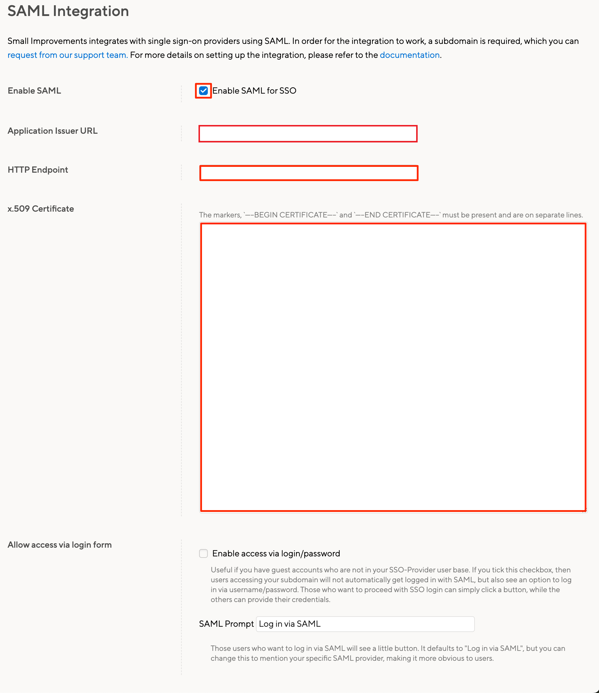
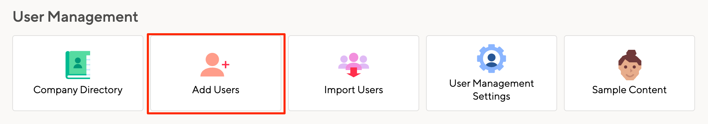

# Configure Small Improvements for Single sign-on with Microsoft Entra ID

In this article,  you learn how to integrate Small Improvements with Microsoft Entra ID. When you integrate Small Improvements with Microsoft Entra ID, you can:

* Control in Microsoft Entra ID who has access to Small Improvements.
* Enable your users to be automatically signed-in to Small Improvements with their Microsoft Entra accounts.
* Manage your accounts in one central location.

## Prerequisites
The scenario outlined in this article assumes that you already have the following prerequisites:

[!INCLUDE [common-prerequisites.md](~/identity/saas-apps/includes/common-prerequisites.md)]
* Small Improvements single sign-on (SSO) enabled subscription.

## Scenario description

In this article,  you configure and test Microsoft Entra single sign-on in a test environment.

* Small Improvements supports **SP** initiated SSO.

## Add Small Improvements from the gallery

To configure the integration of Small Improvements into Microsoft Entra ID, you need to add Small Improvements from the gallery to your list of managed SaaS apps.

1. Sign in to the [Microsoft Entra admin center](https://entra.microsoft.com) as at least a [Cloud Application Administrator](~/identity/role-based-access-control/permissions-reference.md#cloud-application-administrator).
1. Browse to **Entra ID** > **Enterprise apps** > **New application**.
1. In the **Add from the gallery** section, type **Small Improvements** in the search box.
1. Select **Small Improvements** from results panel and then add the app. Wait a few seconds while the app is added to your tenant.

 Alternatively, you can also use the [Enterprise App Configuration Wizard](https://portal.office.com/AdminPortal/home?Q=Docs#/azureadappintegration). In this wizard, you can add an application to your tenant, add users/groups to the app, assign roles, and walk through the SSO configuration as well. [Learn more about Microsoft 365 wizards.](/microsoft-365/admin/misc/azure-ad-setup-guides)

## Configure and test Microsoft Entra SSO for Small Improvements

Configure and test Microsoft Entra SSO with Small Improvements using a test user called **B.Simon**. For SSO to work, you need to establish a link relationship between a Microsoft Entra user and the related user in Small Improvements.

To configure and test Microsoft Entra SSO with Small Improvements, perform the following steps:

1. **[Configure Microsoft Entra SSO](#configure-azure-ad-sso)** - to enable your users to use this feature.
    1. **Create a Microsoft Entra test user** - to test Microsoft Entra single sign-on with B.Simon.
    1. **Assign the Microsoft Entra test user** - to enable B.Simon to use Microsoft Entra single sign-on.
1. **[Configure Small Improvements SSO](#configure-small-improvements-sso)** - to configure the single sign-on settings on application side.
    1. **[Create Small Improvements test user](#create-small-improvements-test-user)** - to have a counterpart of B.Simon in Small Improvements that's linked to the Microsoft Entra representation of user.
1. **[Test SSO](#test-sso)** - to verify whether the configuration works.

## Configure Microsoft Entra SSO

Follow these steps to enable Microsoft Entra SSO.

1. Sign in to the [Microsoft Entra admin center](https://entra.microsoft.com) as at least a [Cloud Application Administrator](~/identity/role-based-access-control/permissions-reference.md#cloud-application-administrator).
1. Browse to **Entra ID** > **Enterprise apps** > **Small Improvements** > **Single sign-on**.
1. On the **Select a single sign-on method** page, select **SAML**.
1. On the **Set up single sign-on with SAML** page, select the pencil icon for **Basic SAML Configuration** to edit the settings.

   

1. On the **Basic SAML Configuration** section, perform the following steps:

    a. In the **Identifier (Entity ID)** text box, type a URL using the following pattern:
    `https://<subdomain>.small-improvements.com`

    b. In the **Sign on URL** text box, type a URL using the following pattern:
    `https://<subdomain>.small-improvements.com`

	> [!NOTE]
	> These values aren't real. Update these values with the actual Identifier and Sign on URL. Contact [Small Improvements Client support team](mailto:support@small-improvements.com) to get these values. You can also refer to the patterns shown in the **Basic SAML Configuration** section.

1. On the **Set up Single Sign-On with SAML** page, in the **SAML Signing Certificate** section, select **Download** to download the **Certificate (Base64)** from the given options as per your requirement and save it on your computer.

	

1. On the **Set up Small Improvements** section, copy the appropriate URL(s) as per your requirement.

	

[!INCLUDE [create-assign-users-sso.md](~/identity/saas-apps/includes/create-assign-users-sso.md)]

## Configure Small Improvements SSO

1. In another browser window, sign on to your [Small Improvements](https://small-improvements.com) company site as an administrator.

1. From the main dashboard page, select **Admin** > **Integrations** on the left.

     

1. Select the **SAML SSO** button from **Integrations** section.

     

1. On the SSO Setup page, perform the following steps:

      

    a. Check **Enable SAML for SSO**.

    b. In the **Application Issuer URL** text box, enter the Small Improvements subdomain in the following format:  `https://<yourcompany>.small-improvements.com`

    c. In the **HTTP Endpoint** textbox, paste the value of **Login URL**.

    d. Open your downloaded certificate in Notepad, copy the content, and then paste it into the **x509 Certificate** textbox. 

    e. If you wish to have SSO and Login form authentication option available for users, then check the **Enable access via login/password too** option.  

    f. Enter the appropriate value to Name the SSO Login button in the **SAML Prompt** textbox.  

    g. Select **Save**.

### Create Small Improvements test user

To enable Microsoft Entra users to log in to Small Improvements, they must be provisioned into Small Improvements. In the case of Small Improvements, provisioning is a manual task.

**To provision a user account, perform the following steps:**

1. Sign-on to your Small Improvements company site as an administrator.

1. From the Home page, go to the menu on the left, select **Admin** > **Settings**.

     

1. Select the **Add Users** button from User Management section.

    

1. On the **Add Users** dialog, perform the following steps: 

    

	a. Enter the **first name** of user like **Britta**.

    b. Enter the **Last name** of user like **Simon**.

    c. Enter the **Email** of user like **brittasimon@contoso.com**.

    d. You can also choose to enter the personal message in the **Send notification email** box. If you don't wish to send the notification, then uncheck this checkbox.

    e. Select **Create Users**.

## Test SSO

In this section, you test your Microsoft Entra single sign-on configuration with following options. 

* Select **Test this application**, this option redirects to Small Improvements Sign-on URL where you can initiate the login flow. 

* Go to Small Improvements Sign-on URL directly and initiate the login flow from there.

* You can use Microsoft My Apps. When you select the Small Improvements tile in the My Apps, this option redirects to Small Improvements Sign-on URL. For more information, see [Microsoft Entra My Apps](/azure/active-directory/manage-apps/end-user-experiences#azure-ad-my-apps).

## Related content

Once you configure Small Improvements you can enforce session control, which protects exfiltration and infiltration of your organization’s sensitive data in real time. Session control extends from Conditional Access. [Learn how to enforce session control with Microsoft Defender for Cloud Apps](/cloud-app-security/proxy-deployment-aad).
