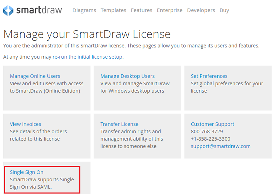
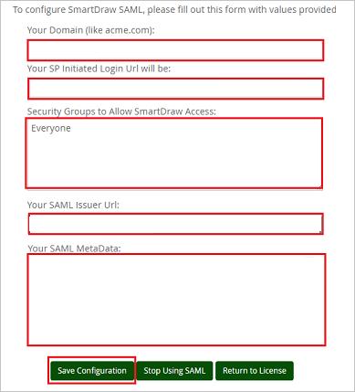

# Configure SmartDraw for Single sign-on with Microsoft Entra ID

In this article,  you learn how to integrate SmartDraw with Microsoft Entra ID. When you integrate SmartDraw with Microsoft Entra ID, you can:

* Control in Microsoft Entra ID who has access to SmartDraw.
* Enable your users to be automatically signed-in to SmartDraw with their Microsoft Entra accounts.
* Manage your accounts in one central location.

## Prerequisites
The scenario outlined in this article assumes that you already have the following prerequisites:

[!INCLUDE [common-prerequisites.md](~/identity/saas-apps/includes/common-prerequisites.md)]
* SmartDraw single sign-on (SSO) enabled subscription.

## Scenario description

In this article,  you configure and test Microsoft Entra SSO in a test environment.

* SmartDraw supports **SP and IDP** initiated SSO.
* SmartDraw supports **Just In Time** user provisioning.

## Add SmartDraw from the gallery

To configure the integration of SmartDraw into Microsoft Entra ID, you need to add SmartDraw from the gallery to your list of managed SaaS apps.

1. Sign in to the [Microsoft Entra admin center](https://entra.microsoft.com) as at least a [Cloud Application Administrator](~/identity/role-based-access-control/permissions-reference.md#cloud-application-administrator).
1. Browse to **Entra ID** > **Enterprise apps** > **New application**.
1. In the **Add from the gallery** section, type **SmartDraw** in the search box.
1. Select **SmartDraw** from results panel and then add the app. Wait a few seconds while the app is added to your tenant.

 Alternatively, you can also use the [Enterprise App Configuration Wizard](https://portal.office.com/AdminPortal/home?Q=Docs#/azureadappintegration). In this wizard, you can add an application to your tenant, add users/groups to the app, assign roles, and walk through the SSO configuration as well. [Learn more about Microsoft 365 wizards.](/microsoft-365/admin/misc/azure-ad-setup-guides)

## Configure and test Microsoft Entra SSO for SmartDraw

Configure and test Microsoft Entra SSO with SmartDraw using a test user called **B.Simon**. For SSO to work, you need to establish a link relationship between a Microsoft Entra user and the related user in SmartDraw.

To configure and test Microsoft Entra SSO with SmartDraw, perform the following steps:

1. **[Configure Microsoft Entra SSO](#configure-azure-ad-sso)** - to enable your users to use this feature.
    1. **Create a Microsoft Entra test user** - to test Microsoft Entra single sign-on with B.Simon.
    1. **Assign the Microsoft Entra test user** - to enable B.Simon to use Microsoft Entra single sign-on.
1. **[Configure SmartDraw SSO](#configure-smartdraw-sso)** - to configure the single sign-on settings on application side.
    1. **[Create SmartDraw test user](#create-smartdraw-test-user)** - to have a counterpart of B.Simon in SmartDraw that's linked to the Microsoft Entra representation of user.
1. **[Test SSO](#test-sso)** - to verify whether the configuration works.

## Configure Microsoft Entra SSO

Follow these steps to enable Microsoft Entra SSO.

1. Sign in to the [Microsoft Entra admin center](https://entra.microsoft.com) as at least a [Cloud Application Administrator](~/identity/role-based-access-control/permissions-reference.md#cloud-application-administrator).
1. Browse to **Entra ID** > **Enterprise apps** > **SmartDraw** > **Single sign-on**.
1. On the **Select a single sign-on method** page, select **SAML**.
1. On the **Set up single sign-on with SAML** page, select the pencil icon for **Basic SAML Configuration** to edit the settings.

   

1. On the **Basic SAML Configuration** section, the user doesn't have to perform any step as the app is already pre-integrated with Azure.

1. Select **Set additional URLs** and perform the following step if you wish to configure the application in **SP** initiated mode:

    In the **Sign-on URL** text box, type a URL using the following pattern:
    `https://app.smartdraw.com/sso/saml/login/<DOMAIN>`

    > [!NOTE]
	> The Sign-on URL value isn't real. You update the Sign-on URL value with the actual Sign-on URL, which is explained later in the article. You can also refer to the patterns shown in the **Basic SAML Configuration** section.

1. Select **Save**.

1. SmartDraw application expects the SAML assertions in a specific format, which requires you to add custom attribute mappings to your SAML token attributes configuration. The following screenshot shows the list of default attributes.

	

1. In addition to above, SmartDraw application expects few more attributes to be passed back in SAML response which are shown below. These attributes are also pre populated but you can review them as per your requirements.

	| Name | Source Attribute|
	| ---------------| --------------- |
	| FirstName | user.givenname |
	| LastName | user.surname |
	| Email | user.mail |
	| Groups | user.groups |

1. On the **Set up single sign-on with SAML** page, in the **SAML Signing Certificate** section,  find **Federation Metadata XML** and select **Download** to download the certificate and save it on your computer.

	

1. On the **Set up SmartDraw** section, copy the appropriate URL(s) based on your requirement.

	

[!INCLUDE [create-assign-users-sso.md](~/identity/saas-apps/includes/create-assign-users-sso.md)]

## Configure SmartDraw SSO

1. In a different web browser window, sign in to your SmartDraw company site as an administrator

1. Select **Single Sign-On** under Manage your SmartDraw License.

	

1. On the Configuration page, perform the following steps:

	

	a. In the **Your Domain (like acme.com)** textbox, type your domain.

	b. Copy the **Your SP Initiated Login Url is** for your instance and paste it in Sign-on URL textbox in **Basic SAML Configuration** on Azure portal.

	c. In the **Security Groups to Allow SmartDraw Access** textbox, type **Everyone**.

	d. In the **Your SAML Issuer Url** textbox, paste the value of **Microsoft Entra Identifier** which you copied previously.

	e. In Notepad, open the Metadata XML file that you downloaded, copy its content, and then paste it into the **Your SAML MetaData** box.

	f. Select **Save Configuration**	

### Create SmartDraw test user

In this section, a user called B.Simon is created in SmartDraw. SmartDraw supports just-in-time user provisioning, which is enabled by default. There's no action item for you in this section. If a user doesn't already exist in SmartDraw, a new one is created after authentication.

## Test SSO

In this section, you test your Microsoft Entra single sign-on configuration with following options. 

#### SP initiated:

* Select **Test this application**, this option redirects to SmartDraw Sign on URL where you can initiate the login flow.  

* Go to SmartDraw Sign-on URL directly and initiate the login flow from there.

#### IDP initiated:

* Select **Test this application**, and you should be automatically signed in to the SmartDraw for which you set up the SSO. 

You can also use Microsoft My Apps to test the application in any mode. When you select the SmartDraw tile in the My Apps, if configured in SP mode you would be redirected to the application sign on page for initiating the login flow and if configured in IDP mode, you should be automatically signed in to the SmartDraw for which you set up the SSO. For more information about the My Apps, see [Introduction to the My Apps](https://support.microsoft.com/account-billing/sign-in-and-start-apps-from-the-my-apps-portal-2f3b1bae-0e5a-4a86-a33e-876fbd2a4510).

## Related content

Once you configure SmartDraw you can enforce session control, which protects exfiltration and infiltration of your organization’s sensitive data in real time. Session control extends from Conditional Access. [Learn how to enforce session control with Microsoft Defender for Cloud Apps](/cloud-app-security/proxy-deployment-aad).
