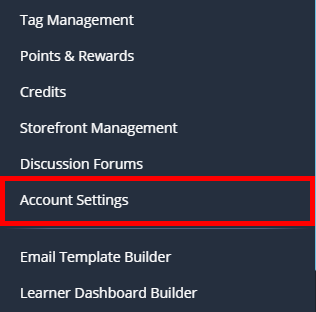
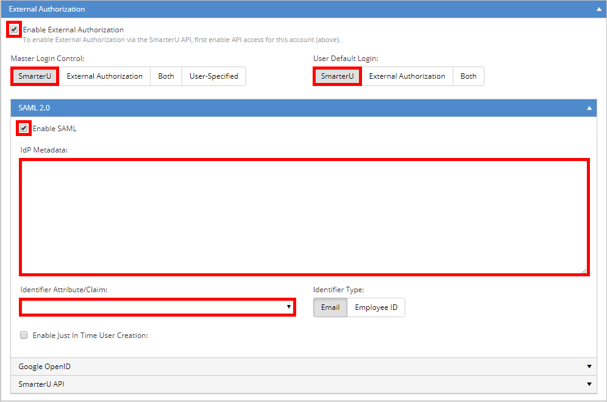
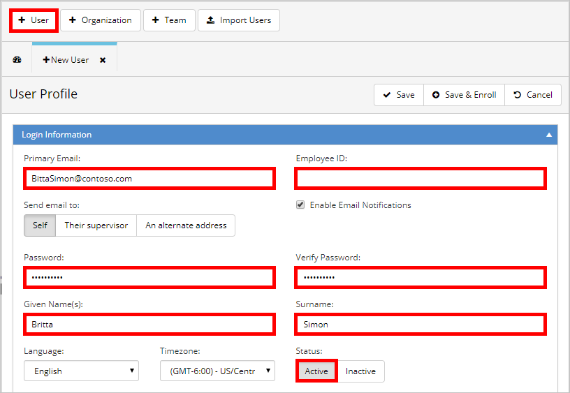

# Configure SmarterU for Single sign-on with Microsoft Entra ID

> [!NOTE]
> The process for integrating SmarterU with Microsoft Entra ID is also documented and maintained in the [SmarterU help system](https://support.smarteru.com/docs/sso-azure-active-directory).

In this article,  you learn how to integrate SmarterU with Microsoft Entra ID. When you integrate SmarterU with Microsoft Entra ID, you can:

* Control in Microsoft Entra ID who has access to SmarterU.
* Enable your users to be automatically signed-in to SmarterU with their Microsoft Entra accounts.
* Manage your accounts in one central location.

## Prerequisites
The scenario outlined in this article assumes that you already have the following prerequisites:

[!INCLUDE [common-prerequisites.md](~/identity/saas-apps/includes/common-prerequisites.md)]
* SmarterU single sign-on (SSO) enabled subscription.

## Scenario description

In this article,  you configure and test Microsoft Entra single sign-on in a test environment.

* SmarterU supports **IDP** initiated SSO.

> [!NOTE]
> Identifier of this application is a fixed string value so only one instance can be configured in one tenant.

## Add SmarterU from the gallery

To configure the integration of SmarterU into Microsoft Entra ID, you need to add SmarterU from the gallery to your list of managed SaaS apps.

1. Sign in to the [Microsoft Entra admin center](https://entra.microsoft.com) as at least a [Cloud Application Administrator](~/identity/role-based-access-control/permissions-reference.md#cloud-application-administrator).
1. Browse to **Entra ID** > **Enterprise apps** > **New application**.
1. In the **Add from the gallery** section, type **SmarterU** in the search box.
1. Select **SmarterU** from results panel and then add the app. Wait a few seconds while the app is added to your tenant.

 Alternatively, you can also use the [Enterprise App Configuration Wizard](https://portal.office.com/AdminPortal/home?Q=Docs#/azureadappintegration). In this wizard, you can add an application to your tenant, add users/groups to the app, assign roles, and walk through the SSO configuration as well. [Learn more about Microsoft 365 wizards.](/microsoft-365/admin/misc/azure-ad-setup-guides)

## Configure and test Microsoft Entra SSO for SmarterU

Configure and test Microsoft Entra SSO with SmarterU using a test user called **B.Simon**. For SSO to work, you need to establish a link relationship between a Microsoft Entra user and the related user in SmarterU.

To configure and test Microsoft Entra SSO with SmarterU, perform the following steps:

1. **[Configure Microsoft Entra SSO](#configure-azure-ad-sso)** - to enable your users to use this feature.
    1. **Create a Microsoft Entra test user** - to test Microsoft Entra single sign-on with B.Simon.
    1. **Assign the Microsoft Entra test user** - to enable B.Simon to use Microsoft Entra single sign-on.
1. **[Configure SmarterU SSO](#configure-smarteru-sso)** - to configure the single sign-on settings on application side.
    1. **[Create SmarterU test user](#create-smarteru-test-user)** - to have a counterpart of B.Simon in SmarterU that's linked to the Microsoft Entra representation of user.
1. **[Test SSO](#test-sso)** - to verify whether the configuration works.

## Configure Microsoft Entra SSO

Follow these steps to enable Microsoft Entra SSO.

1. Sign in to the [Microsoft Entra admin center](https://entra.microsoft.com) as at least a [Cloud Application Administrator](~/identity/role-based-access-control/permissions-reference.md#cloud-application-administrator).
1. Browse to **Entra ID** > **Enterprise apps** > **SmarterU** > **Single sign-on**.
1. On the **Select a single sign-on method** page, select **SAML**.
1. On the **Set up single sign-on with SAML** page, select the pencil icon for **Basic SAML Configuration** to edit the settings.

   

1. On the **Basic SAML Configuration** section, perform the following step:

    In the **Identifier** text box, type the URL:
    `https://www.smarteru.com/`

1. On the **Set up Single Sign-On with SAML** page, in the **SAML Signing Certificate** section, select **Download** to download the **Federation Metadata XML** from the given options as per your requirement and save it on your computer.

	

6. On the **Set up SmarterU** section, copy the appropriate URL(s) as per your requirement.

	

[!INCLUDE [create-assign-users-sso.md](~/identity/saas-apps/includes/create-assign-users-sso.md)]

## Configure SmarterU SSO

1. In a different web browser window, sign in to your SmarterU company site as an administrator.

1. In the toolbar on the top, select **Account Settings**.

    

1. On the account configuration page, perform the following steps:

     

    a. Select **Enable External Authorization**.
  
    b. In the **Master Login Control** section, select the **SmarterU** tab.
  
    c. In the **User Default Login** section, select the **SmarterU** tab.
  
    d. Select **Enable SAML**.
  
    e. Copy the content of the downloaded metadata file, and then paste it into the **IdP Metadata** textbox.

    f. Select an **Identifier Attribute/Claim**.
  
    g. Select **Save**.

### Create SmarterU test user

To enable Microsoft Entra users to sign in to SmarterU, they must be provisioned into SmarterU. In the case of SmarterU, provisioning is a manual task.

**To provision a user account, perform the following steps:**

1. sign in to your **SmarterU** tenant.

1. Go to **Users**.

1. In the user section, perform the following steps:

      

	a. Select **+User**.

	b. Type the related attribute values of the Microsoft Entra user account into the following textboxes: **Primary Email**, **Employee ID**, **Password**, **Verify Password**, **Given Name**, **Surname**.

	c. Select **Active**.

	d. Select **Save**.

> [!NOTE]
> You can use any other SmarterU user account creation tools or APIs provided by SmarterU to provision Microsoft Entra user accounts.

## Test SSO

In this section, you test your Microsoft Entra single sign-on configuration with following options.

* Select **Test this application**, and you should be automatically signed in to the SmarterU for which you set up the SSO.

* You can use Microsoft My Apps. When you select the SmarterU tile in the My Apps, you should be automatically signed in to the SmarterU for which you set up the SSO. For more information about the My Apps, see [Introduction to the My Apps](https://support.microsoft.com/account-billing/sign-in-and-start-apps-from-the-my-apps-portal-2f3b1bae-0e5a-4a86-a33e-876fbd2a4510).

## Related content

Once you configure SmarterU you can enforce session control, which protects exfiltration and infiltration of your organization’s sensitive data in real time. Session control extends from Conditional Access. [Learn how to enforce session control with Microsoft Defender for Cloud Apps](/cloud-app-security/proxy-deployment-aad).
