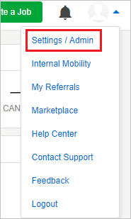

# Configure SmartRecruiters for Single sign-on with Microsoft Entra ID

In this article,  you learn how to integrate SmartRecruiters with Microsoft Entra ID. When you integrate SmartRecruiters with Microsoft Entra ID, you can:

* Control in Microsoft Entra ID who has access to SmartRecruiters.
* Enable your users to be automatically signed-in to SmartRecruiters with their Microsoft Entra accounts.
* Manage your accounts in one central location.

## Prerequisites
The scenario outlined in this article assumes that you already have the following prerequisites:

[!INCLUDE [common-prerequisites.md](~/identity/saas-apps/includes/common-prerequisites.md)]
* SmartRecruiters single sign-on (SSO) enabled subscription.

## Scenario description

In this article,  you configure and test Microsoft Entra single sign-on in a test environment.

* SmartRecruiters supports **SP and IDP** initiated SSO.

## Add SmartRecruiters from the gallery

To configure the integration of SmartRecruiters into Microsoft Entra ID, you need to add SmartRecruiters from the gallery to your list of managed SaaS apps.

1. Sign in to the [Microsoft Entra admin center](https://entra.microsoft.com) as at least a [Cloud Application Administrator](~/identity/role-based-access-control/permissions-reference.md#cloud-application-administrator).
1. Browse to **Entra ID** > **Enterprise apps** > **New application**.
1. In the **Add from the gallery** section, type **SmartRecruiters** in the search box.
1. Select **SmartRecruiters** from results panel and then add the app. Wait a few seconds while the app is added to your tenant.

 Alternatively, you can also use the [Enterprise App Configuration Wizard](https://portal.office.com/AdminPortal/home?Q=Docs#/azureadappintegration). In this wizard, you can add an application to your tenant, add users/groups to the app, assign roles, and walk through the SSO configuration as well. [Learn more about Microsoft 365 wizards.](/microsoft-365/admin/misc/azure-ad-setup-guides)

## Configure and test Microsoft Entra SSO for SmartRecruiters

Configure and test Microsoft Entra SSO with SmartRecruiters using a test user called **B.Simon**. For SSO to work, you need to establish a link relationship between a Microsoft Entra user and the related user in SmartRecruiters.

To configure and test Microsoft Entra SSO with SmartRecruiters, perform the following steps:

1. **[Configure Microsoft Entra SSO](#configure-azure-ad-sso)** - to enable your users to use this feature.
    1. **Create a Microsoft Entra test user** - to test Microsoft Entra single sign-on with B.Simon.
    1. **Assign the Microsoft Entra test user** - to enable B.Simon to use Microsoft Entra single sign-on.
1. **[Configure SmartRecruiters SSO](#configure-smartrecruiters-sso)** - to configure the single sign-on settings on application side.
    1. **[Create SmartRecruiters test user](#create-smartrecruiters-test-user)** - to have a counterpart of B.Simon in SmartRecruiters that's linked to the Microsoft Entra representation of user.
1. **[Test SSO](#test-sso)** - to verify whether the configuration works.

## Configure Microsoft Entra SSO

Follow these steps to enable Microsoft Entra SSO.

1. Sign in to the [Microsoft Entra admin center](https://entra.microsoft.com) as at least a [Cloud Application Administrator](~/identity/role-based-access-control/permissions-reference.md#cloud-application-administrator).
1. Browse to **Entra ID** > **Enterprise apps** > **SmartRecruiters** > **Single sign-on**.
1. On the **Select a single sign-on method** page, select **SAML**.
1. On the **Set up single sign-on with SAML** page, select the pencil icon for **Basic SAML Configuration** to edit the settings.

   

1. On the **Basic SAML Configuration** section, If you wish to configure the application in **IDP** initiated mode, perform the following steps:

    a. In the **Identifier** text box, type a URL using the following pattern:
    `https://www.smartrecruiters.com/web-sso/saml/<companyname>`

    b. In the **Reply URL** text box, type a URL using the following pattern:
    `https://www.smartrecruiters.com/web-sso/saml/<companyname>/callback`

5. Select **Set additional URLs** and perform the following step if you wish to configure the application in **SP** initiated mode:

    In the **Sign-on URL** text box, type a URL using the following pattern:
    `https://www.smartrecruiters.com/web-sso/saml/<companyname>/login`

	> [!NOTE]
	> These values aren't real. Update these values with the actual Identifier, Reply URL and Sign-on URL. Contact [SmartRecruiters Client support team](https://www.smartrecruiters.com/about-us/contact-us/) to get these values. You can also refer to the patterns shown in the **Basic SAML Configuration** section.

6. On the **Set up Single Sign-On with SAML** page, in the **SAML Signing Certificate** section, select **Download** to download the **Certificate (Base64)** from the given options as per your requirement and save it on your computer.

	

7. On the **Set up SmartRecruiters** section, copy the appropriate URL(s) as per your requirement.

	

[!INCLUDE [create-assign-users-sso.md](~/identity/saas-apps/includes/create-assign-users-sso.md)]

## Configure SmartRecruiters SSO

1. In a different web browser window, log in to your SmartRecruiters company site as an administrator.

1. Go to **Settings / Admin**.

    

1. In the **Configuration** section, select **Web SSO**.

	

1. Toggle **Enable Web SSO**.

	

1. In **Identity Provider Configuration**, perform the following steps:

	

	a. In **Identity Provider URL** textbox, paste the value of **Login URL**..

	b. Open **certificate(Base64)** which you have downloaded from Azure portal in the Notepad, copy the content of it and paste into **Identity Provider certificate** textbox.

1. Select **Save Web SSO configuration**.

### Create SmartRecruiters test user

In this section, you create a user called Britta Simon in SmartRecruiters. Work with [SmartRecruiters support team](https://www.smartrecruiters.com/about-us/contact-us/) to add the users in the SmartRecruiters platform. Users must be created and activated before you use single sign-on.

## Test SSO

In this section, you test your Microsoft Entra single sign-on configuration with following options. 

#### SP initiated:

* Select **Test this application**, this option redirects to SmartRecruiters Sign on URL where you can initiate the login flow.  

* Go to SmartRecruiters Sign-on URL directly and initiate the login flow from there.

#### IDP initiated:

* Select **Test this application**, and you should be automatically signed in to the SmartRecruiters for which you set up the SSO. 

You can also use Microsoft My Apps to test the application in any mode. When you select the SmartRecruiters tile in the My Apps, if configured in SP mode you would be redirected to the application sign on page for initiating the login flow and if configured in IDP mode, you should be automatically signed in to the SmartRecruiters for which you set up the SSO. For more information about the My Apps, see [Introduction to the My Apps](https://support.microsoft.com/account-billing/sign-in-and-start-apps-from-the-my-apps-portal-2f3b1bae-0e5a-4a86-a33e-876fbd2a4510).

## Related content

Once you configure SmartRecruiters you can enforce session control, which protects exfiltration and infiltration of your organization’s sensitive data in real time. Session control extends from Conditional Access. [Learn how to enforce session control with Microsoft Defender for Cloud Apps](/cloud-app-security/proxy-deployment-any-app).
