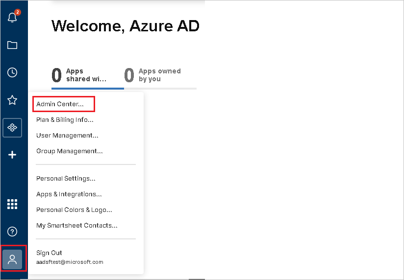
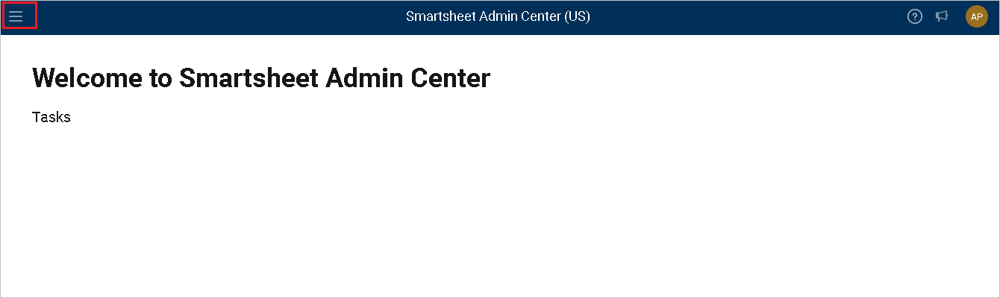
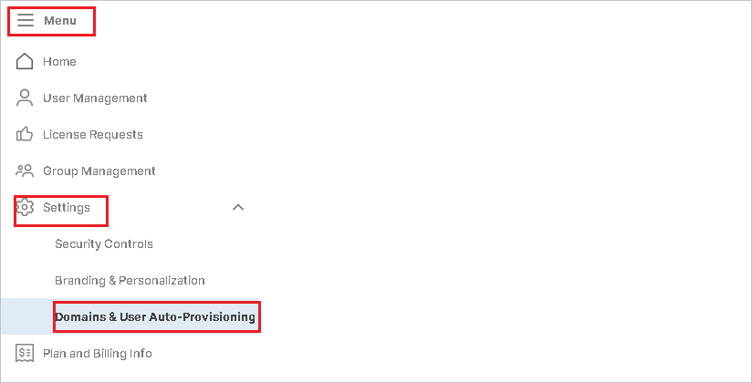

# Configure Smartsheet for automatic user provisioning with Microsoft Entra ID

The objective of this article is to demonstrate the steps to be performed in Smartsheet and Microsoft Entra ID to configure Microsoft Entra ID to automatically provision and de-provision users and/or groups to [Smartsheet](https://www.smartsheet.com/pricing). For important details on what this service does, how it works, and frequently asked questions, see [Automate user provisioning and deprovisioning to SaaS applications with Microsoft Entra ID](~/identity/app-provisioning/user-provisioning.md). 

## Capabilities supported
> [!div class="checklist"]
> * Create users in Smartsheet
> * Remove users in Smartsheet when they don't require access anymore
> * Keep user attributes synchronized between Microsoft Entra ID and Smartsheet
> * Single sign-on to Smartsheet (recommended)

## Prerequisites

The scenario outlined in this article assumes that you already have the following prerequisites:

* [A Microsoft Entra tenant](~/identity-platform/quickstart-create-new-tenant.md).
* A user account in Microsoft Entra ID with [permission](~/identity/role-based-access-control/permissions-reference.md) to configure provisioning (like [Application Administrator](/entra/identity/role-based-access-control/permissions-reference#application-administrator), [Cloud Application Administrator](/entra/identity/role-based-access-control/permissions-reference#cloud-application-administrator), or [Application Owner](/entra/fundamentals/users-default-permissions#owned-enterprise-applications)).
* [A Smartsheet tenant](https://www.smartsheet.com/pricing).
* A user account on a Smartsheet Enterprise or Enterprise Premier plan with System Administrator permissions.
* **System Admins** and an **IT Administrator** can set up Active Directory with Smartsheet

## Step 1: Plan your provisioning deployment
1. Learn about [how the provisioning service works](~/identity/app-provisioning/user-provisioning.md).
1. Determine who's in [scope for provisioning](~/identity/app-provisioning/define-conditional-rules-for-provisioning-user-accounts.md).
1. Determine what data to [map between Microsoft Entra ID and Smartsheet](~/identity/app-provisioning/customize-application-attributes.md). 

## Step 2: Configure Smartsheet to support provisioning with Microsoft Entra ID

Before configuring Smartsheet for automatic user provisioning with Microsoft Entra ID, you need to enable SCIM provisioning on Smartsheet.

1. Sign in as a **System Admin** in the **[Smartsheet portal](https://app.smartsheet.com/b/home)** and navigate to **Account > Admin Center**.

	

1. In the Admin Center page select the **Menu** option to expose the Menu panel.

	

1. Navigate to **Menu > Settings > Domains & User Auto-Provisioning**.

	

1. To add a new domain select **Add Domain** and follow instructions.Once the domain is added make sure it gets verified as well.

1. Generate the **Secret Token** required to configure automatic user provisioning with Microsoft Entra ID by navigating **[Smartsheet portal](https://app.smartsheet.com/b/home)** and then navigating to **Account > Apps and Integrations**.

1. Choose **API Access**. Select **Generate new access token**.

	

1. Define the name of the API Access Token. Select **OK**.

	

1. Copy the API Access Token and save it as it's the only time you can view it. This is required in the **Secret Token** field in Microsoft Entra ID.

	

## Step 3: Add Smartsheet from the Microsoft Entra application gallery

Add Smartsheet from the Microsoft Entra application gallery to start managing provisioning to Smartsheet. If you have previously setup Smartsheet for SSO you can use the same application. However, we recommend that you create a separate app when testing out the integration initially. Learn more about adding an application from the gallery [here](~/identity/enterprise-apps/add-application-portal.md). 

## Step 4: Define who is in scope for provisioning 

[!INCLUDE [create-assign-users-provisioning.md](~/identity/saas-apps/includes/create-assign-users-provisioning.md)]

## Step 5: Configure automatic user provisioning to Smartsheet 

This section guides you through the steps to configure the Microsoft Entra provisioning service to create, update, and disable users and/or groups in Smartsheet based on user and/or group assignments in Microsoft Entra ID.

### To configure automatic user provisioning for Smartsheet in Microsoft Entra ID:

1. Sign in to the [Microsoft Entra admin center](https://entra.microsoft.com) as at least a [Cloud Application Administrator](~/identity/role-based-access-control/permissions-reference.md#cloud-application-administrator).
1. Browse to **Entra ID** > **Enterprise apps**

	

1. In the applications list, select **Smartsheet**.

	

1. Select the **Provisioning** tab.

	

1. Set the **Provisioning Mode** to **Automatic**.

	

1. Under the **Admin Credentials** section, input the **SCIM 2.0 base URL** of `https://scim.smartsheet.com/v2` and **Access Token** value retrieved earlier from Smartsheet in **Secret Token** respectively. Select **Test Connection** to ensure Microsoft Entra ID can connect to Smartsheet. If the connection fails, ensure your Smartsheet account has SysAdmin permissions and try again.

	

1. In the **Notification Email** field, enter the email address of a person or group who should receive the provisioning error notifications and check the checkbox - **Send an email notification when a failure occurs**.

	

1. Select **Save**.

1. Under the **Mappings** section, select **Synchronize Microsoft Entra users to Smartsheet**.

1. Review the user attributes that are synchronized from Microsoft Entra ID to Smartsheet in the **Attribute Mapping** section. The attributes selected as **Matching** properties are used to match the user accounts in Smartsheet for update operations. Select the **Save** button to commit any changes.

   |Attribute|Type|Supported for filtering|
   |---|---|---|
   |userName|String|&check;|
   |active|Boolean|
   |title|String|
   |name.givenName|String|
   |name.familyName|String|
   |phoneNumbers[type eq "work"].value|String|
   |phoneNumbers[type eq "mobile"].value|String|
   |phoneNumbers[type eq "fax"].value|String|
   |emails[type eq "work"].value|String|
   |externalId|String|
   |roles|String|
   |urn:ietf:params:scim:schemas:extension:enterprise:2.0:User:department|String|
   |urn:ietf:params:scim:schemas:extension:enterprise:2.0:User:division|String|
   |urn:ietf:params:scim:schemas:extension:enterprise:2.0:User:costCenter|String|
   |urn:ietf:params:scim:schemas:extension:enterprise:2.0:User:manager|String|

1. To configure scoping filters, refer to the following instructions provided in the [Scoping filter  article](~/identity/app-provisioning/define-conditional-rules-for-provisioning-user-accounts.md).

1. To enable the Microsoft Entra provisioning service for Smartsheet, change the **Provisioning Status** to **On** in the **Settings** section.

	

1. Define the users and/or groups that you would like to provision to Smartsheet by choosing the desired values in **Scope** in the **Settings** section.

	

1. When you're ready to provision, select **Save**.

	

This operation starts the initial synchronization of all users and/or groups defined in **Scope** in the **Settings** section. The initial sync takes longer to perform than subsequent syncs, which occur approximately every 40 minutes as long as the Microsoft Entra provisioning service is running. 

## Step 6: Monitor your deployment

[!INCLUDE [monitor-deployment.md](~/identity/saas-apps/includes/monitor-deployment.md)]

## Connector limitations

* Smartsheet doesn't support soft-deletes. When a user's **active** attribute is set to False, Smartsheet deletes the user permanently.

## Change log

* 06/16/2020 - Added support for enterprise extension attributes "Cost Center", "Division", "Manager" and "Department" for users.
* 02/10/2021 - Added support for core attributes "emails[type eq "work"]" for users.
* 02/12/2022 - Added SCIM base/tenant URL of `https://scim.smartsheet.com/v2` for SmartSheet integration under Admin Credentials section.

## Additional resources

* [Managing user account provisioning for Enterprise Apps](~/identity/app-provisioning/configure-automatic-user-provisioning-portal.md)
* [What is application access and single sign-on with Microsoft Entra ID?](~/identity/enterprise-apps/what-is-single-sign-on.md)

## Related content

* [Learn how to review logs and get reports on provisioning activity](~/identity/app-provisioning/check-status-user-account-provisioning.md)
