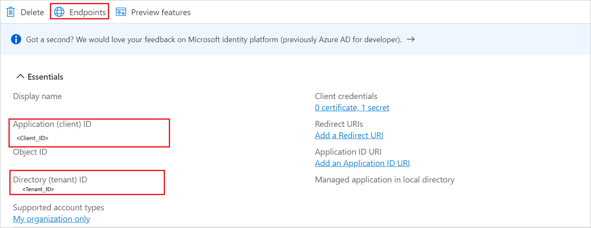
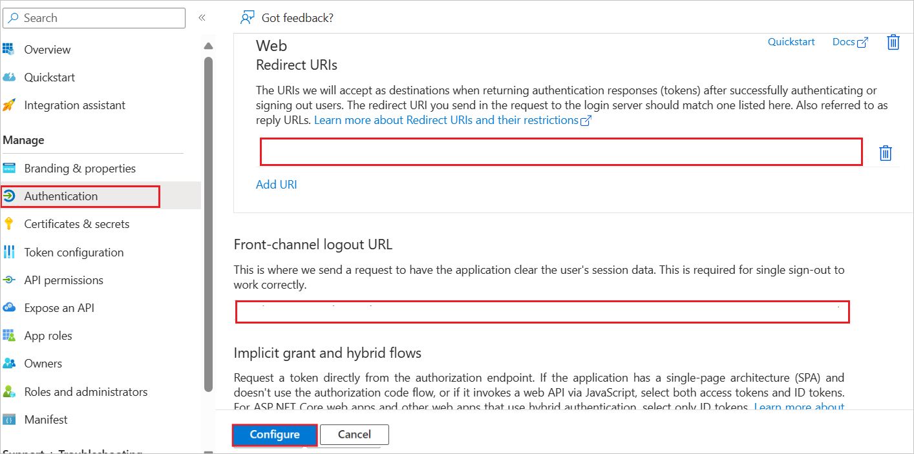
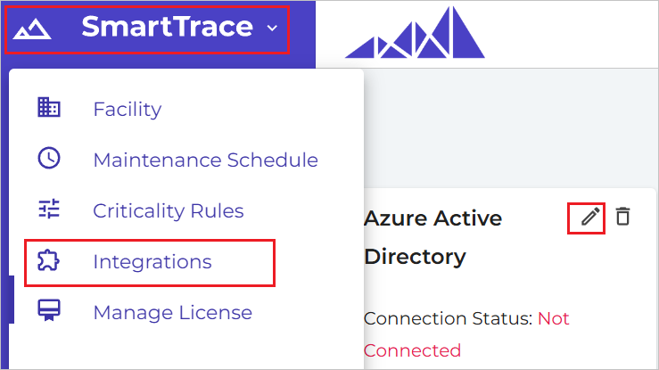
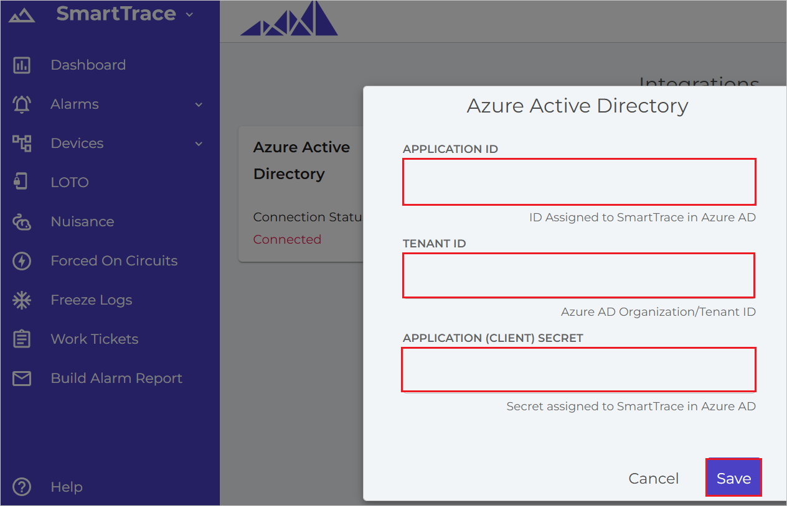

# Configure SmartTrace for Single sign-on with Microsoft Entra ID

In this article,  you learn how to integrate SmartTrace with Microsoft Entra ID. When you integrate SmartTrace with Microsoft Entra ID, you can:

- Use Microsoft Entra ID to control who can access SmartTrace.
- Enable your users to be automatically signed in to SmartTrace with their Microsoft Entra accounts.
- Manage your accounts in one central location: the Azure portal.

## Prerequisites

To get started, you need the following items:

* A Microsoft Entra subscription. If you don't have a subscription, you can get a [free account](https://azure.microsoft.com/free/).
* SmartTrace single sign-on (SSO) enabled subscription.

## Add SmartTrace from the gallery

To configure the integration of SmartTrace into Microsoft Entra ID, you need to add SmartTrace from the gallery to your list of managed SaaS apps.

1. Sign in to the [Microsoft Entra admin center](https://entra.microsoft.com) as at least a [Cloud Application Administrator](~/identity/role-based-access-control/permissions-reference.md#cloud-application-administrator).

1. Browse to **Entra ID** > **Enterprise apps** > **New application**.

1. In the **Add from the gallery** section, enter **SmartTrace** in the search box.

1. Select **SmartTrace** in the results panel and then add the app. Wait a few seconds while the app is added to your tenant.

## Configure Microsoft Entra SSO

Follow these steps to enable Microsoft Entra SSO in the Microsoft Entra admin center.

1. Sign in to the [Microsoft Entra admin center](https://entra.microsoft.com) as at least a [Cloud Application Administrator](~/identity/role-based-access-control/permissions-reference.md#cloud-application-administrator).

1. Browse to **Entra ID** > **Enterprise apps** > **SmartTrace** > **Single sign-on**.

1. Perform the following steps in the below section:

    1. Select **Go to application**.

        

    1. Copy **Application (client) ID** and **Directory (tenant) ID**, use it later in the SmartTrace side configuration.

        

1. Navigate to **Authentication** tab on the left menu and perform the following steps:

    1. In the **Redirect URIs** textbox, type a URL using the following pattern:
    `https://api.smarttrace.ai/v1/auth/callback/azure/<InstanceName>`

    1. In the **Front-channel logout URL** textbox, type a URL using the following pattern:
    `https://api.smarttrace.ai/v1/auth/callback/azure-logout/<InstanceName>`
    

    1. Select **Configure** button.

1. Navigate to **Certificates & secrets** on the left menu and perform the following steps:

    1. Go to **Client secrets** tab and select **+New client secret**.
    1. Enter a valid **Description** in the textbox and select **Expires** days from the drop-down as per your requirement and select **Add**.

        

    1. Once you add a client secret, **Value** is generated. Copy the value and use it later in the SmartTrace side configuration.

        

### Create a Microsoft Entra test user

In this section, you create a test user called B.Simon.

1. Sign in to the [Microsoft Entra admin center](https://entra.microsoft.com) as at least a [User Administrator](~/identity/role-based-access-control/permissions-reference.md#user-administrator).
1. Browse to **Entra ID** > **Users**.
1. Select **New user** > **Create new user**, at the top of the screen.
1. In the **User** properties, follow these steps:
   1. In the **Display name** field, enter `B.Simon`.  
   1. In the **User principal name** field, enter the username@companydomain.extension. For example, `B.Simon@contoso.com`.
   1. Select the **Show password** check box, and then write down the value that's displayed in the **Password** box.
   1. Select **Review + create**.
1. Select **Create**.

### Assign the Microsoft Entra test user

In this section, you enable B.Simon to use single sign-on by granting access to SmartTrace.

1. Sign in to the [Microsoft Entra admin center](https://entra.microsoft.com) as at least a [Cloud Application Administrator](~/identity/role-based-access-control/permissions-reference.md#cloud-application-administrator).
1. Browse to **Entra ID** > **Enterprise apps** > **SmartTrace**.
1. In the app's overview page, select **Users and groups**.
1. Select **Add user/group**, then select **Users and groups** in the **Add Assignment** dialog.
   1. In the **Users and groups** dialog, select **B.Simon** from the Users list, then select the **Select** button at the bottom of the screen.
   1. If you're expecting a role to be assigned to the users, you can select it from the **Select a role** dropdown. If no role has been set up for this app, you see "Default Access" role selected.
   1. In the **Add Assignment** dialog, select the **Assign** button.

## Configure SmartTrace SSO

Below are the configuration steps to complete the OIDC federation setup:

1. Sign into the SmartTrace site as an administrator.

1. Go to **SmartTrace** header > select **Integrations** and select pencil icon on the **Azure Active Directory** tile.

    

1. Perform the following steps in the **Azure Active Directory** page:

    

    1. In the **APPLICATION ID** textbox, paste the **Application (client) ID**, which you have copied from the Microsoft Entra page.

    1. In the **TENANT ID** textbox, paste the **Directory (tenant) ID**, which you have copied from the Microsoft Entra page.

    1. In the **APPLICATION (CLIENT) SECRET** textbox, paste the value, which you have copied from **Certificates & secrets** section at Microsoft Entra side.

    1. Select **Save**.