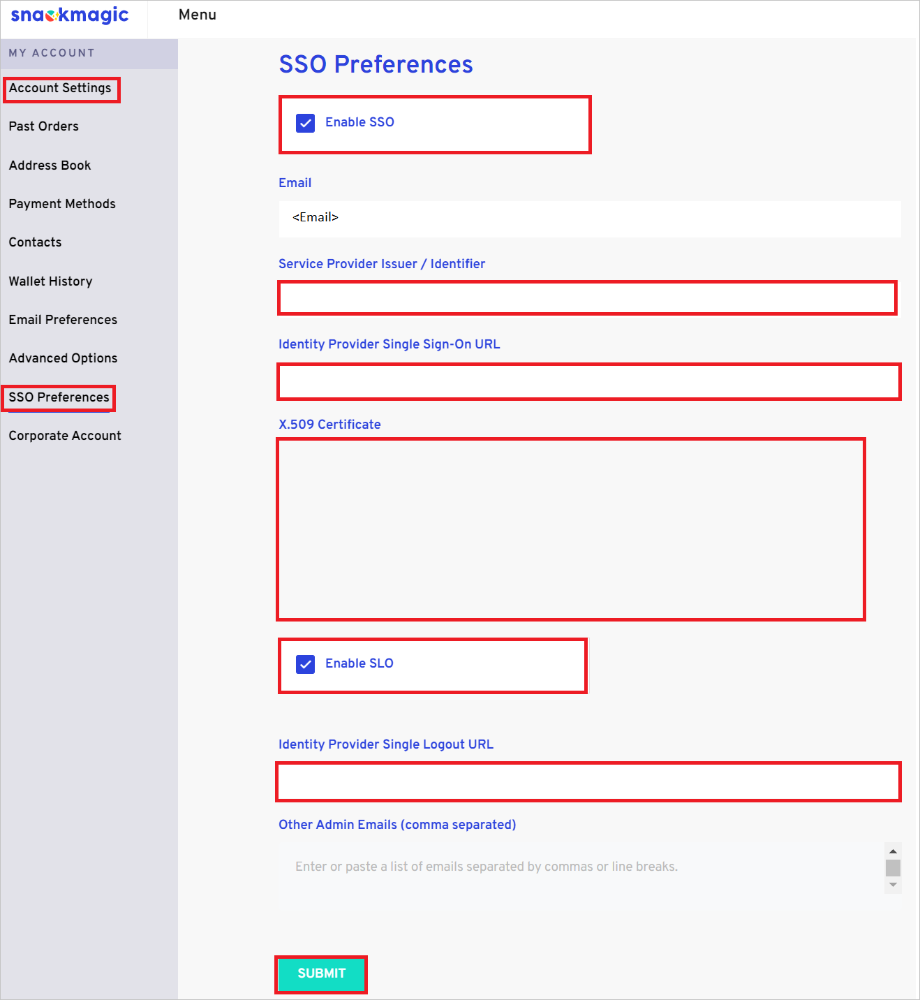

# Configure Snackmagic for Single sign-on with Microsoft Entra ID

In this article,  you learn how to integrate Snackmagic with Microsoft Entra ID. When you integrate Snackmagic with Microsoft Entra ID, you can:

* Control in Microsoft Entra ID who has access to Snackmagic.
* Enable your users to be automatically signed-in to Snackmagic with their Microsoft Entra accounts.
* Manage your accounts in one central location.

## Prerequisites
The scenario outlined in this article assumes that you already have the following prerequisites:

[!INCLUDE [common-prerequisites.md](~/identity/saas-apps/includes/common-prerequisites.md)]
* Snackmagic single sign-on (SSO) enabled subscription.

## Scenario description

In this article,  you configure and test Microsoft Entra SSO in a test environment.

* Snackmagic supports **SP and IDP** initiated SSO.
* Snackmagic supports **Just In Time** user provisioning.

> [!NOTE]
> Identifier of this application is a fixed string value so only one instance can be configured in one tenant.

## Add Snackmagic from the gallery

To configure the integration of Snackmagic into Microsoft Entra ID, you need to add Snackmagic from the gallery to your list of managed SaaS apps.

1. Sign in to the [Microsoft Entra admin center](https://entra.microsoft.com) as at least a [Cloud Application Administrator](~/identity/role-based-access-control/permissions-reference.md#cloud-application-administrator).
1. Browse to **Entra ID** > **Enterprise apps** > **New application**.
1. In the **Add from the gallery** section, type **Snackmagic** in the search box.
1. Select **Snackmagic** from results panel and then add the app. Wait a few seconds while the app is added to your tenant.

 Alternatively, you can also use the [Enterprise App Configuration Wizard](https://portal.office.com/AdminPortal/home?Q=Docs#/azureadappintegration). In this wizard, you can add an application to your tenant, add users/groups to the app, assign roles, and walk through the SSO configuration as well. [Learn more about Microsoft 365 wizards.](/microsoft-365/admin/misc/azure-ad-setup-guides)

## Configure and test Microsoft Entra SSO for Snackmagic

Configure and test Microsoft Entra SSO with Snackmagic using a test user called **B.Simon**. For SSO to work, you need to establish a link relationship between a Microsoft Entra user and the related user in Snackmagic.

To configure and test Microsoft Entra SSO with Snackmagic, perform the following steps:

1. **[Configure Microsoft Entra SSO](#configure-azure-ad-sso)** - to enable your users to use this feature.
    1. **Create a Microsoft Entra test user** - to test Microsoft Entra single sign-on with B.Simon.
    1. **Assign the Microsoft Entra test user** - to enable B.Simon to use Microsoft Entra single sign-on.
1. **[Configure Snackmagic SSO](#configure-snackmagic-sso)** - to configure the single sign-on settings on application side.
    1. **[Create Snackmagic test user](#create-snackmagic-test-user)** - to have a counterpart of B.Simon in Snackmagic linked to the Microsoft Entra representation of user.
1. **[Test SSO](#test-sso)** - to verify whether the configuration works.

## Configure Microsoft Entra SSO

Follow these steps to enable Microsoft Entra SSO.

1. Sign in to the [Microsoft Entra admin center](https://entra.microsoft.com) as at least a [Cloud Application Administrator](~/identity/role-based-access-control/permissions-reference.md#cloud-application-administrator).
1. Browse to **Entra ID** > **Enterprise apps** > **Snackmagic** > **Single sign-on**.
1. On the **Select a single sign-on method** page, select **SAML**.
1. On the **Set up single sign-on with SAML** page, select the pencil icon for **Basic SAML Configuration** to edit the settings.

   

1. On the **Basic SAML Configuration** section, perform the following steps:

	a. In the **Relay State** text box, type the URL:
   `https://www.snackmagic.com/`

	b. In the **Logout Url** text box, type the URL:
	`https://sso.snackmagic.com/slo/callback`

1. Select **Set additional URLs** and perform the following step if you wish to configure the application in **SP** initiated mode:

	a. In the **Sign-on URL** text box, type the URL:
    `https://www.snackmagic.com/?modal=login`

1. Select **Save**.

1. Snackmagic application expects the SAML assertions in a specific format, which requires you to add custom attribute mappings to your SAML token attributes configuration. The following screenshot shows the list of default attributes.

	

1. In addition to above, Snackmagic application expects few more attributes to be passed back in SAML response, which are shown below. These attributes are also prepopulated but you can review them as per your requirements.
	
	| Name | Source Attribute|
	| --------| --------- |
	| firstName | user.givenname |
	| lastName | user.surname |
	| company | user.companyname |
	| phone | user.telephonenumber |
	| email | user.userprincipalname |

1. On the **Set up single sign-on with SAML** page, in the **SAML Signing Certificate** section, find **Certificate (Base64)** and select **Download** to download the certificate and save it on your computer.

	

1. On the **Set up Snackmagic** section, copy the appropriate URL(s) based on your requirement.

	

[!INCLUDE [create-assign-users-sso.md](~/identity/saas-apps/includes/create-assign-users-sso.md)]

## Configure Snackmagic SSO

1. Sign in to your Snackmagic company site as an administrator.

1. Go to **Account Settings** > **SSO Preferences** and perform the following steps:

	

	1. Select **Enable SSO** checkbox.

	1. In the **Service Provider Issuer/Identifier** textbox, paste the **Identifier URL** value, which you copied previously.

	1. In the **Identity Provider Single Sign-On URL** textbox, paste the **Login URL** value, which you copied previously.

	1. Open the downloaded **Certificate (Base64)** into Notepad and paste the content into the **X.509 Certificate** textbox.

	1. Select **Enable SLO** checkbox.

	1. In the **Identity Provider Single Logout URL** textbox, paste the **Logout URL** value, which you copied previously.

	1. Select **SUBMIT**.

### Create Snackmagic test user

In this section, a user called Britta Simon is created in Snackmagic. Snackmagic supports just-in-time user provisioning, which is enabled by default. There's no action item for you in this section. If a user doesn't already exist in Snackmagic, a new one is created after authentication.

## Test SSO 

In this section, you test your Microsoft Entra single sign-on configuration with following options. 

#### SP initiated:

* Select **Test this application**, this option redirects to Snackmagic Sign on URL where you can initiate the login flow.  

* Go to Snackmagic Sign-on URL directly and initiate the login flow from there.

#### IDP initiated:

* Select **Test this application**, and you should be automatically signed in to the Snackmagic for which you set up the SSO. 

You can also use Microsoft My Apps to test the application in any mode. When you select the Snackmagic tile in the My Apps, if configured in SP mode you would be redirected to the application sign-on page for initiating the sign-in flow and if configured in IDP mode, you should be automatically signed in to the Snackmagic for which you set up the SSO. For more information, see [Microsoft Entra My Apps](/azure/active-directory/manage-apps/end-user-experiences#azure-ad-my-apps).

## Related content

Once you configure Snackmagic you can enforce session control, which protects exfiltration and infiltration of your organization’s sensitive data in real time. Session control extends from Conditional Access. [Learn how to enforce session control with Microsoft Defender for Cloud Apps](/cloud-app-security/proxy-deployment-aad).
