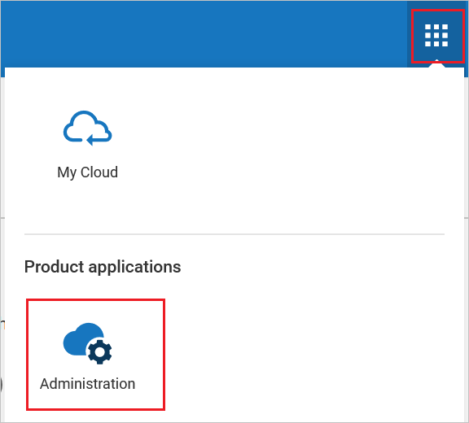
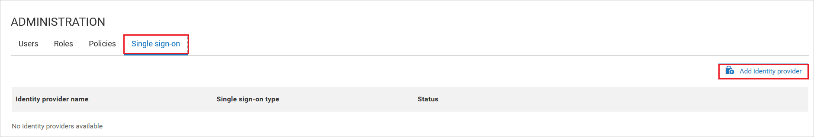
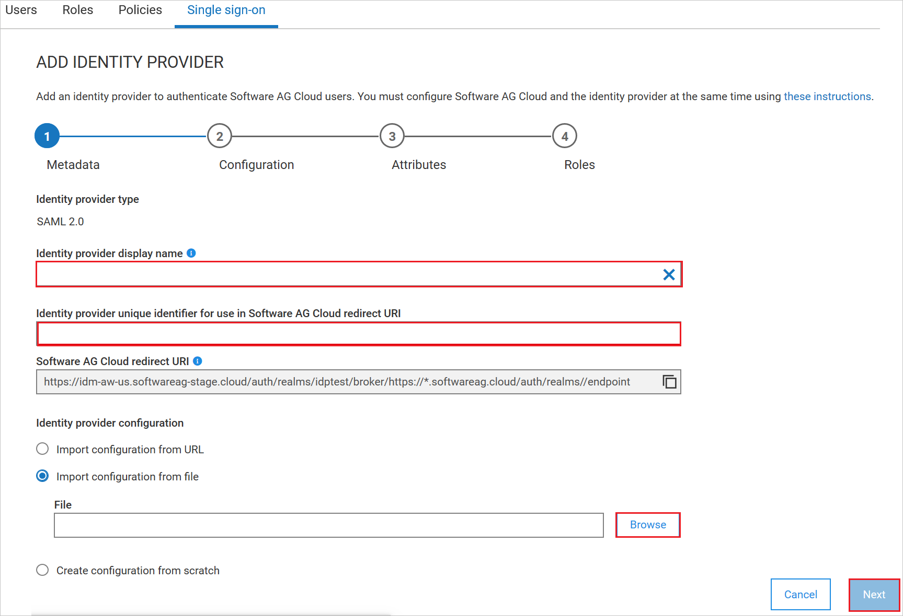

# Configure Software AG Cloud for Single sign-on with Microsoft Entra ID

In this article,  you learn how to integrate Software AG Cloud with Microsoft Entra ID. When you integrate Software AG Cloud with Microsoft Entra ID, you can:

* Control in Microsoft Entra ID who has access to Software AG Cloud.
* Enable your users to be automatically signed-in to Software AG Cloud with their Microsoft Entra accounts.
* Manage your accounts in one central location.

## Prerequisites
The scenario outlined in this article assumes that you already have the following prerequisites:

[!INCLUDE [common-prerequisites.md](~/identity/saas-apps/includes/common-prerequisites.md)]
* Software AG Cloud single sign-on (SSO) enabled subscription.

> [!NOTE]
> This integration is also available to use from Microsoft Entra US Government Cloud environment. You can find this application in the Microsoft Entra US Government Cloud Application Gallery and configure it in the same way as you do from public cloud.

## Scenario description

In this article,  you configure and test Microsoft Entra SSO in a test environment.

* Software AG Cloud supports **SP** initiated SSO.
* Software AG Cloud supports **Just In Time** user provisioning.

## Add Software AG Cloud from the gallery

To configure the integration of Software AG Cloud into Microsoft Entra ID, you need to add Software AG Cloud from the gallery to your list of managed SaaS apps.

1. Sign in to the [Microsoft Entra admin center](https://entra.microsoft.com) as at least a [Cloud Application Administrator](~/identity/role-based-access-control/permissions-reference.md#cloud-application-administrator).
1. Browse to **Entra ID** > **Enterprise apps** > **New application**.
1. In the **Add from the gallery** section, type **Software AG Cloud** in the search box.
1. Select **Software AG Cloud** from results panel and then add the app. Wait a few seconds while the app is added to your tenant.

 Alternatively, you can also use the [Enterprise App Configuration Wizard](https://portal.office.com/AdminPortal/home?Q=Docs#/azureadappintegration). In this wizard, you can add an application to your tenant, add users/groups to the app, assign roles, and walk through the SSO configuration as well. [Learn more about Microsoft 365 wizards.](/microsoft-365/admin/misc/azure-ad-setup-guides)

## Configure and test Microsoft Entra SSO for Software AG Cloud

Configure and test Microsoft Entra SSO with Software AG Cloud using a test user called **B.Simon**. For SSO to work, you need to establish a link relationship between a Microsoft Entra user and the related user in Software AG Cloud.

To configure and test Microsoft Entra SSO with Software AG Cloud, perform the following steps:

1. **[Configure Microsoft Entra SSO](#configure-azure-ad-sso)** - to enable your users to use this feature.
    1. **Create a Microsoft Entra test user** - to test Microsoft Entra single sign-on with B.Simon.
    1. **Assign the Microsoft Entra test user** - to enable B.Simon to use Microsoft Entra single sign-on.
1. **[Configure Software AG Cloud SSO](#configure-software-ag-cloud-sso)** - to configure the single sign-on settings on application side.
    1. **[Create Software AG Cloud test user](#create-software-ag-cloud-test-user)** - to have a counterpart of B.Simon in Software AG Cloud that's linked to the Microsoft Entra representation of user.
1. **[Test SSO](#test-sso)** - to verify whether the configuration works.

## Configure Microsoft Entra SSO

Follow these steps to enable Microsoft Entra SSO.

1. Sign in to the [Microsoft Entra admin center](https://entra.microsoft.com) as at least a [Cloud Application Administrator](~/identity/role-based-access-control/permissions-reference.md#cloud-application-administrator).
1. Browse to **Entra ID** > **Enterprise apps** > **Software AG Cloud** > **Single sign-on**.
1. On the **Select a single sign-on method** page, select **SAML**.
1. On the **Set up single sign-on with SAML** page, select the pencil icon for **Basic SAML Configuration** to edit the settings.

   

1. On the **Basic SAML Configuration** section, perform the following steps:

    1. In the **Identifier (Entity ID)** text box, type a URL using the following pattern:

        `https://<SUBDOMAIN>.softwareag.cloud/auth/realms/TENANT-NAME`
    
    1. In the **Sign on URL** text box, type a URL using the following pattern:

        `https://<SUBDOMAIN>.softwareag.cloud/auth/realms/TENANT-NAME/broker/IDENTITY-PROVIDER-NAME/endpoint`    

        > [!NOTE]
        > These values aren't real. Update these values with the actual Sign on URL and Identifier. Contact [Software AG Cloud Client support team](mailto:support@softwareag.com) to get these values. You can also refer to the patterns shown in the **Basic SAML Configuration** section.

1. On the **Set up single sign-on with SAML** page, in the **SAML Signing Certificate** section,  find **Federation Metadata XML** and select **Download** to download the certificate and save it on your computer.

    

1. On the **Set up Software AG Cloud** section, copy the appropriate URL(s) based on your requirement.

    

[!INCLUDE [create-assign-users-sso.md](~/identity/saas-apps/includes/create-assign-users-sso.md)]

## Configure Software AG Cloud SSO

1. In a different web browser window, sign into Software AG Cloud website as an administrator.

1.  Select **Administration**

    

1. Go to the **Single-sign on > Add identity provider**

    

1. Perform the following steps in the following page.

    

    a. In the **Identity provider display name** textbox, give the name like `azure ad`.

    b. In the **Identity provider unique identifier for use in Software AG Cloud redirect URI** textbox, enter a unique name for the Identity Provider. The **Software AG Cloud redirect URI** field gets refreshed and populated with the URI. Copy this URI and use it to configure the **Entity ID** and other information in the Azure portal as per the patterns defined.

    c. Import the **Federation Metadata XML** file in **Identity provider configuration** and select **Next**.

    d. Go to the **Configuration** page and complete the fields as necessary.

### Create Software AG Cloud test user

In this section, a user called Britta Simon is created in Software AG Cloud. Software AG Cloud supports just-in-time user provisioning, which is enabled by default. There's no action item for you in this section. If a user doesn't already exist in Software AG Cloud, a new one is created after authentication.

## Test SSO 

In this section, you test your Microsoft Entra single sign-on configuration with following option. 

Assuming that the Microsoft Azure is configured as a provider in Software AG Cloud, navigate to `www.softwareag.cloud` and select Login button and enter the environment name. In the next screen, select "Log in with \<IDP NAME\>" link and enter the credentials. Once authenticated, you be logged in and taken to the Software AG Cloud home page.

## Related content

Once you configure Software AG Cloud you can enforce session control, which protects exfiltration and infiltration of your organization's sensitive data in real time. Session control extends from Conditional Access. [Learn how to enforce session control with Microsoft Defender for Cloud Apps](/cloud-app-security/proxy-deployment-any-app).
