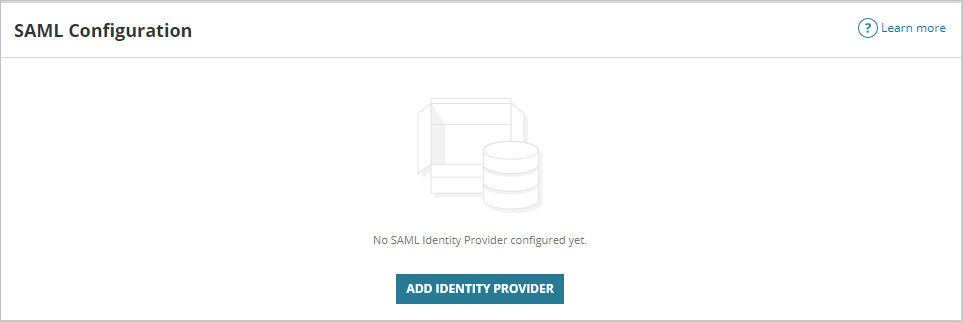
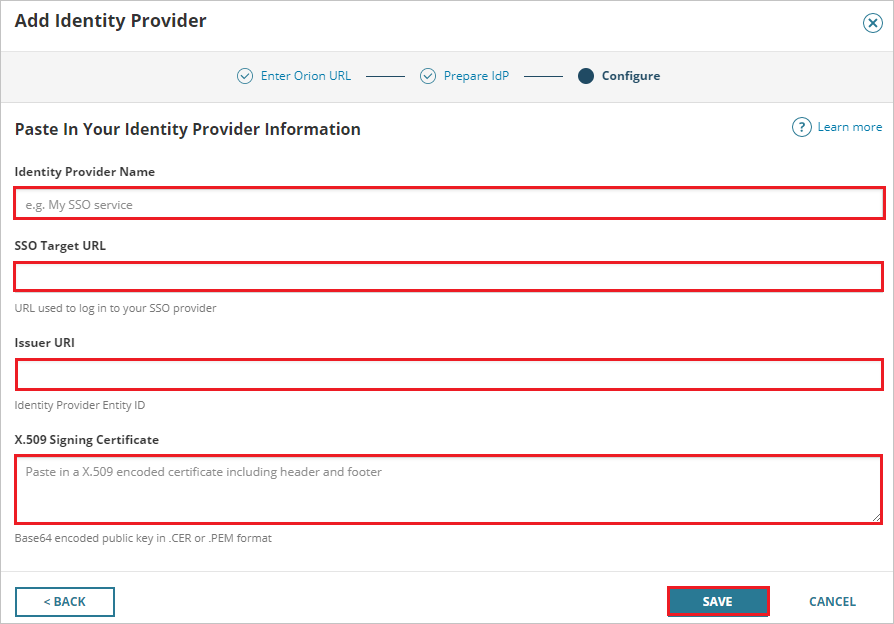
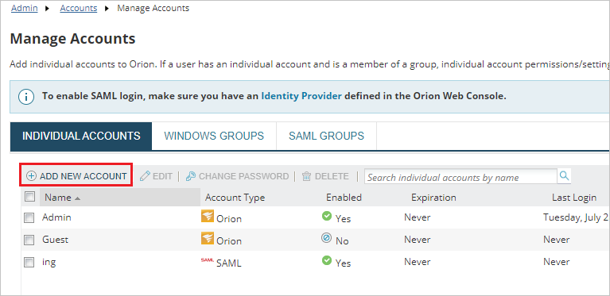

# Microsoft Entra single sign-on (SSO) integration with SolarWinds Orion

In this article,  you learn how to integrate SolarWinds Orion with Microsoft Entra ID. When you integrate SolarWinds Orion with Microsoft Entra ID, you can:

* Control in Microsoft Entra ID who has access to SolarWinds Orion.
* Enable your users to be automatically signed-in to SolarWinds Orion with their Microsoft Entra accounts.
* Manage your accounts in one central location.

## Prerequisites
The scenario outlined in this article assumes that you already have the following prerequisites:
[!INCLUDE [common-prerequisites.md](~/identity/saas-apps/includes/common-prerequisites.md)]
* SolarWinds Orion single sign-on (SSO) enabled subscription.

## Scenario description

In this article,  you configure and test Microsoft Entra SSO in a test environment.

* SolarWinds Orion supports **SP and IDP** initiated SSO.

## Add SolarWinds Orion application

To configure the integration of SolarWinds Orion into Microsoft Entra ID, you need to add SolarWinds Orion to your list of managed SaaS apps.

1. Browse to **Identity** > **Applications** > **Enterprise applications** .
1. Click **New application** option, click **Create your own application** and use **Integrate any other application you don't find in the gallery (Non-gallery)**.
1. Name your application **SolarWinds Orion**.

## Configure and test Microsoft Entra SSO for SolarWinds Orion

Configure and test Microsoft Entra SSO with SolarWinds Orion using a test user called **B.Simon**. For SSO to work, you need to establish a link relationship between a Microsoft Entra user and the related user in SolarWinds Orion.

To configure and test Microsoft Entra SSO with SolarWinds Orion, perform the following steps:

1. **[Configure Microsoft Entra SSO](#configure-azure-ad-sso)** - to enable your users to use this feature.
    1. **Create a Microsoft Entra test user** - to test Microsoft Entra single sign-on with B.Simon.
    1. **Assign the Microsoft Entra test user** - to enable B.Simon to use Microsoft Entra single sign-on.
1. **[Configure SolarWinds Orion SSO](#configure-solarwinds-orion-sso)** - to configure the single sign-on settings on application side.
    1. **[Create SolarWinds Orion test user](#create-solarwinds-orion-test-user)** - to have a counterpart of B.Simon in SolarWinds Orion that's linked to the Microsoft Entra representation of user.
1. **[Test SSO](#test-sso)** - to verify whether the configuration works.

## Configure Microsoft Entra SSO

Follow these steps to enable Microsoft Entra SSO.

1. Sign in to the [Microsoft Entra admin center](https://entra.microsoft.com) as at least a [Cloud Application Administrator](~/identity/role-based-access-control/permissions-reference.md#cloud-application-administrator).

1. Browse to **Identity** > **Applications** > **Enterprise applications**  > **SolarWinds Orion** application integration page, find the Manage section and select single sign-on.
1. On the **Select a single sign-on method** page, select **SAML**.
1. On the **Set up single sign-on with SAML** page, select the pencil icon for **Basic SAML Configuration** to edit the settings.

   

1. On the **Basic SAML Configuration** section, if you wish to configure the application in **IDP** initiated mode, enter the values for the following fields:

    a. In the **Identifier** text box, type a URL using the following pattern:
    `https://<ORION-HOSTNAME-OR-EXTERNAL-URL>`

    b. In the **Reply URL** text box, type a URL using the following pattern:
    `https://<ORION-HOSTNAME-OR-EXTERNAL-URL>/Orion/SAMLLogin.aspx`

1. Select **Set additional URLs** and perform the following step if you wish to configure the application in **SP** initiated mode:

    In the **Sign-on URL** text box, type a URL using the following pattern:
    `https://<ORION-HOSTNAME-OR-EXTERNAL-URL>/Orion/Login.aspx`

	> [!NOTE]
	> These values aren't real. Update these values with the actual Identifier, Reply URL and Sign-on URL. Contact [SolarWinds Orion Client support team](mailto:technicalsupport@solarwinds.com) to get these values. You can also refer to the patterns shown in the **Basic SAML Configuration** section.

1. SolarWinds Orion application expects the SAML assertions in a specific format, which requires you to add custom attribute mappings to your SAML token attributes configuration. The following screenshot shows the list of default attributes.

	

1. In addition to above, SolarWinds Orion application expects few more attributes to be passed back in SAML response, which are shown below. These attributes are also pre populated but you can review them as per your requirements.
	
	| Name |  Source Attribute|
	| ----------- | --------- |
	| FirstName | user.givenname |
    | LastName | user.surname |
    | Email |user.mail |

1. In **User Attributes & Claims** section, select **Add a group claim**.
1. In **Group Claims**, choose **Security groups**.
1. If you have Microsoft Entra ID synchronized with your on-premises AD, change **Source attribute** to **sAMAccountName**. Otherwise, leave it as Group ID.

1. In the **Advanced options**, tick mark **Customize the name of the group claim** and give OrionGroups as the name.

1. Select **Save**.

1. On the **Set up single sign-on with SAML** page, in the **SAML Signing Certificate** section,  find **Certificate (Base64)** and select **Download** to download the certificate and save it on your computer.

	

1. On the **Set up SolarWinds Orion** section, copy the appropriate URL(s) based on your requirement.

	

[!INCLUDE [create-assign-users-sso.md](~/identity/saas-apps/includes/create-assign-users-sso.md)]

## Configure SolarWinds Orion SSO

1. Log in to the SolarWinds Orion and go to the **Settings** -> **All Settings**.

    

1. In the **USER ACCOUNTS** section, select **SAML Configuration**.

    

1. Select **ADD IDENTITY PROVIDER**.

    

1. Perform the following steps in the **Add Identity Provider** page:

    

    a. Go to the **Configure** tab.

    b. In the **Identity Provider Name** textbox, give any valid name like `My SSO service`.

    c. In the **SSO Target URL** textbox, paste the **Login URL** value, which you copied previously.

    d.  In the **Issuer URL** textbox, paste the **Microsoft Entra Identifier** value, which you copied previously.

    e. Open the downloaded **Certificate (Base64)** into Notepad and paste the content into the **X.509 Signing Certificate** textbox.

    f. Select **Save**.

### Create SolarWinds Orion test user

1. Log in to the SolarWinds Orion website and go to the **Settings** -> **All Settings**.

    

1. In the **USER ACCOUNTS** section, select **Manage Accounts**.

    

1. In the **INDIVIDUAL ACCOUNTS** tab, select **ADD NEW ACCOUNT**.

    

1. Select the type of account, which you need to create either SAML individual users or groups.

    

1.  In the **NAME ID** textbox, enter the name that must match with the username or group name exactly as in Microsoft Entra ID.

1.  Select **Next** and then submit the page.

    

## Test SSO 

In this section, you test your Microsoft Entra single sign-on configuration with following options. 

#### SP initiated:

* Select **Test this application**, this option redirects to SolarWinds Orion Sign on URL where you can initiate the login flow.  

* Go to SolarWinds Orion Sign-on URL directly and initiate the login flow from there.

#### IDP initiated:

* Select **Test this application**, and you should be automatically signed in to the SolarWinds Orion for which you set up the SSO. 

You can also use Microsoft My Apps to test the application in any mode. When you select the SolarWinds Orion tile in the My Apps, if configured in SP mode you would be redirected to the application sign on page for initiating the login flow and if configured in IDP mode, you should be automatically signed in to the SolarWinds Orion for which you set up the SSO. For more information about the My Apps, see [Introduction to the My Apps](https://support.microsoft.com/account-billing/sign-in-and-start-apps-from-the-my-apps-portal-2f3b1bae-0e5a-4a86-a33e-876fbd2a4510).

## Related content

Once you configure SolarWinds Orion you can enforce session control, which protects exfiltration and infiltration of your organization’s sensitive data in real time. Session control extends from Conditional Access. [Learn how to enforce session control with Microsoft Defender for Cloud Apps](/cloud-app-security/proxy-deployment-any-app).
