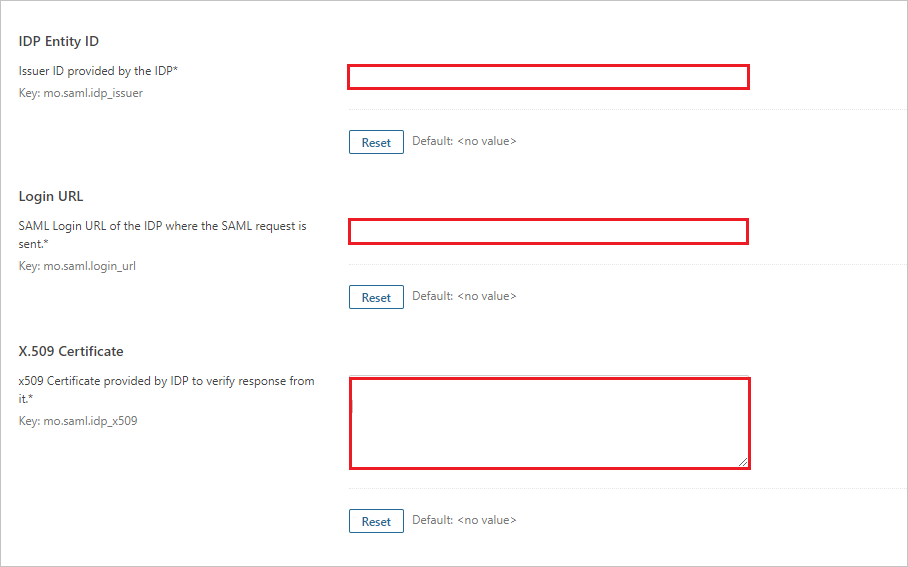
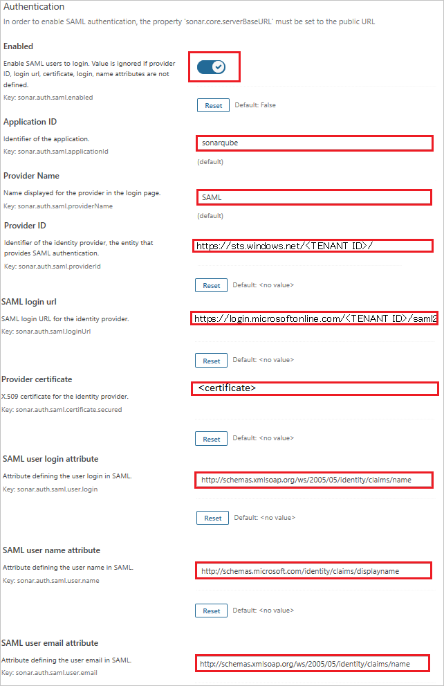

# Configure SonarQube for Single sign-on with Microsoft Entra ID

In this article,  you learn how to integrate SonarQube with Microsoft Entra ID. When you integrate SonarQube with Microsoft Entra ID, you can:

* Control in Microsoft Entra ID who has access to SonarQube.
* Enable your users to be automatically signed-in to SonarQube with their Microsoft Entra accounts.
* Manage your accounts in one central location.

## Prerequisites
The scenario outlined in this article assumes that you already have the following prerequisites:

[!INCLUDE [common-prerequisites.md](~/identity/saas-apps/includes/common-prerequisites.md)]
* SonarQube single sign-on (SSO) enabled subscription.
* Steps to get SonarQube "SAML group attribute" setup correctly to use AzureAD groups for permissions (detailed below).

> [!NOTE]
> Help on installing SonarQube can be found in the [online documentation](https://docs.sonarsource.com/sonarqube-server/latest/setup-and-upgrade/overview/).

## Scenario description

In this article,  you configure and test Microsoft Entra SSO in a test environment.

* SonarQube supports **SP** initiated SSO.

> [!NOTE]
> Identifier of this application is a fixed string value so only one instance can be configured in one tenant.

## Add SonarQube from the gallery

To configure the integration of SonarQube into Microsoft Entra ID, you need to add SonarQube from the gallery to your list of managed SaaS apps.

1. Sign in to the [Microsoft Entra admin center](https://entra.microsoft.com) as at least a [Cloud Application Administrator](~/identity/role-based-access-control/permissions-reference.md#cloud-application-administrator).
1. Browse to **Entra ID** > **Enterprise apps** > **New application**.
1. In the **Add from the gallery** section, type **SonarQube** in the search box.
1. Select **SonarQube** from results panel and then add the app. Wait a few seconds while the app is added to your tenant.

 Alternatively, you can also use the [Enterprise App Configuration Wizard](https://portal.office.com/AdminPortal/home?Q=Docs#/azureadappintegration). In this wizard, you can add an application to your tenant, add users/groups to the app, assign roles, and walk through the SSO configuration as well. [Learn more about Microsoft 365 wizards.](/microsoft-365/admin/misc/azure-ad-setup-guides)

## Configure and test Microsoft Entra SSO for SonarQube

Configure and test Microsoft Entra SSO with SonarQube using a test user called **B.Simon**. For SSO to work, you need to establish a link relationship between a Microsoft Entra user and the related user in SonarQube.

To configure and test Microsoft Entra SSO with SonarQube, perform the following steps:

1. **[Configure Microsoft Entra SSO](#configure-azure-ad-sso)** - to enable your users to use this feature.
    1. **Create a Microsoft Entra test user** - to test Microsoft Entra single sign-on with B.Simon.
    1. **Assign the Microsoft Entra test user** - to enable B.Simon to use Microsoft Entra single sign-on.
1. **[Configure SonarQube SSO](#configure-sonarqube-sso)** - to configure the single sign-on settings on application side.
    1. **[Create SonarQube test user](#create-sonarqube-test-user)** - to have a counterpart of B.Simon in SonarQube that's linked to the Microsoft Entra representation of user.
    1. **[Configure SAML Group Attribute for SonarQube](#configure-saml-group-attribute-for-sonarqube) - to enable B.Simon to use Microsoft Entra single sign-on. 
1. **[Test SSO](#test-sso)** - to verify whether the configuration works.

## Configure Microsoft Entra SSO

Follow these steps to enable Microsoft Entra SSO.

1. Sign in to the [Microsoft Entra admin center](https://entra.microsoft.com) as at least a [Cloud Application Administrator](~/identity/role-based-access-control/permissions-reference.md#cloud-application-administrator).
1. Browse to **Entra ID** > **Enterprise apps** > **SonarQube** > **Single sign-on**.
1. On the **Select a single sign-on method** page, select **SAML**.
1. On the **Set up single sign-on with SAML** page, select the pencil icon for **Basic SAML Configuration** to edit the settings.

   

1. On the **Basic SAML Configuration** section, perform the following steps:

	a. In the **Reply URL** text box, type a URL using the following pattern:
	` https://sonar.<companyspecificurl>.io/oauth2/callback/saml`

    b. In the **Sign-on URL** text box, type one of the following URLs:

	* **For Production Environment**

    	`https://servicessonar.corp.microsoft.com/`

	* **For Dev Environment**

		`https://servicescode-dev.westus.cloudapp.azure.com`

	> [!NOTE]
	> This value isn't real. Update the value with actual Reply URL which are explained later in the article.

1. On the **Set up single sign-on with SAML** page, in the **SAML Signing Certificate** section,  find **Certificate (Base64)** and select **Download** to download the certificate and save it on your computer.

	

1. On the **Set up SonarQube** section, copy the appropriate URLs based on your requirement.

	

[!INCLUDE [create-assign-users-sso.md](~/identity/saas-apps/includes/create-assign-users-sso.md)]

## Configure SonarQube SSO

1. Open a new web browser window and sign into your SonarQube company site as an administrator.

1. Select **Administration > Configuration > Security** and go to the **SAML Plugin** perform the following steps.

1. Copy the following details from the IdP metadata and paste them into the corresponding text fields in the SonarQube plugin.
	1. IdP Entity ID
	2. Sign-in URL
	3. X.509 Certificate 

1. Save all the details.

	

1. On the **SAML** page, perform the following steps:

	

	a. Toggle the **Enabled** option to **yes**.

	b. In **Application ID** text box, enter the name like **sonarqube**.

	c. In **Provider Name** text box, enter the name like **SAML**.

	d. In **Provider ID** text box, paste the value of **Microsoft Entra Identifier**.

	e. In **SAML login url** text box, paste the value of **Login URL**.

	f. Open the Base 64 encoded certificate in notepad, copy its content and paste it into the **Provider certificate** text box.

	g. In **SAML user login attribute** text box, enter the value `http://schemas.xmlsoap.org/ws/2005/05/identity/claims/name`.

	h. In **SAML user name attribute** text box, enter the value `http://schemas.microsoft.com/identity/claims/displayname`.

	i. In **SAML user email attribute** text box, enter the value `http://schemas.xmlsoap.org/ws/2005/05/identity/claims/emailaddress`.

	j. Select **Save**.

### Configure SAML Group Attribute for SonarQube

To set up SAML group attribute and use AzureAD groups for permissions in SonarQube, follow this steps:
   1. In the Administration tab of SonarQube, navigate to Configuration > Security > Saml/
   1. In the SAML group attribute text box, enter the following value: 'http://schemas.microsoft.com/ws/2008/06/identity/claims/role'
   1. Save the changes
   1. Go to Administration > Security > Groups in SonarQube
   1. Map the AzureAD groups to SonarQube groups:
        *  For each AzureAD group, create a corresponding group in SonarQube if it doesn't exist.
        * Ensure the names of the groups match exactly between AzureAD and SonarQube.

### Create SonarQube test user

In this section, you create a user called B.Simon in SonarQube. Work with [SonarQube Client support team](https://sonarsource.com/company/contact/) to add the users in the SonarQube platform. Users must be created and activated before you use single sign-on. 

## Test SSO 

In this section, you test your Microsoft Entra single sign-on configuration with following options. 

* Select **Test this application**, this option redirects to SonarQube Sign-on URL where you can initiate the sign-in flow. 

* Go to SonarQube Sign-on URL directly and initiate the sign-in flow from there.

* You can use Microsoft My Apps. When you select the SonarQube tile in the My Apps, this option redirects to SonarQube Sign-on URL. For more information about the My Apps, see [Introduction to the My Apps](https://support.microsoft.com/account-billing/sign-in-and-start-apps-from-the-my-apps-portal-2f3b1bae-0e5a-4a86-a33e-876fbd2a4510).

## Related content

* Once you configure SonarQube, you can enforce session controls, which protect exfiltration and infiltration of your organization’s sensitive data in real time. Session controls extend from Conditional Access. [Learn how to enforce session control with Microsoft Defender for Cloud Apps](/cloud-app-security/proxy-deployment-any-app).
