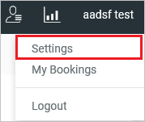
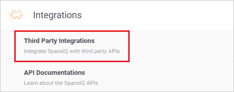
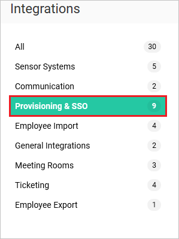
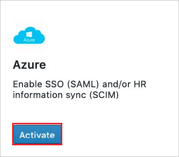
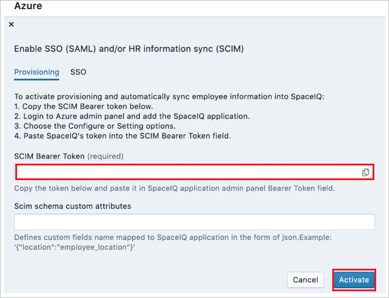
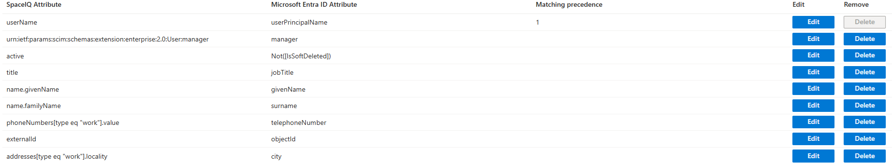

# Configure SpaceIQ for automatic user provisioning with Microsoft Entra ID

The objective of this article is to demonstrate the steps to be performed in SpaceIQ and Microsoft Entra ID to configure Microsoft Entra ID to automatically provision and de-provision users and/or groups to SpaceIQ.

> [!NOTE]
> This article describes a connector built on top of the Microsoft Entra user provisioning service. For important details on what this service does, how it works, and frequently asked questions, see [Automate user provisioning and deprovisioning to SaaS applications with Microsoft Entra ID](~/identity/app-provisioning/user-provisioning.md).
>

## Prerequisites

The scenario outlined in this article assumes that you already have the following prerequisites:

[!INCLUDE [common-prerequisites.md](~/identity/saas-apps/includes/common-prerequisites.md)]
* [A SpaceIQ tenant](https://spaceiq.com/)
* A user account in SpaceIQ with Admin permissions.

## Step 1: Assign users to SpaceIQ

Microsoft Entra ID uses a concept called *assignments* to determine which users should receive access to selected apps. In the context of automatic user provisioning, only the users and/or groups that have been assigned to an application in Microsoft Entra ID are synchronized.

Before configuring and enabling automatic user provisioning, you should decide which users and/or groups in Microsoft Entra ID need access to SpaceIQ. Once decided, you can assign these users and/or groups to SpaceIQ by following the instructions here:
* [Assign a user or group to an enterprise app](~/identity/enterprise-apps/assign-user-or-group-access-portal.md)

## Step 2: Important tips for user assignment to SpaceIQ

* It's recommended that a single Microsoft Entra user is assigned to SpaceIQ to test the automatic user provisioning configuration. More users and/or groups may be assigned later.

* When assigning a user to SpaceIQ, you must select any valid application-specific role (if available) in the assignment dialog. Users with the **Default Access** role are excluded from provisioning.

## Step 3: Set up SpaceIQ for provisioning

1. Sign in to your [SpaceIQ Admin Console](https://main.spaceiq.com/login/). Navigate to **Settings** by selecting it from the drop-down menu on the top right corner of the screen.

	

2.	From the **Settings** page Select **Third Party Integrations**.

	

3.	Navigate to **Provisioning and SSO** tab. Search for the **Azure** tile. Select **Activate**.

	

	

3.	Copy the **SCIM Bearer Token**. This value is entered in the Secret Token field in the Provisioning tab of your SpaceIQ application. Select **Activate**

	

## Step 4: Add SpaceIQ from the gallery

Before configuring SpaceIQ for automatic user provisioning with Microsoft Entra ID, you need to add SpaceIQ from the Microsoft Entra application gallery to your list of managed SaaS applications.

**To add SpaceIQ from the Microsoft Entra application gallery, perform the following steps:**

1. Sign in to the [Microsoft Entra admin center](https://entra.microsoft.com) as at least a [Cloud Application Administrator](~/identity/role-based-access-control/permissions-reference.md#cloud-application-administrator).
1. Browse to **Entra ID** > **Enterprise apps** > **New application**.
1. In the **Add from the gallery** section, type **SpaceIQ**, select **SpaceIQ** in the search box.
1. Select **SpaceIQ** from results panel and then add the app. Wait a few seconds while the app is added to your tenant.
	

## Step 5: Configure automatic user provisioning to SpaceIQ 

This section guides you through the steps to configure the Microsoft Entra provisioning service to create, update, and disable users and/or groups in SpaceIQ based on user and/or group assignments in Microsoft Entra ID.

> [!TIP]
> You may also choose to enable SAML-based single sign-on for SpaceIQ, following the instructions provided in the [SpaceIQ Single sign-on  article](./spaceiq-tutorial.md). Single sign-on can be configured independently of automatic user provisioning, though these two features complement each other

### To configure automatic user provisioning for SpaceIQ in Microsoft Entra ID:

1. Sign in to the [Microsoft Entra admin center](https://entra.microsoft.com) as at least a [Cloud Application Administrator](~/identity/role-based-access-control/permissions-reference.md#cloud-application-administrator).
1. Browse to **Entra ID** > **Enterprise apps**

	

1. In the applications list, select **SpaceIQ**.

	

1. Select the **Provisioning** tab.

	

1. Select **+ New configuration**.

	

1. In the **Tenant URL** field, input your SpaceIQ Tenant URL and Secret Token. Select **Test Connection** to ensure Microsoft Entra ID can connect to SpaceIQ. If the connection fails, ensure your SpaceIQ account has the required admin permissions and try again.

   

1. Select **Create** to create your configuration.

1. Select **Properties** on the **Overview** page.

1. Select the **Edit** icon to edit the properties. Enable notification emails and provide an email to receive quarantine emails. Enable accidental deletions prevention. Select **Apply** to save the changes.

   

1. Select **Attribute Mapping** in the left panel and select **users**.

1. Review the user attributes that are synchronized from Microsoft Entra ID to SpaceIQ in the **Attribute Mapping** section. The attributes selected as **Matching** properties are used to match the user accounts in SpaceIQ for update operations. Select the **Save** button to commit any changes.

	

1. To configure scoping filters, refer to the following instructions provided in the [Scoping filter article](~/identity/app-provisioning/define-conditional-rules-for-provisioning-user-accounts.md).

1. Use [on-demand provisioning](~/identity/app-provisioning/provision-on-demand.md) to validate sync with a small number of users before deploying more broadly in your organization.  

1. When you're ready to provision, select **Start Provisioning** from the **Overview** page.

## Step 6: Monitor your deployment

[!INCLUDE [monitor-deployment.md](~/identity/saas-apps/includes/monitor-deployment.md)]

## More resources

* [Managing user account provisioning for Enterprise Apps](~/identity/app-provisioning/configure-automatic-user-provisioning-portal.md)
* [What is application access and single sign-on with Microsoft Entra ID?](~/identity/enterprise-apps/what-is-single-sign-on.md)

## Related content

* [Learn how to review logs and get reports on provisioning activity](~/identity/app-provisioning/check-status-user-account-provisioning.md)
