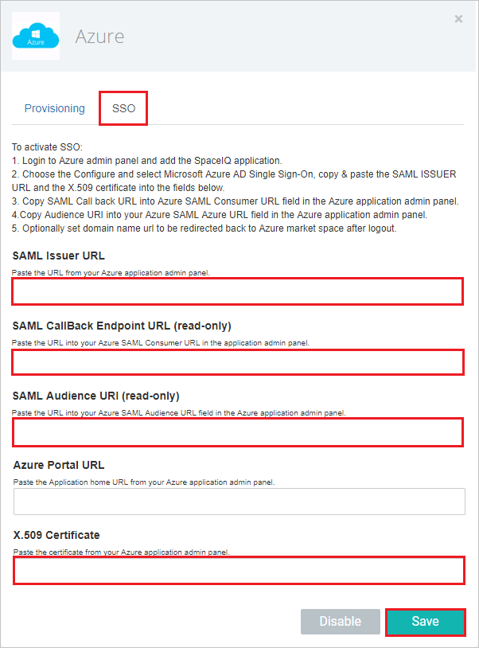

# Configure SpaceIQ for Single sign-on with Microsoft Entra ID

In this article,  you learn how to integrate SpaceIQ with Microsoft Entra ID. When you integrate SpaceIQ with Microsoft Entra ID, you can:

* Control in Microsoft Entra ID who has access to SpaceIQ.
* Enable your users to be automatically signed-in to SpaceIQ with their Microsoft Entra accounts.
* Manage your accounts in one central location.

## Prerequisites
The scenario outlined in this article assumes that you already have the following prerequisites:

[!INCLUDE [common-prerequisites.md](~/identity/saas-apps/includes/common-prerequisites.md)]
* SpaceIQ single sign-on enabled subscription.

## Scenario description

In this article,  you configure and test Microsoft Entra single sign-on in a test environment.

* SpaceIQ supports **IDP** initiated SSO.
* SpaceIQ supports [Automated user provisioning](spaceiq-provisioning-tutorial.md).

> [!NOTE]
> Identifier of this application is a fixed string value so only one instance can be configured in one tenant.

## Add SpaceIQ from the gallery

To configure the integration of SpaceIQ into Microsoft Entra ID, you need to add SpaceIQ from the gallery to your list of managed SaaS apps.

1. Sign in to the [Microsoft Entra admin center](https://entra.microsoft.com) as at least a [Cloud Application Administrator](~/identity/role-based-access-control/permissions-reference.md#cloud-application-administrator).
1. Browse to **Entra ID** > **Enterprise apps** > **New application**.
1. In the **Add from the gallery** section, type **SpaceIQ** in the search box.
1. Select **SpaceIQ** from results panel and then add the app. Wait a few seconds while the app is added to your tenant.

 Alternatively, you can also use the [Enterprise App Configuration Wizard](https://portal.office.com/AdminPortal/home?Q=Docs#/azureadappintegration). In this wizard, you can add an application to your tenant, add users/groups to the app, assign roles, and walk through the SSO configuration as well. [Learn more about Microsoft 365 wizards.](/microsoft-365/admin/misc/azure-ad-setup-guides)

## Configure and test Microsoft Entra SSO for SpaceIQ

Configure and test Microsoft Entra SSO with SpaceIQ using a test user called **B.Simon**. For SSO to work, you need to establish a link relationship between a Microsoft Entra user and the related user in SpaceIQ.

To configure and test Microsoft Entra SSO with SpaceIQ, perform the following steps:

1. **[Configure Microsoft Entra SSO](#configure-azure-ad-sso)** - to enable your users to use this feature.
    1. **Create a Microsoft Entra test user** - to test Microsoft Entra single sign-on with B.Simon.
    1. **Assign the Microsoft Entra test user** - to enable B.Simon to use Microsoft Entra single sign-on.
1. **[Configure SpaceIQ SSO](#configure-spaceiq-sso)** - to configure the single sign-on settings on application side.
    1. **[Create SpaceIQ test user](#create-spaceiq-test-user)** - to have a counterpart of B.Simon in SpaceIQ that's linked to the Microsoft Entra representation of user.
1. **[Test SSO](#test-sso)** - to verify whether the configuration works.

## Configure Microsoft Entra SSO

Follow these steps to enable Microsoft Entra SSO.

1. Sign in to the [Microsoft Entra admin center](https://entra.microsoft.com) as at least a [Cloud Application Administrator](~/identity/role-based-access-control/permissions-reference.md#cloud-application-administrator).
1. Browse to **Entra ID** > **Enterprise apps** > **SpaceIQ** > **Single sign-on**.
1. On the **Select a single sign-on method** page, select **SAML**.
1. On the **Set up single sign-on with SAML** page, select the pencil icon for **Basic SAML Configuration** to edit the settings.

   

1. On the **Set up Single Sign-On with SAML** page, perform the following steps:

    a. In the **Identifier** text box, type the URL:
    `https://api.spaceiq.com`

    b. In the **Reply URL** text box, type a URL using the following pattern:
    `https://api.spaceiq.com/saml/<INSTANCE_ID>/callback`

	> [!NOTE]
	> Update these values with the actual Reply URL and identifier which is explained later in the article.

1. On the **Set up Single Sign-On with SAML** page, in the **SAML Signing Certificate** section, select **Download** to download the **Certificate (Base64)** from the given options as per your requirement and save it on your computer.

	

1. On the **Set up SpaceIQ** section, copy the appropriate URL(s) as per your requirement.

	

[!INCLUDE [create-assign-users-sso.md](~/identity/saas-apps/includes/create-assign-users-sso.md)]

## Configure SpaceIQ SSO

1. Open a new browser window, and then sign in to your SpaceIQ environment as an administrator.

1. Once you're logged in, select the puzzle sign at the top right, then select **Integrations**

	 

1. Under **All PROVISIONING & SSO**, select the **Azure** tile to add an instance of Azure as IDP.

	

1. In the **SSO** dialog box, perform the following steps:

    

	a. In the **SAML Issuer URL** box, paste the **Microsoft Entra Identifier** value copied from the Microsoft Entra application configuration window.

	b. Copy the **SAML CallBack Endpoint URL (read-only)** value and paste the value in the **Reply URL** box in the **Basic SAML Configuration** section.

	c. Copy the **SAML Audience URI (read-only)** value and paste the value in the **Identifier** box in the **Basic SAML Configuration** section.

	d. Open the downloaded certificate file in notepad, copy the content, and then paste it in the **X.509 Certificate** box.

	e. Select **Save**.

### Create SpaceIQ test user

In this section, you create a user called Britta Simon in SpaceIQ. Work [SpaceIQ support team](mailto:eng@spaceiq.com) to add the users in the SpaceIQ platform. Users must be created and activated before you use single sign-on.

SpaceIQ also supports automatic user provisioning, you can find more details [here](./spaceiq-provisioning-tutorial.md) on how to configure automatic user provisioning.

## Test SSO

In this section, you test your Microsoft Entra single sign-on configuration with following options.

* Select **Test this application**, and you should be automatically signed in to the SpaceIQ for which you set up the SSO.

* You can use Microsoft My Apps. When you select the SpaceIQ tile in the My Apps, you should be automatically signed in to the SpaceIQ for which you set up the SSO. For more information about the My Apps, see [Introduction to the My Apps](https://support.microsoft.com/account-billing/sign-in-and-start-apps-from-the-my-apps-portal-2f3b1bae-0e5a-4a86-a33e-876fbd2a4510).

## Related content

Once you configure SpaceIQ you can enforce session control, which protects exfiltration and infiltration of your organization’s sensitive data in real time. Session control extends from Conditional Access. [Learn how to enforce session control with Microsoft Defender for Cloud Apps](/cloud-app-security/proxy-deployment-aad).
