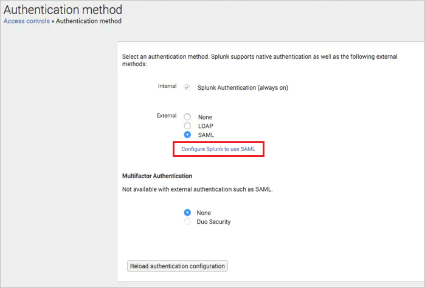
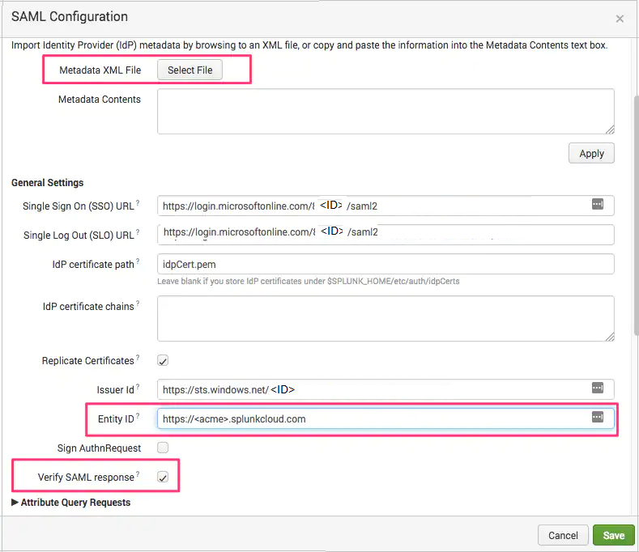
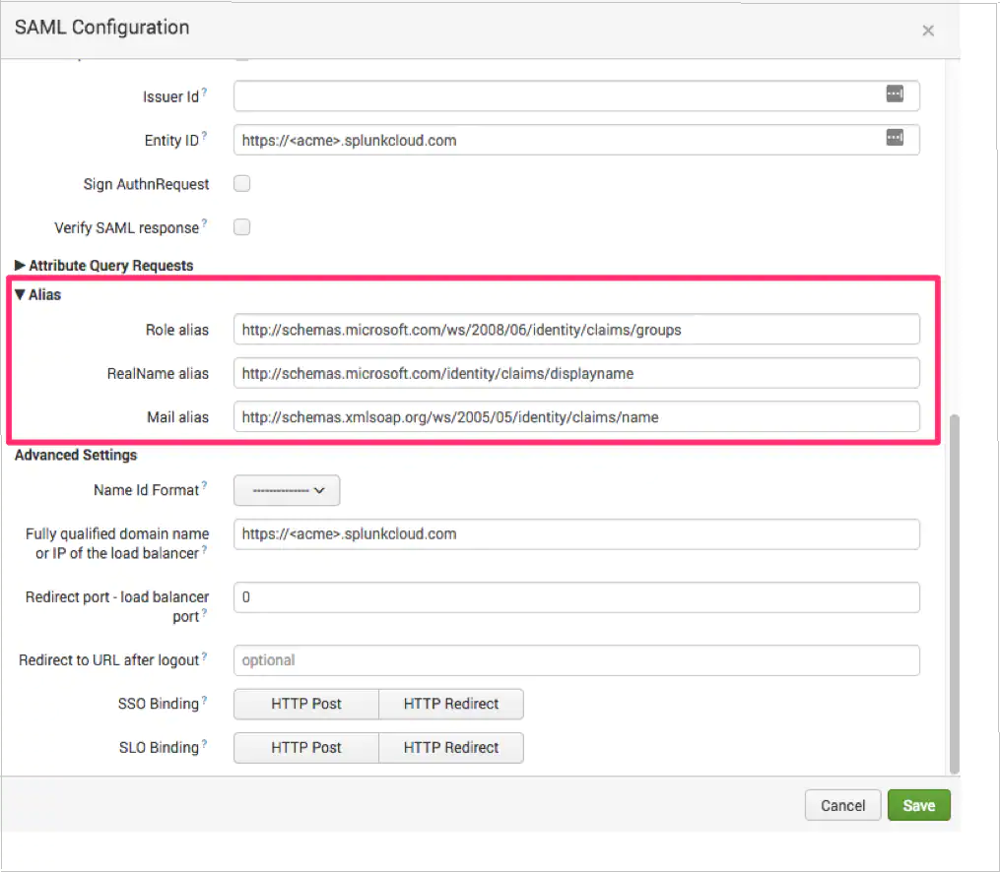
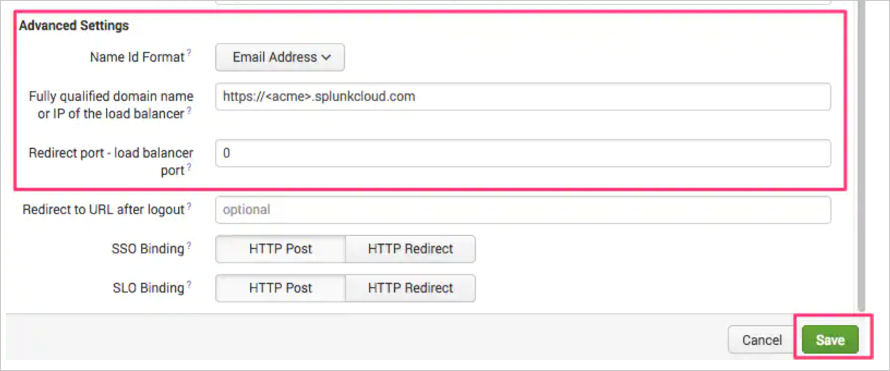

# Configure Microsoft Entra SSO for Splunk Enterprise and Splunk Cloud for Single sign-on with Microsoft Entra ID

In this article,  you learn how to integrate Microsoft Entra SSO for Splunk Enterprise and Splunk Cloud with Microsoft Entra ID. When you integrate Microsoft Entra SSO for Splunk Enterprise and Splunk Cloud with Microsoft Entra ID, you can:

* Control in Microsoft Entra ID who has access to Microsoft Entra SSO for Splunk Enterprise and Splunk Cloud.
* Enable your users to be automatically signed in to Microsoft Entra SSO for Splunk Enterprise and Splunk Cloud with their Microsoft Entra accounts.
* Manage your accounts in one central location: the Azure portal.

## Prerequisites
The scenario outlined in this article assumes that you already have the following prerequisites:

[!INCLUDE [common-prerequisites.md](~/identity/saas-apps/includes/common-prerequisites.md)]
* Microsoft Entra SSO for Splunk Enterprise and Splunk Cloud single sign-on (SSO) enabled subscription.

## Scenario description

In this article,  you configure and test Microsoft Entra single sign-on in a test environment.

* Microsoft Entra SSO for Splunk Enterprise and Splunk Cloud supports **SP** initiated SSO.

## Add Microsoft Entra SSO for Splunk Enterprise and Splunk Cloud from the gallery

To configure the integration of Microsoft Entra SSO for Splunk Enterprise and Splunk Cloud into Microsoft Entra ID, you need to add Microsoft Entra SSO for Splunk Enterprise and Splunk Cloud from the gallery to your list of managed SaaS apps.

1. Sign in to the [Microsoft Entra admin center](https://entra.microsoft.com) as at least a [Cloud Application Administrator](~/identity/role-based-access-control/permissions-reference.md#cloud-application-administrator).
1. Browse to **Entra ID** > **Enterprise apps** > **New application**.
1. In the **Add from the gallery** section, type **Microsoft Entra SSO for Splunk Enterprise and Splunk Cloud** in the search box.
1. Select **Microsoft Entra SSO for Splunk Enterprise and Splunk Cloud** from results panel and then add the app. Wait a few seconds while the app is added to your tenant.

 Alternatively, you can also use the [Enterprise App Configuration Wizard](https://portal.office.com/AdminPortal/home?Q=Docs#/azureadappintegration). In this wizard, you can add an application to your tenant, add users/groups to the app, assign roles, and walk through the SSO configuration as well. [Learn more about Microsoft 365 wizards.](/microsoft-365/admin/misc/azure-ad-setup-guides)

## Configure and test Microsoft Entra SSO for Microsoft Entra SSO for Splunk Enterprise and Splunk Cloud

Configure and test Microsoft Entra SSO with Microsoft Entra SSO for Splunk Enterprise and Splunk Cloud using a test user called **B.Simon**. For SSO to work, you need to establish a link relationship between a Microsoft Entra user and the related user in Microsoft Entra SSO for Splunk Enterprise and Splunk Cloud.

To configure and test Microsoft Entra SSO with Microsoft Entra SSO for Splunk Enterprise and Splunk Cloud, perform the following steps:

1. **[Configure Microsoft Entra SSO](#configure-azure-ad-sso)** - to enable your users to use this feature.
    1. **Create a Microsoft Entra test user** - to test Microsoft Entra single sign-on with B.Simon.
    1. **Assign the Microsoft Entra test user** - to enable B.Simon to use Microsoft Entra single sign-on.
1. **[Configure Microsoft Entra SSO for Splunk Enterprise and Splunk Cloud SSO](#configure-azure-ad-sso-for-splunk-enterprise-and-splunk-cloud-sso)** - to configure the single sign-on settings on application side.
    1. **[Create Microsoft Entra SSO for Splunk Enterprise and Splunk Cloud test user](#create-azure-ad-sso-for-splunk-enterprise-and-splunk-cloud-test-user)** - to have a counterpart of B.Simon in Microsoft Entra SSO for Splunk Enterprise and Splunk Cloud that's linked to the Microsoft Entra representation of user.
1. **[Test SSO](#test-sso)** - to verify whether the configuration works.

## Configure Microsoft Entra SSO

Follow these steps to enable Microsoft Entra SSO.

1. Sign in to the [Microsoft Entra admin center](https://entra.microsoft.com) as at least a [Cloud Application Administrator](~/identity/role-based-access-control/permissions-reference.md#cloud-application-administrator).
1. Browse to **Entra ID** > **Enterprise apps** > **Microsoft Entra SSO for Splunk Enterprise and Splunk Cloud** > **Single sign-on**.
1. On the **Select a single sign-on method** page, select **SAML**.
1. On the **Set up single sign-on with SAML** page, select the pencil icon for **Basic SAML Configuration** to edit the settings.

   

1. On the **Basic SAML Configuration** section, perform the following steps:

    a. In the **Sign-on URL** text box, type a URL using the following pattern:
    `https://<splunkserverUrl>/app/launcher/home`

    b. In the **Identifier** box, type a URL using the following pattern:
    `<splunkserverUrl>`

    c. In the **Reply URL** text box, type a URL using the following pattern:
    `https://<splunkserver>/saml/acs`

	> [!NOTE]
	> These values aren't real. Update these values with the actual Sign-On URL, Identifier and Reply URL. Contact [Microsoft Entra SSO for Splunk Enterprise and Splunk Cloud Client support team](https://www.splunk.com/en_us/about-splunk/contact-us.html) to get these values. You can also refer to the patterns shown in the **Basic SAML Configuration** section.

1. On the **Set up Single Sign-On with SAML** page, in the **SAML Signing Certificate** section, select **Download** to download the **Federation Metadata XML** from the given options as per your requirement and save it on your computer.

	

[!INCLUDE [create-assign-users-sso.md](~/identity/saas-apps/includes/create-assign-users-sso.md)]

## Configure Microsoft Entra SSO for Splunk Enterprise and Splunk Cloud SSO

1. Log in to the Splunk Enterprise and Splunk Cloud website as an administrator.

1. Go to the **Settings > Access Controls** menu option.

1. Select the **Authentication method** link. Select the **SAML** radio button

1. Select the **Configure Splunk to use SAML** link below the SAML radio button.

    

1. Perform the following steps in the **SAML Configuration** section:

    

    a. Select the **Select File** button to upload the **Federation Metadata XML** file, which you have downloaded previously.

    b. In the **Entity ID** field, enter the **Identifier** value, which you copied previously.

    c. Check the **Verify SAML response** checkbox if not already selected. Note that this step is now mandatory for all Splunk Cloud integrations to ensure secure communication between Microsoft Entra and Splunk.

1. Scroll down within the configuration dialogue and select the **Alias** section. Enter the following values in each attribute:

    a. **Role alias**: `http://schemas.microsoft.com/ws/2008/06/identity/claims/groups`

    b.**RealName alias**: `http://schemas.microsoft.com/identity/claims/displayname`

    c. **Mail alias**: `http://schemas.xmlsoap.org/ws/2005/05/identity/claims/emailaddress`

    

1. Scroll down to the **Advanced Settings** section and perform the following steps:

    

    a. Select the **Name Id Format** and select **Email Address** from the dropdown.

    b. In the **Fully qualified domain name or IP of the load balancer** text box, enter the value as: `https://<acme>.splunkcloud.com`.

    c. Set **Redirect port – load balancer port** to `0(zero)` and select **Save**.

1. Select the green **New Group** button in the upper right hand corner of the SAML Groups configuration screen in Splunk.

1. In the **Create new SAML Group** configuration dialogue, Paste the Microsoft Entra Group Object ID (not the application or user Object ID) into the Group Name field. To find the Group Object ID:
    1. Navigate to **Entra ID** > **Groups** in the Microsoft Entra admin center.
    1. Select the group created for Splunk (e.g., SplunkUsers).
    1. Copy the Object ID from the group’s overview page.

### Create Microsoft Entra SSO for Splunk Enterprise and Splunk Cloud test user

In this section, you create a user called Britta Simon in Microsoft Entra SSO for Splunk Enterprise and Splunk Cloud. Work with [Microsoft Entra SSO for Splunk Enterprise and Splunk Cloud support team](https://www.splunk.com/en_us/about-splunk/contact-us.html) to add the users in the Microsoft Entra SSO for Splunk Enterprise and Splunk Cloud platform. Users must be created and activated before you use single sign-on.

## Test SSO

In this section, you test your Microsoft Entra single sign-on configuration with following options. 

* Select **Test this application**, this option redirects to Microsoft Entra SSO for Splunk Enterprise and Splunk Cloud Sign-on URL where you can initiate the login flow. 

* Go to Microsoft Entra SSO for Splunk Enterprise and Splunk Cloud Sign-on URL directly and initiate the login flow from there.

* You can use Microsoft My Apps. When you select the Microsoft Entra SSO for Splunk Enterprise and Splunk Cloud tile in the My Apps, this option redirects to Microsoft Entra SSO for Splunk Enterprise and Splunk Cloud Sign-on URL. For more information about the My Apps, see [Introduction to the My Apps](https://support.microsoft.com/account-billing/sign-in-and-start-apps-from-the-my-apps-portal-2f3b1bae-0e5a-4a86-a33e-876fbd2a4510).

## Related content

Once you configure Microsoft Entra SSO for Splunk Enterprise and Splunk Cloud you can enforce session control, which protects exfiltration and infiltration of your organization’s sensitive data in real time. Session control extends from Conditional Access. [Learn how to enforce session control with Microsoft Defender for Cloud Apps](/cloud-app-security/proxy-deployment-any-app).
