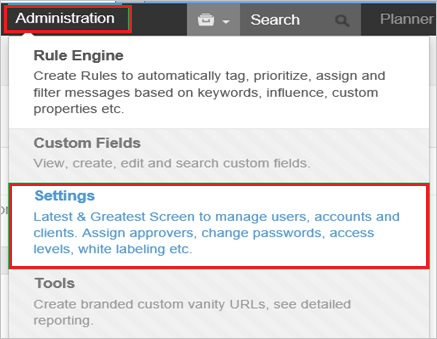
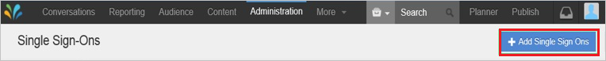
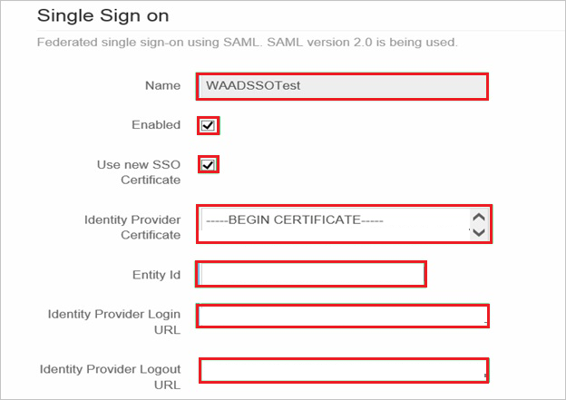
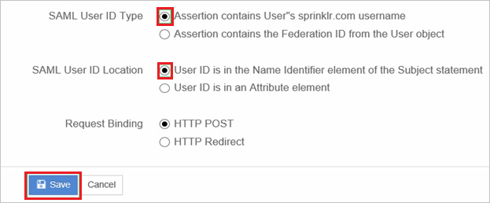
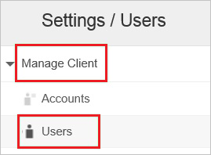
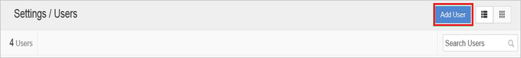
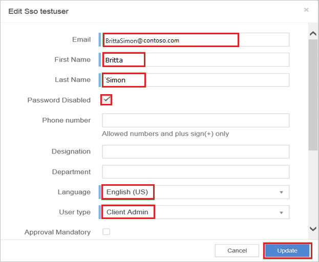
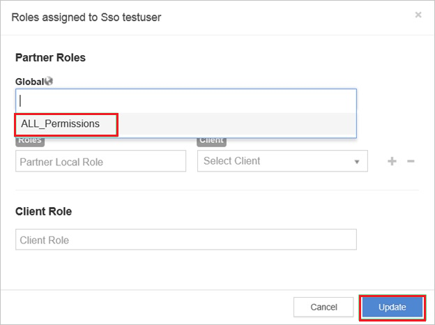

# Configure Sprinklr for Single sign-on with Microsoft Entra ID

In this article,  you learn how to integrate Sprinklr with Microsoft Entra ID. When you integrate Sprinklr with Microsoft Entra ID, you can:

* Control in Microsoft Entra ID who has access to Sprinklr.
* Enable your users to be automatically signed-in to Sprinklr with their Microsoft Entra accounts.
* Manage your accounts in one central location.

## Prerequisites
The scenario outlined in this article assumes that you already have the following prerequisites:

[!INCLUDE [common-prerequisites.md](~/identity/saas-apps/includes/common-prerequisites.md)]
* Sprinklr single sign-on (SSO) enabled subscription.

## Scenario description

In this article,  you configure and test Microsoft Entra single sign-on in a test environment.

* Sprinklr supports **SP** initiated SSO.

## Add Sprinklr from the gallery

To configure the integration of Sprinklr into Microsoft Entra ID, you need to add Sprinklr from the gallery to your list of managed SaaS apps.

1. Sign in to the [Microsoft Entra admin center](https://entra.microsoft.com) as at least a [Cloud Application Administrator](~/identity/role-based-access-control/permissions-reference.md#cloud-application-administrator).
1. Browse to **Entra ID** > **Enterprise apps** > **New application**.
1. In the **Add from the gallery** section, type **Sprinklr** in the search box.
1. Select **Sprinklr** from results panel and then add the app. Wait a few seconds while the app is added to your tenant.

 Alternatively, you can also use the [Enterprise App Configuration Wizard](https://portal.office.com/AdminPortal/home?Q=Docs#/azureadappintegration). In this wizard, you can add an application to your tenant, add users/groups to the app, assign roles, and walk through the SSO configuration as well. [Learn more about Microsoft 365 wizards.](/microsoft-365/admin/misc/azure-ad-setup-guides)

## Configure and test Microsoft Entra SSO for Sprinklr

Configure and test Microsoft Entra SSO with Sprinklr using a test user called **B.Simon**. For SSO to work, you need to establish a link relationship between a Microsoft Entra user and the related user in Sprinklr.

To configure and test Microsoft Entra SSO with Sprinklr, perform the following steps:

1. **[Configure Microsoft Entra SSO](#configure-azure-ad-sso)** - to enable your users to use this feature.
    1. **Create a Microsoft Entra test user** - to test Microsoft Entra single sign-on with B.Simon.
    1. **Assign the Microsoft Entra test user** - to enable B.Simon to use Microsoft Entra single sign-on.
1. **[Configure Sprinklr SSO](#configure-sprinklr-sso)** - to configure the single sign-on settings on application side.
    1. **[Create Sprinklr test user](#create-sprinklr-test-user)** - to have a counterpart of B.Simon in Sprinklr that's linked to the Microsoft Entra representation of user.
1. **[Test SSO](#test-sso)** - to verify whether the configuration works.

## Configure Microsoft Entra SSO

Follow these steps to enable Microsoft Entra SSO.

1. Sign in to the [Microsoft Entra admin center](https://entra.microsoft.com) as at least a [Cloud Application Administrator](~/identity/role-based-access-control/permissions-reference.md#cloud-application-administrator).
1. Browse to **Entra ID** > **Enterprise apps** > **Sprinklr** > **Single sign-on**.
1. On the **Select a single sign-on method** page, select **SAML**.
1. On the **Set up single sign-on with SAML** page, select the pencil icon for **Basic SAML Configuration** to edit the settings.

   

1. On the **Basic SAML Configuration** section, perform the following steps:

	1. In the **Sign on URL** text box, type a URL using the following pattern:
    `https://<SUBDOMAIN>.sprinklr.com`

    1. In the **Identifier (Entity ID)** text box, type a URL using the following pattern:
    `https://<SUBDOMAIN>.sprinklr.com`

	> [!NOTE]
	> These values aren't real. Update these values with the actual Sign on URL and Identifier. Contact [Sprinklr Client support team](https://www.sprinklr.com/contact-us/) to get these values. You can also refer to the patterns shown in the **Basic SAML Configuration** section.

1. On the **Set up Single Sign-On with SAML** page, in the **SAML Signing Certificate** section, select **Download** to download the **Certificate (Base64)** from the given options as per your requirement and save it on your computer.

	

1. On the **Set up Sprinklr** section, copy the appropriate URL(s) as per your requirement.

	

[!INCLUDE [create-assign-users-sso.md](~/identity/saas-apps/includes/create-assign-users-sso.md)]

## Configure Sprinklr SSO

1. In a different web browser window, log in to your Sprinklr company site as an administrator.

1. Go to **Administration** > **Settings**.

    

1. Go to **Manage Partner** > **Single Sign** on from the left pane.

    

1. Select **+Add Single Sign Ons**.

    

1. On the **Single Sign on** page, perform the following steps:

    

    1. In the **Name** textbox, type a name for your configuration (for example: **WAADSSOTest**).

    1. Select **Enabled**.

    1. Select **Use new SSO Certificate**.

    1. Open your base-64 encoded certificate in notepad, copy the content of it into your clipboard, and then paste it to the **Identity Provider Certificate** textbox.

    1. Paste the **Microsoft Entra Identifier** value which you have into the **Entity Id** textbox.

    1. Paste the **Login URL** value which you have into the **Identity Provider Login URL** textbox.

    1. Paste the **Logout URL** value which you have into the **Identity Provider Logout URL** textbox.

    1. As **SAML User ID Type**, select **Assertion contains User’s sprinklr.com username**.

    1. As **SAML User ID Location**, select **User ID is in the Name Identifier element of the Subject statement**.

    1. Select **Save**.

    

### Create Sprinklr test user

1. Log in to your Sprinklr company site as an administrator.

1. Go to **Administration** > **Settings**.

    

1. Go to **Manage Client** > **Users** from the left pane.

    

1. Select **Add User**.

    

1. On the **Edit user** dialog, perform the following steps:

    

    1. In the **Email**, **First Name** and **Last Name** textboxes, type the information of a Microsoft Entra user account you want to provision.

    1. Select **Password Disabled**.

    1. Select **Language**.

    1. Select **User Type**.

    1. Select **Update**.

    > [!IMPORTANT]
    > **Password Disabled** must be selected to enable a user to log in via an Identity provider. 

1. Go to **Role**, and then perform the following steps:

    

    1. From the **Global** list, select **ALL_Permissions**.  

    1. Select **Update**.

> [!NOTE]
> You can use any other Sprinklr user account creation tools or APIs provided by Sprinklr to provision Microsoft Entra user accounts.

## Test SSO

In this section, you test your Microsoft Entra single sign-on configuration with following options. 

* Select **Test this application**, this option redirects to Sprinklr Sign-on URL where you can initiate the login flow. 

* Go to Sprinklr Sign-on URL directly and initiate the login flow from there.

* You can use Microsoft My Apps. When you select the Sprinklr tile in the My Apps, this option redirects to Sprinklr Sign-on URL. For more information about the My Apps, see [Introduction to the My Apps](https://support.microsoft.com/account-billing/sign-in-and-start-apps-from-the-my-apps-portal-2f3b1bae-0e5a-4a86-a33e-876fbd2a4510).

## Related content

Once you configure Sprinklr you can enforce session control, which protects exfiltration and infiltration of your organization’s sensitive data in real time. Session control extends from Conditional Access. [Learn how to enforce session control with Microsoft Defender for Cloud Apps](/cloud-app-security/proxy-deployment-aad).
