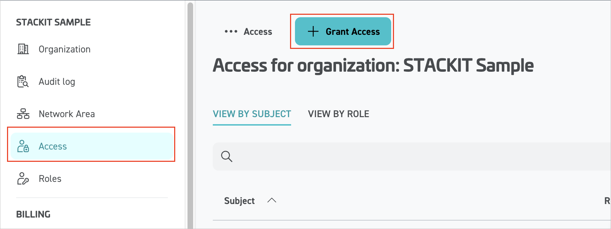

# Configure STACKIT Cloud for single sign-on with Microsoft Entra ID

In this article, you learn how to integrate STACKIT Cloud with Microsoft Entra ID. When you integrate STACKIT Cloud with Microsoft Entra ID, you can:

* Control in Microsoft Entra ID who has access to STACKIT Cloud.
* Enable your users to be automatically signed-in to STACKIT Cloud with their Microsoft Entra accounts.
* Manage your accounts in one central location.

## Prerequisites

The scenario outlined in this article assumes that you already have the following prerequisites:

* [!INCLUDE [common-prerequisites.md](~/identity/saas-apps/includes/common-prerequisites.md)]
* STACKIT Cloud single sign-on (SSO) enabled subscription.

## Scenario description

In this article, you configure and test Microsoft Entra SSO in a test environment.

STACKIT Cloud supports **SP** initiated SSO.

## Add STACKIT Cloud from the gallery

To configure the integration of STACKIT Cloud into Microsoft Entra ID, you need to add STACKIT Cloud from the gallery to your list of managed SaaS apps.

1. Sign in to the [Microsoft Entra admin center](https://entra.microsoft.com) as at least a [Cloud Application Administrator](~/identity/role-based-access-control/permissions-reference.md#cloud-application-administrator).
1. Browse to **Entra ID** > **Enterprise apps** > **New application**.
1. In the **Add from the gallery** section, enter **STACKIT Cloud** in the search box.
1. Select **STACKIT Cloud** from the results panel and then add the app. Wait a few seconds while the app is added to your tenant.

 [!INCLUDE [sso-wizard.md](~/identity/saas-apps/includes/sso-wizard.md)]

## Configure and test Microsoft Entra SSO for STACKIT Cloud

Configure and test Microsoft Entra SSO with STACKIT Cloud using a test user called **B.Simon**. For SSO to work, you need to establish a link relationship between a Microsoft Entra user and the related user in STACKIT Cloud based on the email.

To configure and test Microsoft Entra SSO with STACKIT Cloud, perform the following steps:

1. **[Configure Microsoft Entra SSO](#configure-microsoft-entra-sso)** - to enable your users to use this feature.
    1. **Create a Microsoft Entra test user** - to test Microsoft Entra single sign-on with B.Simon.
    1. **Assign the Microsoft Entra test user** - to enable B.Simon to use Microsoft Entra single sign-on.
1. **[Configure STACKIT Cloud SSO](#configure-stackit-cloud-sso)** - to configure the single sign-on settings on application side.
    1. **[Create STACKIT Cloud test user](#create-stackit-cloud-test-user)** - to have a counterpart of B.Simon in STACKIT Cloud that's linked to the Microsoft Entra representation of user.
1. **[Test SSO](#test-sso)** - to verify whether the configuration works.

## Configure Microsoft Entra SSO

Follow these steps to enable Microsoft Entra SSO.

1. Sign in to the [Microsoft Entra admin center](https://entra.microsoft.com) as at least a [Cloud Application Administrator](~/identity/role-based-access-control/permissions-reference.md#cloud-application-administrator).
1. Browse to **Entra ID** > **Enterprise apps** > **STACKIT Cloud** > **Single sign-on**.
1. On the **Select a single sign-on method** page, select **SAML**.
1. On the **Set up single sign-on with SAML** page, select the pencil icon for **Basic SAML Configuration** to edit the settings.

    

1. On the **Basic SAML Configuration** section, perform the following steps:

	a. In the **Sign on URL** text box, type the URL:
    `https://portal.stackit.cloud`

    b. In the **Identifier (Entity ID)** text box, type a URL using the following pattern:
    `https://accounts.stackit.cloud/idps/*/saml/metadata`

    c. In the **Reply URL** text box, type the URL:
    `https://accounts.stackit.cloud/ui/login/login/externalidp/saml/acs`

	> [!NOTE]
	> The Identifier value isn't real. Update the value with the actual Identifier, which is obtained from the STACKIT during the federated directory setup process.

1. On the **Set up single sign-on with SAML** page, in the **SAML Signing Certificate** section, select the copy button to copy **App Federation Metadata URL** and save it on your computer.

    

1. On the **Set up STACKIT Cloud** section, copy the appropriate URL(s) based on your requirement.

    
    
### Create and assign Microsoft Entra test user
    
Follow the guidelines in the [create and assign a user account](~/identity/enterprise-apps/add-application-portal-assign-users.md) quickstart to create a test user account called B.Simon.

## Configure STACKIT Cloud SSO

To configure STACKIT Cloud SSO, go to the STACKIT Portal and open a support ticket with the following information:

1. Select **Federation type** as SAML 2.0 with Microsoft Entra ID.
1. Provide the **Reason for integration** with brief explanation (for example, “Enable SSO for enterprise users”).
1. Enter the **Email domains** with all email domains your employees use for login (for example, @example.org and @foobar.com).
1. Enter the **IdP metadata URL** as a publicly accessible URL to your IdP’s metadata file. The system uses this URL to automatically retrieve configuration details such as endpoints and certificates.

> [!NOTE]
> The downloaded file is also enough to configure the federation on STACKIT side.

After you provide the required information, STACKIT support team configures the federation. Then, they provide you with a unique SAML metadata URL for the STACKIT IdP.

### Create STACKIT Cloud test user

On the **Organization** page, select **Grant Access** to invite the user into the organization. Enter the email address of the user in Microsoft Entra ID.

## Test SSO

In this section, you test your Microsoft Entra single sign-on configuration with the following options.

* Select **Test this application**, this option redirects to STACKIT Cloud Sign-on URL where you can initiate the login flow.

* Go to STACKIT Cloud Sign-on URL directly and initiate the login flow from there.

* You can use Microsoft My Apps. When you select the STACKIT Cloud tile in the My Apps, this option redirects to STACKIT Cloud Sign-on URL. For more information about the My Apps, see [Introduction to the My Apps](https://support.microsoft.com/account-billing/sign-in-and-start-apps-from-the-my-apps-portal-2f3b1bae-0e5a-4a86-a33e-876fbd2a4510).

## Related content

Once you configure STACKIT Cloud, you can enforce session control, which protects exfiltration and infiltration of your organization’s sensitive data in real time. Session control extends from Conditional Access. [Learn how to enforce session control with Microsoft Defender for Cloud Apps](/cloud-app-security/proxy-deployment-any-app).
