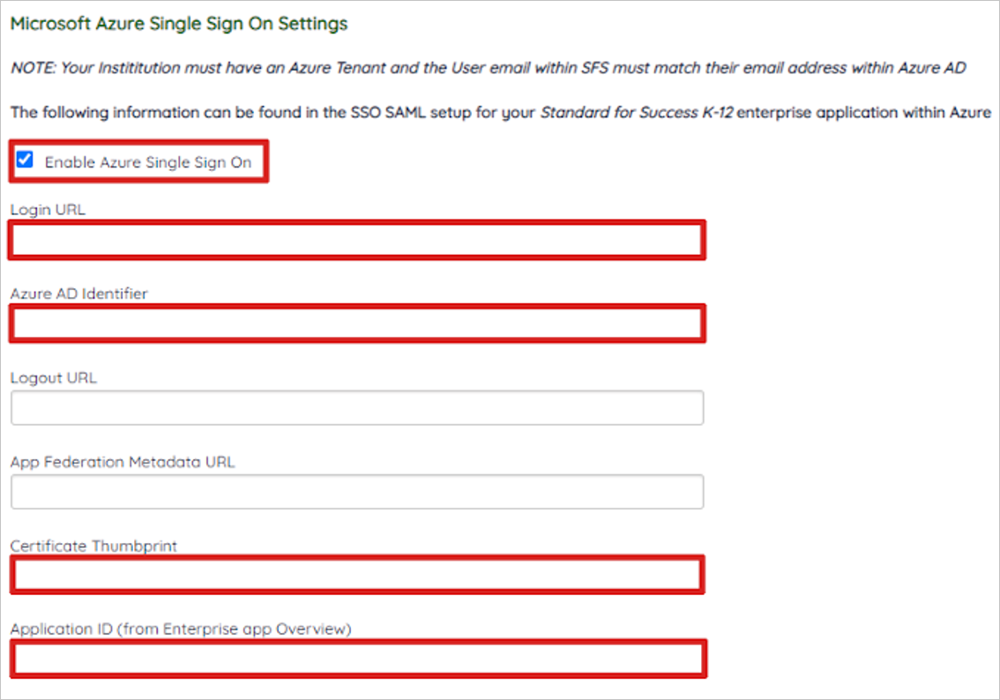
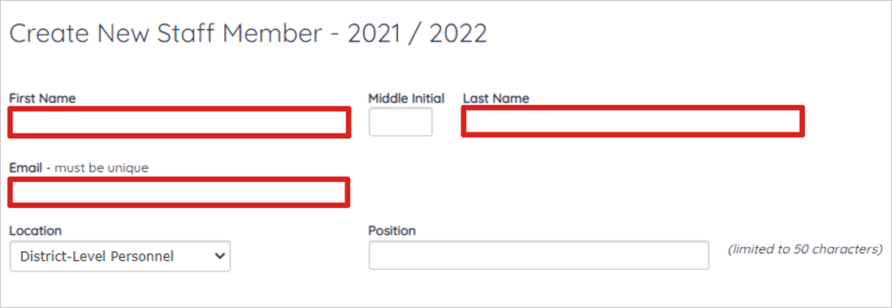

# Configure Standard for Success K-12 for Single sign-on with Microsoft Entra ID

In this article,  you learn how to integrate Standard for Success K-12 with Microsoft Entra ID. When you integrate Standard for Success K-12 with Microsoft Entra ID, you can:

* Control in Microsoft Entra ID who has access to Standard for Success K-12.
* Enable your users to be automatically signed-in to Standard for Success K-12 with their Microsoft Entra accounts.
* Manage your accounts in one central location.

## Prerequisites

To get started, you need the following items:

* A Microsoft Entra subscription. If you don't have a subscription, you can get a [free account](https://azure.microsoft.com/free/).
* Standard for Success K-12 single sign-on (SSO) enabled subscription.
* Along with Cloud Application Administrator, Application Administrator can also add or manage applications in Microsoft Entra ID.
For more information, see [Azure built-in roles](~/identity/role-based-access-control/permissions-reference.md).

## Scenario description

In this article,  you configure and test Microsoft Entra SSO in a test environment.

* Standard for Success K-12 supports **SP** and **IDP** initiated SSO.

## Add Standard for Success K-12 from the gallery

To configure the integration of Standard for Success K-12 into Microsoft Entra ID, you need to add Standard for Success K-12 from the gallery to your list of managed SaaS apps.

1. Sign in to the [Microsoft Entra admin center](https://entra.microsoft.com) as at least a [Cloud Application Administrator](~/identity/role-based-access-control/permissions-reference.md#cloud-application-administrator).
1. Browse to **Entra ID** > **Enterprise apps** > **New application**.
1. In the **Add from the gallery** section, type **Standard for Success K-12** in the search box.
1. Select **Standard for Success K-12** from results panel and then add the app. Wait a few seconds while the app is added to your tenant.

 Alternatively, you can also use the [Enterprise App Configuration Wizard](https://portal.office.com/AdminPortal/home?Q=Docs#/azureadappintegration). In this wizard, you can add an application to your tenant, add users/groups to the app, assign roles, and walk through the SSO configuration as well. [Learn more about Microsoft 365 wizards.](/microsoft-365/admin/misc/azure-ad-setup-guides)

## Configure and test Microsoft Entra SSO for Standard for Success K-12

Configure and test Microsoft Entra SSO with Standard for Success K-12 using a test user called **B.Simon**. For SSO to work, you need to establish a link relationship between a Microsoft Entra user and the related user in Standard for Success K-12.

To configure and test Microsoft Entra SSO with Standard for Success K-12, perform the following steps:

1. **[Configure Microsoft Entra SSO](#configure-azure-ad-sso)** - to enable your users to use this feature.
    1. **Create a Microsoft Entra test user** - to test Microsoft Entra single sign-on with B.Simon.
    1. **Assign the Microsoft Entra test user** - to enable B.Simon to use Microsoft Entra single sign-on.
1. **[Configure Standard for Success K-12 SSO](#configure-standard-for-success-k-12-sso)** - to configure the single sign-on settings on application side.
    1. **[Create Standard for Success K-12 test user](#create-standard-for-success-k-12-test-user)** - to have a counterpart of B.Simon in Standard for Success K-12 that's linked to the Microsoft Entra representation of user.
1. **[Test SSO](#test-sso)** - to verify whether the configuration works.

## Configure Microsoft Entra SSO

Follow these steps to enable Microsoft Entra SSO.

1. Sign in to the [Microsoft Entra admin center](https://entra.microsoft.com) as at least a [Cloud Application Administrator](~/identity/role-based-access-control/permissions-reference.md#cloud-application-administrator).
1. Browse to **Entra ID** > **Enterprise apps** > **Standard for Success K-12** > **Single sign-on**.
1. On the **Select a single sign-on method** page, select **SAML**.
1. On the **Set up single sign-on with SAML** page, select the pencil icon for **Basic SAML Configuration** to edit the settings.

    

1. On the **Basic SAML Configuration** section, perform the following steps:

    a. In the **Identifier** text box, type a value using the following pattern: 
    `api://<ApplicationId>`

    b. In the **Reply URL** text box, type a URL using the following pattern: 
    `https://edu.standardforsuccess.com/access/mssaml_consume?did=<INSTITUTION-ID>`

1. Select **Set additional URLs** and perform the following steps if you wish to configure the application in SP initiated mode:

    a. In the **Sign-on URL** text box, type a URL using the following pattern: 
    `https://edu.standardforsuccess.com/access/mssaml_int?did=<INSTITUTION-ID>`

    b. In the **Relay State** text box, type a URL using the following pattern:
    `https://edu.standardforsuccess.com/access/mssaml_consume?did=<INSTITUTION-ID>`

    > [!Note]
    > These values aren't real. Update these values with the actual Identifier, Reply URL, Sign-on URL and Relay State. Contact [Standard for Success K-12 Client support team](mailto:help@standardforsuccess.com) to get the INSTITUTION-ID value. You can also refer to the patterns shown in the Basic SAML Configuration section.

1. In the **SAML Signing Certificate** section, select **Edit** button to open **SAML Signing Certificate** dialog.

    

1. In the **SAML Signing Certificate** section, copy the **Thumbprint Value** and save it on your computer.

        

1. On the **Set up Standard for Success K-12** section, copy the appropriate URL(s) based on your requirement.

	  

[!INCLUDE [create-assign-users-sso.md](~/identity/saas-apps/includes/create-assign-users-sso.md)]

## Configure Standard for Success K-12 SSO

1. Log in to your Standard for Success K-12 company site as an administrator with superuser access.

1. From the menu, navigate to **Utilities** > **Tools & Features**.

1.	Scroll down to **Single Sign On Settings** and select the **Microsoft Azure Single Sign On** link and perform the following steps:

    

    a. Select **Enable Azure Single Sign On** checkbox.

    b. In the **Login URL** textbox, paste the **Login URL** value which you copied previously.

    c. In the **Microsoft Entra Identifier** textbox, paste the **Microsoft Entra Identifier** value which you copied previously.
    
    d. Fill the **Application ID** in the **Application ID** text box.

    e. In the **Certificate Thumbprint** text box, paste the **Thumbprint Value** that you copied.

    f. Select **Save**.

### Create Standard for Success K-12 test user

1. In a different web browser window, log into your Standard for Success K-12 website as an administrator with superuser privileges.

1. From the menu, navigate to **Utilities** > **Accounts Manager**, then select **Create New User** and perform the following steps:

    

    a. In **First Name** text box, enter the first name of the user.

    b. In **Last Name** text box, enter the last name of the user.

    c. In **Email** text box, enter the email address which you have added within Azure.

    d. Scroll to the bottom and Select **Create User**.

## Test SSO 

In this section, you test your Microsoft Entra single sign-on configuration with following options. 

#### SP initiated:

* Select **Test this application**, this option redirects to Standard for Success K-12 Sign on URL where you can initiate the login flow.  

* Go to Standard for Success K-12 Sign-on URL directly and initiate the login flow from there.

#### IDP initiated:

* Select **Test this application**, and you should be automatically signed in to the Standard for Success K-12 for which you set up the SSO. 

You can also use Microsoft My Apps to test the application in any mode. When you select the Standard for Success K-12 tile in the My Apps, if configured in SP mode you would be redirected to the application sign on page for initiating the login flow and if configured in IDP mode, you should be automatically signed in to the Standard for Success K-12 for which you set up the SSO. For more information, see [Microsoft Entra My Apps](/azure/active-directory/manage-apps/end-user-experiences#azure-ad-my-apps).

## Related content

Once you configure Standard for Success K-12 you can enforce session control, which protects exfiltration and infiltration of your organization’s sensitive data in real time. Session control extends from Conditional Access. [Learn how to enforce session control with Microsoft Cloud App Security](/cloud-app-security/proxy-deployment-aad).
