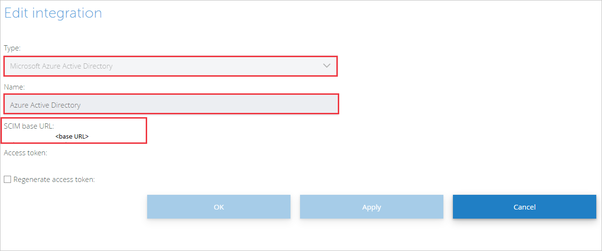

# Configure StarLeaf for automatic user provisioning with Microsoft Entra ID

The objective of this article is to demonstrate the steps to be performed in StarLeaf and Microsoft Entra ID to configure Microsoft Entra ID to automatically provision and de-provision users and/or groups to StarLeaf.

> [!NOTE]
>  This article describes a connector built on top of the Microsoft Entra user provisioning service. For important details on what this service does, how it works, and frequently asked questions, see [Automate user provisioning and deprovisioning to SaaS applications with Microsoft Entra ID](~/identity/app-provisioning/user-provisioning.md).
>
> This connector is currently in Preview. For more information about previews, see [Universal License Terms For Online Services](https://www.microsoft.com/licensing/terms/product/ForOnlineServices/all).

## Prerequisites

The scenario outlined in this article assumes that you already have the following prerequisites:

[!INCLUDE [common-prerequisites.md](~/identity/saas-apps/includes/common-prerequisites.md)].
* [A StarLeaf tenant](https://starleaf.com/).
* A user account in StarLeaf with Admin permissions.

## Assign users to StarLeaf
Microsoft Entra ID uses a concept called assignments to determine which users should receive access to selected apps. In the context of automatic user provisioning, only the users and/or groups that have been assigned to an application in Microsoft Entra ID are synchronized.

Before you configure and enable automatic user provisioning, you should decide which users and groups in Microsoft Entra ID need access to StarLeaf. Then you can assign the users and groups to StarLeaf by following [these instructions](~/identity/enterprise-apps/assign-user-or-group-access-portal.md).

## Important tips for assigning users to StarLeaf

* It's recommended that a single Microsoft Entra user is assigned to StarLeaf to test the automatic user provisioning configuration. More users and groups can be assigned later.

* When you assign a user to StarLeaf, you must select any valid application-specific role (if available) in the assignment dialog. Users with the Default Access role are excluded from provisioning.

## Set up StarLeaf for provisioning

Before you configure StarLeaf for automatic user provisioning with Microsoft Entra ID, you need to configure SCIM provisioning in StarLeaf:

1. Sign in to your StarLeaf Admin Console. Navigate to **Integrations** > **Add integration**.

	

2. Select the **Type** to be Microsoft Entra ID. Enter a suitable name in **Name**. Select **Apply**.

	

3.  The **SCIM base URL** and **Access token** values are then displayed. These values are entered in the **Tenant URL** and **Secret Token** fields in the Provisioning tab of your StarLeaf application. 

	

## Add StarLeaf from the gallery

To configuring StarLeaf for automatic user provisioning with Microsoft Entra ID, you need to add StarLeaf from the Microsoft Entra application gallery to your list of managed SaaS applications.

**To add StarLeaf from the Microsoft Entra application gallery, perform the following steps:**

1. Sign in to the [Microsoft Entra admin center](https://entra.microsoft.com) as at least a [Cloud Application Administrator](~/identity/role-based-access-control/permissions-reference.md#cloud-application-administrator).
1. Browse to **Entra ID** > **Enterprise apps** > **New application**.
1. In the **Add from the gallery** section, type **StarLeaf**, select **StarLeaf** in the results panel.
	

## Configure automatic user provisioning to StarLeaf

This section guides you through the steps to configure the Microsoft Entra provisioning service to create, update, and disable users and/or groups in StarLeaf based on user and/or group assignments in Microsoft Entra ID.

1. Sign in to the [Microsoft Entra admin center](https://entra.microsoft.com) as at least a [Cloud Application Administrator](~/identity/role-based-access-control/permissions-reference.md#cloud-application-administrator).
1. Browse to **Entra ID** > **Enterprise apps**

	

1. In the applications list, select **StarLeaf**.

	

3. Select the **Provisioning** tab.

	

4. Set the **Provisioning Mode** to **Automatic**.

	

5. Under the Admin Credentials section, input the **SCIM Base URL** and **Access Token** values retrieved earlier in **Tenant URL** and **Secret Token** respectively. Select **Test Connection** to ensure Microsoft Entra ID can connect to StarLeaf. If the connection fails, ensure your StarLeaf account has Admin permissions and try again.

	

6. In the **Notification Email** field, enter the email address of a person or group who should receive the provisioning error notifications and check the **Send an email notification when a failure occurs** box.

	

7. Select **Save**.

8. Under the **Mappings** section, select **Synchronize Microsoft Entra users to StarLeaf**.

9. Review the user attributes that are synchronized from Microsoft Entra ID to StarLeaf in the **Attribute Mapping** section. The attributes selected as **Matching** properties are used to match the user accounts in StarLeaf for update operations. Select the **Save** button to commit any changes.

	

10. To configure scoping filters, refer to the following instructions provided in the [Scoping filter  article](~/identity/app-provisioning/define-conditional-rules-for-provisioning-user-accounts.md).

11. To enable the Microsoft Entra provisioning service for StarLeaf, change the **Provisioning Status** to **On** in the **Settings** section.

	

12. Define the users and/or groups that you would like to provision to StarLeaf by choosing the desired values in **Scope** in the **Settings** section.

	

13. When you're ready to provision, select **Save**.

	

This operation starts the initial synchronization of all users and/or groups defined in **Scope** in the **Settings** section. The initial sync takes longer to perform than subsequent syncs, which occur approximately every 40 minutes as long as the Microsoft Entra provisioning service is running. You can use the **Synchronization Details** section to monitor progress and follow links to provisioning activity report, which describes all actions performed by the Microsoft Entra provisioning service on StarLeaf.

For more information on how to read the Microsoft Entra provisioning logs, see [Reporting on automatic user account provisioning](~/identity/app-provisioning/check-status-user-account-provisioning.md)

## Connector limitations

* StarLeaf doesn't currently support group provisioning. 
* StarLeaf requires **email** and **userName** values to have the same source value.

## More resources

* [Manage user account provisioning for enterprise apps](~/identity/app-provisioning/configure-automatic-user-provisioning-portal.md)
* [What is application access and single sign-on with Microsoft Entra ID?](~/identity/enterprise-apps/what-is-single-sign-on.md)

## Related content

* Learn how to [review logs and get reports on provisioning activity](~/identity/app-provisioning/check-status-user-account-provisioning.md).
