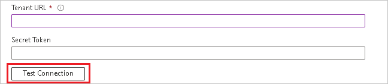

# Configure Starmind for automatic user provisioning with Microsoft Entra ID

This article describes the steps you need to perform in both Starmind and Microsoft Entra ID to configure automatic user provisioning. When configured, Microsoft Entra ID automatically provisions and deprovisions users to [Starmind](https://www.starmind.com/) using the Microsoft Entra provisioning service. For important details on what this service does, how it works, and frequently asked questions, see [Automate user provisioning and deprovisioning to SaaS applications with Microsoft Entra ID](~/identity/app-provisioning/user-provisioning.md). 

## Supported capabilities
> [!div class="checklist"]
> * Create users in Starmind.
> * Remove users in Starmind when they don't require access anymore.
> * Keep user attributes synchronized between Microsoft Entra ID and Starmind.
> * [Single sign-on](starmind-tutorial.md) to Starmind (recommended).

## Prerequisites

The scenario outlined in this article assumes that you already have the following prerequisites:

* [A Microsoft Entra tenant](~/identity-platform/quickstart-create-new-tenant.md) 
* One of the following roles: [Application Administrator](/entra/identity/role-based-access-control/permissions-reference#application-administrator), [Cloud Application Administrator](/entra/identity/role-based-access-control/permissions-reference#cloud-application-administrator), or [Application Owner](/entra/fundamentals/users-default-permissions#owned-enterprise-applications).
* A user account in Starmind with at least User Admin permissions.

## Plan your provisioning deployment

* Learn about [how the provisioning service works](~/identity/app-provisioning/user-provisioning.md).
* Determine who's in [scope for provisioning](~/identity/app-provisioning/define-conditional-rules-for-provisioning-user-accounts.md).
* Determine what data to [map between Microsoft Entra ID and Starmind](~/identity/app-provisioning/customize-application-attributes.md).

## Configure Starmind to support provisioning with Microsoft Entra ID

Contact [Starmind support](https://starmind.atlassian.net/servicedesk/customer/portal/2) to open a service request to enable Starmind to support provisioning with Microsoft Entra ID. Ensure to provide the Starmind network domain (such as acme.starmind.com) you want to enable user provisioning for. You then get provided with the Tenant URL and Secret Token for authorization.

## Starmind from the Microsoft Entra application gallery

Add Starmind from the Microsoft Entra application gallery to start managing provisioning to Starmind. If you have previously setup Starmind for SSO, you can use the same application. However it's recommended that you create a separate app when testing out the integration initially. Learn more about adding an application from the gallery [here](~/identity/enterprise-apps/add-application-portal.md). 

## Define who is in scope for provisioning 

[!INCLUDE [create-assign-users-provisioning.md](~/identity/saas-apps/includes/create-assign-users-provisioning.md)]

## Configure automatic user provisioning to Starmind 

This section guides you through the steps to configure the Microsoft Entra provisioning service to create, update, and disable users in Starmind based on user assignments in Microsoft Entra ID.

### To configure automatic user provisioning for Starmind in Microsoft Entra ID:

1. Sign in to the [Microsoft Entra admin center](https://entra.microsoft.com) as at least a [Cloud Application Administrator](~/identity/role-based-access-control/permissions-reference.md#cloud-application-administrator).
1. Browse to **Entra ID** > **Enterprise apps**

	

1. In the applications list, select **Starmind**.

	

1. Select the **Provisioning** tab.

	

1. Set the **Provisioning Mode** to **Automatic**.

	

1. Under the **Admin Credentials** section, input your Starmind Tenant URL and Secret Token. Select **Test Connection** to ensure Microsoft Entra ID can connect to Starmind. If the connection fails, ensure your Starmind account has Admin permissions and try again.

 	

1. In the **Notification Email** field, enter the email address of a person who should receive the provisioning error notifications and select the **Send an email notification when a failure occurs** check box.

	

1. Select **Save**.

1. Under the **Mappings** section, select **Synchronize Microsoft Entra users to Starmind**.

1. Review the user attributes that are synchronized from Microsoft Entra ID to Starmind in the **Attribute-Mapping** section. The attributes selected as **Matching** properties are used to match the user accounts in Starmind for update operations. If you choose to change the [matching target attribute](~/identity/app-provisioning/customize-application-attributes.md), you need to ensure that the Starmind API supports filtering users based on that attribute. Select the **Save** button to commit any changes.

   |Attribute|Type|Supported for filtering|Required by Starmind|
   |---|---|---|---|
   |userName|String|&check;|&check;
   |active|Boolean||
   |title|String||
   |emails[type eq "work"].value|String|&check;|&check;
   |name.givenName|String||
   |name.familyName|String||
   |urn:ietf:params:scim:schemas:extension:enterprise:2.0:User:organization|String||
   |urn:ietf:params:scim:schemas:extension:enterprise:2.0:User:department|String||

1. To configure scoping filters, refer to the following instructions provided in the [Scoping filter  article](~/identity/app-provisioning/define-conditional-rules-for-provisioning-user-accounts.md).

1. To enable the Microsoft Entra provisioning service for Starmind, change the **Provisioning Status** to **On** in the **Settings** section.

	

1. Define the users that you would like to provision to Starmind by choosing the desired values in **Scope** in the **Settings** section.

	

1. When you're ready to provision, select **Save**.

	

This operation starts the initial synchronization cycle of all users defined in **Scope** in the **Settings** section. The initial cycle takes longer to perform than subsequent cycles, which occur approximately every 40 minutes as long as the Microsoft Entra provisioning service is running. 

## Monitor your deployment

[!INCLUDE [monitor-deployment.md](~/identity/saas-apps/includes/monitor-deployment.md)]

## More resources

* [Managing user account provisioning for Enterprise Apps](~/identity/app-provisioning/configure-automatic-user-provisioning-portal.md)
* [What is application access and single sign-on with Microsoft Entra ID?](~/identity/enterprise-apps/what-is-single-sign-on.md)

## Related content

* [Learn how to review logs and get reports on provisioning activity](~/identity/app-provisioning/check-status-user-account-provisioning.md)
