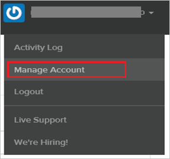
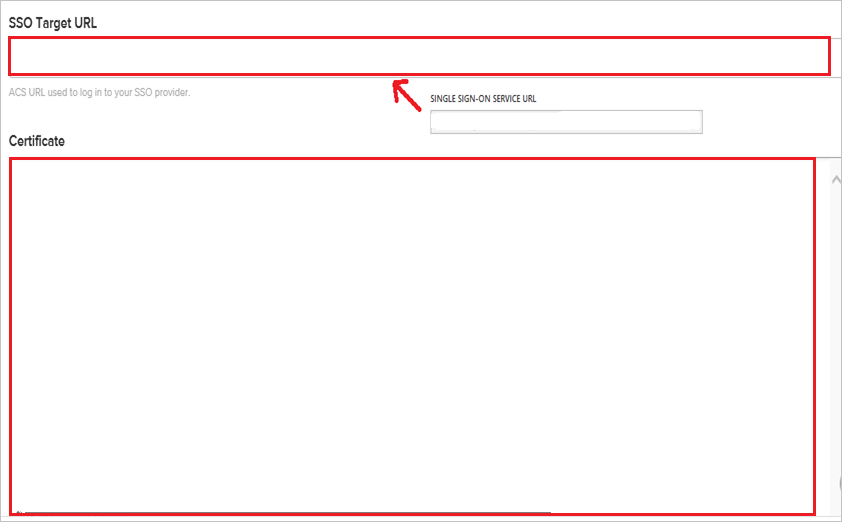

# Configure StatusPage for Single sign-on with Microsoft Entra ID

In this article,  you learn how to integrate StatusPage with Microsoft Entra ID. When you integrate StatusPage with Microsoft Entra ID, you can:

* Control in Microsoft Entra ID who has access to StatusPage.
* Enable your users to be automatically signed-in to StatusPage with their Microsoft Entra accounts.
* Manage your accounts in one central location.

## Prerequisites
The scenario outlined in this article assumes that you already have the following prerequisites:

[!INCLUDE [common-prerequisites.md](~/identity/saas-apps/includes/common-prerequisites.md)]
* StatusPage single sign-on enabled subscription.

## Scenario description

In this article,  you configure and test Microsoft Entra single sign-on in a test environment.

* StatusPage supports **IDP** initiated SSO.

## Add StatusPage from the gallery

To configure the integration of StatusPage into Microsoft Entra ID, you need to add StatusPage from the gallery to your list of managed SaaS apps.

1. Sign in to the [Microsoft Entra admin center](https://entra.microsoft.com) as at least a [Cloud Application Administrator](~/identity/role-based-access-control/permissions-reference.md#cloud-application-administrator).
1. Browse to **Entra ID** > **Enterprise apps** > **New application**.
1. In the **Add from the gallery** section, type **StatusPage** in the search box.
1. Select **StatusPage** from results panel and then add the app. Wait a few seconds while the app is added to your tenant.

 Alternatively, you can also use the [Enterprise App Configuration Wizard](https://portal.office.com/AdminPortal/home?Q=Docs#/azureadappintegration). In this wizard, you can add an application to your tenant, add users/groups to the app, assign roles, and walk through the SSO configuration as well. [Learn more about Microsoft 365 wizards.](/microsoft-365/admin/misc/azure-ad-setup-guides)

## Configure and test Microsoft Entra SSO for StatusPage

In this section, you configure and test Microsoft Entra single sign-on with StatusPage based on a test user called **Britta Simon**.
For single sign-on to work, a link relationship between a Microsoft Entra user and the related user in StatusPage needs to be established.

To configure and test Microsoft Entra SSO with StatusPage, perform the following steps:

1. **[Configure Microsoft Entra SSO](#configure-azure-ad-sso)** - to enable your users to use this feature.
    1. **Create a Microsoft Entra test user** - to test Microsoft Entra single sign-on with Britta Simon.
    1. **Assign the Microsoft Entra test user** - to enable Britta Simon to use Microsoft Entra single sign-on.
1. **[Configure StatusPage SSO](#configure-statuspage-sso)** - to configure the Single Sign-On settings on application side.
    1. **[Create StatusPage test user](#create-statuspage-test-user)** - to have a counterpart of Britta Simon in StatusPage that's linked to the Microsoft Entra representation of user.
6. **[Test SSO](#test-sso)** - to verify whether the configuration works.

## Configure Microsoft Entra SSO

Follow these steps to enable Microsoft Entra SSO.

1. Sign in to the [Microsoft Entra admin center](https://entra.microsoft.com) as at least a [Cloud Application Administrator](~/identity/role-based-access-control/permissions-reference.md#cloud-application-administrator).
1. Browse to **Entra ID** > **Enterprise apps** > **AskYourTeam** > **Single sign-on**.
1. On the **Select a single sign-on method** page, select **SAML**.
1. On the **Set up single sign-on with SAML** page, select the pencil icon for **Basic SAML Configuration** to edit the settings.

   

1. On the **Set up Single Sign-On with SAML** page, perform the following steps:

    a. In the **Identifier** text box, type a URL using one of the following patterns:

    | Identifier |
    |--------------|
    | `https://<subdomain>.statuspagestaging.com/` |
    | `https://<subdomain>.statuspage.io/` |
    |

    b. In the **Reply URL** text box, type a URL using one of the following patterns:

     | Reply URL |
    |--------------|
    | `https://<subdomain>.statuspagestaging.com/sso/saml/consume` |
    | `https://<subdomain>.statuspage.io/sso/saml/consume` |
    |

    > [!NOTE]
    > Contact the StatusPage support team at [SupportTeam@statuspage.io](mailto:SupportTeam@statuspage.io)to request metadata necessary to configure single sign-on. 
    >
    > a. From the metadata, copy the Issuer value, and then paste it into the **Identifier** textbox.
    >
    > b. From the metadata, copy the Reply URL, and then paste it into the **Reply URL** textbox.

1. On the **Set up Single Sign-On with SAML** page, in the **SAML Signing Certificate** section, select **Download** to download the **Certificate (Base64)** from the given options as per your requirement and save it on your computer.

	

1. On the **Set up StatusPage** section, copy the appropriate URL(s) as per your requirement.

	

[!INCLUDE [create-assign-users-sso.md](~/identity/saas-apps/includes/create-assign-users-sso.md)]

## Configure StatusPage SSO

1. In a different web browser window, sign in to your StatusPage company site as an administrator

1. In the main toolbar, select **Manage Account**.

    

1. Select the **Single Sign-on** tab.

1. On the SSO Setup page, perform the following steps:

    

    

    a. In the **SSO Target URL** textbox, paste the value of **Login URL**.

    b. Open your downloaded certificate in Notepad, copy the content, and then paste it into the **Certificate** textbox.

    c. Select **SAVE CONFIGURATION**.

### Create StatusPage test user

The objective of this section is to create a user called Britta Simon in StatusPage.

StatusPage supports just-in-time provisioning. You have already enabled it in [Configure Microsoft Entra Single Sign-On](#configure-azure-ad-sso).

**To create a user called Britta Simon in StatusPage, perform the following steps:**

1. Sign-on to your StatusPage company site as an administrator.

1. In the menu on the top, select **Manage Account**.

	

1. Select the **Team Members** tab.

1. Select **ADD TEAM MEMBER**.
  
     

1. Type the **Email Address**, **First Name**, and **Surname** of a valid user you want to provision into the related textboxes.

1. As **Role**, choose **Client Administrator**.

1. Select **CREATE ACCOUNT**.

## Test SSO

In this section, you test your Microsoft Entra single sign-on configuration with following options.

* Select **Test this application**, and you should be automatically signed in to the StatusPage for which you set up the SSO

* You can use Microsoft My Apps. When you select the StatusPage tile in the My Apps, you should be automatically signed in to the StatusPage for which you set up the SSO. For more information about the My Apps, see [Introduction to the My Apps](https://support.microsoft.com/account-billing/sign-in-and-start-apps-from-the-my-apps-portal-2f3b1bae-0e5a-4a86-a33e-876fbd2a4510).

## Related content

Once you configure StatusPage you can enforce session control, which protects exfiltration and infiltration of your organization’s sensitive data in real time. Session control extends from Conditional Access. [Learn how to enforce session control with Microsoft Defender for Cloud Apps](/cloud-app-security/proxy-deployment-any-app).
