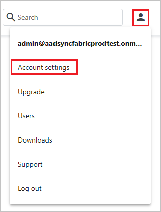
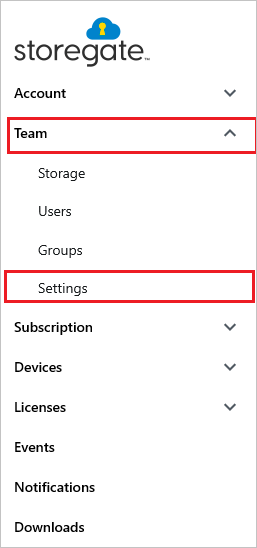
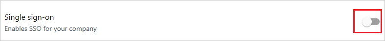
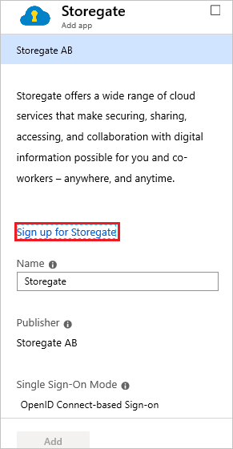
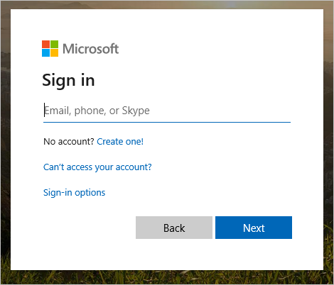

# Configure Storegate for automatic user provisioning with Microsoft Entra ID

The objective of this article is to demonstrate the steps to be performed in Storegate and Microsoft Entra ID to configure Microsoft Entra ID to automatically provision and de-provision users and/or groups to Storegate.

> [!NOTE]
> This article describes a connector built on top of the Microsoft Entra user provisioning service. For important details on what this service does, how it works, and frequently asked questions, see [Automate user provisioning and deprovisioning to SaaS applications with Microsoft Entra ID](~/identity/app-provisioning/user-provisioning.md).
>

## Prerequisites

The scenario outlined in this article assumes that you already have the following prerequisites:

* [!INCLUDE [common-prerequisites.md](~/identity/saas-apps/includes/common-prerequisites.md)]
* [A Storegate tenant](https://www.storegate.com)
* A user account on a Storegate with Administrator permissions.

## Step 1: Assign users to Storegate

Microsoft Entra ID uses a concept called assignments to determine which users should receive access to selected apps. In the context of automatic user provisioning, only the users and/or groups that have been assigned to an application in Microsoft Entra ID are synchronized.

Before configuring and enabling automatic user provisioning, you should decide which users and/or groups in Microsoft Entra ID need access to Storegate. Once decided, you can assign these users and/or groups to Storegate by following the instructions [Assign a user or group to an enterprise app](~/identity/enterprise-apps/assign-user-or-group-access-portal.md).

### Important tips for assigning users to Storegate

* It's recommended that a single Microsoft Entra user is assigned to Storegate to test the automatic user provisioning configuration. Additional users and/or groups may be assigned later.

* When assigning a user to Storegate, you must select any valid application-specific role (if available) in the assignment dialog. Users with the **Default Access** role are excluded from provisioning.

## Step 2: Set up Storegate for provisioning

Before configuring Storegate for automatic user provisioning with Microsoft Entra ID, you need to retrieve some provisioning information from Storegate.

1. Sign in to your [Storegate Admin Console](https://ws1.storegate.com/identity/core/login?signin=c71fb8fe18243c571da5b333d5437367) and navigate to the settings by selecting the user icon in the upper right corner and select **Account Settings**.

	

1. Within settings navigate to **Team > Settings** and verify that the toggle switch is switched on in the **Single sign-on** section.

	

	

1. Copy the **Tenant URL** and **Token**. These values are entered in the **Tenant URL** and **Secret Token** fields respectively in the Provisioning tab of your Storegate application. 

## Step 3: Add Storegate from the gallery

To configure Storegate for automatic user provisioning with Microsoft Entra ID, you need to add Storegate from the Microsoft Entra application gallery to your list of managed SaaS applications.

1. Sign in to the [Microsoft Entra admin center](https://entra.microsoft.com) as at least a [Cloud Application Administrator](~/identity/role-based-access-control/permissions-reference.md#cloud-application-administrator).
1. Browse to **Entra ID** > **Enterprise apps** > **New application**.
1. In the **Add from the gallery** section, type **Storegate**, select **Storegate** in the results panel. 

	

1. Select the **Sign-up for Storegate** button which will redirect you to Storegate's login page. 

	

1. Sign in to your [Storegate Admin Console](https://ws1.storegate.com/identity/core/login?signin=c71fb8fe18243c571da5b333d5437367) and navigate to the settings by selecting the user icon in the upper right corner and select **Account Settings**.

	

1. Within settings navigate to **Team > Settings** and select toggle switch in the Single sign-on section, this will start the consent-flow. Select **Activate**.

	

	

1. As Storegate is an OpenIDConnect app, choose to log in to Storegate using your Microsoft work account.

	

1. After a successful authentication, accept the consent prompt for the consent page. The application is then automatically added to your tenant and you'll be redirected to your Storegate account.

## Step 4: Configure automatic user provisioning to Storegate 

This section guides you through the steps to configure the Microsoft Entra provisioning service to create, update, and disable users and/or groups in Storegate based on user and/or group assignments in Microsoft Entra ID.

> [!NOTE]
> To learn more about Storegate's SCIM endpoint, refer [this](https://en-support.storegate.com/article/step-by-step-instruction-how-to-enable-azure-provisioning-to-your-storegate-team-account/).

### Configure automatic user provisioning for Storegate in Microsoft Entra ID

1. Sign in to the [Microsoft Entra admin center](https://entra.microsoft.com) as at least a [Cloud Application Administrator](~/identity/role-based-access-control/permissions-reference.md#cloud-application-administrator).
1. Browse to **Entra ID** > **Enterprise apps**

	

1. In the applications list, select **Storegate**.

	

1. Select the **Provisioning** tab.

	

1. Select **+ New configuration**.

	

1. In the **Tenant URL** field, enter your Storegate Tenant URL and Secret Token. Select **Test Connection** to ensure Microsoft Entra ID can connect to Storegate. If the connection fails, ensure your Storegate account has the required admin permissions and try again.

   

1. Select **Create** to create your configuration.

1. Select **Properties** on the **Overview** page.

1. Select the **Edit** icon to edit the properties. Enable notification emails and provide an email to receive quarantine notifications. Enable **Accidental deletions prevention**. Select **Apply** to save the changes.

    

1. Select **Attribute Mapping** in the left panel and select **users**.

1. Review the user attributes that are synchronized from Microsoft Entra ID to Storegate in the **Attribute Mapping** section. The attributes selected as **Matching** properties are used to match the user accounts in Storegate for update operations. Select the **Save** button to commit any changes.

   |Attribute|Type|Supported for filtering|Required by Storegate|
   |---|---|---|---|
   |userName|String|&check;|&check; 
   |active|Boolean||
   |preferredLanguage|String||
   |name.givenName|String||
   |name.familyName|String||

1. To configure scoping filters, refer to the instructions provided in the [Scoping filter article](~/identity/app-provisioning/define-conditional-rules-for-provisioning-user-accounts.md).

1. Use [on-demand provisioning](~/identity/app-provisioning/provision-on-demand.md) to validate sync with a small number of users before deploying more broadly in your organization.

1. When you're ready to provision, select **Start Provisioning** from the **Overview** page.

## Step 5: Monitor your deployment

[!INCLUDE [monitor-deployment.md](~/identity/saas-apps/includes/monitor-deployment.md)]

## Additional resources

* [Managing user account provisioning for Enterprise Apps](~/identity/app-provisioning/configure-automatic-user-provisioning-portal.md)
* [What is application access and single sign-on with Microsoft Entra ID?](~/identity/enterprise-apps/what-is-single-sign-on.md)

## Related content

* [Learn how to review logs and get reports on provisioning activity](~/identity/app-provisioning/check-status-user-account-provisioning.md)
