 
# Configure Stormshield Network Security (OIDC) for single sign-on with Microsoft Entra ID
 
In this article, you learn how to integrate Stormshield Network Security (OIDC) with Microsoft Entra ID. When you integrate Stormshield Network Security (OIDC) with Microsoft Entra ID, you can:
 
* Use Microsoft Entra ID to control who can access Stormshield Network Security (OIDC).
* Enable your users to be automatically signed in to Stormshield Network Security (OIDC) with their Microsoft Entra accounts.
* Manage your accounts in one central location: the Microsoft Entra admin center.
 
## Prerequisites
 
To get started, you need the following items:
 
* A Microsoft Entra subscription. If you don't have a subscription, you can get a [free account](https://azure.microsoft.com/free/).
* Stormshield Network Security (OIDC) single sign-on (SSO) enabled subscription.
 
## Add Stormshield Network Security (OIDC) from the gallery
 
To configure the integration of Stormshield Network Security (OIDC) into Microsoft Entra ID, you need to add Stormshield Network Security (OIDC) from the gallery to your list of managed SaaS apps.

## Collect and generate OIDC provider credentials (Client ID, Secret, Domain, Tenant ID)

The first step is to collect the necessary information from Microsoft Entra ID and generate the application secret to configure the Stormshield Network Security firewall.
 
1. Sign in to the [Microsoft Entra admin center](https://entra.microsoft.com) as at least a [Cloud Application Administrator](~/identity/role-based-access-control/permissions-reference.md#cloud-application-administrator).
 
1. Browse to **Entra ID** > **Enterprise apps** > **New application**.
 
1. In the **Add from the gallery** section, enter **Stormshield Network Security (OIDC)** in the search box.
 
1. Select **Stormshield Network Security (OIDC)** in the results panel and then add the app. Wait a few seconds while the app is added to your tenant.
 
## Configure Microsoft Entra SSO
 
Follow these steps to enable Microsoft Entra SSO in the Microsoft Entra admin center.
 
1. Sign in to the [Microsoft Entra admin center](https://entra.microsoft.com) as at least a [Cloud Application Administrator](~/identity/role-based-access-control/permissions-reference.md#cloud-application-administrator).
 
1. Browse to **Entra ID** > **Enterprise apps** > **Stormshield Network Security (OIDC)** > **Single sign-on**.
 
1. Perform the following steps:
 
    1. Select **Go to application**.
 
        [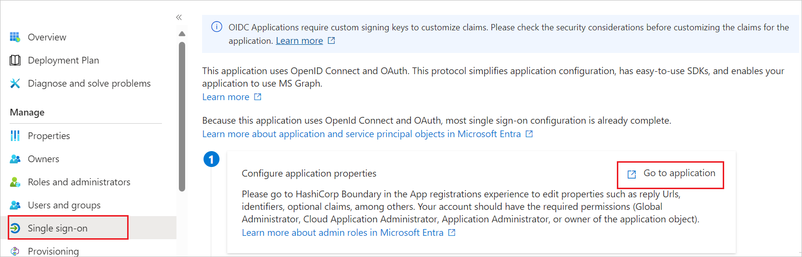](common/go-to-application.png#lightbox)
 
    1. Copy **Application (client) ID** and use it later in the Stormshield Network Security (OIDC) side configuration.
 
        [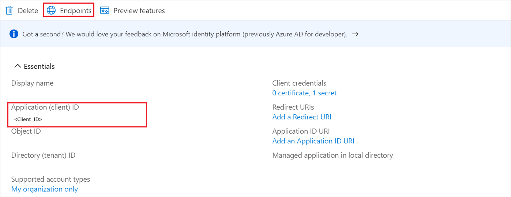](common/application-id.png#lightbox)
 
    1. Under **Endpoints** tab, copy **OpenID Connect metadata document** link and use it later in the Stormshield Network Security (OIDC) side configuration.
 
        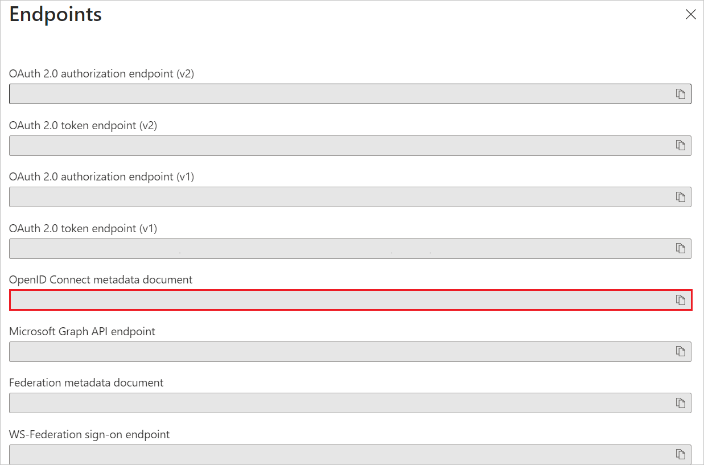
## Configure the redirect URI(s)

> [!IMPORTANT]
> This step ensures that Microsoft Entra ID sends the user back to the correct firewall URL after successful authentication.

1. Navigate to the **Authentication** tab on the left menu and perform the following steps:
 
    1. In the **Redirect URIs** textbox, paste the **Relying Party Redirect URI** value that you copied from the Stormshield Network Security (OIDC) side. These URIs must use HTTPS.
 
        [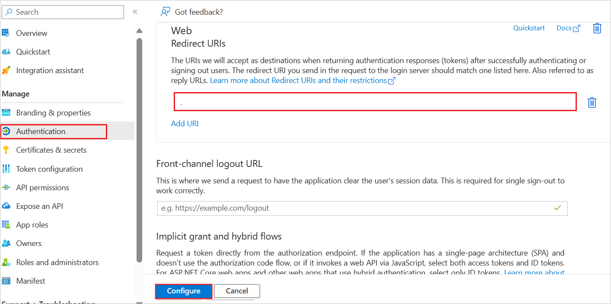](common/redirect.png#lightbox)
 
    1. Select **Configure** button.
 
1. Navigate to **Certificates & secrets** on the left menu and perform the following steps:
 
    1. Go to the **Client secrets** tab and select **+New client secret**.
    1. Enter a valid **Description** in the textbox, select an expiration period from the **Expires** drop-down as per your requirement, and select **Add**.
 
        [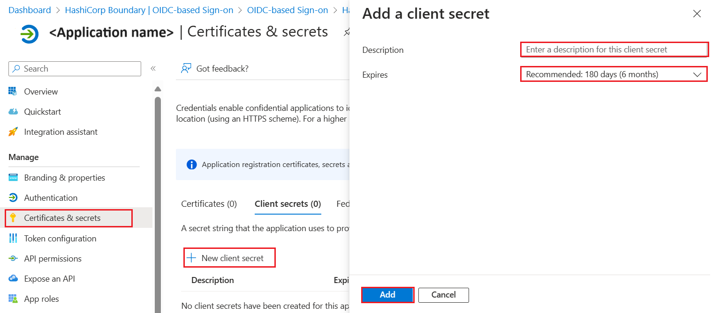](common/client-secret.png#lightbox)
 
    1. Once you add a client secret, **Value** is generated. Copy the value and use it later in the Stormshield Network Security (OIDC) side configuration.
 
        
 
### Create a Microsoft Entra test user
 
In this section, you create a test user called B.Simon.
 
1. Sign in to the [Microsoft Entra admin center](https://entra.microsoft.com) as at least a [User Administrator](~/identity/role-based-access-control/permissions-reference.md#user-administrator).
1. Browse to **Entra ID** > **Users**.
1. Select **New user** > **Create new user**, at the top of the screen.
1. In the **User** properties, follow these steps:
   1. In the **Display name** field, enter `B.Simon`.  
   1. In the **User principal name** field, enter the username@companydomain.extension. For example, `B.Simon@contoso.com`.
   1. Select the **Show password** check box, and then write down the value that's displayed in the **Password** box.
   1. Select **Review + create**.
1. Select **Create**.
 
### Assign roles to users or groups in the application (Optional)
 
In this section, you configure which users in Microsoft Entra ID are authorized to use the application and manage their access rights. You enable B.Simon to use single sign-on by granting access to Stormshield Network Security (OIDC).
 
1. Sign in to the [Microsoft Entra admin center](https://entra.microsoft.com) as at least a [Cloud Application Administrator](~/identity/role-based-access-control/permissions-reference.md#cloud-application-administrator).
1. Browse to **Entra ID** > **Enterprise apps** > **Stormshield Network Security (OIDC)**.
1. In the app's overview page, select **Users and groups**.
1. Select **Add user/group**, then select **Users and groups** in the **Add Assignment** dialog.
   1. In the **Users and groups** dialog, select **B.Simon** from the Users list, then select the **Select** button at the bottom of the screen.
   1. If you're expecting a role to be assigned to the users, you can select it from the **Select a role** dropdown. If no role has been set up for this app, you see "Default Access" role selected.
   1. In the **Add Assignment** dialog, select the **Assign** button.
 
## Configure Stormshield Network Security (OIDC) SSO

To configure single sign-on on **Stormshield Network Security** side, you need to download user groups to import them into the SNS firewall. To simplify the creation of local group objects on the SNS firewall, you can retrieve the unique identifiers (GUIDs) of your Microsoft Entra ID groups.

## Download user groups to import them into the SNS firewall (Optional)

To simplify the creation of local group objects on the SNS firewall, you can retrieve the unique identifiers (GUIDs) of your Microsoft Entra ID groups.

1. Browse to **Entra ID** > **Groups** > **All groups**.
1. Select the desired group (e.g., **SNS Authentication**).
1. Copy the **Object ID** (GUID) of the group.

> [!NOTE]
> The SNS firewall uses the Object ID (GUID) to identify groups from Microsoft Entra ID. The [next section](#enable-the-oidc-authentication-method) will show you the method for **importing** the complete list of groups in CSV format, which is the most efficient method for a large number of groups.

### Configure the Stormshield Network Security Firewall for Microsoft Entra ID authentication

This section guides you through the necessary configurations on the **Stormshield Network Security (SNS) firewall** to enable **OIDC authentication** via **Microsoft Entra ID**.

**Sign in** to the web administration interface of the firewall.

### Set the firewall FQDN for access to the captive portal

> [!NOTE]
> The FQDN configured here must be resolvable by browsers on client workstations for captive portal access to function correctly. This is a network prerequisite.

In **System** > **Configuration** > **General configuration** tab > **Captive portal** section:

1.  In the **Redirect to the captive portal** field, select the value **Specify a domain name (FQDN)**.
1.  In the **Domain name (FQDN)** field, enter the full name of the firewall (example: `documentation-firewall.stormshield.eu`).

> [!IMPORTANT]
> This FQDN must be identical to the one used when [declaring URIs in the Stormshield application](#configure-the-redirect-uris) defined in the **Microsoft Entra ID** tenant.

### Configure the server identity based on this FQDN

The certificate of this server identity is meant to be used by the firewall's captive portal.

> [!NOTE]
> In **SSL** VPN access, it is preferable for the captive portal identity to come from a public CA, as it is already integrated into browsers.

### Import a public server identity (Recommended)

If you have obtained a server certificate from a public CA that matches the FQDN defined in the previous step, you must import it into the firewall.

1.  Go to **Objects** > **Certificates and PKI**.
1.  Select **Import a File** (or **Import an Identity**).
1.  Follow the wizard steps to import the certificate and its private key.

> [!NOTE]
> You can choose to generate a server identity from the firewall's internal CA, but this is **not recommended** for production environments.

### Configure the captive portal to use the identity

Once the server identity is available on the firewall:

1.  Go to **Configuration** > **Users** > **Authentication** tab.
1.  In the **SSL server** fieldset, use the drop-down menu in the **Certificate (private key)** field to select the server identity you just imported/created.
1.  Select **Apply** to save the changes to the configuration.

### Enable the OIDC authentication method

In **Users** > **Authentication > Available methods** tab:

1.  Select **Enable a method**.
1.  Select **OIDC/Microsoft Entra ID**.
    A configuration wizard will automatically launch:
1.  **Domain name**: indicate the main domain name [retrieved from your Microsoft Entra ID administration center](#collect-and-generate-oidc-provider-credentials-client-id-secret-domain-tenant-id) (e.g., `snsdoc.onmicrosoft.com`).
1.  **Tenant ID**: enter the ID [retrieved from your Microsoft Entra ID administration center](#collect-and-generate-oidc-provider-credentials-client-id-secret-domain-tenant-id) in this field.
1.  **Application ID (client)**: enter the value [retrieved from your Microsoft Entra ID administration center](#collect-and-generate-oidc-provider-credentials-client-id-secret-domain-tenant-id) in this field.
1.  **Client secret**: enter the value retrieved and saved when [Creating a secret for the application](#collect-and-generate-oidc-provider-credentials-client-id-secret-domain-tenant-id) during the creation of the SNS application on your **Microsoft Entra ID** tenant. If you did not save this value, you need to delete the **Client secret** that was created earlier for your application, and generate a new one, by following the procedure described in [this step](#collect-and-generate-oidc-provider-credentials-client-id-secret-domain-tenant-id).
1.  Select **Next**.
    The wizard suggests URLs that correspond to the captive portal service, the **SSL** VPN service, and access to the firewall’s web administration interface. These URLs can be copied directly from this wizard to be entered as redirect URLs in [your **Microsoft Entra ID** administration center](#configure-the-redirect-uris) if necessary.
    They are also available in the OIDC/**Microsoft Entra ID** method editing panel.
1. Select **Next**.
1. Select the CSV file containing the groups in your **Microsoft Entra ID** tenant, which was downloaded when [Download user groups to import them into the SNS firewall](#download-user-groups-to-import-them-into-the-sns-firewall-optional), then select **Next**. A summary of the group import operation then appears.
1. Select **Next**.
1. Confirm your configuration by selecting on **Finish**.
    You will be redirected to the OIDC/**Microsoft Entra ID** authentication method editing panel.
1. Select **Apply** to save the configuration of the **Microsoft Entra ID** authentication method on the firewall.

In this example, the configuration of the OIDC/**Microsoft Entra ID** method on the firewall will therefore resemble the following:

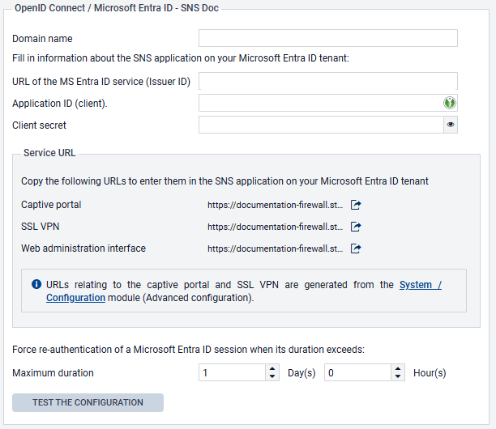

### Create the authentication rule

Go to **Configuration** > **Users** > **Authentication** > **Authentication policy** tab:

1.  Select **New rule** and select **Standard rule**.
1.  Select **All** users in the **Users** menu.
    Permissions to connect to the captive portal, web administration interface or **SSL** VPN by authenticating through **Microsoft Entra ID** will be granted according to the privileges set in the tenant.
1.  In the **Sources** menu: add the network interfaces through which users authenticated by **Microsoft Entra ID** will be presenting on the firewall. In this example, the following interfaces are used:
    * **in**: interface to access the internal captive portal to authenticate administrators via the web administration interface,
    * **out**: interface to access the external captive portal that **SSL** VPN clients use for retrieving their configuration files and setting up tunnels,
    * **sslvpn**: interface used by **SSL** VPN clients to access the firewall's **SSL** VPN service when the tunnel is set up.
1.  In the **Authentication methods** menu: select **Enable a method** and select the **OIDC** method.
1.  Likewise, add the other authentication methods for your users (e.g., **LDAP**).
1.  Confirm this authentication rule by selecting **OK**.
    The rule will be added to the authentication policy but will not be enabled by default.
1.  In the authentication rule grid, select on the status of the rule to enable it.

The authentication rule will look like this:

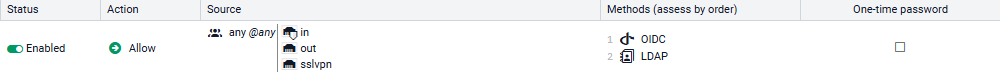

> [!NOTE]
> During an authentication, rules are scanned in order of their appearance in the list.
> As such, ensure that you organize them using the **Up** and **Down** buttons when necessary, as well as the associated actions (**Allow**/**Block**).

The firewall's captive portal will now offer **Microsoft Entra ID** authentication:

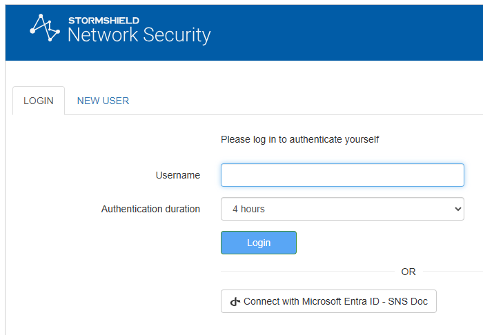

### Configure the captive portal

In **Configuration** > **Users** > **Authentication** > **Captive portal** tab:

1.  Add the **in** and **out** interfaces to respectively associate them with the **Internal** and **External** profiles of the captive portal.
1.  Select the server identity certificate based on the firewall’s FQDN.

The captive portal configuration will look like this:

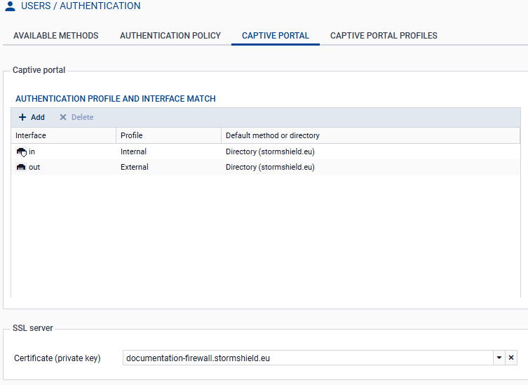

### Import Microsoft Entra security groups

Go to **Configuration** > **Users** > **Users and Groups > Microsoft Entra ID** tab.
The list of imported **Microsoft Entra ID** groups and their group IDs are displayed in the grid.

When you add or edit groups in your **Microsoft Entra ID** administration center, you can import these groups into this module by using the **Import groups** button, and selecting the CSV file that was exported from your **Microsoft Entra ID** tenant when [Downloading user groups to import them into the SNS firewall](#download-user-groups-to-import-them-into-the-sns-firewall-optional).

> [!NOTE]
> If custom groups were added through this module, they will not be overwritten when a CSV file is imported. If an imported group has the same name as a custom group, they will be differentiated by their unique identifiers (UIDs), and can coexist in the configuration.

### Create application roles on the firewall (optional)

To use application roles to manage user permissions, these roles must have identical configurations on the firewall and [in the **Microsoft Entra ID** tenant application](#assign-roles-to-users-or-groups-in-the-application-optional).

> [!NOTE]
> The Stormshield Network Security firewall is provided with the default application roles that mirror those available [in the **Microsoft Entra ID** tenant application](#assign-roles-to-users-or-groups-in-the-application-optional).
> You only need to create or edit roles in this section if you wish to use **custom roles**.

Go to **Users > Users** > **Microsoft Entra ID** tab.

1.  Select **Add,** then on **Application role**.
1.  Fill in the following fields:
    * The **Application role name** (any text).
    * The **Application role UID**, which has to use syntax in `Actions.Permissions` format (e.g., `SNS.Config.All.Write`, `SNS.Config.All.Read`).
    * The optional **Description** (any text).

> [!IMPORTANT]
> The role UID must be unique on the firewall, and identical to the UID of the corresponding application role that was [created in your **Microsoft Entra ID** tenant](#assign-roles-to-users-or-groups-in-the-application-optional).

1.  Select **Apply** to confirm the creation of the role.
1.  Select **Apply** to save changes to the configuration.

### Allow SSL VPN for users authenticated through Microsoft Entra ID

In **Configuration** > **Users** > **Access privileges** > **Detailed access** tab:

1.  Select **Add**.
1.  Enable **Microsoft Entra ID** and select a group that has been imported from **Microsoft Entra ID**, a custom group or an application role.
1.  Select **Apply**.
    A rule is added to the grid.
1.  Select in the **SSL VPN** column of this rule and select **Allow**.
1.  Select in the **Status** column of this rule to enable it.
1.  Select **Apply**, then **Save** to confirm changes to the configuration.

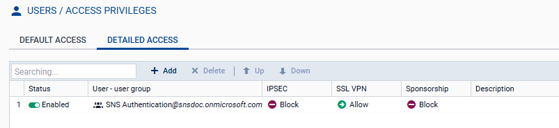

### Allow administrators to access the web administration interface

In **System** > **Administrators**:

1.  Select **Add an administrator**.
1.  Select the type of permissions to be granted to the administrator group.
1.  Select **Microsoft Entra ID**, then select a security group that was imported from **Microsoft Entra ID**, a custom security group or an application role.
1.  Confirm your selection by selecting on **Apply**.
1.  Select **Apply** to confirm changes to the configuration.

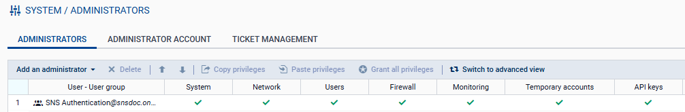

