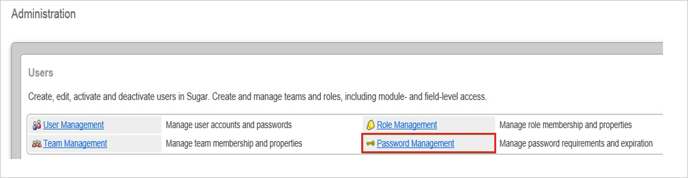
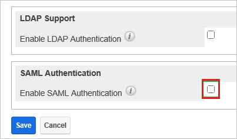
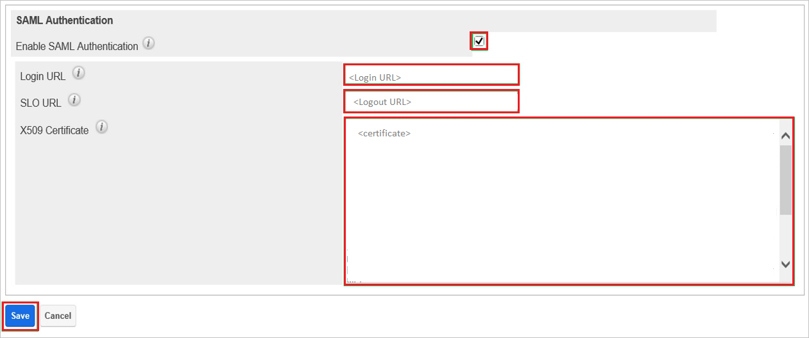
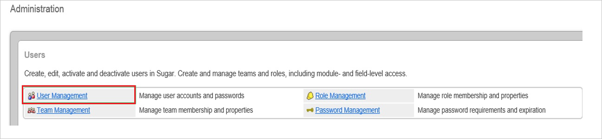
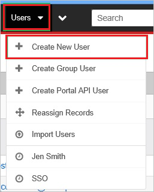
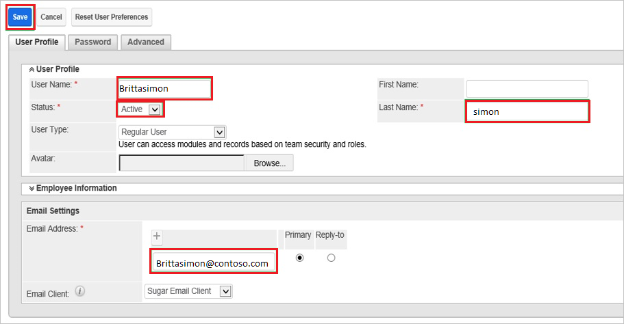
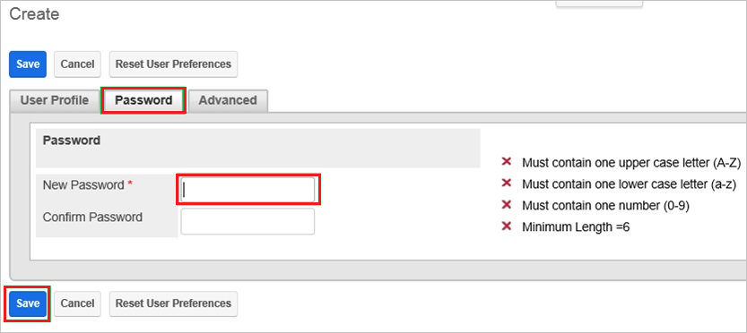

# Configure Sugar CRM for Single sign-on with Microsoft Entra ID

In this article,  you learn how to integrate Sugar CRM with Microsoft Entra ID. When you integrate Sugar CRM with Microsoft Entra ID, you can:

* Control in Microsoft Entra ID who has access to Sugar CRM.
* Enable your users to be automatically signed-in to Sugar CRM with their Microsoft Entra accounts.
* Manage your accounts in one central location.

## Prerequisites
The scenario outlined in this article assumes that you already have the following prerequisites:

[!INCLUDE [common-prerequisites.md](~/identity/saas-apps/includes/common-prerequisites.md)]
* Sugar CRM single sign-on (SSO) enabled subscription.

## Scenario description

In this article,  you configure and test Microsoft Entra SSO in a test environment.

* Sugar CRM supports **SP** initiated SSO

> [!NOTE]
> Identifier of this application is a fixed string value so only one instance can be configured in one tenant.

## Add Sugar CRM from the gallery

To configure the integration of Sugar CRM into Microsoft Entra ID, you need to add Sugar CRM from the gallery to your list of managed SaaS apps.

1. Sign in to the [Microsoft Entra admin center](https://entra.microsoft.com) as at least a [Cloud Application Administrator](~/identity/role-based-access-control/permissions-reference.md#cloud-application-administrator).
1. Browse to **Entra ID** > **Enterprise apps** > **New application**.
1. In the **Add from the gallery** section, type **Sugar CRM** in the search box.
1. Select **Sugar CRM** from results panel and then add the app. Wait a few seconds while the app is added to your tenant.

 Alternatively, you can also use the [Enterprise App Configuration Wizard](https://portal.office.com/AdminPortal/home?Q=Docs#/azureadappintegration). In this wizard, you can add an application to your tenant, add users/groups to the app, assign roles, and walk through the SSO configuration as well. [Learn more about Microsoft 365 wizards.](/microsoft-365/admin/misc/azure-ad-setup-guides)

## Configure and test Microsoft Entra SSO for Sugar CRM

Configure and test Microsoft Entra SSO with Sugar CRM using a test user called **B.Simon**. For SSO to work, you need to establish a link relationship between a Microsoft Entra user and the related user in Sugar CRM.

To configure and test Microsoft Entra SSO with Sugar CRM, perform the following steps:

1. **[Configure Microsoft Entra SSO](#configure-azure-ad-sso)** - to enable your users to use this feature.
    1. **Create a Microsoft Entra test user** - to test Microsoft Entra single sign-on with B.Simon.
    1. **Assign the Microsoft Entra test user** - to enable B.Simon to use Microsoft Entra single sign-on.
1. **[Configure Sugar CRM SSO](#configure-sugar-crm-sso)** - to configure the single sign-on settings on application side.
    1. **[Create Sugar CRM test user](#create-sugar-crm-test-user)** - to have a counterpart of B.Simon in Sugar CRM that's linked to the Microsoft Entra representation of user.
1. **[Test SSO](#test-sso)** - to verify whether the configuration works.

## Configure Microsoft Entra SSO

Follow these steps to enable Microsoft Entra SSO.

1. Sign in to the [Microsoft Entra admin center](https://entra.microsoft.com) as at least a [Cloud Application Administrator](~/identity/role-based-access-control/permissions-reference.md#cloud-application-administrator).
1. Browse to **Entra ID** > **Enterprise apps** > **Sugar CRM** > **Single sign-on**.
1. On the **Select a single sign-on method** page, select **SAML**.
1. On the **Set up single sign-on with SAML** page, select the pencil icon for **Basic SAML Configuration** to edit the settings.

   

1. On the **Basic SAML Configuration** section, enter the values for the following fields:

    a. In the **Sign-on URL** text box, type a URL using the following pattern:

	- `https://<companyname>.sugarondemand.com`
	- `https://<companyname>.trial.sugarcrm`

	b. In the **Reply URL** text box, type a URL using the following pattern:

	- `https://<companyname>.sugarondemand.com/<companyname>`
	- `https://<companyname>.trial.sugarcrm.com/<companyname>`
    - `https://<companyname>.trial.sugarcrm.eu/<companyname>`

	> [!NOTE]
	> These values aren't real. Update these values with the actual Sign-On URL and Reply URL. Contact [Sugar CRM Client support team](https://support.sugarcrm.com/) to get these values. You can also refer to the patterns shown in the **Basic SAML Configuration** section.

1. On the **Set up single sign-on with SAML** page, in the **SAML Signing Certificate** section,  find **Certificate (Base64)** and select **Download** to download the certificate and save it on your computer.

	

1. On the **Set up Sugar CRM** section, copy the appropriate URL(s) based on your requirement.

	

[!INCLUDE [create-assign-users-sso.md](~/identity/saas-apps/includes/create-assign-users-sso.md)]

## Configure Sugar CRM SSO

1. In a different web browser window, sign in to your Sugar CRM company site as an administrator.

1. Go to **Admin**.

    

1. In the **Administration** section, select **Password Management**.

    

1. Select **Enable SAML Authentication**.

    

1. In the **SAML Authentication** section, perform the following steps:

      

    a. In the **Login URL** textbox, paste the value of **Login URL**.
  
    b. In the **SLO URL** textbox, paste the value of **Logout URL**.
  
    c. Open your base-64 encoded certificate in notepad, copy the content of it into your clipboard, and then paste the entire Certificate into **X.509 Certificate** textbox.
  
    d. Select **Save**.

### Create Sugar CRM test user

In order to enable Microsoft Entra users to sign in to Sugar CRM, they must be provisioned to Sugar CRM. In the case of Sugar CRM, provisioning is a manual task.

**To provision a user account, perform the following steps:**

1. Sign in to your **Sugar CRM** company site as administrator.

1. Go to **Admin**.

    

1. In the **Administration** section, select **User Management**.

    

1. Go to **Users** > **Create New User**.

    

1. On the **User Profile** tab, perform the following steps:

    

    * Type the **user name**, **last name**, and **email address** of a valid Microsoft Entra user into the related textboxes.
  
1. As **Status**, select **Active**.

1. On the Password tab, perform the following steps:

    

    a. Type the password into the related textbox.

    b. Select **Save**.

> [!NOTE]
> You can use any other Sugar CRM user account creation tools or APIs provided by Sugar CRM to provision Microsoft Entra user accounts.

## Test SSO 

In this section, you test your Microsoft Entra single sign-on configuration with following options. 

* Select **Test this application**, this option redirects to Sugar CRM Sign-on URL where you can initiate the login flow. 

* Go to Sugar CRM Sign-on URL directly and initiate the login flow from there.

* You can use Microsoft My Apps. When you select the Sugar CRM tile in the My Apps, this option redirects to Sugar CRM Sign-on URL. For more information about the My Apps, see [Introduction to the My Apps](https://support.microsoft.com/account-billing/sign-in-and-start-apps-from-the-my-apps-portal-2f3b1bae-0e5a-4a86-a33e-876fbd2a4510).

## Related content

Once you configure Sugar CRM you can enforce session control, which protects exfiltration and infiltration of your organization’s sensitive data in real time. Session control extends from Conditional Access. [Learn how to enforce session control with Microsoft Defender for Cloud Apps](/cloud-app-security/proxy-deployment-any-app).
