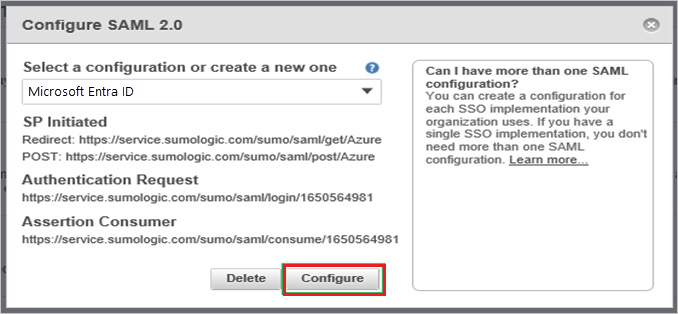
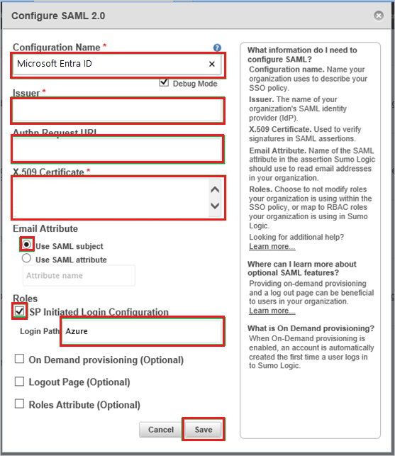
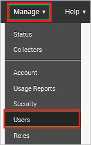
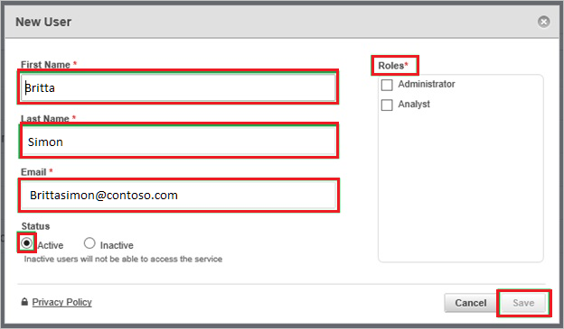

# Configure SumoLogic for Single sign-on with Microsoft Entra ID

In this article,  you learn how to integrate SumoLogic with Microsoft Entra ID. When you integrate SumoLogic with Microsoft Entra ID, you can:

* Control in Microsoft Entra ID who has access to SumoLogic.
* Enable your users to be automatically signed-in to SumoLogic with their Microsoft Entra accounts.
* Manage your accounts in one central location.

## Prerequisites
The scenario outlined in this article assumes that you already have the following prerequisites:

[!INCLUDE [common-prerequisites.md](~/identity/saas-apps/includes/common-prerequisites.md)]
* SumoLogic single sign-on (SSO) enabled subscription.

## Scenario description

In this article,  you configure and test Microsoft Entra SSO in a test environment.

* SumoLogic supports **IDP** initiated SSO.

## Add SumoLogic from the gallery

To configure the integration of SumoLogic into Microsoft Entra ID, you need to add SumoLogic from the gallery to your list of managed SaaS apps.

1. Sign in to the [Microsoft Entra admin center](https://entra.microsoft.com) as at least a [Cloud Application Administrator](~/identity/role-based-access-control/permissions-reference.md#cloud-application-administrator).
1. Browse to **Entra ID** > **Enterprise apps** > **New application**.
1. In the **Add from the gallery** section, type **SumoLogic** in the search box.
1. Select **SumoLogic** from results panel and then add the app. Wait a few seconds while the app is added to your tenant.

 Alternatively, you can also use the [Enterprise App Configuration Wizard](https://portal.office.com/AdminPortal/home?Q=Docs#/azureadappintegration). In this wizard, you can add an application to your tenant, add users/groups to the app, assign roles, and walk through the SSO configuration as well. [Learn more about Microsoft 365 wizards.](/microsoft-365/admin/misc/azure-ad-setup-guides)

## Configure and test Microsoft Entra SSO for SumoLogic

Configure and test Microsoft Entra SSO with SumoLogic using a test user called **B.Simon**. For SSO to work, you need to establish a link relationship between a Microsoft Entra user and the related user in SumoLogic.

To configure and test Microsoft Entra SSO with SumoLogic, perform the following steps:

1. **[Configure Microsoft Entra SSO](#configure-azure-ad-sso)** - to enable your users to use this feature.
    1. **Create a Microsoft Entra test user** - to test Microsoft Entra single sign-on with B.Simon.
    1. **Assign the Microsoft Entra test user** - to enable B.Simon to use Microsoft Entra single sign-on.
1. **[Configure SumoLogic SSO](#configure-sumologic-sso)** - to configure the single sign-on settings on application side.
    1. **[Create SumoLogic test user](#create-sumologic-test-user)** - to have a counterpart of B.Simon in SumoLogic that's linked to the Microsoft Entra representation of user.
1. **[Test SSO](#test-sso)** - to verify whether the configuration works.

## Configure Microsoft Entra SSO

Follow these steps to enable Microsoft Entra SSO.

1. Sign in to the [Microsoft Entra admin center](https://entra.microsoft.com) as at least a [Cloud Application Administrator](~/identity/role-based-access-control/permissions-reference.md#cloud-application-administrator).
1. Browse to **Entra ID** > **Enterprise apps** > **SumoLogic** > **Single sign-on**.
1. On the **Select a single sign-on method** page, select **SAML**.
1. On the **Set up single sign-on with SAML** page, select the pencil icon for **Basic SAML Configuration** to edit the settings.

   

1. On the **Set up single sign-on with SAML** page, perform the following steps:

    a. In the **Identifier** text box, type a URL using one of the following patterns:

    | Identifier URL |
    |---|
    | `https://service.sumologic.com`|
    | `https://<tenantname>.us2.sumologic.com`|
    | `https://<tenantname>.us4.sumologic.com`|
    | `https://<tenantname>.eu.sumologic.com`|
    | `https://<tenantname>.jp.sumologic.com`|
    | `https://<tenantname>.de.sumologic.com`|
    | `https://<tenantname>.ca.sumologic.com`|
    |

    b. In the **Reply URL** text box, type a URL using one of the following patterns:

    | Reply URL |
    |---|
    | `https://service.sumologic.com/sumo/saml/consume/<tenantname>` |
    | `https://service.us2.sumologic.com/sumo/saml/consume/<tenantname>` |
    | `https://service.us4.sumologic.com/sumo/saml/consume/<tenantname>` |
    | `https://service.eu.sumologic.com/sumo/saml/consume/<tenantname>` |
    | `https://service.jp.sumologic.com/sumo/saml/consume/<tenantname>` |
    | `https://service.de.sumologic.com/sumo/saml/consume/<tenantname>` |
    | `https://service.ca.sumologic.com/sumo/saml/consume/<tenantname>` |
    | `https://service.au.sumologic.com/sumo/saml/consume/<tenantname>` |
    |

	> [!NOTE]
	> These values aren't real. Update these values with the actual Identifier and Reply URL. Contact [SumoLogic Client support team](https://www.sumologic.com/contact-us/) to get these values. You can also refer to the patterns shown in the **Basic SAML Configuration** section.

1. SumoLogic application expects the SAML assertions in a specific format, which requires you to add custom attribute mappings to your SAML token attributes configuration. The following screenshot shows the list of default attributes.

	

1. In addition to above, SumoLogic application expects few more attributes to be passed back in SAML response which are shown below. These attributes are also pre populated but you can review them as per your requirements.

	|  Name | Source Attribute |
	| ---------------| --------------- |
	| FirstName | user.givenname |
	| LastName | user.surname |
	| Roles | user.assignedroles |

    > [!NOTE]
	> Please select [here](~/identity-platform/enterprise-app-role-management.md) to know how to configure **Role** in Microsoft Entra ID.

1. On the **Set up single sign-on with SAML** page, in the **SAML Signing Certificate** section,  find **Certificate (Base64)** and select **Download** to download the certificate and save it on your computer.

	

1. On the **Set up SumoLogic** section, copy the appropriate URL(s) based on your requirement.

	

[!INCLUDE [create-assign-users-sso.md](~/identity/saas-apps/includes/create-assign-users-sso.md)]

## Configure SumoLogic SSO

1. In a different web browser window, sign in to your SumoLogic company site as an administrator.

1. Go to **Manage** > **Security**.

    

1. Select **SAML**.

    

1. From the **Select a configuration or create a new one** list, select **Microsoft Entra ID**, and then select **Configure**.

    

1. On the **Configure SAML 2.0** dialog, perform the following steps:

    

    a. In the **Configuration Name** textbox, type **Microsoft Entra ID**.

    b. Select **Debug Mode**.

    c. In the **Issuer** textbox, paste the value of **Microsoft Entra Identifier**.

    d. In the **Authn Request URL** textbox, paste the value of **Login URL**.

    e. Open your base-64 encoded certificate in notepad, copy the content of it into your clipboard, and then paste the entire Certificate into **X.509 Certificate** textbox.

    f. As **Email Attribute**, select **Use SAML subject**.  

    g. Select **SP initiated Login Configuration**.

    h. In the **Login Path** textbox, type **Azure** and select **Save**.

### Create SumoLogic test user

In order to enable Microsoft Entra users to sign in to SumoLogic, they must be provisioned to SumoLogic. In the case of SumoLogic, provisioning is a manual task.

**To provision a user account, perform the following steps:**

1. Sign in to your **SumoLogic** tenant.

1. Go to **Manage** > **Users**.

    

1. Select **Add**.

    

1. On the **New User** dialog, perform the following steps:

    

    a. Type the related information of the Microsoft Entra account you want to provision into the **First Name**, **Last Name**, and **Email** textboxes.
  
    b. Select a role.
  
    c. As **Status**, select **Active**.
  
    d. Select **Save**.

> [!NOTE]
> You can use any other SumoLogic user account creation tools or APIs provided by SumoLogic to provision Microsoft Entra user accounts.

## Test SSO

In this section, you test your Microsoft Entra single sign-on configuration with following options.

* Select **Test this application**, and you should be automatically signed in to the SumoLogic for which you set up the SSO.

* You can use Microsoft My Apps. When you select the SumoLogic tile in the My Apps, you should be automatically signed in to the SumoLogic for which you set up the SSO. For more information about the My Apps, see [Introduction to the My Apps](https://support.microsoft.com/account-billing/sign-in-and-start-apps-from-the-my-apps-portal-2f3b1bae-0e5a-4a86-a33e-876fbd2a4510).

## Related content

Once you configure SumoLogic you can enforce session control, which protects exfiltration and infiltration of your organization’s sensitive data in real time. Session control extends from Conditional Access. [Learn how to enforce session control with Microsoft Defender for Cloud Apps](/cloud-app-security/proxy-deployment-aad).
