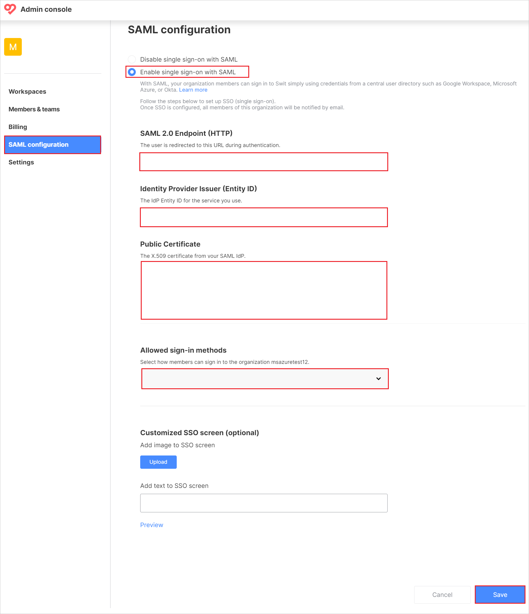
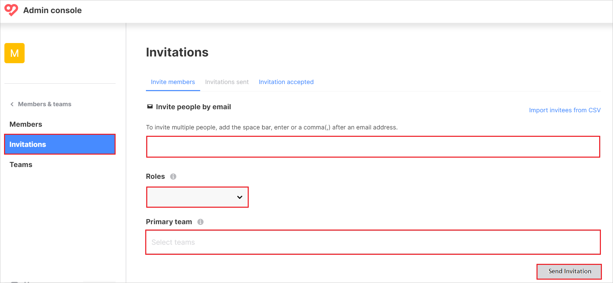

# Configure Swit for Single sign-on with Microsoft Entra ID

In this article,  you learn how to integrate Swit with Microsoft Entra ID. When you integrate Swit with Microsoft Entra ID, you can:

* Control in Microsoft Entra ID who has access to Swit.
* Enable your users to be automatically signed-in to Swit with their Microsoft Entra accounts.
* Manage your accounts in one central location.

## Prerequisites

To get started, you need the following items:

* A Microsoft Entra subscription. If you don't have a subscription, you can get a [free account](https://azure.microsoft.com/free/).
* Swit single sign-on (SSO) enabled subscription.
* Along with Cloud Application Administrator, Application Administrator can also add or manage applications in Microsoft Entra ID.
For more information, see [Azure built-in roles](~/identity/role-based-access-control/permissions-reference.md).

> [!NOTE]
> This integration is also available to use from Microsoft Entra US Government Cloud environment. You can find this application in the Microsoft Entra US Government Cloud Application Gallery and configure it in the same way as you do from public cloud.

## Scenario description

In this article,  you configure and test Microsoft Entra SSO in a test environment.

* Swit supports **SP** initiated SSO.

## Add Swit from the gallery

To configure the integration of Swit into Microsoft Entra ID, you need to add Swit from the gallery to your list of managed SaaS apps.

1. Sign in to the [Microsoft Entra admin center](https://entra.microsoft.com) as at least a [Cloud Application Administrator](~/identity/role-based-access-control/permissions-reference.md#cloud-application-administrator).
1. Browse to **Entra ID** > **Enterprise apps** > **New application**.
1. In the **Add from the gallery** section, type **Swit** in the search box.
1. Select **Swit** from results panel and then add the app. Wait a few seconds while the app is added to your tenant.

 Alternatively, you can also use the [Enterprise App Configuration Wizard](https://portal.office.com/AdminPortal/home?Q=Docs#/azureadappintegration). In this wizard, you can add an application to your tenant, add users/groups to the app, assign roles, and walk through the SSO configuration as well. [Learn more about Microsoft 365 wizards.](/microsoft-365/admin/misc/azure-ad-setup-guides)

## Configure and test Microsoft Entra SSO for Swit

Configure and test Microsoft Entra SSO with Swit using a test user called **B.Simon**. For SSO to work, you need to establish a link relationship between a Microsoft Entra user and the related user in Swit.

To configure and test Microsoft Entra SSO with Swit, perform the following steps:

1. **[Configure Microsoft Entra SSO](#configure-azure-ad-sso)** - to enable your users to use this feature.
    1. **Create a Microsoft Entra test user** - to test Microsoft Entra single sign-on with B.Simon.
    1. **Assign the Microsoft Entra test user** - to enable B.Simon to use Microsoft Entra single sign-on.
1. **[Configure Swit SSO](#configure-swit-sso)** - to configure the single sign-on settings on application side.
    1. **[Create Swit test user](#create-swit-test-user)** - to have a counterpart of B.Simon in Swit that's linked to the Microsoft Entra representation of user.
1. **[Test SSO](#test-sso)** - to verify whether the configuration works.

## Configure Microsoft Entra SSO

Follow these steps to enable Microsoft Entra SSO.

1. Sign in to the [Microsoft Entra admin center](https://entra.microsoft.com) as at least a [Cloud Application Administrator](~/identity/role-based-access-control/permissions-reference.md#cloud-application-administrator).
1. Browse to **Entra ID** > **Enterprise apps** > **Swit** > **Single sign-on**.
1. On the **Select a single sign-on method** page, select **SAML**.
1. On the **Set up single sign-on with SAML** page, select the pencil icon for **Basic SAML Configuration** to edit the settings.

   

1. On the **Basic SAML Configuration** section, perform the following steps:

   a. In the **Identifier** textbox, type a URL using the following pattern:
   `https://<OrgName>.swit.io`

   b. In the **Reply URL** textbox, type the URL:
   `https://saml.swit.io/saml/acs`

   c. In the **Sign on URL** textbox, type a URL using the following pattern:
   `https://swit.io/auth/login?subdomain=<OrgName>`

	> [!NOTE]
	> These values aren't real. Update the values with the actual Identifier and Sign on URL. Contact [Swit support team](mailto:help@swit.io) to get these values. You can also refer to the patterns shown in the **Basic SAML Configuration** section.

1. Swit application expects the SAML assertions in a specific format, which requires you to add custom attribute mappings to your SAML token attributes configuration. The following screenshot shows the list of default attributes.

	

    > [!Note]
    >  From the above list of default attributes, please replace givenname with **firstname**, surname with **lastname**, name with **username** and delete **emailaddress** claim as per requirements of the Swit application.

1. Below are the optional claims, which can be mapped to the user and passed back in the SAML response based on your requirements.
	
	| Name |  Source Attribute|
	| -------------- | --------- |
    | language | user.preferredlanguage |
    | tel | user.telephonenumber |

1. On the **Set up single sign-on with SAML** page, in the **SAML Signing Certificate** section,  find **Certificate (Base64)** and select **Download** to download the certificate and save it on your computer.

	

1. On the **Set up Swit** section, copy the appropriate URLs based on your requirement.

	

[!INCLUDE [create-assign-users-sso.md](~/identity/saas-apps/includes/create-assign-users-sso.md)]

## Configure Swit SSO

1. Log in to your Swit company site as an administrator.

1. Go to **Admin console** in the bottom-left corner of the Administration page, then select **SAML configuration**.

1. In the **SAML configuration** page, perform the following steps:

    

    a. Select **Enable single sign-on with SAML** button.

    b. In the **SAML 2.0 Endpoint (HTTP)** textbox, paste the **Login URL** value, which you copied previously.

    c. In the **Identity Provider Issuer (Entity ID)** textbox, paste the **Microsoft Entra Identifier** value, which you copied previously.

    d. Open the downloaded **Certificate (Base64)** into Notepad and paste the content into the **Public Certificate** textbox.

    e. Select **Allowed sign-in methods** from the dropdown.

    f. Select **Save**.

### Create Swit test user

1. In a different web browser window, log in to your Swit company site as an administrator.

1. Go to **Admin console** > **Members&teams** and select **Invitations**.

1. In the **Invitations** page, perform the following steps:

    

    a. In the **Invite people by email** textbox, type a valid email address.

    b. Select **Roles** from the dropdown menu.

    c. Select **Primary team** from the dropdown menu.

    d. Select **Send Invitation**.

## Test SSO 

In this section, you test your Microsoft Entra single sign-on configuration with following options. 

* Select **Test this application**, this option redirects to Swit Sign-on URL where you can initiate the login flow. 

* Go to Swit Sign-on URL directly and initiate the login flow from there.

* You can use Microsoft My Apps. When you select the Swit tile in the My Apps, this option redirects to Swit Sign-on URL. For more information, see [Microsoft Entra My Apps](/azure/active-directory/manage-apps/end-user-experiences#azure-ad-my-apps).

## Related content

Once you configure Swit you can enforce session control, which protects exfiltration and infiltration of your organization’s sensitive data in real time. Session control extends from Conditional Access. [Learn how to enforce session control with Microsoft Cloud App Security](/cloud-app-security/proxy-deployment-aad).
