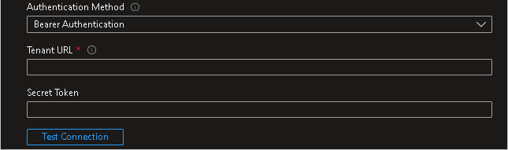
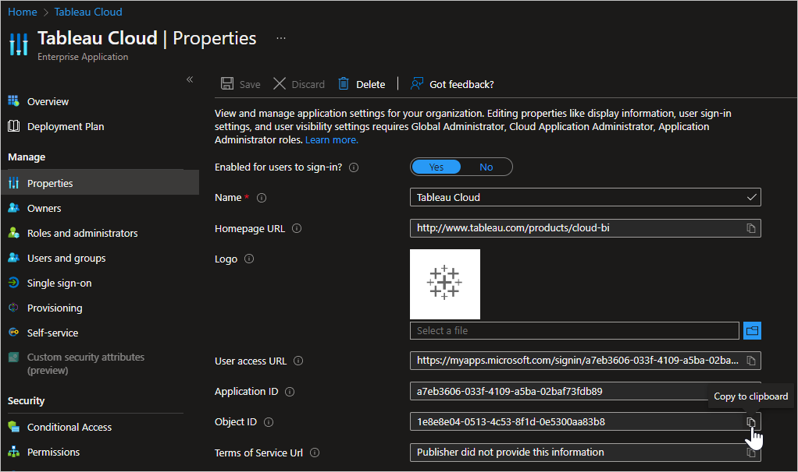
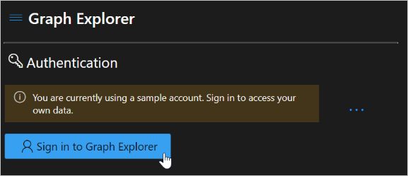
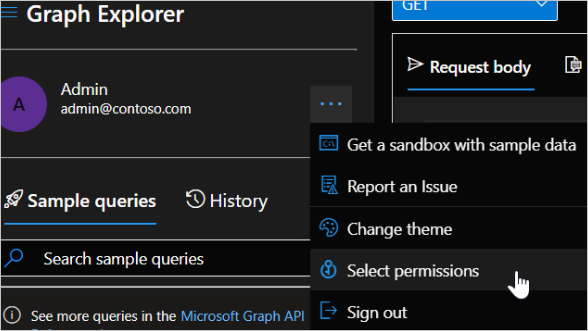
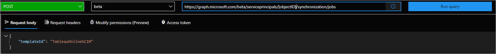

# Configure Tableau Cloud for automatic user provisioning with Microsoft Entra ID

This article describes the steps you need to do in both Tableau Cloud and Microsoft Entra ID to configure automatic user provisioning. When configured, Microsoft Entra ID automatically provisions and de-provisions users and groups to [Tableau Cloud](https://www.tableau.com/) using the Microsoft Entra provisioning service. For important details on what this service does, how it works, and frequently asked questions, see [Automate user provisioning and deprovisioning to SaaS applications with Microsoft Entra ID](~/identity/app-provisioning/user-provisioning.md). 

## Capabilities supported
> [!div class="checklist"]
> * Create users in Tableau Cloud.
> * Remove users in Tableau Cloud when they don't require access anymore.
> * Keep user attributes synchronized between Microsoft Entra ID and Tableau Cloud.
> * Provision groups and group memberships in Tableau Cloud.
> * [Single sign-on](tableauonline-tutorial.md) to Tableau Cloud (recommended).

## Prerequisites

The scenario outlined in this article assumes that you already have the following prerequisites:

* [A Microsoft Entra tenant](~/identity-platform/quickstart-create-new-tenant.md) 
* One of the following roles: [Application Administrator](/entra/identity/role-based-access-control/permissions-reference#application-administrator), [Cloud Application Administrator](/entra/identity/role-based-access-control/permissions-reference#cloud-application-administrator), or [Application Owner](/entra/fundamentals/users-default-permissions#owned-enterprise-applications).
* A [Tableau Cloud tenant](https://www.tableau.com/).
* A user account in Tableau Cloud with Admin permission

> [!NOTE]
> The Microsoft Entra provisioning integration relies on the [Tableau Cloud REST API](https://onlinehelp.tableau.com/current/api/rest_api/en-us/help.htm). This API is available to Tableau Cloud developers.

## Step 1: Plan your provisioning deployment
1. Learn about [how the provisioning service works](~/identity/app-provisioning/user-provisioning.md).
1. Determine who's in [scope for provisioning](~/identity/app-provisioning/define-conditional-rules-for-provisioning-user-accounts.md).
1. Determine what data to [map between Microsoft Entra ID and Tableau Cloud](~/identity/app-provisioning/customize-application-attributes.md). 

## Step 2: Configure Tableau Cloud to support provisioning with Microsoft Entra ID

Use the following steps to enable SCIM support with Microsoft Entra ID:
1. The SCIM functionality requires that you configure your site to support SAML single sign-on. If you haven't done this yet, complete the following sections in [Configure SAML with Microsoft Entra ID](https://help.tableau.com/current/online/en-us/saml_config_azure_ad.htm):
 	* Step 1: [Open the Tableau Cloud SAML Settings](https://help.tableau.com/current/online/en-us/saml_config_azure_ad.htm#open-the-tableau-online-saml-settings).
 	* Step 2: [Add Tableau Cloud to your Microsoft Entra applications](https://help.tableau.com/current/online/en-us/saml_config_azure_ad.htm#add-tableau-online-to-your-azure-ad-applications).
	 
  	> [!NOTE]
  	> If you don’t set up SAML single sign-on, your user is unable to sign into Tableau Cloud after they have been provisioned unless you manually change the user’s authentication method from SAML to Tableau or Tableau MFA in Tableau Cloud. 

1. In Tableau Cloud, navigate to **Settings > Authentication** page, then under **Automatic Provisioning and Group Synchronization (SCIM)**, select the **Enable SCIM** check box. This populates the **Base URL** and **Secret** boxes with values you use in the SCIM configuration of your IdP.
  	> [!NOTE] 
  	> The secret token is displayed only immediately after it's generated. If you lose it before you can apply it to Microsoft Entra ID, you can select **Generate New Secret**. In addition, the secret token is tied to the Tableau Cloud user account of the site administrator who enables SCIM support. If that user’s site role changes or the user is removed from the site, the secret token becomes invalid, and another site administrator must generate a new secret token and apply it to Microsoft Entra ID.

## Step 3: Add Tableau Cloud from the Microsoft Entra application gallery

Add Tableau Cloud from the Microsoft Entra application gallery to start managing provisioning to Tableau Cloud. If you have previously setup Tableau Cloud for SSO, you can use the same application. However it's recommended you create a separate app when testing out the integration initially. Learn more about adding an application from the gallery [here](~/identity/enterprise-apps/add-application-portal.md). 

## Step 4: Define who is in scope for provisioning 

[!INCLUDE [create-assign-users-provisioning.md](~/identity/saas-apps/includes/create-assign-users-provisioning.md)]

## Step 5: Configure automatic user provisioning to Tableau Cloud 

This section guides you through the steps to configure the Microsoft Entra provisioning service to create, update, and disable users and groups in Tableau Cloud based on user and group assignments in Microsoft Entra ID.

> [!TIP]
> You must enable SAML-based single sign-on for Tableau Cloud. Follow the instructions in the [Tableau Cloud single sign-on  article](tableauonline-tutorial.md). If SAML isn't enabled, then the user that's provisioned isn't able to sign in.

### To configure automatic user provisioning for Tableau Cloud in Microsoft Entra ID:

1. Sign in to the [Microsoft Entra admin center](https://entra.microsoft.com) as at least a [Cloud Application Administrator](~/identity/role-based-access-control/permissions-reference.md#cloud-application-administrator).
1. Browse to **Entra ID** > **Enterprise apps**

	

1. In the applications list, select **Tableau Cloud**.

	

1. Select the **Provisioning** tab.

	

1. Set the **Provisioning Mode** to **Automatic**.

	

1. In the **Admin Credentials** section, input your Tableau Cloud Tenant URL and Secret Token. Select **Test Connection** to ensure Microsoft Entra ID can connect to Tableau Cloud. If the connection fails, ensure your Tableau Cloud account has Admin permissions and try again.

	

	> [!NOTE]
	> You'll have 2 options for your Authentication Method: **Bearer Authentication** and **Basic Authentication**. Make sure that you select Bearer Authentication. Basic authentication doesn't work for the SCIM 2.0 endpoint.

1. In the **Notification Email** field, enter the email address of a person or group who should receive the provisioning error notifications and select the **Send an email notification when a failure occurs** check box.

	

1. Select **Save**.

1. In the **Mappings** section, select **Synchronize Microsoft Entra users to Tableau Cloud**.

1. Review the user attributes that are synchronized from Microsoft Entra ID to Tableau Cloud in the **Attribute-Mapping** section. The attributes selected as **Matching** properties are used to match the user accounts in Tableau Cloud for update operations. If you choose to change the [matching target attribute](~/identity/app-provisioning/customize-application-attributes.md), you need to ensure that the Tableau Cloud API supports filtering users based on that attribute. Select the **Save** button to commit any changes.

   |Attribute|Type|Supported for filtering|Required by Tableau Cloud|
   |---|---|---|---|
   |userName|String|&check;|&check;
   |active|Boolean||
   |roles|String||

1. Under the **Mappings** section, select **Synchronize Microsoft Entra groups to Tableau Cloud**.

1. Review the group attributes that are synchronized from Microsoft Entra ID to Tableau Cloud in the **Attribute-Mapping** section. The attributes selected as **Matching** properties are used to match the groups in Tableau Cloud for update operations. Select the **Save** button to commit any changes.

   |Attribute|Type|Supported for filtering|Required by Tableau Cloud|
   |---|---|---|---|
   |displayName|String|&check;
   |members|Reference|

1. To configure scoping filters, refer to the following instructions provided in the [Scoping filter  article](~/identity/app-provisioning/define-conditional-rules-for-provisioning-user-accounts.md).

1. To enable the Microsoft Entra provisioning service for Tableau Cloud, change the **Provisioning Status** to **On** in the **Settings** section.

	

1. Define the users and groups that you would like to provision to Tableau Cloud by choosing the desired values in **Scope** in the **Settings** section.

	

1. When you're ready to provision, select **Save**.

	

This operation starts the initial synchronization cycle of all users and groups defined in **Scope** in the **Settings** section. The initial cycle takes longer to complete than next cycles, which occur approximately every 40 minutes as long as the Microsoft Entra provisioning service is running. 

### Update a Tableau Cloud application to use the Tableau Cloud SCIM 2.0 endpoint

In June 2022, Tableau released a SCIM 2.0 connector. Completing the steps below will update applications configured to use the Tableau API endpoint to the use the SCIM 2.0 endpoint. These steps remove any customizations previously made to the Tableau Cloud application, including:

* Authentication details (credentials used for provisioning, NOT the credentials used for SSO)
* Scoping filters
* Custom attribute mappings
>[!Note]
>Be sure to note any changes that have been made to the settings listed above before completing the steps below. Failure to do so results in the loss of customized settings.

1. Sign in to the [Microsoft Entra admin center](https://entra.microsoft.com) as at least a [Cloud Application Administrator](~/identity/role-based-access-control/permissions-reference.md#cloud-application-administrator).
1. Browse to **Entra ID** > **Enterprise apps** > **Tableau Cloud**.

1. In the Properties section of your new custom app, copy the **Object ID**.

		

1. In a new web browser window, navigate to `https://developer.microsoft.com/graph/graph-explorer` and sign in as the administrator for the Microsoft Entra tenant where your app is added.

	

1. Check to make sure the account being used to the correct permissions. The permission **Directory.ReadWrite.All** is required to make this change.

	

	

1. Using the ObjectID selected from the app previously, run the following command:

	`GET https://graph.microsoft.com/beta/servicePrincipals/[object-id]/synchronization/jobs/`

1. Taking the "id" value from the response body of the GET request from above, run the command below, replacing "[job-id]" with the id value from the GET request. The value should have the format of "Tableau.xxxxxxxxxxxxxxx.xxxxxxxxxxxxxxx":

	`DELETE https://graph.microsoft.com/beta/servicePrincipals/[object-id]/synchronization/jobs/[job-id]`

1. In the Graph Explorer, run the command below. Replace "[object-id]" with the service principal ID (object ID) copied from the third step.

	`POST https://graph.microsoft.com/beta/servicePrincipals/[object-id]/synchronization/jobs { "templateId": "TableauOnlineSCIM" }`

	

1. Return to the first web browser window and select the Provisioning tab for your application. Your configuration will have been reset. You can confirm the upgrade has taken place by confirming the Job ID starts with **TableauOnlineSCIM**.

1. Under the Admin Credentials section, select "Bearer Authentication" as the authentication method and enter the Tenant URL and Secret Token of the Tableau instance you wish to provision to.
	

1. Restore any previous changes you made to the application (Authentication details, Scoping filters, Custom attribute mappings) and re-enable provisioning.

>[!Note]
>Failure to restore the previous settings may results in attributes (name.formatted for example) updating in Workplace unexpectedly. Be sure to check the configuration before enabling provisioning

## Step 6: Monitor your deployment

[!INCLUDE [monitor-deployment.md](~/identity/saas-apps/includes/monitor-deployment.md)]

## Change log
* 09/30/2020 - Added support for attribute "authSetting" for Users.
* 06/24/2022 - Updated the app to be SCIM 2.0 compliant.

## More resources

* [Managing user account provisioning for Enterprise Apps](~/identity/app-provisioning/configure-automatic-user-provisioning-portal.md)
* [What is application access and single sign-on with Microsoft Entra ID?](~/identity/enterprise-apps/what-is-single-sign-on.md)

## Related content

* [Learn how to review logs and get reports on provisioning activity](~/identity/app-provisioning/check-status-user-account-provisioning.md)
