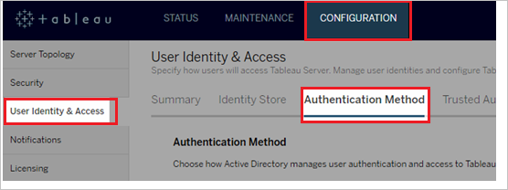
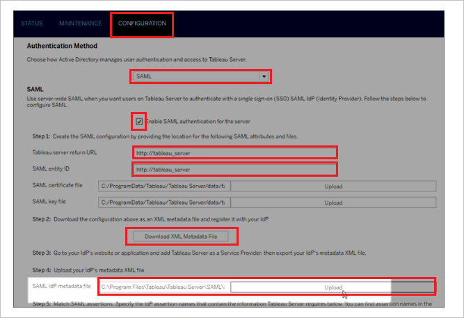

# Configure Tableau Server for Single sign-on with Microsoft Entra ID

In this article,  you learn how to integrate Tableau Server with Microsoft Entra ID. When you integrate Tableau Server with Microsoft Entra ID, you can:

* Control in Microsoft Entra ID who has access to Tableau Server.
* Enable your users to be automatically signed-in to Tableau Server with their Microsoft Entra accounts.
* Manage your accounts in one central location.

## Prerequisites
The scenario outlined in this article assumes that you already have the following prerequisites:

[!INCLUDE [common-prerequisites.md](~/identity/saas-apps/includes/common-prerequisites.md)]
* Tableau Server single sign-on (SSO) enabled subscription.

## Scenario description

In this article,  you configure and test Microsoft Entra SSO in a test environment.

* Tableau Server supports **SP** initiated SSO

## Add Tableau Server from the gallery

To configure the integration of Tableau Server into Microsoft Entra ID, you need to add Tableau Server from the gallery to your list of managed SaaS apps.

1. Sign in to the [Microsoft Entra admin center](https://entra.microsoft.com) as at least a [Cloud Application Administrator](~/identity/role-based-access-control/permissions-reference.md#cloud-application-administrator).
1. Browse to **Entra ID** > **Enterprise apps** > **New application**.
1. In the **Add from the gallery** section, type **Tableau Server** in the search box.
1. Select **Tableau Server** from results panel and then add the app. Wait a few seconds while the app is added to your tenant.

 Alternatively, you can also use the [Enterprise App Configuration Wizard](https://portal.office.com/AdminPortal/home?Q=Docs#/azureadappintegration). In this wizard, you can add an application to your tenant, add users/groups to the app, assign roles, and walk through the SSO configuration as well. [Learn more about Microsoft 365 wizards.](/microsoft-365/admin/misc/azure-ad-setup-guides)

## Configure and test Microsoft Entra SSO for Tableau Server

Configure and test Microsoft Entra SSO with Tableau Server using a test user called **B.Simon**. For SSO to work, you need to establish a link relationship between a Microsoft Entra user and the related user in Tableau Server.

To configure and test Microsoft Entra SSO with Tableau Server, perform the following steps:

1. **[Configure Microsoft Entra SSO](#configure-azure-ad-sso)** - to enable your users to use this feature.
    1. **Create a Microsoft Entra test user** - to test Microsoft Entra single sign-on with B.Simon.
    1. **Assign the Microsoft Entra test user** - to enable B.Simon to use Microsoft Entra single sign-on.
1. **[Configure Tableau Server SSO](#configure-tableau-server-sso)** - to configure the single sign-on settings on application side.
    1. **[Create Tableau Server test user](#create-tableau-server-test-user)** - to have a counterpart of B.Simon in Tableau Server that's linked to the Microsoft Entra representation of user.
1. **[Test SSO](#test-sso)** - to verify whether the configuration works.

## Configure Microsoft Entra SSO

Follow these steps to enable Microsoft Entra SSO.

1. Sign in to the [Microsoft Entra admin center](https://entra.microsoft.com) as at least a [Cloud Application Administrator](~/identity/role-based-access-control/permissions-reference.md#cloud-application-administrator).
1. Browse to **Entra ID** > **Enterprise apps** > **Tableau Server** > **Single sign-on**.
1. On the **Select a single sign-on method** page, select **SAML**.
1. On the **Set up single sign-on with SAML** page, select the pencil icon for **Basic SAML Configuration** to edit the settings.

   

1. On the **Basic SAML Configuration** section, enter the values for the following fields:

    a. In the **Sign-on URL** text box, type a URL using the following pattern:
    `https://azure.<domain name>.link`

    b. In the **Identifier** box, type a URL using the following pattern:
    `https://azure.<domain name>.link`

    c. In the **Reply URL** text box, type a URL using the following pattern:
    `https://azure.<domain name>.link/wg/saml/SSO/index.html`

	> [!NOTE]
	> The preceding values aren't real values. Update the values with the actual Sign-on URL, Identifier and Reply URL from the Tableau Server configuration page which is explained later in the article.

1. On the **Set up single sign-on with SAML** page, in the **SAML Signing Certificate** section,  find **Federation Metadata XML** and select **Download** to download the certificate and save it on your computer.

	

1. On the **Set up Tableau Server** section, copy the appropriate URL(s) based on your requirement.

	

[!INCLUDE [create-assign-users-sso.md](~/identity/saas-apps/includes/create-assign-users-sso.md)]

## Configure Tableau Server SSO

1. To get SSO configured for your application, you need to sign in to your Tableau Server tenant as an administrator.

2. On the **CONFIGURATION** tab, select **User Identity & Access**, and then select the **Authentication** Method tab.

	

3. On the **CONFIGURATION** page, perform the following steps:

	

	a. For **Authentication Method**, select SAML.

	b. Select the checkbox of **Enable SAML Authentication for the server**.

	c. Tableau Server return URL—The URL that Tableau Server users are accessing, such as `http://tableau_server`. Using `http://localhost` isn't recommended. Using a URL with a trailing slash (for example, `http://tableau_server/`) isn't supported. Copy **Tableau Server return URL** and paste it in to **Sign On URL** textbox in **Basic SAML Configuration** section.

	d. SAML entity ID—The entity ID uniquely identifies your Tableau Server installation to the IdP. You can enter your Tableau Server URL again here, if you like, but it doesn't have to be your Tableau Server URL. Copy **SAML entity ID** and paste it in to **Identifier** textbox in **Basic SAML Configuration** section.

	e. Select the **Download XML Metadata File** and open it in the text editor application. Locate Assertion Consumer Service URL with Http Post and Index 0 and copy the URL. Now paste it in to **Reply URL** textbox in **Basic SAML Configuration** section.

	f. Locate your Federation Metadata file downloaded from Azure portal, and then upload it in the **SAML Idp metadata file**.

	g. Enter the names for the attributes that the IdP uses to hold the user names, display names, and email addresses.

	h. Select **Save**.

	> [!NOTE]
	> Customer have to upload A PEM-encoded x509 Certificate file with a .crt extension and a RSA or DSA private key file that has the .key extension, as a Certificate Key file. For more information on Certificate file and Certificate Key file, please refer to [this](https://help.tableau.com/current/server/en-us/saml_requ.htm) document. If you need help configuring SAML on Tableau Server then please refer to this article [Configure Server Wide SAML](https://help.tableau.com/current/server/en-us/config_saml.htm).

	> [!NOTE]
	> The SAML Certificate and SAML Key files are generated separately and uploaded to the Tableau Server Manager. For example, in the linux shell, use openssl to generate the cert and key like so: `openssl req -x509 -sha256 -nodes -days 365 -newkey rsa:2048 -keyout private.key -out saml.crt` then upload the `saml.crt` and `private.key` files via the TSM Configuration GUI (As shown in the screenshot at the start of this step) or via the [command line according to the tableau docs](https://help.tableau.com/current/server-linux/en-us/config_saml.htm). If you're in a production environment, you may want to find a more secure way to handle SAML certs and keys.

### Create Tableau Server test user

The objective of this section is to create a user called B.Simon in Tableau Server. You need to provision all the users in the Tableau server.

That username of the user should match the value which you have configured in the Microsoft Entra custom attribute of **username**. With the correct mapping the integration should work Configuring Microsoft Entra Single Sign-On.

> [!NOTE]
> If you need to create a user manually, you need to contact the Tableau Server administrator in your organization.

## Test SSO 

In this section, you test your Microsoft Entra single sign-on configuration with following options. 

* Select **Test this application**, this option redirects to Tableau Server Sign-on URL where you can initiate the login flow. 

* Go to Tableau Server Sign-on URL directly and initiate the login flow from there.

* You can use Microsoft My Apps. When you select the Tableau Server tile in the My Apps, this option redirects to Tableau Server Sign-on URL. For more information about the My Apps, see [Introduction to the My Apps](https://support.microsoft.com/account-billing/sign-in-and-start-apps-from-the-my-apps-portal-2f3b1bae-0e5a-4a86-a33e-876fbd2a4510).

## Related content

Once you configure Tableau Server you can enforce session control, which protects exfiltration and infiltration of your organization’s sensitive data in real time. Session control extends from Conditional Access. [Learn how to enforce session control with Microsoft Defender for Cloud Apps](/cloud-app-security/proxy-deployment-any-app).
