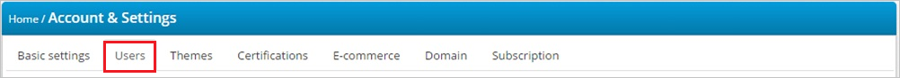

# Configure TalentLMS for Single sign-on with Microsoft Entra ID

In this article,  you learn how to integrate TalentLMS with Microsoft Entra ID. When you integrate TalentLMS with Microsoft Entra ID, you can:

* Control in Microsoft Entra ID who has access to TalentLMS.
* Enable your users to be automatically signed-in to TalentLMS with their Microsoft Entra accounts.
* Manage your accounts in one central location.

## Prerequisites
The scenario outlined in this article assumes that you already have the following prerequisites:

[!INCLUDE [common-prerequisites.md](~/identity/saas-apps/includes/common-prerequisites.md)]
* TalentLMS single sign-on enabled subscription.

## Scenario description

In this article,  you configure and test Microsoft Entra single sign-on in a test environment.

* TalentLMS supports **SP** initiated SSO.

## Add TalentLMS from the gallery

To configure the integration of TalentLMS into Microsoft Entra ID, you need to add TalentLMS from the gallery to your list of managed SaaS apps.

1. Sign in to the [Microsoft Entra admin center](https://entra.microsoft.com) as at least a [Cloud Application Administrator](~/identity/role-based-access-control/permissions-reference.md#cloud-application-administrator).
1. Browse to **Entra ID** > **Enterprise apps** > **New application**.
1. In the **Add from the gallery** section, type **TalentLMS** in the search box.
1. Select **TalentLMS** from results panel and then add the app. Wait a few seconds while the app is added to your tenant.

 Alternatively, you can also use the [Enterprise App Configuration Wizard](https://portal.office.com/AdminPortal/home?Q=Docs#/azureadappintegration). In this wizard, you can add an application to your tenant, add users/groups to the app, assign roles, and walk through the SSO configuration as well. [Learn more about Microsoft 365 wizards.](/microsoft-365/admin/misc/azure-ad-setup-guides)

## Configure and test Microsoft Entra SSO for TalentLMS

Configure and test Microsoft Entra SSO with TalentLMS using a test user called **B.Simon**. For SSO to work, you need to establish a link relationship between a Microsoft Entra user and the related user in TalentLMS.

To configure and test Microsoft Entra SSO with TalentLMS, perform the following steps:

1. **[Configure Microsoft Entra SSO](#configure-azure-ad-sso)** - to enable your users to use this feature.
    1. **Create a Microsoft Entra test user** - to test Microsoft Entra single sign-on with B.Simon.
    1. **Assign the Microsoft Entra test user** - to enable B.Simon to use Microsoft Entra single sign-on.
1. **[Configure TalentLMS SSO](#configure-talentlms-sso)** - to configure the single sign-on settings on application side.
    1. **[Create TalentLMS test user](#create-talentlms-test-user)** - to have a counterpart of B.Simon in TalentLMS that's linked to the Microsoft Entra representation of user.
1. **[Test SSO](#test-sso)** - to verify whether the configuration works.

## Configure Microsoft Entra SSO

Follow these steps to enable Microsoft Entra SSO.

1. Sign in to the [Microsoft Entra admin center](https://entra.microsoft.com) as at least a [Cloud Application Administrator](~/identity/role-based-access-control/permissions-reference.md#cloud-application-administrator).
1. Browse to **Entra ID** > **Enterprise apps** > **TalentLMS** > **Single sign-on**.
1. On the **Select a single sign-on method** page, select **SAML**.
1. On the **Set up single sign-on with SAML** page, select the pencil icon for **Basic SAML Configuration** to edit the settings.

   

1. On the **Basic SAML Configuration** section, perform the following steps:

    a. In the **Identifier (Entity ID)** text box, type a URL using the following pattern:
    `<tenant-name>.talentlms.com`

    b. In the **Sign on URL** text box, type a URL using the following pattern:
    `https://<tenant-name>.TalentLMSapp.com`

	> [!NOTE]
	> These values aren't real. Update these values with the actual Identifier and Sign on URL. Contact [TalentLMS Client support team](https://www.talentlms.com/contact) to get these values. You can also refer to the patterns shown in the **Basic SAML Configuration** section.

5. In the **SAML Signing Certificate** section, select **Edit** button to open **SAML Signing Certificate** dialog.

	

6. In the **SAML Signing Certificate** section, copy the **THUMBPRINT** and save it on your computer.

    

7. On the **Set up TalentLMS** section, copy the appropriate URL(s) as per your requirement.

	

[!INCLUDE [create-assign-users-sso.md](~/identity/saas-apps/includes/create-assign-users-sso.md)]

## Configure TalentLMS SSO

1. In a different web browser window, sign in to your TalentLMS company site as an administrator.

1. In the **Account & Settings** section, select the **Users** tab.

    

1. Select **Single Sign-On (SSO)**,

1. In the Single Sign-On section, perform the following steps:

    

    a. From the **SSO integration type** list, select **SAML 2.0**.

    b. In the **Identity provider (IDP)** textbox, paste the value of **Microsoft Entra Identifier**.

    c. Paste the **Thumbprint** value from Azure portal into the **Certificate fingerprint** textbox.

    d.  In the **Remote sign-in URL** textbox, paste the value of **Login URL**.

    e. In the **Remote sign-out URL** textbox, paste the value of **Logout URL**.

    f. Fill in the following:

    * In the **TargetedID** textbox, type `http://schemas.xmlsoap.org/ws/2005/05/identity/claims/name`

    * In the **First name** textbox, type `http://schemas.xmlsoap.org/ws/2005/05/identity/claims/givenname`

    * In the **Last name** textbox, type `http://schemas.xmlsoap.org/ws/2005/05/identity/claims/surname`

    * In the **Email** textbox, type `http://schemas.xmlsoap.org/ws/2005/05/identity/claims/emailaddress`

1. Select **Save**.

### Create TalentLMS test user

To enable Microsoft Entra users to sign in to TalentLMS, they must be provisioned into TalentLMS. In the case of TalentLMS, provisioning is a manual task.

**To provision a user account, perform the following steps:**

1. Sign in to your **TalentLMS** tenant.

1. Select **Users**, and then select **Add User**.

1. On the **Add user** dialog page, perform the following steps:

      

    a. In the **First name** textbox, enter the first name of user like `Britta`.

    b. In the **Last name** textbox, enter the last name of user like `Simon`.
 
    c. In the **Email address** textbox, enter the email of user like `brittasimon@contoso.com`.

    d. Select **Add User**.

> [!NOTE]
> You can use any other TalentLMS user account creation tools or APIs provided by TalentLMS to provision Microsoft Entra user accounts.

## Test SSO

In this section, you test your Microsoft Entra single sign-on configuration with following options. 

* Select **Test this application**, this option redirects to TalentLMS Sign-on URL where you can initiate the login flow. 

* Go to TalentLMS Sign-on URL directly and initiate the login flow from there.

* You can use Microsoft My Apps. When you select the TalentLMS tile in the My Apps, this option redirects to TalentLMS Sign-on URL. For more information about the My Apps, see [Introduction to the My Apps](https://support.microsoft.com/account-billing/sign-in-and-start-apps-from-the-my-apps-portal-2f3b1bae-0e5a-4a86-a33e-876fbd2a4510).

## Related content

Once you configure TalentLMS you can enforce session control, which protects exfiltration and infiltration of your organization’s sensitive data in real time. Session control extends from Conditional Access. [Learn how to enforce session control with Microsoft Defender for Cloud Apps](/cloud-app-security/proxy-deployment-any-app).
