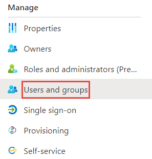
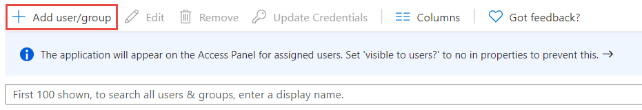

# Tutorial: Configure Tapt for automatic user provisioning

This article explains how to configure automatic user provisioning between 
[Tapt](https://www.tapt.io/) and **Microsoft Entra ID**. Once configured, Microsoft Entra ID 
automatically provisions and deprovisions users in **Tapt** using the 
**Microsoft Entra provisioning service**.

## Prerequisites

To configure automatic user provisioning for Tapt, you need:

- A Microsoft Entra tenant.
- A user account with [Global Administrator](/entra/identity/role-based-access-control/permissions-reference) permissions.
- A Tapt user with administrative privileges.

## Step 1: Plan your provisioning deployment

- Learn about how the [provisioning service works](/entra/identity/app-provisioning/user-provisioning).
- Determine who will be in [scope for provisioning](/entra/identity/app-provisioning/define-conditional-rules-for-provisioning-user-accounts?pivots=app-provisioning).
- Determine what data to [map between Microsoft Entra ID and Tapt.](/entra/identity/app-provisioning/define-conditional-rules-for-provisioning-user-accounts?pivots=app-provisioning)

## Step 2: Creating the Tapt application in Microsoft Entra application gallery

1. Sign in to the [Microsoft Entra admin center](https://entra.microsoft.com) as a Global Administrator.
2. Browse to **Global Secure Access** > **Applications** > **Enterprise applications**.
3. Select **New application**.
4. Input a name for the Application ‘Tapt Integration’

   

4. Select **Integrate any other application you don’t find in the gallery** 

5. Select **Create** to add the application.

## Step 2: Configure Tapt to support provisioning with Microsoft Entra ID

1. Navigate to [Tapt Dashboard](https://platform.tapt.io/) in a separate browser tab.

2. If you aren't logged in to Tapt you will need to do so.

3. Click on settings in the left sidebar and then navigate to Integrations.

4. Under Integrations, locate the Active Directory / Microsoft Entra ID integration block and click Configure. Next, click Generate to create a token. Copy both the URL and Token. These values should be entered into the Tenant URL and Secret Token fields in the Microsoft Entra admin centre, respectively.
    
    

5. Go back to the Microsoft Entra application you just created and apply the relevant values.

## Admin credentials

In the **Admin Credentials** section:

- Enter your **Tenant URL**.
- Provide your **Secret Token**.
    > [!NOTE]
    > You can find this information in your Tapt admin dashboard. This token is valid for 6 months. If it expires, you can generate a new secret token in your Tapt dashboard.

- Select **Test Connection** to verify the credentials.
    
    

## Step 3: Configure automatic user provisioning to Tapt

1. In the Microsoft Entra admin center, go to your **Tapt** application.
2. Select **Provisioning** in the left navigation menu.

    

3. Set **Provisioning Mode** to **Automatic**.

    

## Step 4: Disable Groups provisioning

1. Once saved, expand the mappings option in **Provisioning**
2. Select **Provision Active Directory Groups**
3. Set Enabled to **No** and **save**

## Step 5: Add users to the application

1. Navigate back to the main page of your Azure application
2. Click **Users and Groups** in the left-hand side of the page

    

3. Click **Add user/group**
    

4. Select the users and/or groups that you would like to provision

## Step 6: Ensure provisioning status is ‘on’

1. Select Provisioning in the left panel
2. Ensure that the provision status is ‘on’

    > [!NOTE]
    > A sync will occur every 40 minutes

    

## Additional resources

- [Attribute mappings](/entra/identity/app-provisioning/user-attributes)
- [Provisioning logs](/entra/identity/app-provisioning/use-scim-to-provision-users)