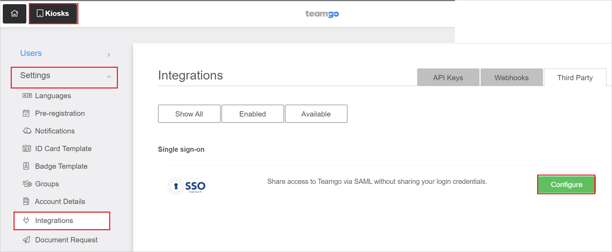

# Configure Teamgo for Single sign-on with Microsoft Entra ID

In this article,  you learn how to integrate Teamgo with Microsoft Entra ID. When you integrate Teamgo with Microsoft Entra ID, you can:

* Control in Microsoft Entra ID who has access to Teamgo.
* Enable your users to be automatically signed-in to Teamgo with their Microsoft Entra accounts.
* Manage your accounts in one central location.

## Prerequisites
The scenario outlined in this article assumes that you already have the following prerequisites:

[!INCLUDE [common-prerequisites.md](~/identity/saas-apps/includes/common-prerequisites.md)]
* Teamgo single sign-on (SSO) enabled subscription.

## Scenario description

In this article,  you configure and test Microsoft Entra SSO in a test environment.

* Teamgo supports **SP and IDP** initiated SSO.
* Teamgo supports **Just In Time** user provisioning.
* Teamgo supports [Automated user provisioning](teamgo-provisioning-tutorial.md).

## Adding Teamgo from the gallery

To configure the integration of Teamgo into Microsoft Entra ID, you need to add Teamgo from the gallery to your list of managed SaaS apps.

1. Sign in to the [Microsoft Entra admin center](https://entra.microsoft.com) as at least a [Cloud Application Administrator](~/identity/role-based-access-control/permissions-reference.md#cloud-application-administrator).
1. Browse to **Entra ID** > **Enterprise apps** > **New application**.
1. In the **Add from the gallery** section, type **Teamgo** in the search box.
1. Select **Teamgo** from results panel and then add the app. Wait a few seconds while the app is added to your tenant.

 Alternatively, you can also use the [Enterprise App Configuration Wizard](https://portal.office.com/AdminPortal/home?Q=Docs#/azureadappintegration). In this wizard, you can add an application to your tenant, add users/groups to the app, assign roles, and walk through the SSO configuration as well. [Learn more about Microsoft 365 wizards.](/microsoft-365/admin/misc/azure-ad-setup-guides)

## Configure and test Microsoft Entra SSO for Teamgo

Configure and test Microsoft Entra SSO with Teamgo using a test user called **B.Simon**. For SSO to work, you need to establish a link relationship between a Microsoft Entra user and the related user in Teamgo.

To configure and test Microsoft Entra SSO with Teamgo, perform the following steps:

1. **[Configure Microsoft Entra SSO](#configure-azure-ad-sso)** - to enable your users to use this feature.
    1. **Create a Microsoft Entra test user** - to test Microsoft Entra single sign-on with B.Simon.
    1. **Assign the Microsoft Entra test user** - to enable B.Simon to use Microsoft Entra single sign-on.
1. **[Configure Teamgo SSO](#configure-teamgo-sso)** - to configure the single sign-on settings on application side.
    1. **[Create Teamgo test user](#create-teamgo-test-user)** - to have a counterpart of B.Simon in Teamgo that's linked to the Microsoft Entra representation of user.
1. **[Test SSO](#test-sso)** - to verify whether the configuration works.

## Configure Microsoft Entra SSO

Follow these steps to enable Microsoft Entra SSO.

1. Sign in to the [Microsoft Entra admin center](https://entra.microsoft.com) as at least a [Cloud Application Administrator](~/identity/role-based-access-control/permissions-reference.md#cloud-application-administrator).
1. Browse to **Entra ID** > **Enterprise apps** > **Teamgo** > **Single sign-on**.
1. On the **Select a single sign-on method** page, select **SAML**.
1. On the **Set up single sign-on with SAML** page, select the pencil icon for **Basic SAML Configuration** to edit the settings.

   

1. On the **Basic SAML Configuration** section, if you wish to configure the application in **IDP** initiated mode, enter the values for the following fields:

    a. In the **Identifier** text box, type one of the following URLs:

    | Identifier |
    |-----------|
    | `https://my.teamgo.co` |
    | `https://my.teamgo.co/integration/saml/serviceProviderEntityId` |
    |

    b. In the **Reply URL** text box, type a URL using one of the following patterns:

    | Reply URL |
    |-----------|
    | `https://my.teamgo.co` |
    | `https://my.teamgo.co/integration/saml?acs&domain=<DOMAIN NAME>` |
    |

1. Select **Set additional URLs** and perform the following step if you wish to configure the application in **SP** initiated mode:

    In the **Sign-on URL** text box, type the URL:
    `https://my.teamgo.co/integration/saml `

	> [!NOTE]
	> The value isn't real. Update the value with the actual Reply URL. Contact [Teamgo Client support team](mailto:support@teamgo.co) to get the value. You can also refer to the patterns shown in the **Basic SAML Configuration** section.

1. Teamgo application expects the SAML assertions in a specific format, which requires you to add custom attribute mappings to your SAML token attributes configuration. The following screenshot shows the list of default attributes.

	

1. In addition to above, Teamgo application expects few more attributes to be passed back in SAML response which are shown below. These attributes are also pre populated but you can review them as per your requirements.
	
	| Name |  Source Attribute|
	| --------------- | --------- |
	| displayname | user.displayname |

1. On the **Set up single sign-on with SAML** page, in the **SAML Signing Certificate** section,  find **Certificate (Base64)** and select **Download** to download the certificate and save it on your computer.

	

1. On the **Set up Teamgo** section, copy the appropriate URL(s) based on your requirement.

	

[!INCLUDE [create-assign-users-sso.md](~/identity/saas-apps/includes/create-assign-users-sso.md)]

## Configure Teamgo SSO

1. Log in to your Teamgo website as an administrator.

1. Select  **Kiosks** button and go to the **Settings** > **Integrations** in the left navigation.

1. In the **Integrations**, go to the **Single sign-on** tab and select **Configure**.

    

1. Perform the following steps in the below **SAML** page. 

    

    a. In the **SSO Domain** textbox, give the domain value.

    b. In the **Issuer URL** textbox, paste the **Identifier** value which you copied previously.

    c. In the **SAML 2.0 Endpoint URL (HTTP)** textbox, paste the **Login URL** value which you copied previously.

    d. Open the downloaded **Certificate (Base64)** into Notepad and paste the content into the **Public Certificate/Fingerprint** textbox.

    e. Select **Save**.

### Create Teamgo test user

In this section, a user called B.Simon is created in Teamgo. Teamgo supports just-in-time provisioning, which is enabled by default. There's no action item for you in this section. If a user doesn't already exist in Teamgo, a new one is created when you attempt to access Teamgo.

## Test SSO 

In this section, you test your Microsoft Entra single sign-on configuration with following options. 

#### SP initiated:

* Select **Test this application**, this option redirects to Teamgo Sign on URL where you can initiate the login flow.  

* Go to Teamgo Sign-on URL directly and initiate the login flow from there.

#### IDP initiated:

* Select **Test this application**, and you should be automatically signed in to the Teamgo for which you set up the SSO 

You can also use Microsoft My Apps to test the application in any mode. When you select the Teamgo tile in the My Apps, if configured in SP mode you would be redirected to the application sign on page for initiating the login flow and if configured in IDP mode, you should be automatically signed in to the Teamgo for which you set up the SSO. For more information about the My Apps, see [Introduction to the My Apps](https://support.microsoft.com/account-billing/sign-in-and-start-apps-from-the-my-apps-portal-2f3b1bae-0e5a-4a86-a33e-876fbd2a4510).

## Related content

Once you configure Teamgo you can enforce session control, which protects exfiltration and infiltration of your organization’s sensitive data in real time. Session control extends from Conditional Access. [Learn how to enforce session control with Microsoft Defender for Cloud Apps](/cloud-app-security/proxy-deployment-any-app).
