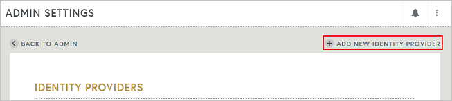
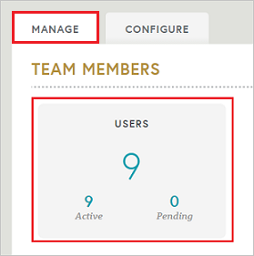
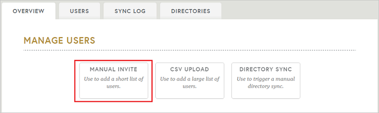
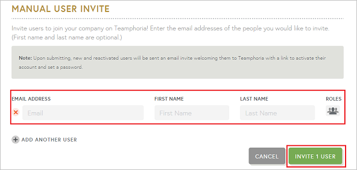

# Configure Teamphoria for Single sign-on with Microsoft Entra ID

In this article,  you learn how to integrate Teamphoria with Microsoft Entra ID. When you integrate Teamphoria with Microsoft Entra ID, you can:

* Control in Microsoft Entra ID who has access to Teamphoria.
* Enable your users to be automatically signed-in to Teamphoria with their Microsoft Entra accounts.
* Manage your accounts in one central location.

To learn more about SaaS app integration with Microsoft Entra ID, see [What is application access and single sign-on with Microsoft Entra ID](~/identity/enterprise-apps/what-is-single-sign-on.md).

## Prerequisites
The scenario outlined in this article assumes that you already have the following prerequisites:

[!INCLUDE [common-prerequisites.md](~/identity/saas-apps/includes/common-prerequisites.md)]
* Teamphoria single sign-on (SSO) enabled subscription.

## Scenario description

In this article,  you configure and test Microsoft Entra SSO in a test environment.

* Teamphoria supports **SP** initiated SSO

## Adding Teamphoria from the gallery

To configure the integration of Teamphoria into Microsoft Entra ID, you need to add Teamphoria from the gallery to your list of managed SaaS apps.

1. Sign in to the [Microsoft Entra admin center](https://entra.microsoft.com) as at least a [Cloud Application Administrator](~/identity/role-based-access-control/permissions-reference.md#cloud-application-administrator).
1. Browse to **Entra ID** > **Enterprise apps** > **New application**.
1. In the **Add from the gallery** section, type **Teamphoria** in the search box.
1. Select **Teamphoria** from results panel and then add the app. Wait a few seconds while the app is added to your tenant.

 Alternatively, you can also use the [Enterprise App Configuration Wizard](https://portal.office.com/AdminPortal/home?Q=Docs#/azureadappintegration). In this wizard, you can add an application to your tenant, add users/groups to the app, assign roles, and walk through the SSO configuration as well. [Learn more about Microsoft 365 wizards.](/microsoft-365/admin/misc/azure-ad-setup-guides)

## Configure and test Microsoft Entra single sign-on for Teamphoria

Configure and test Microsoft Entra SSO with Teamphoria using a test user called **B.Simon**. For SSO to work, you need to establish a link relationship between a Microsoft Entra user and the related user in Teamphoria.

To configure and test Microsoft Entra SSO with Teamphoria, complete the following building blocks:

1. **[Configure Microsoft Entra SSO](#configure-azure-ad-sso)** - to enable your users to use this feature.
    1. **Create a Microsoft Entra test user** - to test Microsoft Entra single sign-on with B.Simon.
    1. **Assign the Microsoft Entra test user** - to enable B.Simon to use Microsoft Entra single sign-on.
1. **[Configure Teamphoria SSO](#configure-teamphoria-sso)** - to configure the single sign-on settings on application side.
    1. **[Create Teamphoria test user](#create-teamphoria-test-user)** - to have a counterpart of B.Simon in Teamphoria that's linked to the Microsoft Entra representation of user.
1. **[Test SSO](#test-sso)** - to verify whether the configuration works.

## Configure Microsoft Entra SSO

Follow these steps to enable Microsoft Entra SSO.

1. Sign in to the [Microsoft Entra admin center](https://entra.microsoft.com) as at least a [Cloud Application Administrator](~/identity/role-based-access-control/permissions-reference.md#cloud-application-administrator).
1. Browse to **Entra ID** > **Enterprise apps** > **Teamphoria** > **Single sign-on**.
1. On the **Select a single sign-on method** page, select **SAML**.
1. On the **Set up single sign-on with SAML** page, select the edit/pen icon for **Basic SAML Configuration** to edit the settings.

   

1. On the **Basic SAML Configuration** section, enter the values for the following fields:

    In the **Sign-on URL** text box, type a URL using the following pattern:
    `https://<sub-domain>.teamphoria.com/login`

	> [!NOTE]
	> The value isn't real. Update the value with the actual Sign-On URL. Contact [Teamphoria Client support team](https://www.teamphoria.com/) to get the value. You can also refer to the patterns shown in the **Basic SAML Configuration** section.

1. On the **Set up single sign-on with SAML** page, in the **SAML Signing Certificate** section,  find **Certificate (Base64)** and select **Download** to download the certificate and save it on your computer.

	

1. On the **Set up Teamphoria** section, copy the appropriate URL(s) based on your requirement.

	

[!INCLUDE [create-assign-users-sso.md](~/identity/saas-apps/includes/create-assign-users-sso.md)]

## Configure Teamphoria SSO

1. In a different web browser window, sign in to your Teamphoria company site as an administrator

4. Go to **ADMIN SETTINGS** option in the left toolbar and under the Configure Tab select **SINGLE SIGN-ON** to open the SSO configuration window.

	

5. Select **ADD NEW IDENTITY PROVIDER** option in the top right corner to open the form for adding the settings for SSO.

	

6. Enter the details in the fields as described below-

	

	a. **DISPLAY NAME**: Enter the display name of the plugin on the admin page.

	b. **BUTTON NAME**: The name of the tab that will display on the login page for logging in via SSO.

	c. **CERTIFICATE**: Open the Certificate downloaded earlier in notepad, copy the contents of the same and paste it here in the box.

	d. **ENTRY POINT**: Paste the **Login URL** copied earlier.

	e. Switch the option to **ON** and select **SAVE**.

### Create Teamphoria test user

In order to enable Microsoft Entra users to sign in to Teamphoria, they must be provisioned into Teamphoria. In the case of Teamphoria, provisioning is a manual task.

**To provision a user account, perform the following steps:**

1. Sign in to your Teamphoria company site as an administrator.

1. Select **ADMIN** settings on the left toolbar and under the **MANAGE** tab Select **USERS** to open the admin page for users.

    

1. Select the **MANUAL INVITE** option.

	

1. On this page, perform following action.

	

    a. In the **EMAIL ADDRESS** textbox, enter the **email address** of the user like B.Simon.

    b. In the **FIRST NAME** textbox, enter the first name of the user like **B**.

	c. In the **LAST NAME** textbox, enter the last name of the user like **Simon**.

    d. Select **INVITE 1 USER**. User needs to accept the invite to get created in the system.

## Test SSO 

In this section, you test your Microsoft Entra single sign-on configuration using the Access Panel.

When you select the Teamphoria tile in the Access Panel, you should be automatically signed in to the Teamphoria for which you set up SSO. For more information about the Access Panel, see [Introduction to the Access Panel](https://support.microsoft.com/account-billing/sign-in-and-start-apps-from-the-my-apps-portal-2f3b1bae-0e5a-4a86-a33e-876fbd2a4510).

## Additional resources

- [List of articles on How to Integrate SaaS Apps with Microsoft Entra ID](./tutorial-list.md)

- [What is application access and single sign-on with Microsoft Entra ID?](~/identity/enterprise-apps/what-is-single-sign-on.md)

- [What is Conditional Access in Microsoft Entra ID?](~/identity/conditional-access/overview.md)
