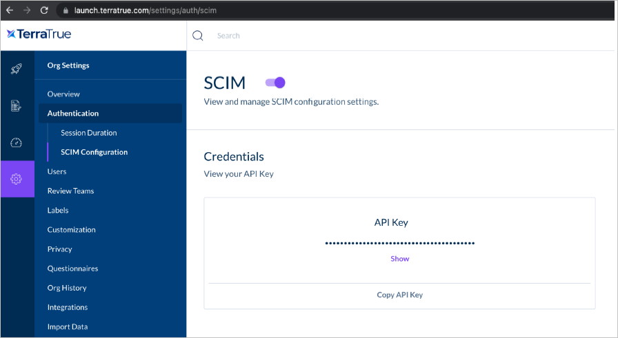

# Configure TerraTrue for automatic user provisioning with Microsoft Entra ID

This article describes the steps you need to perform in both TerraTrue and Microsoft Entra ID to configure automatic user provisioning. When configured, Microsoft Entra ID automatically provisions and de-provisions users and groups to [TerraTrue](https://terratruehq.com/) using the Microsoft Entra provisioning service. For important details on what this service does, how it works, and frequently asked questions, see [Automate user provisioning and deprovisioning to SaaS applications with Microsoft Entra ID](~/identity/app-provisioning/user-provisioning.md). 

## Capabilities supported
> [!div class="checklist"]
> * Create users in TerraTrue.
> * Remove users in TerraTrue when they don't require access anymore.
> * Keep user attributes synchronized between Microsoft Entra ID and TerraTrue.
> * [Single sign-on](terratrue-tutorial.md) to TerraTrue.

## Prerequisites

The scenario outlined in this article assumes that you already have the following prerequisites:

* [A Microsoft Entra tenant](~/identity-platform/quickstart-create-new-tenant.md). 
* One of the following roles: [Application Administrator](/entra/identity/role-based-access-control/permissions-reference#application-administrator), [Cloud Application Administrator](/entra/identity/role-based-access-control/permissions-reference#cloud-application-administrator), or [Application Owner](/entra/fundamentals/users-default-permissions#owned-enterprise-applications). 
* A [TerraTrue](https://terratruehq.com/) tenant.
* A user account in TerraTrue with Admin permissions.

## Step 1: Plan your provisioning deployment
1. Learn about [how the provisioning service works](~/identity/app-provisioning/user-provisioning.md).
1. Determine who's in [scope for provisioning](~/identity/app-provisioning/define-conditional-rules-for-provisioning-user-accounts.md).
1. Determine what data to [map between Microsoft Entra ID and TerraTrue](~/identity/app-provisioning/customize-application-attributes.md). 

## Step 2: Configure TerraTrue to support provisioning with Microsoft Entra ID

1. In TerraTrue, navigate to **Organization Settings > Authentication > SCIM** or visit `https://launch.terratrue.com/settings/auth/scim`.
1. Next, enable the **“SCIM Configuration”** toggle and select **“Copy API Key”** to copy the SCIM API Key.

	

## Step 3: Add TerraTrue from the Microsoft Entra application gallery

Add TerraTrue from the Microsoft Entra application gallery to start managing provisioning to TerraTrue. If you have previously setup TerraTrue for SSO, you can use the same application. However, we recommend that you create a separate app when testing out the integration initially. Learn more about adding an application from the gallery [here](~/identity/enterprise-apps/add-application-portal.md). 

## Step 4: Define who is in scope for provisioning 

[!INCLUDE [create-assign-users-provisioning.md](~/identity/saas-apps/includes/create-assign-users-provisioning.md)]

## Step 5: Configure automatic user provisioning to TerraTrue 

This section guides you through the steps to configure the Microsoft Entra provisioning service to create, update, and disable users and/or groups in TerraTrue based on user and/or group assignments in Microsoft Entra ID.

### To configure automatic user provisioning for TerraTrue in Microsoft Entra ID:

1. Sign in to the [Microsoft Entra admin center](https://entra.microsoft.com) as at least a [Cloud Application Administrator](~/identity/role-based-access-control/permissions-reference.md#cloud-application-administrator).
1. Browse to **Entra ID** > **Enterprise apps**

	

1. In the applications list, select **TerraTrue**.

	

1. Select the **Provisioning** tab.

	

1. Set the **Provisioning Mode** to **Automatic**.

	

1. Under the **Admin Credentials** section, input your TerraTrue Tenant URL and Secret Token. Select **Test Connection** to ensure Microsoft Entra ID can connect to TerraTrue. If the connection fails, ensure your TerraTrue account has Admin permissions and try again.

 	

1. In the **Notification Email** field, enter the email address of a person or group who should receive the provisioning error notifications and select the **Send an email notification when a failure occurs** check box.

	

1. Select **Save**.

1. Under the **Mappings** section, select **Synchronize Microsoft Entra users to TerraTrue**.

1. Review the user attributes that are synchronized from Microsoft Entra ID to TerraTrue in the **Attribute-Mapping** section. The attributes selected as **Matching** properties are used to match the user accounts in TerraTrue for update operations. If you choose to change the [matching target attribute](~/identity/app-provisioning/customize-application-attributes.md), you need to ensure that the TerraTrue API supports filtering users based on that attribute. Select the **Save** button to commit any changes.

   |Attribute|Type|Supported for filtering|Required by TerraTrue|
   |---|---|---|---|
    |userName|String|&check;|&check;
    |active|Boolean|  
    |name.givenName|String
    |name.familyName|String
    |name.formatted|String

1. To configure scoping filters, refer to the following instructions provided in the [Scoping filter  article](~/identity/app-provisioning/define-conditional-rules-for-provisioning-user-accounts.md).

1. To enable the Microsoft Entra provisioning service for TerraTrue, change the **Provisioning Status** to **On** in the **Settings** section.

	

1. Define the users and/or groups that you would like to provision to TerraTrue by choosing the desired values in **Scope** in the **Settings** section.

	

1. When you're ready to provision, select **Save**.

	

This operation starts the initial synchronization cycle of all users and groups defined in **Scope** in the **Settings** section. The initial cycle takes longer to perform than subsequent cycles, which occur approximately every 40 minutes as long as the Microsoft Entra provisioning service is running. 

## Step 6: Monitor your deployment

[!INCLUDE [monitor-deployment.md](~/identity/saas-apps/includes/monitor-deployment.md)]

## Troubleshooting and Tips
Reach out to `hello@terratrue.com` for help ensuring that your provisioning is working correctly.

TerraTrue provides a revision history of all changes to a user's account visible to any TerraTrue administrator at the link below. All user changes made as a result of SCIM provisioning is shown with the Actor column being "Scim System User".

`https://launch.terratrue.com/settings/history`

Lastly, TerraTrue sets the user's Display Name based on the first name and last name received during the first user sync. Subsequent changes to the user's Display Name may be made by an administrator from within TerraTrue under the User Organization Settings at the link below:

`https://launch.terratrue.com/settings/users`

## More resources

* [Managing user account provisioning for Enterprise Apps](~/identity/app-provisioning/configure-automatic-user-provisioning-portal.md)
* [What is application access and single sign-on with Microsoft Entra ID?](~/identity/enterprise-apps/what-is-single-sign-on.md)

## Related content

* [Learn how to review logs and get reports on provisioning activity](~/identity/app-provisioning/check-status-user-account-provisioning.md)
