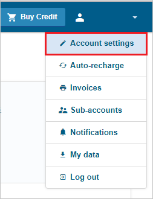
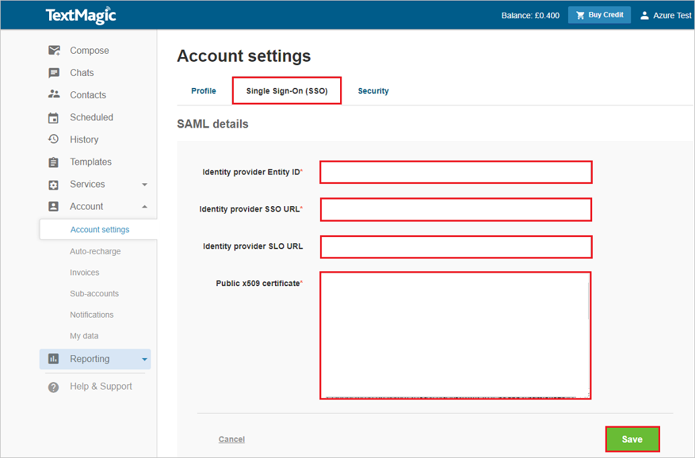

# Configure TextMagic for Single sign-on with Microsoft Entra ID

In this article,  you learn how to integrate TextMagic with Microsoft Entra ID. When you integrate TextMagic with Microsoft Entra ID, you can:

* Control in Microsoft Entra ID who has access to TextMagic.
* Enable your users to be automatically signed-in to TextMagic with their Microsoft Entra accounts.
* Manage your accounts in one central location.

## Prerequisites
The scenario outlined in this article assumes that you already have the following prerequisites:

[!INCLUDE [common-prerequisites.md](~/identity/saas-apps/includes/common-prerequisites.md)]
* TextMagic single sign-on (SSO) enabled subscription.

## Scenario description

In this article,  you configure and test Microsoft Entra SSO in a test environment.

* TextMagic supports **IDP** initiated SSO.

* TextMagic supports **Just In Time** user provisioning.

> [!NOTE]
> Identifier of this application is a fixed string value so only one instance can be configured in one tenant.

## Add TextMagic from the gallery

To configure the integration of TextMagic into Microsoft Entra ID, you need to add TextMagic from the gallery to your list of managed SaaS apps.

1. Sign in to the [Microsoft Entra admin center](https://entra.microsoft.com) as at least a [Cloud Application Administrator](~/identity/role-based-access-control/permissions-reference.md#cloud-application-administrator).
1. Browse to **Entra ID** > **Enterprise apps** > **New application**.
1. In the **Add from the gallery** section, type **TextMagic** in the search box.
1. Select **TextMagic** from results panel and then add the app. Wait a few seconds while the app is added to your tenant.

 Alternatively, you can also use the [Enterprise App Configuration Wizard](https://portal.office.com/AdminPortal/home?Q=Docs#/azureadappintegration). In this wizard, you can add an application to your tenant, add users/groups to the app, assign roles, and walk through the SSO configuration as well. [Learn more about Microsoft 365 wizards.](/microsoft-365/admin/misc/azure-ad-setup-guides)

## Configure and test Microsoft Entra SSO for TextMagic

Configure and test Microsoft Entra SSO with TextMagic using a test user called **B.Simon**. For SSO to work, you need to establish a link relationship between a Microsoft Entra user and the related user in TextMagic.

To configure and test Microsoft Entra SSO with TextMagic, perform the following steps:

1. **[Configure Microsoft Entra SSO](#configure-azure-ad-sso)** - to enable your users to use this feature.
    1. **Create a Microsoft Entra test user** - to test Microsoft Entra single sign-on with B.Simon.
    1. **Assign the Microsoft Entra test user** - to enable B.Simon to use Microsoft Entra single sign-on.
1. **[Configure TextMagic SSO](#configure-textmagic-sso)** - to configure the single sign-on settings on application side.
    1. **[Create TextMagic test user](#create-textmagic-test-user)** - to have a counterpart of B.Simon in TextMagic that's linked to the Microsoft Entra representation of user.
1. **[Test SSO](#test-sso)** - to verify whether the configuration works.

## Configure Microsoft Entra SSO

Follow these steps to enable Microsoft Entra SSO.

1. Sign in to the [Microsoft Entra admin center](https://entra.microsoft.com) as at least a [Cloud Application Administrator](~/identity/role-based-access-control/permissions-reference.md#cloud-application-administrator).
1. Browse to **Entra ID** > **Enterprise apps** > **TextMagic** > **Single sign-on**.
1. On the **Select a single sign-on method** page, select **SAML**.
1. On the **Set up single sign-on with SAML** page, select the pencil icon for **Basic SAML Configuration** to edit the settings.

   

1. On the **Basic SAML Configuration** section, perform the following step:

    In the **Identifier** text box, type the URL:
    `https://my.textmagic.com/saml/metadata`

5. TextMagic application expects the SAML assertions in a specific format, which requires you to add custom attribute mappings to your SAML token attributes configuration. The following screenshot shows the list of default attributes, whereas **nameidentifier** is mapped with **user.userprincipalname**. TextMagic application expects **nameidentifier** to be mapped with **user.mail**, so you need to edit the attribute mapping by selecting **Edit** icon and change the attribute mapping.

	

1. In addition to above, TextMagic application expects few more attributes to be passed back in SAML response which are shown below. These attributes are also pre populated but you can review them as per your requirement.

	| Name |   Source Attribute| Namespace  |
	| --------------- | --------------- | --------------- |
	| company | user.companyname | https://schemas.xmlsoap.org/ws/2005/05/identity/claims |
	| firstName | user.givenname |  https://schemas.xmlsoap.org/ws/2005/05/identity/claims |
	| lastName | user.surname |  https://schemas.xmlsoap.org/ws/2005/05/identity/claims |
	| phone | user.telephonenumber |  https://schemas.xmlsoap.org/ws/2005/05/identity/claims |

1. On the **Set up single sign-on with SAML** page, in the **SAML Signing Certificate** section,  find **Certificate (Base64)** and select **Download** to download the certificate and save it on your computer.

	

1. On the **Set up TextMagic** section, copy the appropriate URL(s) based on your requirement.

	

[!INCLUDE [create-assign-users-sso.md](~/identity/saas-apps/includes/create-assign-users-sso.md)]

## Configure TextMagic SSO

1. In a different web browser window, sign in to your TextMagic company site as an administrator

4. Select **Account settings** under the username.

	

5. Select the **Single Sign-On (SSO)** tab and fill in the following fields:  

	

	a. In **Identity provider Entity ID:** textbox, paste the value of **Microsoft Entra Identifier**.

	b. In **Identity provider SSO URL:** textbox, paste the value of **Login URL**.

	c. In **Identity provider SLO URL:** textbox, paste the value of **Logout URL**.

	d. Open your **base-64 encoded certificate** in notepad downloaded from Azure portal, copy the content of it into your clipboard, and then paste it to the **Public x509 certificate:** textbox.

	e. Select **Save**.

### Create TextMagic test user

In this section, a user called B.Simon is created in TextMagic. TextMagic supports just-in-time user provisioning, which is enabled by default. There's no action item for you in this section. If a user doesn't already exist in TextMagic, a new one is created after authentication.

## Test SSO 

In this section, you test your Microsoft Entra single sign-on configuration with following options.

* Select **Test this application**, and you should be automatically signed in to the TextMagic for which you set up the SSO.

* You can use Microsoft My Apps. When you select the TextMagic tile in the My Apps, you should be automatically signed in to the TextMagic for which you set up the SSO. For more information about the My Apps, see [Introduction to the My Apps](https://support.microsoft.com/account-billing/sign-in-and-start-apps-from-the-my-apps-portal-2f3b1bae-0e5a-4a86-a33e-876fbd2a4510).

## Related content

Once you configure TextMagic you can enforce session control, which protects exfiltration and infiltration of your organization’s sensitive data in real time. Session control extends from Conditional Access. [Learn how to enforce session control with Microsoft Defender for Cloud Apps](/cloud-app-security/proxy-deployment-aad).
