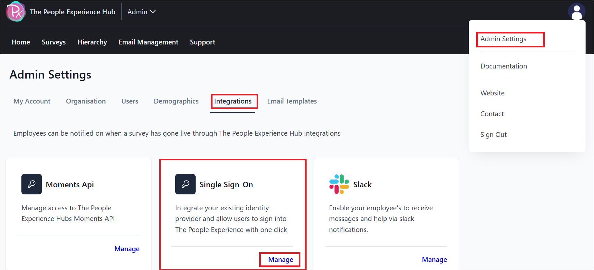
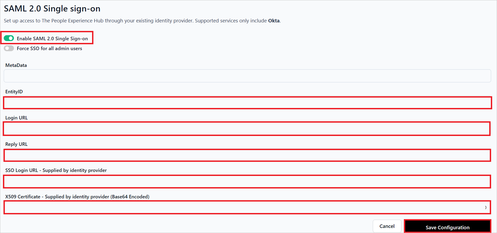
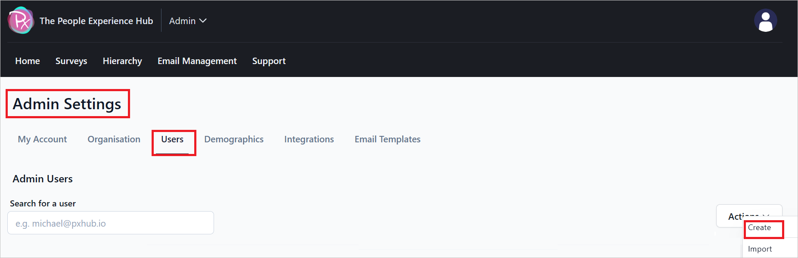
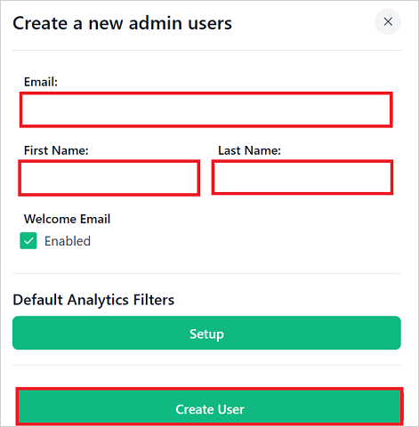

# Configure The People Experience Hub for Single sign-on with Microsoft Entra ID

In this article,  you learn how to integrate The People Experience Hub with Microsoft Entra ID. When you integrate The People Experience Hub with Microsoft Entra ID, you can:

* Control in Microsoft Entra ID who has access to The People Experience Hub.
* Enable your users to be automatically signed-in to The People Experience Hub with their Microsoft Entra accounts.
* Manage your accounts in one central location.

## Prerequisites
The scenario outlined in this article assumes that you already have the following prerequisites:

[!INCLUDE [common-prerequisites.md](~/identity/saas-apps/includes/common-prerequisites.md)]
* The People Experience Hub single sign-on (SSO) enabled subscription.

## Scenario description

In this article,  you configure and test Microsoft Entra SSO in a test environment.

* The People Experience Hub supports **SP and IDP** initiated SSO.

> [!NOTE]
> Identifier of this application is a fixed string value so only one instance can be configured in one tenant.

## Adding The People Experience Hub from the gallery

To configure the integration of The People Experience Hub into Microsoft Entra ID, you need to add The People Experience Hub from the gallery to your list of managed SaaS apps.

1. Sign in to the [Microsoft Entra admin center](https://entra.microsoft.com) as at least a [Cloud Application Administrator](~/identity/role-based-access-control/permissions-reference.md#cloud-application-administrator).
1. Browse to **Entra ID** > **Enterprise apps** > **New application**.
1. In the **Add from the gallery** section, type **The People Experience Hub** in the search box.
1. Select **The People Experience Hub** from results panel and then add the app. Wait a few seconds while the app is added to your tenant.

Alternatively, you can also use the [Enterprise App Configuration Wizard](https://portal.office.com/AdminPortal/home?Q=Docs#/azureadappintegration). In this wizard, you can add an application to your tenant, add users/groups to the app, assign roles, and walk through the SSO configuration as well. [Learn more about Microsoft 365 wizards.](/microsoft-365/admin/misc/azure-ad-setup-guides)

## Configure and test Microsoft Entra SSO for The People Experience Hub

Configure and test Microsoft Entra SSO with The People Experience Hub using a test user called **B.Simon**. For SSO to work, you need to establish a link relationship between a Microsoft Entra user and the related user in The People Experience Hub.

To configure and test Microsoft Entra SSO with The People Experience Hub, perform the following steps:

1. **[Configure Microsoft Entra SSO](#configure-microsoft-entra-sso)** - to enable your users to use this feature.
    1. **Create a Microsoft Entra test user** - to test Microsoft Entra single sign-on with B.Simon.
    1. **Assign the Microsoft Entra test user** - to enable B.Simon to use Microsoft Entra single sign-on.
1. **[Configure The People Experience Hub SSO](#configure-the-people-experience-hub-sso)** - to configure the single sign-on settings on application side.
    1. **[Create The People Experience Hub test user](#create-the-people-experience-hub-test-user)** - to have a counterpart of B.Simon in The People Experience Hub that's linked to the Microsoft Entra representation of user.
1. **[Test SSO](#test-sso)** - to verify whether the configuration works.

## Configure Microsoft Entra SSO

Follow these steps to enable Microsoft Entra SSO in the Microsoft Entra admin center.

1. Sign in to the [Microsoft Entra admin center](https://entra.microsoft.com) as at least a [Cloud Application Administrator](~/identity/role-based-access-control/permissions-reference.md#cloud-application-administrator).
1. Browse to **Entra ID** > **Enterprise apps** > **The People Experience Hub** > **Single sign-on**.
1. On the **Select a single sign-on method** page, select **SAML**.
1. On the **Set up single sign-on with SAML** page, select the pencil icon for **Basic SAML Configuration** to edit the settings.

   

1. On the **Basic SAML Configuration** section, perform the following steps:

    a. In the **Identifier** textbox, type the URL:
    `https://app.pxhub.io`

    b. In the **Reply URL** textbox, type a URL using the following pattern:
    `https://auth.api.pxhub.io/v1/auth/saml/<COMPANY_ID>/assert`

1. Perform the following step, if you wish to configure the application in **SP** initiated mode:

	In the **Sign on URL** textbox, type a URL using the following pattern:
    `https://auth.api.pxhub.io/v1/auth/saml/<COMPANY_ID>/login`

	> [!NOTE]
    > These values aren't real. Update these values with the actual Reply URL and Sign on URL. Contact [The People Experience Hub support team](mailto:it@pxhub.io) to get these values. You can also refer to the patterns shown in the **Basic SAML Configuration** section in the Microsoft Entra admin center.

1. On the **Set up single sign-on with SAML** page, in the **SAML Signing Certificate** section, find **Certificate (Base64)** and select **Download** to download the certificate and save it on your computer.

	

1. On the **Set up The People Experience Hub** section, copy the appropriate URL(s) based on your requirement.

	

[!INCLUDE [create-assign-users-sso.md](~/identity/saas-apps/includes/create-assign-users-sso.md)]

## Configure The People Experience Hub SSO

1. Log in to The People Experience Hub company site as an administrator.

1. Go to **Admin Settings** > **Integrations** > **Single Sign-On** and select **Manage**.

    

1. In the **SAML 2.0 Single sign-on** page, perform the following steps:

    

    1. **Enable SAML 2.0 Single sign-on** toggle on.

    1. Copy **EntityID** value, paste this value into the **Identifier** textbox in the **Basic SAML Configuration** section in Microsoft Entra admin center.

    1. Copy **Login URL** value, paste this value into the **Sign on URL** textbox in the **Basic SAML Configuration** section in Microsoft Entra admin center.

    1. Copy **Reply URL** value, paste this value into the **Reply URL** textbox in the **Basic SAML Configuration** section in Microsoft Entra admin center.

    1. In the **SSO Login URL** textbox, paste the **Login URL** value, which you copied from the Microsoft Entra admin center.

    1. Open the downloaded **Certificate (Base64)** into Notepad and paste the content into the **X509 Certificate** textbox.

    1. Select **Save Configuration**.

### Create The People Experience Hub test user

1. In a different web browser window, sign into The People Experience Hub website as an administrator.

1. Navigate to **Admin Settings** > **Users** and select **Create**.
    
    

1. In the **Create a new admin users** section, perform the following steps:

    

    1. In the **Email** textbox, enter a valid email address of the user.

    1. In the **First Name** textbox, enter the first name of the user.

    1. In the **Last Name** textbox, enter the last name of the user.

    1. Select **Create User**.

## Test SSO 

In this section, you test your Microsoft Entra single sign-on configuration with following options. 

#### SP initiated:

* Select **Test this application** in Microsoft Entra admin center. this option redirects to The People Experience Hub Sign-on URL where you can initiate the login flow.  

* Go to The People Experience Hub Sign-on URL directly and initiate the login flow from there.

#### IDP initiated:

* Select **Test this application** in Microsoft Entra admin center and you should be automatically signed in to The People Experience Hub for which you set up the SSO. 

You can also use Microsoft My Apps to test the application in any mode. When you select The People Experience Hub tile in the My Apps, if configured in SP mode you would be redirected to the application sign-on page for initiating the login flow and if configured in IDP mode, you should be automatically signed in to The People Experience Hub for which you set up the SSO. For more information about the My Apps, see [Introduction to the My Apps](https://support.microsoft.com/account-billing/sign-in-and-start-apps-from-the-my-apps-portal-2f3b1bae-0e5a-4a86-a33e-876fbd2a4510).

## Related content

Once you configure The People Experience Hub you can enforce session control, which protects exfiltration and infiltration of your organization's sensitive data in real time. Session control extends from Conditional Access. [Learn how to enforce session control with Microsoft Defender for Cloud Apps](/cloud-app-security/proxy-deployment-any-app).
