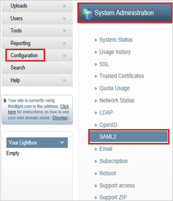
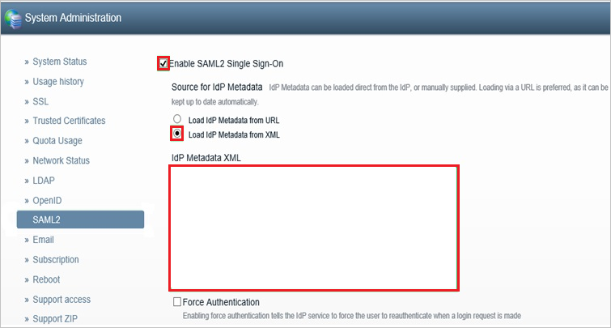

# Configure ThirdLight for Single sign-on with Microsoft Entra ID

In this article,  you learn how to integrate ThirdLight with Microsoft Entra ID. When you integrate ThirdLight with Microsoft Entra ID, you can:

* Control in Microsoft Entra ID who has access to ThirdLight.
* Enable your users to be automatically signed-in to ThirdLight with their Microsoft Entra accounts.
* Manage your accounts in one central location.

## Prerequisites

To configure Microsoft Entra integration with ThirdLight, you need to have:

* A Microsoft Entra subscription. If you don't have a Microsoft Entra environment, you can get a [free account](https://azure.microsoft.com/free/).
* A ThirdLight subscription that has single sign-on enabled.
* Along with Cloud Application Administrator, Application Administrator can also add or manage applications in Microsoft Entra ID.
For more information, see [Azure built-in roles](~/identity/role-based-access-control/permissions-reference.md).

## Scenario description

In this article,  you configure and test Microsoft Entra single sign-on in a test environment.

* ThirdLight supports SP-initiated SSO.

## Add ThirdLight from the gallery

To configure the integration of ThirdLight into Microsoft Entra ID, you need to add ThirdLight from the gallery to your list of managed SaaS apps.

1. Sign in to the [Microsoft Entra admin center](https://entra.microsoft.com) as at least a [Cloud Application Administrator](~/identity/role-based-access-control/permissions-reference.md#cloud-application-administrator).
1. Browse to **Entra ID** > **Enterprise apps** > **New application**.
1. In the **Add from the gallery** section, type **ThirdLight** in the search box.
1. Select **ThirdLight** from results panel and then add the app. Wait a few seconds while the app is added to your tenant.

 Alternatively, you can also use the [Enterprise App Configuration Wizard](https://portal.office.com/AdminPortal/home?Q=Docs#/azureadappintegration). In this wizard, you can add an application to your tenant, add users/groups to the app, assign roles, and walk through the SSO configuration as well. [Learn more about Microsoft 365 wizards.](/microsoft-365/admin/misc/azure-ad-setup-guides)

## Configure and test Microsoft Entra SSO for ThirdLight

Configure and test Microsoft Entra SSO with ThirdLight using a test user called **B.Simon**. For SSO to work, you need to establish a link relationship between a Microsoft Entra user and the related user in ThirdLight.

To configure and test Microsoft Entra SSO with ThirdLight, perform the following steps:

1. **[Configure Microsoft Entra SSO](#configure-azure-ad-sso)** - to enable your users to use this feature.
    1. **Create a Microsoft Entra test user** - to test Microsoft Entra single sign-on with B.Simon.
    1. **Assign the Microsoft Entra test user** - to enable B.Simon to use Microsoft Entra single sign-on.
1. **[Configure ThirdLight SSO](#configure-thirdlight-sso)** - to configure the single sign-on settings on application side.
    1. **[Create ThirdLight test user](#create-thirdlight-test-user)** - to have a counterpart of B.Simon in ThirdLight that's linked to the Microsoft Entra representation of user.
1. **[Test SSO](#test-sso)** - to verify whether the configuration works.

## Configure Microsoft Entra SSO

Follow these steps to enable Microsoft Entra SSO.

1. Sign in to the [Microsoft Entra admin center](https://entra.microsoft.com) as at least a [Cloud Application Administrator](~/identity/role-based-access-control/permissions-reference.md#cloud-application-administrator).
1. Browse to **Entra ID** > **Enterprise apps** > **ThirdLight** > **Single sign-on**.
1. On the **Select a single sign-on method** page, select **SAML**.
1. On the **Set up single sign-on with SAML** page, select the pencil icon for **Basic SAML Configuration** to edit the settings.

    

1. In the **Basic SAML Configuration** dialog box, perform the following steps:

    1. In the **Identifier (Entity ID)** box, type a URL using the following pattern:
    `https://<subdomain>.thirdlight.com/saml/sp`

    1. In the **Sign on URL** box, type a URL using the following pattern:
    `https://<subdomain>.thirdlight.com/`

	   > [!NOTE]
	   > These values are placeholders. You need to use the actual Identifier and Sign on URL. Contact the [ThirdLight support team](https://www.thirdlight.com/support) to get the values. You can also refer to the patterns shown in the **Basic SAML Configuration** dialog box.

1. On the **Set up Single Sign-On with SAML** page, in the **SAML Signing Certificate** section, select the **Download** link next to **Federation Metadata XML**, per your requirements, and save the file on your computer:

	

1. In the **Set up ThirdLight** section, copy the appropriate URLs, based on your requirements:

	

[!INCLUDE [create-assign-users-sso.md](~/identity/saas-apps/includes/create-assign-users-sso.md)]

## Configure ThirdLight SSO

1. In a new web browser window, sign in to your ThirdLight company site as an admin.

1. Go to **Configuration** > **System Administration** > **SAML2**:

    

1. In the SAML2 configuration section, take the following steps.
  
    

	1. Select **Enable SAML2 Single Sign-On**.

	1. Under **Source for IdP Metadata**, select **Load IdP Metadata from XML**.

	1. Open the  metadata file that you downloaded in the previous section. Copy the file's content and paste it into the **IdP Metadata XML** box.

    1. Select **Save SAML2 settings**.

### Create ThirdLight test user

To enable Microsoft Entra users to sign in to ThirdLight, you need to add them to ThirdLight. You need to add them manually.

To create a user account, take these steps:

1. Sign in to your ThirdLight company site as an admin.

1. Go to the **Users** tab.

1. Select **Users and Groups**.

1. Select **Add new User**.

1. Enter the user name, a name or description, and the email address of a valid Microsoft Entra account that you want to provision. Choose a Preset or Group of New Members.

1. Select **Create**.

> [!NOTE]
> You can use any user account creation tool or API provided by ThirdLight to provision Microsoft Entra user accounts.

## Test SSO

In this section, you test your Microsoft Entra single sign-on configuration with following options. 

* Select **Test this application**, this option redirects to ThirdLight Sign-on URL where you can initiate the login flow. 

* Go to ThirdLight Sign-on URL directly and initiate the login flow from there.

* You can use Microsoft My Apps. When you select the ThirdLight tile in the My Apps, this option redirects to ThirdLight Sign-on URL. For more information, see [Microsoft Entra My Apps](/azure/active-directory/manage-apps/end-user-experiences#azure-ad-my-apps).

## Related content

Once you configure ThirdLight you can enforce session control, which protects exfiltration and infiltration of your organization’s sensitive data in real time. Session control extends from Conditional Access. [Learn how to enforce session control with Microsoft Cloud App Security](/cloud-app-security/proxy-deployment-aad).
