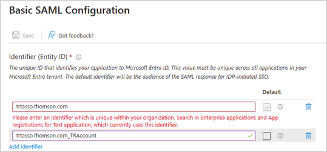
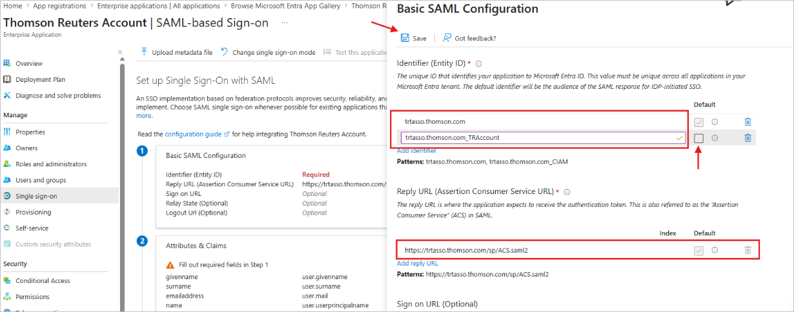
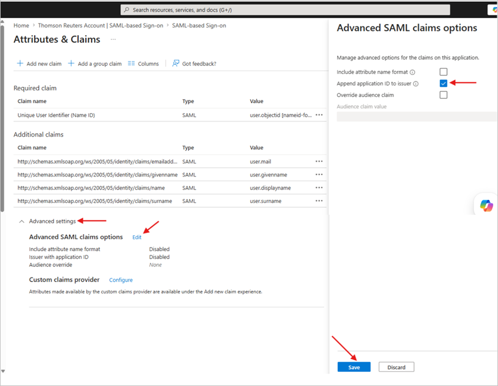

# Configure Thomson Reuters Account for single sign-on with Microsoft Entra ID

In this article, you learn how to integrate Thomson Reuters Account with Microsoft Entra ID. When you integrate Thomson Reuters Account with Microsoft Entra ID, users have a seamless single sign-on experience with the wide range of applications from Thomson Reuters that their organization has subscribed to. Also, you can:

* Control in Microsoft Entra ID who has access to Thomson Reuters Account.
* Enable your users to be automatically signed-in to Thomson Reuters Account with their Microsoft Entra accounts.
* Manage your accounts in one central location.

## Prerequisites
The scenario outlined in this article assumes that you already have the following prerequisites:

[!INCLUDE [common-prerequisites.md](~/identity/saas-apps/includes/common-prerequisites.md)]
* Thomson Reuters Account single sign-on (SSO) enabled subscription.

## Add Thomson Reuters Account from the gallery

To configure the integration of Thomson Reuters Account into Microsoft Entra ID, you need to add Thomson Reuters Account from the gallery to your list of managed SaaS apps.

1. Sign in to the [Microsoft Entra admin center](https://entra.microsoft.com) as at least a [Cloud Application Administrator](~/identity/role-based-access-control/permissions-reference.md#cloud-application-administrator).
1. Browse to **Entra ID** > **Enterprise apps** > **+ New application**.
1. In the **Add from the gallery** section, enter **Thomson Reuters Account** in the search box.
1. Select **Thomson Reuters Account** from results panel and then add the app. Wait a few seconds while the app is added to your tenant.

Alternatively, you can also use the [Enterprise App Configuration Wizard](https://portal.office.com/AdminPortal/home?Q=Docs#/azureadappintegration). In this wizard, you can add an application to your tenant, add users/groups to the app, assign roles, and walk through the SSO configuration as well. [Learn more about Microsoft 365 wizards.](/microsoft-365/admin/misc/azure-ad-setup-guides)

## Configure Microsoft Entra SSO

Follow these steps to enable Microsoft Entra SSO in the Microsoft Entra admin center.

1. Sign in to the [Microsoft Entra admin center](https://entra.microsoft.com) as at least a [Cloud Application Administrator](~/identity/role-based-access-control/permissions-reference.md#cloud-application-administrator).
1. Browse to **Entra ID** > **Enterprise apps** > **Thomson Reuters Account** > **single sign-on**.
1. On the **Select a single sign-on method** page, select **SAML**.
1. On the **Set up single sign-on with SAML** page, select the pencil icon for **Basic SAML Configuration** to edit the settings.

   

1. On the **Basic SAML Configuration** section, perform the following steps:

    a. For the **Identifier (Entity ID)** value, configure as follows:
    
    * In the **Identifier (Entity ID)** select `trtasso.thomson.com` (by default) and proceed to step 5.b.

    * In the **Identifier (Entity ID)** text box, enter the URL: `trtasso.thomson.com_TRAccount `.

    > [!NOTE]
    > If there’s an existing SSO configuration that is used to access Thomson Reuters products, then you won’t be able to select and save `trtasso.thomson.com` as the Identifier/Entity ID. In such a case you’ll get the below error. So, switch to `trtasso.thomson.com_TRAccount` as default by checking the checkbox next to it and delete the `trtasso.thomson.com` Entity ID else you won’t be able to save the configuration.

    

    b. In the **Reply URL** text box, type the URL:
    `https://trtasso.thomson.com/sp/ACS.saml2`

    

1. Thomson Reuters Account application expects the SAML assertions in a specific format, which requires you to add custom attribute mappings to your SAML token attributes configuration. The following screenshot shows the list of default attributes, whereas **nameidentifier** is mapped with **user.userprincipalname**. Thomson Reuters Account application expects **nameidentifier** to be mapped with **user.objectid**, so you need to edit the attribute mapping by selecting **Edit** icon and change the attribute mapping.

    |Name| Microsoft Entra ID attribute mapping |Value|
    |--------|---------|--------------------|
    |Unique UserIdentifier (Name ID)| user.objectid| A value that is both unique and persistent. Don't use an email address as that can change over time.|
    |emailaddress| user.emailaddress |Email address of the user|
    |givenname| user.givenname |First name of user|
    |surname |user.surname |Last name of user|
    |name |user.displayname |Full name of user|

1. If you have chosen the **Identifier (Entity ID)** as `trtasso.thomson.com_TRAccount`, then select the **Edit** option in **Attributes and Claims** and in the next page, select and expand **Advanced settings**, select the **Edit** option right next to **Advanced SAML claims** options. Once you do that, a pane will appear to the right from which you have to check the **Append application ID to issuer** and select **Save**.

    

1. On the **Set up single sign-on with SAML** page, in the SAML Signing Certificate section, select copy button to copy **App Federation Metadata Url**.

	

## Configure Thomson Reuters Account SSO

To configure single sign-on on Thomson Reuters' side, you need to send the below details to the representative from Thomson Reuters whom you are working with to set up SSO:
1. The **App Federation Metadata Url** of your configuration on Microsoft Entra ID.
1. The **Identifier (Entity ID)** that was chosen (`trtasso.thomson.com` or `trtasso.thomson.com_TRAccount`).
1. The **Email domains** of users from your organization that would access Thomson Reuters applications (This is used by the Thomson Reuters team to enable SSO for those email domains).

## Related content

Once you configure Thomson Reuters Account you can enforce session control, which protects exfiltration and infiltration of your organization's sensitive data in real time. Session control extends from Conditional Access. [Learn how to enforce session control with Microsoft Defender for Cloud Apps](/cloud-app-security/proxy-deployment-any-app).