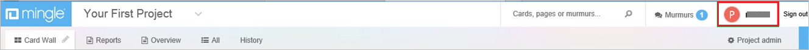
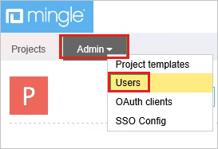
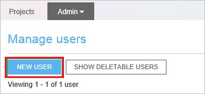
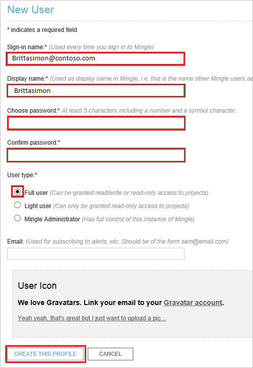

# Configure Thoughtworks Mingle for Single sign-on with Microsoft Entra ID

In this article,  you learn how to integrate Thoughtworks Mingle with Microsoft Entra ID. When you integrate Thoughtworks Mingle with Microsoft Entra ID, you can:

* Control in Microsoft Entra ID who has access to Thoughtworks Mingle.
* Enable your users to be automatically signed-in to Thoughtworks Mingle with their Microsoft Entra accounts.
* Manage your accounts in one central location.

## Prerequisites
The scenario outlined in this article assumes that you already have the following prerequisites:

[!INCLUDE [common-prerequisites.md](~/identity/saas-apps/includes/common-prerequisites.md)]
* Thoughtworks Mingle single sign-on enabled subscription.

## Scenario description

In this article,  you configure and test Microsoft Entra SSO in a test environment.

* Thoughtworks Mingle supports **SP** initiated SSO.

## Add Thoughtworks Mingle from the gallery

To configure the integration of Thoughtworks Mingle into Microsoft Entra ID, you need to add Thoughtworks Mingle from the gallery to your list of managed SaaS apps.

1. Sign in to the [Microsoft Entra admin center](https://entra.microsoft.com) as at least a [Cloud Application Administrator](~/identity/role-based-access-control/permissions-reference.md#cloud-application-administrator).
1. Browse to **Entra ID** > **Enterprise apps** > **New application**.
1. In the **Add from the gallery** section, type **Thoughtworks Mingle** in the search box.
1. Select **Thoughtworks Mingle** from results panel and then add the app. Wait a few seconds while the app is added to your tenant.

 Alternatively, you can also use the [Enterprise App Configuration Wizard](https://portal.office.com/AdminPortal/home?Q=Docs#/azureadappintegration). In this wizard, you can add an application to your tenant, add users/groups to the app, assign roles, and walk through the SSO configuration as well. [Learn more about Microsoft 365 wizards.](/microsoft-365/admin/misc/azure-ad-setup-guides)

## Configure and test Microsoft Entra SSO for Thoughtworks Mingle

Configure and test Microsoft Entra SSO with Thoughtworks Mingle using a test user called **B.Simon**. For SSO to work, you need to establish a link relationship between a Microsoft Entra user and the related user in Thoughtworks Mingle.

To configure and test Microsoft Entra SSO with Thoughtworks Mingle, perform the following steps:

1. **[Configure Microsoft Entra SSO](#configure-azure-ad-sso)** - to enable your users to use this feature.
    1. **Create a Microsoft Entra test user** - to test Microsoft Entra single sign-on with B.Simon.
    2. **Assign the Microsoft Entra test user** - to enable B.Simon to use Microsoft Entra single sign-on.
2. **[Configure Thoughtworks Mingle SSO](#configure-thoughtworks-mingle-sso)** - to configure the single sign-on settings on application side.
    1. **[Create Thoughtworks Mingle test user](#create-thoughtworks-mingle-test-user)** - to have a counterpart of B.Simon in Thoughtworks Mingle that's linked to the Microsoft Entra representation of user.
3. **[Test SSO](#test-sso)** - to verify whether the configuration works.

## Configure Microsoft Entra SSO

Follow these steps to enable Microsoft Entra SSO.

1. Sign in to the [Microsoft Entra admin center](https://entra.microsoft.com) as at least a [Cloud Application Administrator](~/identity/role-based-access-control/permissions-reference.md#cloud-application-administrator).
1. Browse to **Entra ID** > **Enterprise apps** > **Thoughtworks Mingle** > **Single sign-on**.
1. On the **Select a single sign-on method** page, select **SAML**.
1. On the **Set up single sign-on with SAML** page, select the pencil icon for **Basic SAML Configuration** to edit the settings.

   

1. On the **Basic SAML Configuration** section, perform the following steps:

    In the **Sign-on URL** text box, type a URL using the following pattern:
    `https://<companyname>.mingle.thoughtworks.com`

	> [!NOTE]
	> The value isn't real. Update the value with the actual Sign-On URL. Contact Thoughtworks Mingle Client support team to get the value. You can also refer to the patterns shown in the **Basic SAML Configuration** section.

1. On the **Set up Single Sign-On with SAML** page, in the **SAML Signing Certificate** section, select **Download** to download the **Federation Metadata XML** from the given options as per your requirement and save it on your computer.

	

6. On the **Set up Thoughtworks Mingle** section, copy the appropriate URL(s) as per your requirement.

	

[!INCLUDE [create-assign-users-sso.md](~/identity/saas-apps/includes/create-assign-users-sso.md)]

## Configure Thoughtworks Mingle SSO

1. Sign in to your **Thoughtworks Mingle** company site as administrator.

2. Select the **Admin** tab, and then, select **SSO Config**.
   
    

3. In the **SSO Config** section, perform the following steps:
   
    
    
    a. To upload the metadata file, select **Choose file**. 

    b. Select **Save Changes**.

### Create Thoughtworks Mingle test user

For Microsoft Entra users to be able to sign in, they must be provisioned to the Thoughtworks Mingle application using their Microsoft Entra user names. In the case of Thoughtworks Mingle, provisioning is a manual task.

**To configure user provisioning, perform the following steps:**

1. Sign in to your Thoughtworks Mingle company site as administrator.

2. Select **Profile**.
   
    

3. Select the **Admin** tab, and then select **Users**.
   
    

4. Select **New User**.
   
    

5. On the **New User** dialog page, perform the following steps:
   
      
 
    a. Type the **Sign-in name**, **Display name**, **Choose password**, **Confirm password** of a valid Microsoft Entra account you want to provision into the related textboxes. 

    b. As **User type**, select **Full user**.

    c. Select **Create This Profile**.

>[!NOTE]
>You can use any other Thoughtworks Mingle user account creation tools or APIs provided by Thoughtworks Mingle to provision Microsoft Entra user accounts.
> 

## Test SSO

In this section, you test your Microsoft Entra single sign-on configuration with following options. 

* Select **Test this application**, this option redirects to Thoughtworks Mingle Sign-on URL where you can initiate the login flow. 

* Go to Thoughtworks Mingle Sign-on URL directly and initiate the login flow from there.

* You can use Microsoft My Apps. When you select the Thoughtworks Mingle tile in the My Apps, this option redirects to Thoughtworks Mingle Sign-on URL. For more information about the My Apps, see [Introduction to the My Apps](https://support.microsoft.com/account-billing/sign-in-and-start-apps-from-the-my-apps-portal-2f3b1bae-0e5a-4a86-a33e-876fbd2a4510).

## Related content

Once you configure Thoughtworks Mingle you can enforce session control, which protects exfiltration and infiltration of your organization’s sensitive data in real time. Session control extends from Conditional Access. [Learn how to enforce session control with Microsoft Defender for Cloud Apps](/cloud-app-security/proxy-deployment-aad).
