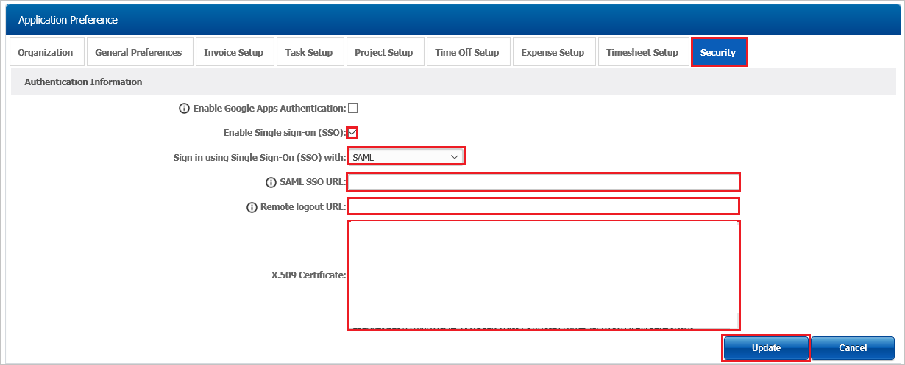

# Configure TimeLive for Single sign-on with Microsoft Entra ID

In this article,  you learn how to integrate TimeLive with Microsoft Entra ID. When you integrate TimeLive with Microsoft Entra ID, you can:

* Control in Microsoft Entra ID who has access to TimeLive.
* Enable your users to be automatically signed-in to TimeLive with their Microsoft Entra accounts.
* Manage your accounts in one central location.

## Prerequisites
The scenario outlined in this article assumes that you already have the following prerequisites:

[!INCLUDE [common-prerequisites.md](~/identity/saas-apps/includes/common-prerequisites.md)]
* TimeLive single sign-on (SSO) enabled subscription.

## Scenario description

In this article,  you configure and test Microsoft Entra single sign-on in a test environment.

* TimeLive supports **SP** initiated SSO.

* TimeLive supports **Just In Time** user provisioning.

## Add TimeLive from the gallery

To configure the integration of TimeLive into Microsoft Entra ID, you need to add TimeLive from the gallery to your list of managed SaaS apps.

1. Sign in to the [Microsoft Entra admin center](https://entra.microsoft.com) as at least a [Cloud Application Administrator](~/identity/role-based-access-control/permissions-reference.md#cloud-application-administrator).
1. Browse to **Entra ID** > **Enterprise apps** > **New application**.
1. In the **Add from the gallery** section, type **TimeLive** in the search box.
1. Select **TimeLive** from results panel and then add the app. Wait a few seconds while the app is added to your tenant.

 Alternatively, you can also use the [Enterprise App Configuration Wizard](https://portal.office.com/AdminPortal/home?Q=Docs#/azureadappintegration). In this wizard, you can add an application to your tenant, add users/groups to the app, assign roles, and walk through the SSO configuration as well. [Learn more about Microsoft 365 wizards.](/microsoft-365/admin/misc/azure-ad-setup-guides)

## Configure and test Microsoft Entra SSO for TimeLive

Configure and test Microsoft Entra SSO with TimeLive using a test user called **B.Simon**. For SSO to work, you need to establish a link relationship between a Microsoft Entra user and the related user in TimeLive.

To configure and test Microsoft Entra SSO with TimeLive, perform the following steps:

1. **[Configure Microsoft Entra SSO](#configure-azure-ad-sso)** - to enable your users to use this feature.
    1. **Create a Microsoft Entra test user** - to test Microsoft Entra single sign-on with B.Simon.
    1. **Assign the Microsoft Entra test user** - to enable B.Simon to use Microsoft Entra single sign-on.
1. **[Configure TimeLive SSO](#configure-timelive-sso)** - to configure the single sign-on settings on application side.
    1. **[Create TimeLive test user](#create-timelive-test-user)** - to have a counterpart of B.Simon in TimeLive that's linked to the Microsoft Entra representation of user.
1. **[Test SSO](#test-sso)** - to verify whether the configuration works.

## Configure Microsoft Entra SSO

Follow these steps to enable Microsoft Entra SSO.

1. Sign in to the [Microsoft Entra admin center](https://entra.microsoft.com) as at least a [Cloud Application Administrator](~/identity/role-based-access-control/permissions-reference.md#cloud-application-administrator).
1. Browse to **Entra ID** > **Enterprise apps** > **TimeLive** > **Single sign-on**.
1. On the **Select a single sign-on method** page, select **SAML**.
1. On the **Set up single sign-on with SAML** page, select the pencil icon for **Basic SAML Configuration** to edit the settings.

   

1. On the **Basic SAML Configuration** section, perform the following steps:

    a. In the **Identifier (Entity ID)** text box, type a URL using the following pattern:
    `https://<domainname>.livetecs.com/`
	
	b. In the **Sign on URL** text box, type a URL using the following pattern:
    `https://<domainname>.livetecs.com/`

	> [!NOTE]
	> These values aren't real. Update these values with the actual Identifier and Sign on URL. Contact [TimeLive Client support team](mailto:support@livetecs.com) to get these values. You can also refer to the patterns shown in the **Basic SAML Configuration** section.

1. On the **Set up Single Sign-On with SAML** page, in the **SAML Signing Certificate** section, select **Download** to download the **Certificate (Base64)** from the given options as per your requirement and save it on your computer.

	

1. On the **Set up TimeLive** section, copy the appropriate URL(s) as per your requirement.

	

[!INCLUDE [create-assign-users-sso.md](~/identity/saas-apps/includes/create-assign-users-sso.md)]

## Configure TimeLive SSO

1. In a different web browser window, sign in to your TimeLive company site as an administrator.

2. Select **Preferences** under **Admin Options**.

	

3. In the **Application Preference** section, perform the following steps:
	
	

	a. Select **Security** tab.

	b. Check **Enable Single Sign On (SSO)** checkbox.

	c. Select **SAML** from the drop down menu with heading **Sign in using Single Sign-On (SSO) with**.

	d. In the **SAML SSO URL**, Paste **Login URL** value which you have copied form the Azure portal.

	e. In the **Remote logout URL**, Paste **Logout URL** value which you have copied form the Azure portal.

	f. Open the downloaded **base-64 encoded certificate** from Azure portal in Notepad, copy the content, and then paste it into the **X.509 Certificate** textbox.

	g. Select **Update**.

### Create TimeLive test user

In this section, a user called Britta Simon is created in TimeLive. TimeLive supports just-in-time user provisioning, which is enabled by default. There's no action item for you in this section. If a user doesn't already exist in TimeLive, a new one is created after authentication.

## Test SSO 

In this section, you test your Microsoft Entra single sign-on configuration with following options. 

* Select **Test this application**, this option redirects to TimeLive Sign-on URL where you can initiate the login flow. 

* Go to TimeLive Sign-on URL directly and initiate the login flow from there.

* You can use Microsoft My Apps. When you select the TimeLive tile in the My Apps, this option redirects to TimeLive Sign-on URL. For more information, see [Microsoft Entra My Apps](/azure/active-directory/manage-apps/end-user-experiences#azure-ad-my-apps).

## Related content

Once you configure TimeLive you can enforce session control, which protects exfiltration and infiltration of your organization’s sensitive data in real time. Session control extends from Conditional Access. [Learn how to enforce session control with Microsoft Cloud App Security](/cloud-app-security/proxy-deployment-aad).
